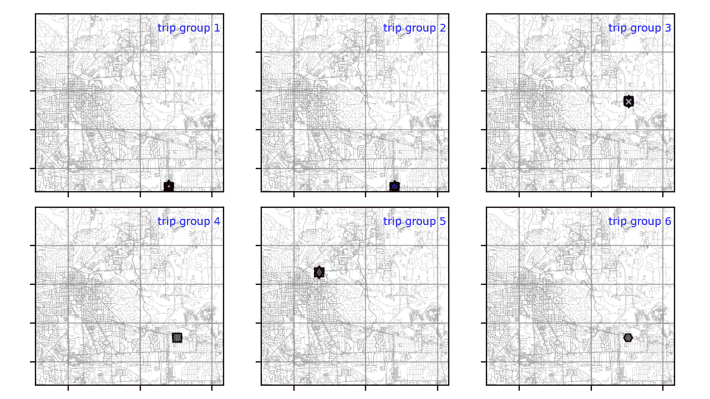
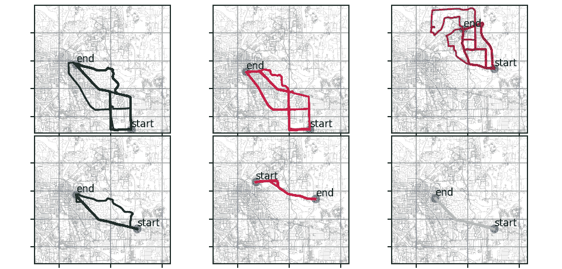
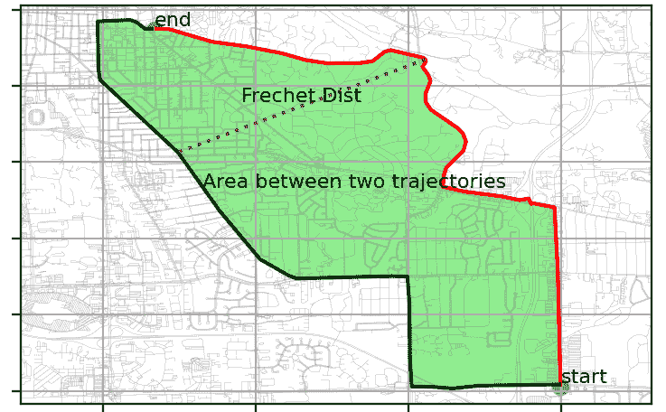

# 基于 Python 的 GPS 轨迹聚类

> 原文：<https://towardsdatascience.com/gps-trajectory-clustering-with-python-9b0d35660156?source=collection_archive---------8----------------------->

## 如何解决这个领域遇到的常见问题

移动设备的快速增长导致基于位置的服务、地理社交网络、交通或拼车应用程序收集了大量的 GPS 轨迹。



GPS 轨迹聚类(Trips)(图片由作者提供)

GPS 轨迹聚类越来越多地用于许多应用中。例如，它可以帮助识别经常的路线或行程。轨迹相似度可以用来发现轨迹是否遵循某一路线。然后，它可以用于跟踪运输服务，例如城市中的公共汽车。

在本文中，我将简要介绍快速 GPS 轨迹聚类。这个解决方案中使用了 Python 开源库。通常，在聚类轨迹期间可能会遇到几个问题。

*   GPS 轨迹通常包含许多数据点。聚类可能需要很长时间。
*   需要合适的相似性度量来比较不同的轨迹。
*   聚类方法和配置
*   可视化轨迹及其聚类

关于这个主题有很多有趣的文章[1，2]。然而，并非所有上述问题都得到解决。在本文中，我将展示一个涵盖所有这些领域的 Python 解决方案。这里使用的数据最初来自车辆能量数据集[3]。首先对原始数据应用聚类所有 GPS 点的过程。然后，我选择了几个起始端组的轨迹。为简单起见，本文提供的数据是针对这些轨迹组的，如下所示:



聚类前的 GPS 轨迹

本文的代码和教程可以在 [my GitHub here](https://github.com/steveyx/gps-trajectories-clustering) 中找到。

## 轨迹数据点减少

Ramer-Douglas-Peucker (RDP)算法是减少折线点数的最常用方法之一。这个算法的目的是找到一个子集的点来代表整个折线。

RDP 函数返回子集点和点索引

这里参数*ε*设置为 10(米)。在 RDP 之后，与原始数据点相比，轨迹中的数据点的数量显著减少。

```
traj #    data points original       after RDP
0         266                        21
1         276                        36
2         239                        34
...
```

这有助于大幅减少距离矩阵的计算时间。

```
distance matrix without RDP: 	 61.0960 seconds
distance matrix with RDP: 	 0.4899 seconds
```

## 轨迹相似性度量和距离矩阵

有多种方法可以测量两个轨迹的相似性，例如弗雷歇距离、面积法，如下图所示。它们可以使用 [*相似性度量*](https://pypi.org/project/similaritymeasures/) 包*来计算。*



轨迹相似性度量:弗雷歇距离和面积

对于本文中的示例，弗雷歇距离用于计算距离矩阵，如下所示。还支持区域相似性度量。

## DBSCAN 聚类

*Scikit-learn* 提供了几种聚类方法。在本文中，我将介绍带有预先计算好的矩阵的 DBSCAN。参数设置如下:

*   *eps* :弗雷歇距离 1000(米)，面积测量 30 万(米)。
*   *min_samples:* 1、确保所有轨迹都将被聚类成一个簇。

代码如下。

## 结果和轨迹可视化

Matplotlib 是一个全面的 Python 可视化库。它为静态和动态可视化提供了灵活的解决方案。

使用 *Matplotlib* 中的子图可视化六个组的聚类结果。如下所示，大多数轨迹组都有几个簇。只有最后两组具有一个聚类，因为这些轨迹的相似性高(弗雷歇距离小于 *eps* ，即 1000)。


聚类 GPS 轨迹

## 结论

随着当今许多支持 GPS 的设备的使用，GPS 轨迹聚类变得越来越流行。本文向您介绍了这一领域的常见问题。然后探索 Python 工具来解决这些问题。如需进一步阅读，您可以查看这些关于[折线简化](https://martinfleischmann.net/line-simplification-algorithms/)、[距离矩阵计算](/fast-discrete-fréchet-distance-d6b422a8fb77)和[基于网络的空间可视化](/data-101s-spatial-visualizations-and-analysis-in-python-with-folium-39730da2adf)的文章。

## 参考

1.  joo Paulo Figueira，[聚类移动物体轨迹](/clustering-moving-object-trajectories-216c372d37e2)，
2.  William Yee，[物联网/GPS 轨迹聚类和地理空间聚类简介](/a-gentle-introduction-to-iot-gps-trajectory-clustering-and-geospatial-clustering-daba8da8c41e)
3.  车辆能源数据集(VED，[用于车辆能源消耗研究的大规模数据集](https://arxiv.org/abs/1905.02081)