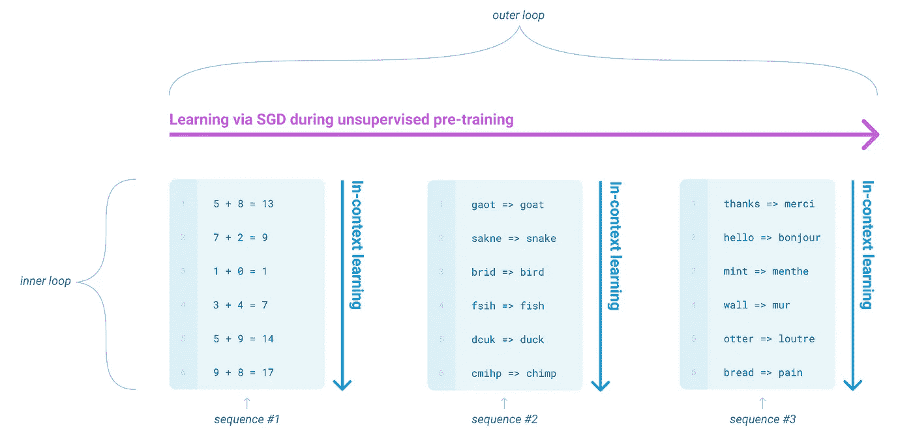
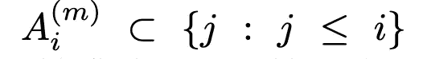
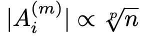
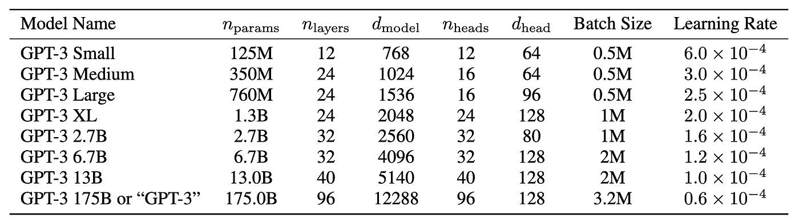
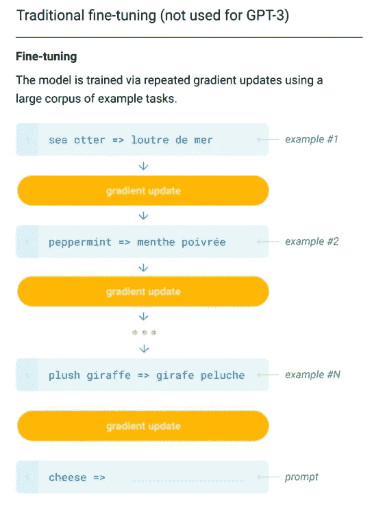
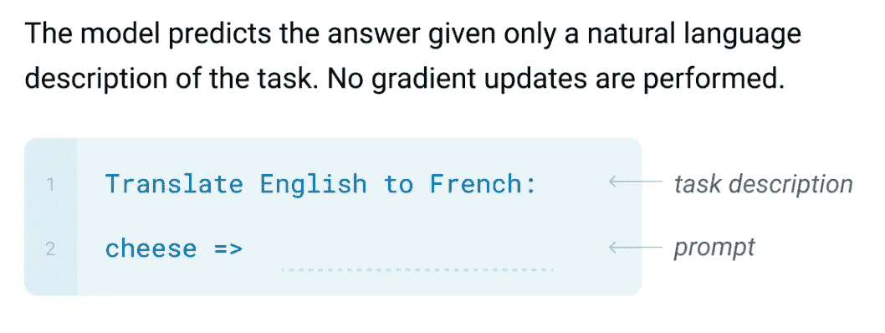
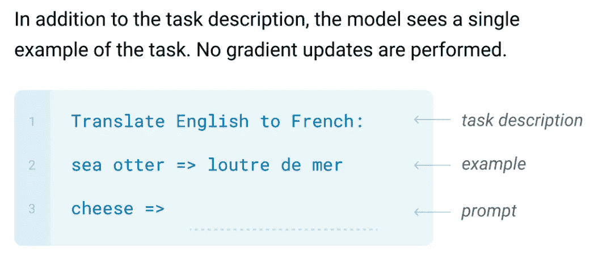
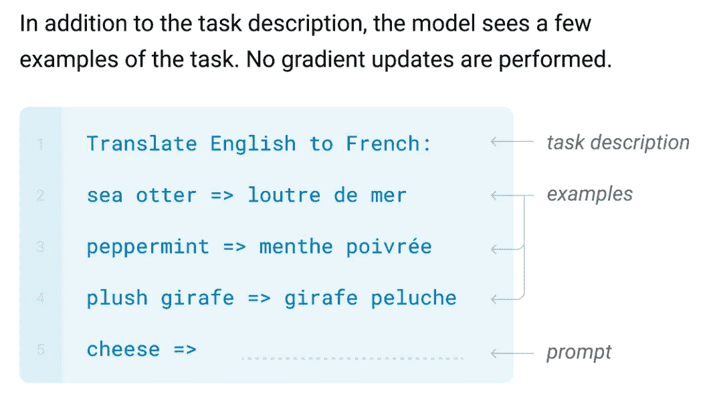
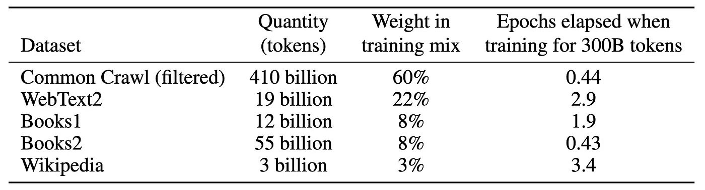

# GPT 三号解释道

> 原文：<https://towardsdatascience.com/gpt-3-explained-19e5f2bd3288?source=collection_archive---------14----------------------->

## 了解基于变压器的自监督架构


GPT-3 在行动中通过 [OpenAI 博客](https://openai.com/blog/openai-api/)

在本文中，我们将讨论 OpenAI 在论文“[语言模型是一次性学习者](https://arxiv.org/abs/2005.14165)”中提出的著名的 GPT-3 模型。它是 [GPT-2](https://openai.com/blog/better-language-models/) 的继任者，后者的架构与 GPT-3 非常相似。

如果你不知道 GPT-2，可以考虑读一读我写的关于 GPT-2 的文章，因为 GPT-3 的大部分都是基于它的，这将有助于更好地理解这个模型。

# 快速回顾

回到 GPT-2，它本质上是一个基于 Transformer 架构的自回归模型( [Vaswani et al.](https://arxiv.org/abs/1706.03762) )。但是 GPT-2 的新颖之处在于它的预训练方法。

预培训利用数据集级别的多任务学习。它基本上意味着输入告诉模型执行特定的 NLP 任务。

> 例如，翻译示例可以是原始文档本身中的格式“**翻译成法语、<英语文本>、<法语文本>** ”。或者阅读理解任务样本可以是这样的格式，“**使用回答给定问题，<文档>，<问题>，<回答>。**
> 
> — [GPT-2 博客](https://medium.com/swlh/openai-gpt-2-language-models-are-multitask-learners-1c6d42d406ae)

他们称这种**零射击任务迁移**或**元学习**，或**语境** **学习**。这样，模型不需要在下游 NLP 任务上进行微调，这是朝着模型和一般智能的统一迈出的一步。

GPT-3 基于相同的背景学习原则，但在模型和整体方法上有所改进。本文还讨论了这种方法存在的问题，并试图实现最先进的结果。我们将在接下来的章节中看到这一点。

# 培训方法



通过 [GPT-3 论文](https://arxiv.org/abs/2005.14165)进行元学习

如前所述，GPT-3 也是基于情境学习的思想。如上图所示。显然，在序列上没有直接的“内部循环”训练。例如，序列可以是:

```
5 + 8 = 13, 7 + 2 = 9, 1 + 0 = 1, and so on...
```

并且该模型将在自回归目标上被训练，即**给定前一个令牌，最大化下一个**的概率。这样，它可以直接从输入中捕获模式。

想法很简单；人类不会针对每一项任务在大型数据集上进行训练。有时候，

> “请告诉我这句话描述的是开心的事还是悲伤的事”

足以给我们一个预期的背景。或者对于天真的人来说，

> “这听起来开心，这听起来悲伤，你觉得这听起来如何？”

足以让他们以合理的能力理解任务。

虽然这个概念很有前途，但以前的方法，如 GPT-2，比最先进的方法效果差得多，最先进的方法主要是基于预训练-微调方法。

基于变压器的模型的最新进展表明，将模型缩放得更高大大改善了微调结果。并且在元学习目标中提高模型的规模确实是有意义的，因为**模型在相同的模型容量内同时和**捕获许多技能和任务**(注意，在微调设置中，为每个下游任务训练一个新的模型)**。

> 因此，作者训练了 1750 亿个参数模型！

它的参数比之前最大的型号至少多 10 倍。

# 模型架构

架构与 GPT 2 号非常相似，只是放大了一倍。它包括自定义权重初始化、预标准化和字节对编码。我在关于 GPT-2 的文章中已经谈到了这一点。如果你有兴趣，可以考虑读一读。

除此之外，一些想法来自[稀疏变换器](https://arxiv.org/abs/1904.10509)，它对注意力计算增加了一些修改，以降低复杂性并支持更长的序列。基本上，在完全(密集)关注中，每个标记都关注序列中的每个其他标记，这导致了`O(n²)` 空间，即，它与序列长度成二次比例。为了克服这一点，[稀疏变换器](https://arxiv.org/abs/1904.10509)建议每个记号可以只参与序列中记号的子集，使得:



**其中** `**A**` **为** `**the ith**` **令牌序列中的子集，为** `**the mth**` **注意头，为 p 头**通过[稀疏变压器纸](https://arxiv.org/abs/1904.10509)

而且，



**令牌子集通过[稀疏变换纸](https://arxiv.org/abs/1904.10509)与序列长度**的第 p 个根成比例

接下来是为子集做出有效的选择(`A`)。对该模型的进一步讨论超出了本文的范围。有兴趣可以[参考](https://arxiv.org/abs/1904.10509) [稀疏变压器](https://arxiv.org/abs/1904.10509) [论文](https://arxiv.org/abs/1904.10509)。

GPT-3 在密集和稀疏的注意力模式之间交替。然而，还不清楚这种交替到底是如何进行的，但据推测，它要么是在层之间，要么是在残余块之间。

此外，作者训练了 8 种不同尺寸的 GPT-3，以研究模型性能对模型尺寸的依赖性。以下是这 8 款车型的配置:



通过 [GPT-3 论文](https://arxiv.org/abs/2005.14165)比较不同尺寸的配置

此外，该模型在深度和宽度维度上跨 GPU 共享，以最大限度地减少节点之间的数据传输。

# 微调与零触发、单触发与少触发

这是我们最感兴趣的部分。GPT-3 在二十多个数据集上进行了评估。对于这些任务中的每一个，它被评估为 3 种设置——零射击、单射击和少射击。我们将了解这些是什么，并将它们与本节中的微调方法进行比较。

## 微调



通过 [GPT-3 文件](https://arxiv.org/abs/2005.14165)进行微调

在这种方法中，我们首先预训练一个模型(主要基于自回归或完形填空目标)，这有助于模型捕捉语言中的一般模式；然后，我们为特定的下游 NLP 任务单独地重新训练它。在上图中，该模型针对翻译任务进行了微调。

这种方法的主要缺点是对于单个任务需要大型数据集。此外，对一个数据集进行微调可能无法为同一任务提供比其他数据集更好的泛化能力。虽然微调结果很强，但事实证明这与人类的表现相比是不公平的。

## 零射击



通过 [GPT-3 纸](https://arxiv.org/abs/2005.14165)进行零点设置

在这种设置中，在预训练模型(通过上下文学习)之后，我们直接向模型提供任务的输入，而无需针对该任务的任何特殊训练。**只需告诉模型“做什么”和输入**。这是最具挑战性的设置，在某些情况下，这可能是“不公平的困难”例如，对于像“制作 200 米短跑世界记录表”这样的输入，输出格式是不明确的。

> 然而，至少在某些情况下，零距离拍摄最接近人类执行任务的方式。
> 
> — [GPT-3 论文](https://arxiv.org/abs/2005.14165)

例如，在上面的翻译示例中，输入足够清晰，人类可以理解所期望的内容。同样，这也是 GPT-2 所提供的。

## 一次性的



通过 [GPT-3 纸](https://arxiv.org/abs/2005.14165)一次设定

在这个设置中，我们提供 1)“做什么”，2)任务的一个实例(一次性)，然后 3)输入。该示例旨在**仅用于调节**，即**，旨在提供任务的一些背景信息。**您可以将此视为为模型提供了某种类比。我们在零射击设置中看到了“不公平困难”的例子。在这样的任务中，如果至少提供了一个任务的演示，那么输入的答案就变得更可信了。

## 少数镜头



通过 [GPT-3 纸](https://arxiv.org/abs/2005.14165)进行少拍设置

最后，在少镜头设置中，输入包括 1)“做什么”，2)几个例子(少镜头)，然后 3)输入。此设置为模型预测输出提供了更好的输入条件。通常，`K`个示例被添加到输入中，其中`K`在`10`和`100`之间。该模型支持`2048`的上下文长度，因此大约最多`K = 100`个示例可以适合上下文窗口。与微调相比，少量设置大大减少了所需的数据量。但是不可否认的是，至少需要一些特定于任务的数据。这种设置的主要缺点是，到目前为止，在这种设置下获得的结果比最先进的结果差得多。然而，GPT-3 在许多任务上已经成功地获得了与最先进的结果非常相似的结果。

> **注意**，与微调不同，**在所有这些设置中，模型从不在示例**上训练。这些示例仅用于调节，即提供输入的一些上下文。它们直接用于推理时的输入。

> 因此，语言模型是一次性学习者！

# 训练数据集



通过 [GPT-3 论文](https://arxiv.org/abs/2005.14165)在 GPT-3 中使用的数据集

像大多数语言模型一样，GPT-3 也是在 CommonCrawl 数据集上训练的。收集了覆盖 2016 年至 2019 年的 41 个月度 CommonCrawl 碎片，数据量为 45TB。然而，来自 CommonCrawl 的未过滤或轻度过滤的数据往往比过滤的数据集质量低。所以作者采取了三个步骤来过滤它:

1.  作者选取了一些高质量的语料库，基于与这些语料库的相似性，对 CommonCrawl 进行了过滤。
2.  模糊重复数据消除用于消除数据集内部和数据集之间的冗余。这也确保了完整性，即模型不会根据验证数据进行训练。
3.  最后，添加已知的高质量参考数据，以增加数据集的多样性。

留给我们 570GB 数据~400B 字节对令牌。

> 关于在大量互联网数据上训练的大型语言模型的一个主要问题是，模型可能已经在预训练期间看到了下游任务的测试数据。为了减轻这种数据污染，作者试图找到并删除这种重叠的数据。
> 
> **然而，过滤中的一个 bug 导致一些数据在预训练中重叠，由于训练成本的原因，再次训练模型不可行。**

# 限制

尽管有著名的优点，GPT-3 也有一些限制:

*   尽管文本生成的质量很高，但有时模型会生成重复的文本。在生成长文档时，它可能会失去连贯性，自相矛盾，有时甚至完全失去上下文。作者也注意到 **GPT-3 在“常识物理”问题上遇到了麻烦**；具体来说，比如“如果我把奶酪放进冰箱，它会融化吗？”。
*   我们知道，对于“填空”等任务，**双向模型的表现优于自回归模型。**所以，可以说**一款大型自动编码模型在此类任务上可以胜过 GPT-3** 。这也为大规模训练双向模型或在零射或少射设置下训练它们打开了一个研究机会。
*   由于模型是一般训练的，它没有任何特定任务的偏见。这个模型对所有的代币都进行了同等的称重。因此，一些现实世界中的应用程序，如虚拟助手，可能会从**微调方法中受益，因为它们提供了更面向目标的结果，而不仅仅是预测**。
*   一个 GPT-3 的模型显然很难推断。在**上进行推理既昂贵又不方便。这就对该模型的实际适用性提出了质疑。这也为模型的提炼版本的开发打开了研究分支。**
*   这一点对于大多数深度学习模型来说都是一个局限——模型所做的决定都是基于它所训练的数据。因此，最终**该模型很有可能会有刻板印象和偏见。**这是一个值得社会关注的话题。详见 [GPT-3 论文](https://arxiv.org/abs/2005.14165)中的**更广泛影响**部分。

# 结果

在这一部分，我将粘贴一些 GPT-3 生成的文本:

一篇生成的新闻文章，人类最难与人类写的文章区分开来:

```
**Title**: United Methodists Agree to Historic Split
**Subtitle**: Those who oppose gay marriage will form their own denomination
**Article**: After two days of intense debate, the United Methodist Church has agreed to a historic split - one that is expected to end in the creation of a new denomination, one that will be "theologically and socially conservative," according to The Washington Post. The majority of delegates attending the church's annual General Conference in May voted to strengthen a ban on the ordination of LGBTQ clergy and to write new rules that will "discipline" clergy who officiate at same-sex weddings. But those who opposed these measures have a new plan: They say they will form a separate denomination by 2020, calling their church the Christian Methodist denomination.The Post notes that the denomination, which claims 12.5 million members, was in the early 20th century the "largest Protestant denomination in the U.S.,"but that it has been shrinking in recent decades. The new split will be the second in the church's history. The first occurred in 1968, when roughly10 percent of the denomination left to form the Evangelical United Brethren Church. The Post notes that the proposed split "comes at a critical time for the church, which has been losing members for years," which has been"pushed toward the brink of a schism over the role of LGBTQ people in the church." Gay marriage is not the only issue that has divided the church. In 2016, the denomination was split over ordination of transgender clergy, with the North Pacific regional conference voting to ban them from serving as clergy, and the South Pacific regional conference voting to allow them.
```

文本完成示例:

```
To do a "farduddle" means to jump up and down really fast. An example of a sentence that uses the word farduddle is:
One day when I was playing tag with my little sister, she got really excited and she started doing these crazy farduddles.A "yalubalu" is a type of vegetable that looks like a big pumpkin. An example of a sentence that uses the word yalubalu is:
I was on a trip to Africa and I tried this yalubalu vegetable that was grown in a garden there. It was delicious.
```

生成的诗歌:


GPT-3 经由[生成的诗歌-3 GPT 论文](https://arxiv.org/abs/2005.14165)

# 结论

在本文中，我们讨论了著名的 GPT-3 模型，并了解了它是如何工作的。这个模型产生了惊人的结果，甚至在人类自己的游戏中愚弄了他们。然而，仍有许多改进的空间，这是进一步研究的动力。

# 参考

 [## 语言模型是很少机会学习的

### 最近的工作表明，通过对大量的…进行预先培训，在许多自然语言处理任务和基准方面取得了实质性的进展

arxiv.org](https://arxiv.org/abs/2005.14165) [](https://medium.com/swlh/openai-gpt-2-language-models-are-multitask-learners-1c6d42d406ae) [## OpenAI GPT-2:语言模型是多任务学习者

### 了解基于变压器的自监督架构

medium.com](https://medium.com/swlh/openai-gpt-2-language-models-are-multitask-learners-1c6d42d406ae) [](https://medium.com/dataseries/openai-gpt-generative-pre-training-for-language-understanding-bbbdb42b7ff4) [## 开放式 GPT:语言理解的生成性预训练

### 了解基于变压器的自监督架构

medium.com](https://medium.com/dataseries/openai-gpt-generative-pre-training-for-language-understanding-bbbdb42b7ff4)  [## 用稀疏变换器生成长序列

### 变形金刚是强大的序列模型，但是需要的时间和内存随着序列的平方增长…

arxiv.org](https://arxiv.org/abs/1904.10509)