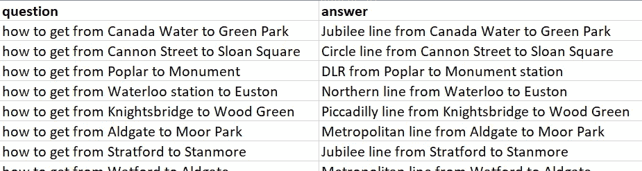
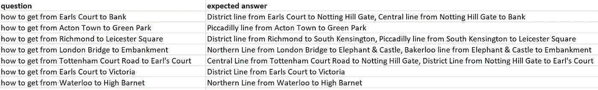
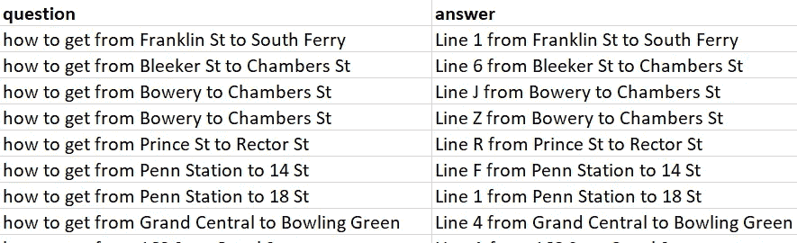
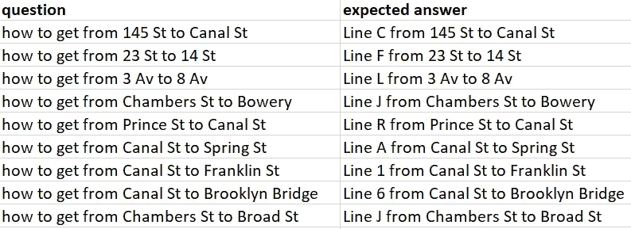
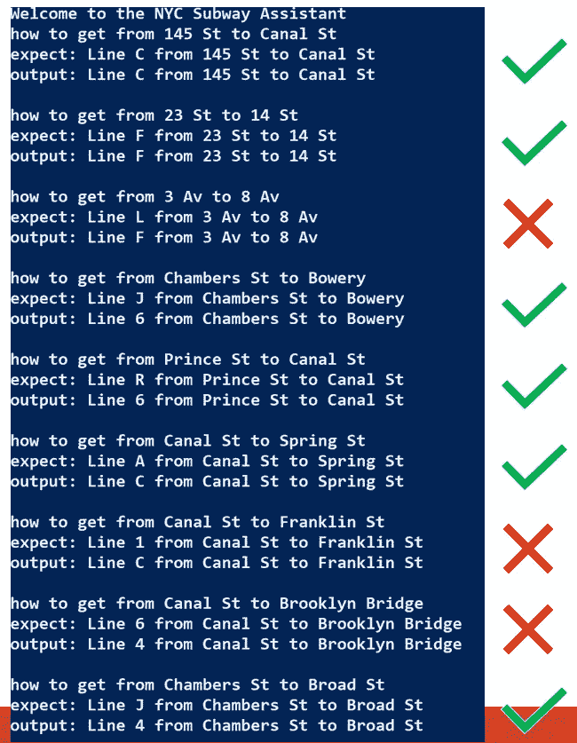

# GPT 3 号导航纽约地铁

> 原文：<https://towardsdatascience.com/gpt-3-navigates-the-new-york-subway-f28ea49fcead?source=collection_archive---------24----------------------->


纽约的地铁(图片快门)

2020 年末，我发表了一篇关于使用 GPT 3 号导航伦敦地铁的文章。本文描述了我如何用 Python 创建了一个简单的[工具:](https://github.com/ryanmark1867/tube_assistant/blob/master/tube_assistant.py)

*   定义一个 GPT-3 对象，读取一个包含提示的 CSV 文件，并调用 GPT-3 add_example API 使提示对 GPT-3 对象可用



包含传递给 GPT-3 的提示的 CSV 文件

*   从另一个 CSV 文件读入测试行程，使用 GPT-3 提交请求()API 让 GPT-3 对行程进行预测，并打印出 GPT-3 返回的预测:



CSV 文件，包含传递给 GPT-3 进行预测的测试行程

这个实验的结果很一般。当旅行完全在一条地下线路上时，GPT 3 号能够在大约 2/3 的时间里预测正确的旅行。当旅行需要在地铁线路之间转换时，GPT 3 号的旅行方向大多是错误的。

## GPT 3 号将如何与其他地铁系统配合？

在幕后，我试图将同样的方法应用于 TTC 地铁，我的家乡多伦多的地铁系统。不幸的是，在 TTC 地铁旅行的提示下，GPT 3 号甚至连单线旅行都搞不清楚。我认为 GPT 3 号在伦敦地铁和 TTC 的表现不同是因为与伦敦地铁相比，用于训练 GPT 3 号的语料库中关于 TTC 地铁的资料较少。与伦敦地铁相比，TTC 在 GPT-3 的训练语料库中的足迹更小，这并不奇怪。伦敦的人口是多伦多的两倍多，地铁的总长度是 TTC 地铁的 5 倍。

令我失望的是，TTC 地铁不是测试我的 GPT-3 安全带的好候选，但我仍然想重用我为伦敦地铁实验创建的安全带。我需要找到另一个应用程序，最好是一个我比较熟悉的拓扑结构有趣的公交网络。本周，我终于找到了一个在 GPT-3 的培训中有很大机会脱颖而出的候选人:纽约地铁。

## 在纽约地铁系统上测试 GPT-3

由于缺乏维护投资，纽约地铁最近受到了一些批评。然而，我认为尽管最近有一些挫折，这是一个辉煌的系统。例如，你不得不佩服领导人的远见卓识，他们在一个多世纪前决定咬紧牙关，创建专用的快递线路。为了重用我的 GPT-3 线束，纽约地铁是完美的——一个具有有趣拓扑的大网络，在 GPT-3 的训练语料库中有很好的表现机会。

为了锻炼 GPT 3 号在纽约地铁中导航的能力，我所要做的就是:

*   创建一个 CSV 文件，其中包含一组关于纽约地铁出行的提示:



纽约地铁提示(NYC _ prompts _ hops _ separated _ and _ segmented . CSV)

*   创建一个 CSV 文件，其中包含一组在纽约地铁上的测试行程:



纽约地铁测试之旅(nyc_tests.csv)

定义了这些 CSV 文件后，我更新了线束的配置文件以指向它们:

然后我可以从命令行运行这个工具:

```
python tube_assistant.py
```

在测试行程中运行安全带的结果与我在伦敦地铁测试中看到的结果相同:2/3 正确:



在纽约地铁测试行程中使用安全带练习 GPT-3 的结果

多亏了 GPT 3 号的灵活性和我为伦敦地铁实验设计的 Python 线束，我能够用最小的努力来练习 GPT 3 号在纽约地铁中导航的能力。

## 结论

GPT-3 是一个了不起的模型，它用最多几个例子提示作为输入，解决了许多新奇的问题。伦敦地铁和纽约地铁的实验告诉我，当涉及到空间导航问题时，GPT-3 并没有产生惊人的结果。尽管如此，仍然令人印象深刻的是，只有少数几个提示开始，GPT-3 可以在这种导航问题上产生一般的结果。同样令人印象深刻的是，GPT-3 可以应用于另一个交通系统，无需对 Python 代码进行任何更改——我所需要做的就是创建几个 CSV 文件，然后就可以开始了。

## 资源

*   Repo 包含本文中描述的工具的代码:【https://github.com/ryanmark1867/tube_assistant
*   描述纽约地铁实验的视频:【https://youtu.be/Xzb1Vc8dYAY 
*   描述伦敦地铁实验的视频:[https://youtu.be/790PiTSqi4Y](https://youtu.be/790PiTSqi4Y)