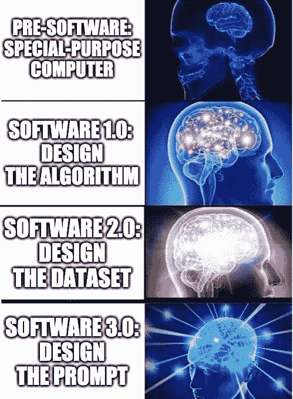
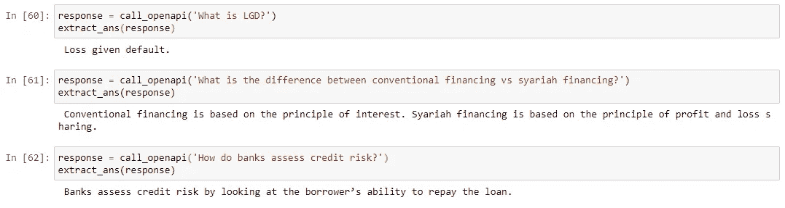
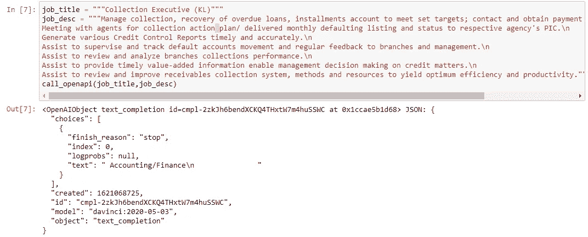
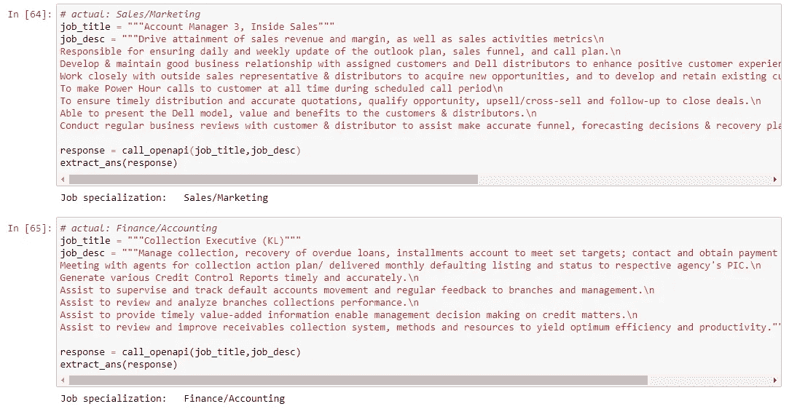
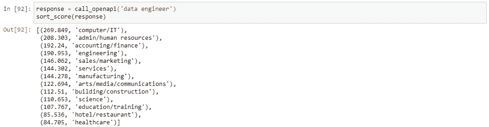
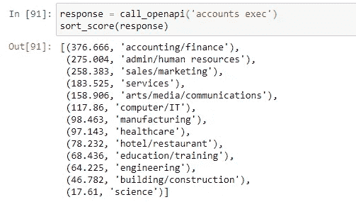
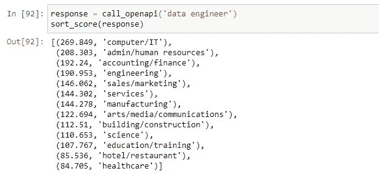
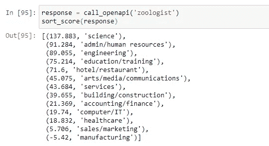
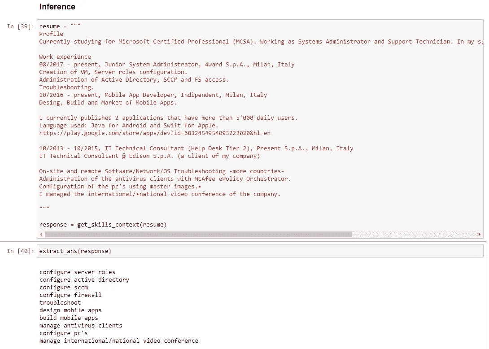
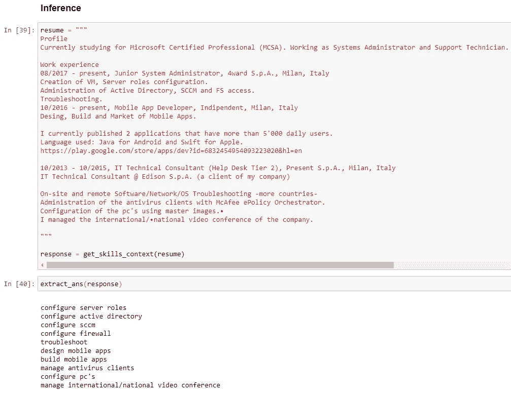

# GPT-就业市场中的 3 个用例

> 原文：<https://towardsdatascience.com/gpt-3-use-cases-in-job-marketplaces-d1acfe1f58a9?source=collection_archive---------18----------------------->

来自 Unsplash 的书籍

## GPT-3 搜索、分类和提取任务的快速工程探索

# 介绍

虽然 GPT-3 已经发布了一段时间，由于它在编写类似人类的故事和诗歌方面的非凡能力，引起了很大的轰动，但我从来没有想到它附带的 API 会提供如此的灵活性和易用性来构建具有广泛应用程序的数据产品。

在这篇文章中，我试图探索一些与我在就业市场上看到的问题相关的用例，并试图理解如何在未来围绕“即时工程”构建基于语言的数据产品。

与此同时，本文并不试图解释 GPT-3 是如何工作的，或者它是如何能够做它正在做的事情。关于这些话题的更多细节已经在诸如杰伊·阿拉玛[【1】](https://jalammar.github.io/how-gpt3-works-visualizations-animations/)和马克斯·伍尔夫[【2】](https://minimaxir.com/2020/07/gpt3-expectations/)的文章中写得很漂亮了。GPT-3 论文本身可以参考[【3】](https://arxiv.org/abs/2005.14165#openai)。

## 什么是“即时工程”？

[软件 3.0 上的迷因](https://nitter.cc/karpathy/status/1273788774422441984)

在 GPT-3 的 API 中,“提示”是一个提供给 API 的参数，以便它能够识别要解决的问题的上下文。根据提示的书写方式，返回的文本将尝试匹配相应的模式[4]。

下面是一个提示的例子，我们试图对 API 进行编程，在银行部门的范围内提供答案。“Q:”和“A:”格式，以及问题文本和它的回答，向模型提示我们正在寻找的东西存在于银行领域中(或者至少，我是这样理解它的:)

用“银行”上下文提示 API。

一旦设置了提示，我们现在就可以自由地发送我们的文本(或者问题，如果你愿意的话)。

来自 GPT-3 的问答回复。

如上所述，我们可以看到，我们得到的回应确实听起来合理(如果不是一个准确的答案)。

对于如何配置提示的其他创造性方法，请查看他们的 GPT-3 API 页面[5]的*示例*部分。或者，您也可以参考我的笔记本，查看文本分类和产品命名任务的提示示例。

回到我们的议程上来，让我们来看看就业市场领域中可以应用 GPT 协议-3 的一些现有用例。

免责声明:虽然我以前在工地公司工作过，但我没有直接参与过下面提到的大部分用例。因此，现实生活中对这些问题的解决方案可能与我解决问题的方式完全不同。这意味着在我的解决方法中可能会有明显的差距。

# 用例 1:工作专业化的分类

## 问题

给定由客户提供的工作广告(即雇主)，我们(作为就业市场)希望帮助他们快速将广告分类到正确的工作类别中，以便有助于稍后在工作门户中发现工作广告。

虽然这个问题可能由我们的客户/账户经理(即我们帮助我们的客户填写表格)，这种方法(由我们的客户自己或我们的客户经理填写表格)通常容易出错，并且从长远来看不可扩展(更不用说，归因于糟糕的数据收集)。

## 解决办法

根据职位名称和描述，我们尝试根据单词出现的可能性(基于配置的提示)来推断职位类别。

我们通过向 GPT-3 提示职位名称、描述和类别的样子来做到这一点。我们会将最终的作业专门化留空，以此向 API 发出信号，这是它接下来需要填充的位置。“###”关键字在此配置中被定义为停止字符。

向 GPT-3 提供职位名称、描述和职位类别/专业的预期语法

## 观察

我们为 GPT-3 提供了非常少的“会计/财务”和“销售/营销”工作类别的例子。在下面的图片中，我们可以看到在两种情况下它都能够返回我们输入的正确答案。

基于所提供种子中的输入的响应。

在下面的例子中，我们试图测试与原始提示完全不同类别的招聘广告(即“会计/财务”和“销售/营销”)。虽然测试样本很小，但结果也是积极的。

不及时的测试结果

最后一个例子让我感到惊讶的是，模型本身能够处理马来语输入，而不需要首先将文本翻译成英语。

# 用例 2:工作专业化的搜索排名

职位“数据工程师”的搜索结果

## 问题

在这个问题中，一个客户试图找到市场上最相关的工作。招聘广告应该按什么顺序展示给他/她？

现实中解决这个问题的现有方法实际上比我提出的方法更复杂。在这个个性化的时代，向用户展示的内容在很大程度上取决于一些因素，比如最近的浏览行为、个人资料以及许多其他因素。

为了将问题空间限制在一个更易于管理的范围内，我们首先集中精力确定我们认为广告可能属于哪一类工作。如果不是因为单词在不同的上下文中有不同的意思，这个任务一开始看起来似乎很简单。

## 解决办法

基于所提供的职位名称，我们尝试根据职位分类的语义相似性得分的顺序对固定数量的职位分类进行排序。

如前所述，第一步是为 API 配置正确的提示符。

提示 GPT-3 搜索能力

对于这项任务，我们利用了 GPT-3 中的“*搜索*模块(与之前的“*完成*模块相对)。这将确保我们不是试图在给出提示之前完成句子(如在前面的用例中)，而是要求 API 返回我们的查询之间的语义相似性得分(即。职位名称)和参考文件(即工作分类列表)。

## 观察

一旦出现提示，我们就可以开始测试 API 了。下面的例子表明，一般来说，人们只需使用 GPT-3 就能够对职务分类进行开箱即用的排序，而不需要任何进一步的微调。但是，请注意，这是基于当前的测试设置和小样本，因此里程可能会有所不同。

示例 1:客户经理

示例 2:数据工程师

例 3:动物学家

# 用例 3:从简历中解析技能上下文

从简历摘录中提取技能上下文

## 问题

基于提供的招聘广告或简历，我们希望能够从中提取某些信息，以帮助我们更好地匹配求职者和招聘广告。

虽然我们可以从简历/广告中提取许多信息(如技术技能、工作经历、过去的教育等)，但在这个用例中，我们将集中精力提取软技能。

## 解决办法

解决这个问题最简单的方法是依靠软技能字典，并基于精确匹配或某种形式的字符串相似性算法在一组阈值内提取关键字。虽然一开始很有效，但人们会立即被这些问题所困扰:

1.  提取的软技能与我们想要的上下文不匹配(这不是真正的技能，因此是精度问题)。
2.  我们无法用一个人写软技能的许多方式来填充我们的字典(回忆问题)。

在建议的解决方案中，我们的目标是用一些简历中典型经历部分的例子来解决这个提示性的 GPT-3，并提供一些提取软技能的例子。

经验和提取的软技能的例子(添加了上下文)

用更早的例子提示 GPT-3。

## 观察

从高层次的角度来看，它似乎能够提取简历中提到的大部分技能。特别令人感兴趣的是标准化“配置”一词的能力，而不是使用“管理”(来自“管理”)。它还能够将“配置防火墙”添加到列表中——这是一项简历中根本没有提到的技能，但可能暗示了 F5、McAfee 等其他工具的存在。

技能提取的结果

以前必须构建类似的东西(使用 Spacy、Databricks 和许多手动维护的字典等工具的组合)，解决方案构建的简单性(即提示)与输出质量相结合——让我更加欣赏 GPT 3。

# 结论

本文首先简要介绍了 prompt engineering，然后快速介绍了 GPT-3 可能适用的就业市场行业中的几个相关用例。

每个数据产品构建的简易性(通过提示)以及我们从中获得的结果证明了 GPT-3 在成为解决基于语言的任务的通用工具方面的巨大潜力。

也就是说，与构建任何数据产品一样，仍然需要更彻底和全面的验证测试来确定 GPT-3 可能存在的差距和错误。然而，这不是本文的范围。

本文中使用的笔记本可以在我的 git repo [6]中找到。

# 参考

[1]:[https://jalammar . github . io/how-gp T3-works-visualizations-animations/](https://jalammar.github.io/how-gpt3-works-visualizations-animations/)

【2】:【https://minimaxir.com/2020/07/gpt3-expectations/ 

【3】:【https://arxiv.org/abs/2005.14165#openai 

【4】:[https://beta.openai.com/docs/introduction](https://beta.openai.com/docs/introduction)

【5】:[https://beta.openai.com/examples](https://beta.openai.com/examples)

[6]:[https://github.com/ikanez/openai-experiments](https://github.com/ikanez/openai-experiments)