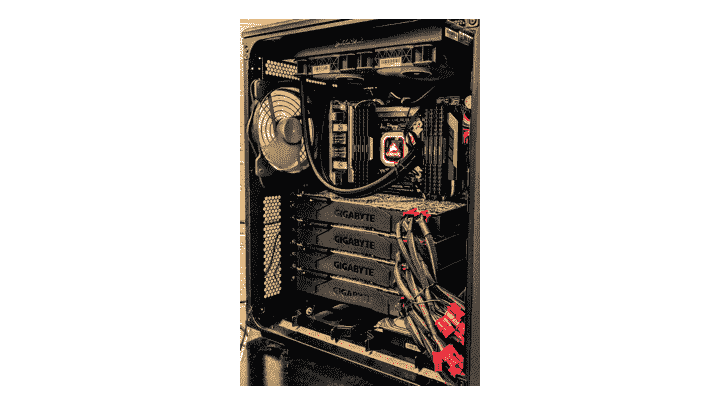
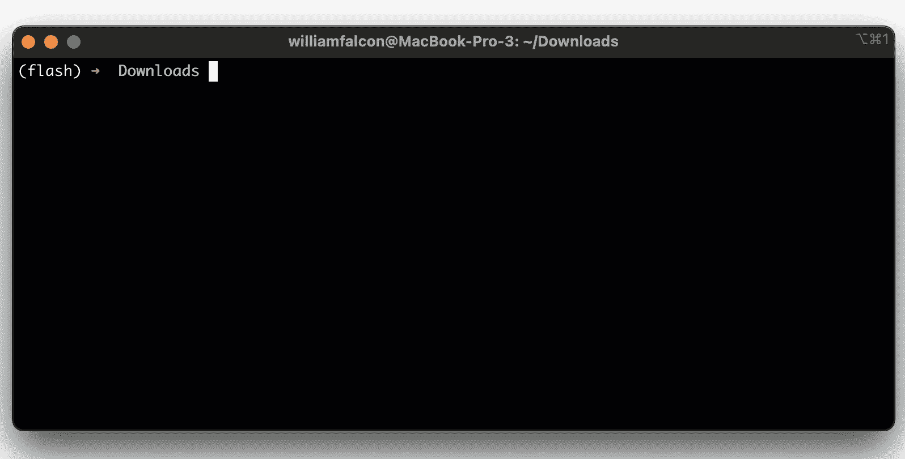
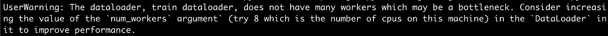

# GPU 快！数据集是你的瓶颈

> 原文：<https://towardsdatascience.com/gpus-are-fast-datasets-are-your-bottleneck-e5ac9bf2ad27?source=collection_archive---------15----------------------->

## 了解数据集如何成为您培训的瓶颈

糟糕的数据实践会减缓你的训练(图片来源: [pixabay](https://pixabay.com/photos/taxis-traffic-road-vehicles-city-1209542/)

如果你正在使用机器学习或深度学习，那么你可能会沉迷于确保你的所有代码都可以在 GPU 上运行，或者，对于勇敢的人来说，甚至可以在 TPU 上运行。

我讨厌带来坏消息，但你的模型可能已经非常适合 GPU 了！(特别是如果你使用像 [PyTorch Lightning](https://github.com/PyTorchLightning/pytorch-lightning) 这样的框架，它可以让你在 GPU 和 CPU 之间自动切换，而无需修改代码)。

真正的罪魁祸首是数据吞吐量。数据可能会以您可能没有意识到的微妙方式成为瓶颈。

# CPU 上的转换

当处理深度学习的数据时，你非常非常可能以某种方式转换你的输入。例如，如果您处理图像，您可能会对这些图像应用转换管道。

例如，这是一个典型的计算机视觉管道:

图像转换(作者自己的)

肮脏的秘密是，今天这些转换在 CPU 上一次一个输入地被应用**…这意味着它们*超级*慢。如果您的模型允许，您可以在 GPU 上一次对一批数据应用相同的转换。**

Kornia 是一个帮助你在 GPU 内存中完成这些转换的库

# 磁盘吞吐量

下一个主要瓶颈是从磁盘读取样本的速度。不管你有世界上最快的型号和 GPU…你的数据必须从磁盘-> CPU -> GPU。

GPU 机器内部(作者自己的)

你机器上的磁盘？最好是真正好的 SSD。

在云上，这变得更加相关…例如，如果您开始在云机器上运行几十个模型，这些模型都需要相同的数据，那么您将不得不为此构建非常优化的系统。在大规模训练时，S3 根本做不到！

当通过[网格 AI](https://docs.grid.ai/) 在 AWS 上运行云作业时，您可以使用网格[数据存储库](https://docs.grid.ai/products/add-data-to-grid-datastores)，这些数据存储库针对大规模运行进行了优化。只需创建一个数据存储:

当模型大规模运行时(甚至跨越数百个 GPU 和许多并发模型)，grid 将确保对其进行优化。

然后，要在云上运行代码，只需使用[网格运行](https://docs.grid.ai/products/run-run-and-sweep-github-files)

# 同时数据加载

使用 **num_workers (** 作者自己的)预加载数据

另一个容易出错的地方是将数据集加载到机器学习代码中的类。PyTorch 有一个 Dataloader 抽象，负责批处理和预加载数据。但是，为了充分利用这一点，请确保使用 num_workers 参数，它将在后台自动预加载批处理

问题总是 num_workers 应该是什么？通常，它是你机器上 CPU 数量的倍数。

如果你使用 PyTorch Lightning 这样的框架，它甚至会为你推荐 num_workers！

