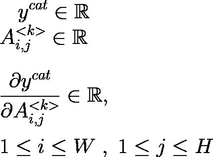

# Grad-CAM:为你的模特做决定的相机

> 原文：<https://towardsdatascience.com/grad-cam-camera-for-your-models-decision-1ef69aae8fe7?source=collection_archive---------8----------------------->

## 🤖[深度学习](https://equipintelligence.medium.com/list/deep-learning-techniques-methods-and-how-tos-01015cf5f917)

## 灯光，凸轮，渐变！

**来源:** [**Grad-CAM:基于梯度定位的深度网络视觉解释**](https://arxiv.org/abs/1610.02391)

模型可解释性是 ML 中的热门话题之一，因为它对于理解*黑盒*神经网络和一般 ML 系统非常重要。它们有助于识别 ML 系统中的潜在偏差，这些偏差会导致失败或不满意的用户体验。

 [## 研究显示人工智能经常有偏见。以下是如何让算法为我们所有人服务的方法

### 现有的人类偏见过于频繁地转移到人工智能上。这里有五种类型的偏见以及如何解决…

www.weforum.org](https://www.weforum.org/agenda/2021/07/ai-machine-learning-bias-discrimination/)  [## 研究发现商业人工智能系统中的性别和皮肤类型偏见

### 主要技术公司的三个商业发布的面部分析程序展示了皮肤类型和…

news.mit.edu](https://news.mit.edu/2018/study-finds-gender-skin-type-bias-artificial-intelligence-systems-0212) 

你会不时地看到这些头条新闻，因为无偏见 ML 模型的重要性在现代世界一直在上升。模型可解释性技术实际上允许我们检查我们的 ML 系统的低效率，并且寻找潜在的偏见。

在这个故事中，我们将研究一种新的方法，Grad-CAM 技术来生成 CAM(类激活图)，这有助于我们可视化我们的 CNN(或任何其他模型)在给定数据中的外观。

另外，您可以在官方的 Keras examples repo 中找到 Grad-CAM 实现(使用 TF)的源代码，

 [## Keras 文档:Grad-CAM 类激活可视化

### 作者:fchollet 创建日期:2020/04/26 最近修改时间:2021/03/07 描述:如何获得类激活…

keras.io](https://keras.io/examples/vision/grad_cam/) 

# 🧾目录

[**1。模型可解释性介绍**](#03b1)

[②**。我们可以用什么来解释模型的决定？**](#276f)

[**3。输入 Grad-CAM**](#cc6c)

[**4。通过实验学习- Grad-CAM**](#d351)

[*— 4.1。了解设置*和](#7e0c)

[*— 4.2。为每个特征图生成分数*](#d63f)

[*— 4.3。生成 Grad-CAM 热图*](#f3bb)

[**5。用 Grad-CAM**](#e71d) 进行反事实解释

[**6。模型决策中的检验偏差**](#978a)

[第七期**。作者的下一步/更多故事**](#c079)

[**8。参考文献**](#32cf)

# 1.⚖模型可解释性简介

> 对黑盒进行逆向工程

图 1 ->由图像分类 CNN 做出的推断。**来源:作者图片**

在阅读深度学习的入门书籍时，你可能已经注意到一件事，那就是他们将神经网络称为* ***【黑盒】*** 。我们知道神经网络确实有一个定义良好的数学结构，那么为什么它们被称为“黑盒”呢？

原因是我们无法解码神经网络做出的决策。例如，让我们考虑一个简单的 CNN 的狗与猫分类器(见*图 1* )。对于给定的图像，由模型做出的决定是由模型预测的类别。对于给定的图像，该模型决定该图像包含“狗”还是“猫”。

在我们的案例中，解码一个决定将有助于我们研究输入图像的特性或特征，这些特性或特征在产生那个决定中起了主要作用。如果我们的模型预测了“狗”这个类别，那么可能产生这个决定的一个重要特征可能是它的鼻子、耳朵或任何其他使它区别于“猫”这个类别的特征。我们想知道我们的模型基于什么来预测某个标签，比如“猫”或“狗”。

> “为了建立对智能系统的信任，并让它们有意义地融入我们的日常生活，很明显，我们必须建立‘透明’的模型，能够解释它们为什么会预测它们预测的东西。”—来自[ 1 ]

考虑到橙子和苹果的图像分类问题，这些水果的形状不是一个*好的*特征，因为它们可能有相似的形状。这可能会给我们****不正确的结果*** ，当模型已经在现实世界中部署时。

为了更好地理解 ML 中模型可解释性的概念，请参考，

 [## 可解释的机器学习

### 机器学习在改进产品、流程和研究方面潜力巨大。但是电脑通常不会…

christophm.github.io](https://christophm.github.io/interpretable-ml-book/) 

为了识别这样的特征，也为了发现我们的 NN 模型对于特定决策的*焦点*，我们引入了**模型可解释性**的概念(参见**【2】**)**)。它包括所有那些为我们的模型决策带来可解释性和透明性的技术。**

> *****“黑盒” *:*** 在我们的上下文中，“黑盒”指的是决策无法被解码的模型。通俗地说，我们无法满意地回答这个问题，“为什么这个决定是由我们的模型做出的？。**
> 
> *****不正确的结果:**我们可能想要识别这样的特征，以便我们可以知道我们的模型的弱点**

# **2.🎓我们如何解释模型的决定？**

> **渐变是你所需要的，尤其是在 DL 中**

**为了更好地解释模型的决策，我们需要确定输入中的哪个要素对决策的贡献最大。在我们的狗与猫分类器中，如果预测一幅图像包含一只“猫”,那么模型会考虑哪些特征，如眼睛、身体颜色、耳朵，来产生这种预测？**

**嗯，我们可以分析梯度，以检查我们的模型侧重于生成某个预测。梯度有助于我们测量输入( ***x*** )对输出的影响(如 ***x*** 上的某些函数 ***f*** )。这就是我们所需要的，图像中对神经网络输出影响最大的部分或区域。**

** [## 理解机器学习中的梯度

### 以张量值函数的导数为例。

medium.com](https://medium.com/analytics-vidhya/understanding-gradients-in-machine-learning-60fff04c6400) 

我们将确保梯度调查区域的形象，这是重要的决策模型。这就是 Grad-CAM 方法中“Grad-”的含义，我们将在下一节探讨。** 

# **3.进入 Grad CAM**

> **嗯，这就是故事的全部！**

**

**来源:** [**Grad-CAM:通过基于梯度的定位来自深度网络的视觉解释**](https://arxiv.org/abs/1610.02391)** 

**Grad-CAM 是由研究人员于 2017 年在论文***【Grad-CAM:通过基于梯度的定位来自深度网络的视觉解释】*** (参见**【1】**)中引入的，以便为模型的某些输出生成类激活图(CAM)。他们的方法 Grad-CAM 也概括了**【7】**的方法，也可用于其他类型的模型。在他们的论文中，人们可以观察到图像字幕模型以及 VQA(视觉问答)模型的可视化。**

** [## 具有深度学习的视觉问答

### 本博客包含“面向视觉问答的分层问题-图像共同关注”论文的实现…

towardsdatascience.com](/visual-question-answering-with-deep-learning-2e5e7cbfdcd4) 

首先，我们将从神经网络的基础上理解 Grad-CAM 的基本实现。因此，这个故事期望读者有一些关于神经网络，反向传播和卷积层的知识。

 [## 轻轻潜入卷积神经网络背后的数学

### 神经网络之谜第五部分

towardsdatascience.com](/gentle-dive-into-math-behind-convolutional-neural-networks-79a07dd44cf9) 

然后，我们将强调 Grad-CAM 的一些特性，这些特性有助于更好地理解我们的模型。所以，我们开始吧！

# 4.🧪通过实验学习——grad-cam

## 4.1.了解设置

> 理解包含模型决策信息的参数

图 2-> CNN 的底层。**来源:作者图片**

假设我们对猫和狗的图像分类问题做了一个简单的 CNN。我们的 CNN 将预测标签*‘猫’*和*‘狗’*的分布，为此我们需要在最后一个密集层上激活 ****softmax*** (参见*图 2* )。我们的 CNN 由一些卷积层组成，后面是一个*展平*层，然后是一些 FC ( *全连通或密集*)层。我们没有考虑所有卷积层，而是只分析最后一个卷积层的* ***输出。*** 最后一个卷积层的输出被展平并传递给 FC 层。如*图 2* 所示，最后一个卷积层的输出是*特征图，宽度 ***W*** 和高度 ***H*** 各一张。我们将它们统称为张量 ***A*** ，其中 ***A_k*** 将是***k 个*** 内核。*

**

*图 3->**A**和 **A_k 的形状来源:作者图片***

*要知道内核和过滤器的区别，你可以参考我的这个故事，*

* [## 内核与过滤器:去神秘化

### 一劳永逸地理解差异。

pub.towardsai.net](https://pub.towardsai.net/kernels-vs-filters-demystified-1fd594e1c38d) 

在 softmax 之前，我们的 CNN 的输出是 ***y_c*** ，在猫与狗分类器的情况下， ***y_c*** 是一个形状为`( 2 , 1 )`的数组。这个数组的第一个和第二个元素分别是类“cat”和“dog”的输出。

图 4->**y _ c 的构成来源:作者图片**

正如我们之前讨论的，我们将利用渐变来解码模型的决策。为了计算梯度，我们需要一个函数和变量来计算它。我们的目的是研究特征图、*和我们的 CNN、 ***y*** 的输出之间的关系。*

*每个特征图捕获输入图像的一些高级特征，并在做出最终决定 ***y*** 中有其贡献。让我们假设，我们需要解码预测类“cat”的决策，所以我们将只关注输入 ***y_cat*** 中的一个。*中任何特征映射的任何变化都会导致 ***y_cat*** 值的变化。那么，为什么不计算 ***y_cat*** 相对于特征图 ***A_k*** 之一的梯度呢？**

**首先，让我们从下图中了解这个渐变的形状，**

****

**图 5->**y _ cat**w . r . t .到 **A_k .的渐变形状来源:作者图片****

**因此，我们感兴趣的梯度具有形状 ***W * H*** ，这与 ***A*** 中的特征图相同。我们还会用 ***i*** 和 ***j*** 来索引这个矩阵的元素。我们可以构造这个矩阵的另一种方法是通过计算***y _ cat***w . r . t .***A _ k***的元素之一的梯度，索引为 ***i*** 和 ***j*** 。这个梯度是实数(标量)，**

****

**图 6->**y _ cat**w . r . t .到由 **A_k 的 **i** 和 **j** 索引的元素的渐变形状来源:图片由作者**提供**

**如果我们计算所有这些可能的梯度，对于所有的值 ***i*** 和 ***j*** 并将它们放置在一个 ***W * H*** 网格中，我们得到与图 5 中描述的相同的梯度。我们中的许多人可能已经知道这一点，但在这里提到它是很重要的，因为我们将在执行梯度的全局平均池中使用这一观察。**

> *****softmax** :准确地说，我们将其称为 soft argmax，但大多数 ML 文献都求助于 softmax。参见**【3】。****
> 
> *****最后一个卷积层的输出**:我们选择最后一个卷积层的输出是有原因的。最后一个卷积层捕获高级特征，从而保存关于输入图像(馈送给 CNN 的图像)的重要区域的信息。Grad-CAM 研究论文***【1】***的一个注解，**
> 
> *****“我们发现 Grad-CAM 图随着我们移至更早的卷积层而变得越来越差，因为它们具有更小的感受域，并且只关注语义更少的局部特征。”*****
> 
> **注意，我们总是可以使用 CNN 的其他层。当 CNN 的初始层捕获局部特征时，它们的梯度不会解释任何关于构成最终预测(或决策)的全局或高级特征的事情**

## **4.2.为每个特征地图生成分数**

> **根据每个特征图在最终输出中的影响对其进行加权**

**在上一节中，我们已经获得了一个渐变来研究 ***y_cat*** (甚至 ***y_dog*** ) w.r.t 到单个特征图 ***A_k*** 的变化。但我们的目标是研究从 ***y_cat*** w.r.t 到 ***A*** ，一个由所有 ***K*** 组成的张量特征图。*中的一些特征映射可能对最终输出 ***y_cat*** 产生比其他更大的影响。如果我们能根据它们在 ***y_cat*** 中的影响，给这些特征图中的每一个分配一个分数就好了。如文中所述，我们可以计算*图 6* 中描述的梯度的所有元素的平均值，并将其用作该特征图的得分。***

** [## 全球平均池

### 本教程将展示 YOLO 如何使用张量流工作的基本解释。本教程的代码旨在…

www.guidetomlandai.com](https://www.guidetomlandai.com/Global-Average-Pooling/) 

换句话说，我们正在执行特征映射的全局平均池化(GAP ),

图 7 ->每个特征图的得分。**来源:作者图片**

特征图的分数越大，对 ***y_c*** 的影响越大。由于我们想要分析增加 ***y_c*** 值的特征，我们期望具有更高分数的特征图具有更多正梯度，总结了*图 7* 中的表达式。如*图 6* 所示，渐变的正值意味着增加像素(元素) ***A_i，j，*****y _ c**的值也会增加 ***。***

## 4.3.生成 Grad-CAM 热图

> 将我们所有的知识整合起来制作热图

由于我们已经为*中的每个特征图计算了分数，我们现在可以继续制作 Grad-CAM 热图，我们在故事的前面部分已经看到了。稍后，我们将把这张热图叠加到输入图像上，看看我们的模型*看到了什么*来生成某种预测。*

*使用这些分数，我们计算*中所有 ***K*** 特征图的加权和，**

********

**图 8 ->计算特征图的加权和。**来源:作者图片****

**最后，我们应用逐元素的 ReLU 操作(参见**【4】**)来获得最终的热图。**

****

**图 9-> Grad-CAM 热图。**来源:作者图片****

**使用 ReLU 操作的原因在文章中有清楚的描述，**

> **我们将 ReLU 应用于地图的线性组合，因为我们只对对感兴趣的类别有积极影响的特征感兴趣，即，为了增加 y_c，应该增加其强度的像素。**

**您可以从 Grad-CAM 上的官方 Keras 示例中找到将热图叠加到输入图像上的代码。**** 

# **5.🎎Grad-CAM 的反事实解释**

> **思考你的模型没有想到的东西！**

**正如 Christoph Molnar 在“可解释的机器学习”中提到的(参见**【5】**)，**

> **一个反事实的解释以这样的形式描述了一个因果关系:“如果 X 没有发生，Y 也不会发生”**

****

**图 10 ->如论文[ 1 ]所示的反事实解释。**来源:** [**Grad-CAM:通过基于梯度的定位来自深度网络的视觉解释**](https://arxiv.org/abs/1610.02391)**

**一个反事实的解释描述了当一个特定的决定被采取的时候什么不会发生。考虑到我们的猫与狗分类器的例子，我们想检查在给定输入图像的情况下，当模型的决定是“猫”或“狗”时，什么不会发生。**

**为了计算给定类别和模型的反事实解释，我们重复第 4 节中描述的相同过程。**

** [## 6.1 反事实解释|可解释的机器学习

### 作者:Susanne Dandl & Christoph Molnar 一个反事实的解释以“如果 X…

christophm.github.io](https://christophm.github.io/interpretable-ml-book/counterfactual.html) 

但是这一次，在对特征图 ***A_k*** 进行全局平均池化的同时，我们对梯度取反，比如，

图 11 ->计算热图作为反事实解释的 **alpha_c** 表达式。**来源:** [**Grad-CAM:基于梯度定位的深度网络视觉解释**](https://arxiv.org/abs/1610.02391)

通过否定梯度，如图 11 所示，我们现在看到的是当像素值(或强度)增加时导致 ***y_c*** 减少的像素。生成的热图捕捉了模型在生成预测时没有关注的要素。** 

# **6.👩模型决策中的🧑检验偏差**

> **改进数据集和 ML 系统**

**

图 12 ->模型预测的偏差。**来源:** [**Grad-CAM:通过基于梯度的定位来自深度网络的视觉解释**](https://arxiv.org/abs/1610.02391)** 

**我们可以使用 Grad-CAM 来识别训练数据集传递的模型预测中的偏差。考虑到本文中的示例，假设我们已经根据从 ImageNet 数据集获取的图像训练了一个护士和医生图像分类器。该分类器在测试数据集上表现很好，但不能很好地泛化。我们是怎么知道的？查看*图 12* 中的 Grad-CAM 热图，我们的有偏模型，我们可以观察到该模型专注于预测“护士”和“医生”标签时看似无关紧要的不需要的特征(部分面部、头发)。该模型似乎学习基于性别的特征，这在我们的用例中是不合适的。**

** [## 机器学习和深度学习中的偏见是什么？

### 随着医疗行业收集数字数据的能力增强，新一轮的基于机器的学习(ML)和…

www.foreseemed.com](https://www.foreseemed.com/blog/bias-in-machine-learning) 

正如论文中提到的，数据集是有偏差的。78%标为“医生”的图像包含男性，而 93%标为“护士”的图像包含女性。显然，数据集中存在的性别偏见被传递到了模型中。请注意，该模型在测试数据集上表现良好，准确率为 82%。

一旦我们知道我们的数据集中存在特定的偏差，我们就重新收集数据并重新训练模型。无偏模型，如图*图 12* 所示，捕捉准确的特征以识别包含“护士”和“医生”的图像。请注意，该模型侧重于识别“医生”形象的听诊器。** 

# **7.👨‍🦱下一步/作者的更多故事**

**Grad-CAM 之后，许多研究小组提出了他们的方法，以获得更好的模型可解释性。**

**Grad-CAM++**【8】**和 Score-CAM**【9】**都是基于 Grad-CAM 的思想构建的。此外，我们还平滑了分数凸轮**【10】**。**

**正如您将观察到的，模型可解释性一直是一个活跃的研究领域。因此，我们制作了一些新的“CAM ”,请在下面的评论中告诉我！**

**感谢您阅读这个故事！欢迎在下面的评论区发表你的评论/疑问/建议。**

# **8.参考**

1.  **[**Grad-CAM:基于梯度定位的深度网络视觉解释**](https://arxiv.org/abs/1610.02391)**
2.  **博客: [**公平可解释的机器学习**](/fair-and-explainable-machine-learning-25b802b00bec) ， [**解决机器学习中的“黑箱”问题**](/addressing-the-issue-of-black-boxes-in-machine-learning-f86429acbb2a)**
3.  **维基百科: [**Softmax 函数**](https://en.wikipedia.org/wiki/Softmax_function)**
4.  **[**理解具有整流线性单元的深度神经网络**](https://arxiv.org/abs/1611.01491)**
5.  **[**可解释的机器学习——让黑盒模型变得可解释的指南。，作者克里斯托夫·莫尔纳尔**](https://christophm.github.io/interpretable-ml-book/)**
6.  **[**数据集中的偏差:深度学习用于新冠肺炎检测|走向数据科学**](/bias-in-your-datasets-covid-19-case-study-d065aa698b74)**
7.  **[**学习深度特征进行判别定位**](https://arxiv.org/abs/1512.04150v1)**
8.  **[**Grad-CAM++:改进了对深度卷积网络的可视化解释**](https://arxiv.org/abs/1710.11063)**
9.  **[**Score-CAM:卷积神经网络的分数加权可视化解释**](https://paperswithcode.com/paper/score-camimproved-visual-explanations-via)**
10.  **[**SS-CAM:平滑的分数-CAM，用于更清晰的视觉特征定位**](https://arxiv.org/abs/2006.14255)*****