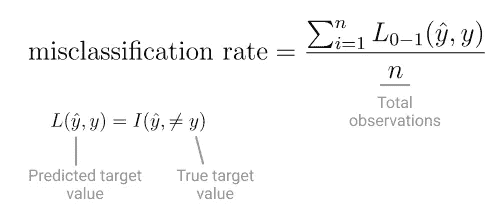

# 用真实的例子和一些 Python 代码解释了梯度推进决策树

> 原文：<https://towardsdatascience.com/gradient-boosted-decision-trees-explained-with-a-real-life-example-and-some-python-code-77cee4ccf5e?source=collection_archive---------2----------------------->

## [入门](https://towardsdatascience.com/tagged/getting-started)

## 梯度推进算法解决了机器学习中最大的问题之一:**偏差**。

图片作者。

*这是致力于基于树的算法系列的第三篇也是最后一篇文章，基于树的算法是一组广泛使用的监督机器学习算法。*

*第一篇文章讲的是* [*决策树*](/decision-tree-classifier-explained-in-real-life-picking-a-vacation-destination-6226b2b60575) *，第二篇探讨的是* [*随机森林*](/random-forests-algorithm-explained-with-a-real-life-example-and-some-python-code-affbfa5a942c) *。一切都用现实生活中的例子和一些 Python 代码来解释。*

梯度推进算法解决了机器学习中最大的问题之一:**偏差**。

决策树是一种简单而灵活的算法。简单到可以**欠填充**数据。

欠拟合决策树深度较低，这意味着它只对数据集进行几次分割，以尝试分离数据。因为它没有将数据集分成越来越多不同的观察值，所以它无法捕捉其中的真实模式。

*简单模型(左)与复杂模型(右)的偏差。[* 作者图片 *]*

说到基于树的算法[随机森林](/random-forests-algorithm-explained-with-a-real-life-example-and-some-python-code-affbfa5a942c)是革命性的，因为它使用了**打包**到**来减少随机树集合模型的总体方差**。

在梯度增强算法中，用于控制偏差的技术称为[增强](https://en.wikipedia.org/wiki/Boosting_(machine_learning))。

在 20 世纪 80 年代末和 90 年代， [Robert Schapire](https://en.wikipedia.org/wiki/Robert_Schapire) 和 [Yoav Freund](https://en.wikipedia.org/wiki/Yoav_Freund) 开发了一种最流行的 [Boosting 算法](https://en.wikipedia.org/wiki/Boosting_(machine_learning))、 [AdaBoost](https://en.wikipedia.org/wiki/AdaBoost) ，以解决欠拟合并减少偏差。

但是他们并不孤单。计算机科学和理论机器学习领域正乘着这股热情和开创性算法的浪潮，更多的科学家开始开发助推方法。

Friedman 探索了提升如何成为充分损失函数的优化方法。沙皮雷和弗罗因德从迈克尔·卡恩斯(Michael Kearns)提出的一个问题中获得了灵感，迈克尔·卡恩斯(Michael Kearns)提出了一个问题、*一群学习能力差的学生能创造出一个学习能力强的学生吗？*

在这种情况下，*弱* *学习器*是比随机模型稍好的任何模型，并且永远不会有效地实现零训练误差。一个*强学习者*是相反的，一个可以被改进并有效地将训练误差降到零的模型。

大约在同一时间，杰罗姆·弗莱德曼也在进行助推实验。他最终开发了几种新算法，最流行的是梯度推进决策树。

这些科学家和其他科学家的巧妙努力为机器学习带来了充满活力的新篇章。它产生了强大的算法。其中许多至今仍然适用。

# 增压 101

助推的座右铭是结果大于各部分之和。

[Boosting](https://en.wikipedia.org/wiki/Boosting_(machine_learning)) 基于这样一个假设，即找到几个简单的规则来进行预测要比找到一个适用于所有数据并生成最佳预测的规则*容易得多。*

Boosting 背后的直觉是，你多次训练同一个**弱学习者**，一个规则简单的模型。然后将它的*弱*预测组合成一个更准确的结果。该模型总是相同类型的，但是，每次，对于它错误分类的观察值，用不同的权重对其进行训练。

先前被错误分类的预测将对下一个*弱学习者*具有更大的权重，因此每个*弱学习者*将注意力集中在*最难的*观察上【1】。

*Boosting 算法赋予被错误分类的观测值更多的权重。(*图片作者 *)*

当你顺序组合不同的弱学习者时，每一个都会做出一些不正确的预测。但是他们会覆盖彼此的盲点，在其他学习者不擅长的地方做出更好的预测。每个模型*从上一个模型的错误中慢慢学习*。

# 所有升压算法的共同点是什么

所有助推算法都是**集成**分类器或回归器，这取决于手头的任务，因为它们结合了几个模型的结果。

*m 个弱学习者的集合。(*图片由作者提供)

在回归任务的聚合步骤中，您可以计算每个观察值的所有预测的加权和。而在分类任务中，多数票*决定*分配哪个类。

# 创造一个增强的合奏

大多数算法集中于参数估计，寻找使其损失函数最小的参数。Boosting 算法侧重于函数估计。

*弱学习器*的集合实际上是一组将特征映射到目标并最小化损失函数的函数[3]。

每增加一个新的*弱学习器*都会最小化集合的损失函数。 *(* 图片由作者提供)

并且因为用于寻找下一个*弱* *学习器*的优化算法是[梯度下降](/stochastic-gradient-descent-explained-in-real-life-predicting-your-pizzas-cooking-time-b7639d5e6a32)，损失函数必须是可微且凸的。

然而，这种时间梯度下降用于函数空间。

通常情况下，梯度下降从可微凸函数中的随机点开始，只有当它找到最小值时才会停止。

相同的概念被转化为具有梯度下降的 Boosting 算法，但是在函数空间中。

该算法从一个非常简单的*弱学习器*开始，例如，总是预测类 0。

随着每个*弱学习器*被添加到集合中，**算法朝着正确的目标前进了一步**，因为它只添加了最小化损失函数的*弱学习器*。

*系综的损失函数。(*图片作者)

指数损失通常用于分类任务，而在回归任务中则是平方损失。

# 梯度增强决策树 vs Adaboost vs …

所有提升算法都有一个共同的原则，它们使用提升来创建一个学习器集合，然后再进行组合。但是每一种都有独特的特点，使它们更适合特定的任务。

例如，在**梯度增强决策树**中，*弱学习器*总是一棵决策树。

在**随机** **梯度推进*、*** 中，弗里德曼在算法中引入了随机性，类似于装袋中发生的情况。在每次迭代中，该算法不是使用不同权重的整个训练数据集，而是随机选取训练数据集的一个样本，并使用它来训练下一个学习者[4]。

**Adaboost** 在许多方面类似于梯度增强决策树，在某种意义上，你拥有训练数据集中每个观察的权重分布，并且在每次迭代中，算法根据前一个*弱学习器*的表现来调整这些权重。但是在每次迭代中，当它根据弱学习者的错误率*选择一个新的学习率*α*时，它的适应性就开始发挥作用了。*

现在，您已经对不同的 Boosting 算法有了更多的了解，让我们看看它们的实际应用吧！

# 🛩🏝使用 Boosting 算法减少模型偏差

计划假期很有挑战性。最难的部分，选择目的地。

但你是数据科学家。你相信机器学习可以对你的下一个度假目的地给出算法意见。

每当计划度假时，你总是会考虑到:

*   假期的持续时间，
*   个人预算，
*   天气预报，
*   如果你的大家庭要加入，
*   如果你喜欢冒险，想要探索新的地方。

说到选择分类算法，你知道决策树据说是模仿人类做决策的方式。但是它[有局限性](/decision-tree-classifier-explained-in-real-life-picking-a-vacation-destination-6226b2b60575)，仅仅一个决策树不是一个非常强大的预测器。

如果你专注于控制偏差，而不是模型方差，随机森林会给你更好的结果。所以随机森林不是一个选项。

因为使用低**偏差**模型是你的目标，提升算法正是你要找的。

你要做的第一件事就是翻看你的旧笔记，收集一些关于你如何选择以前的度假目的地的数据。你收集了所有的信息，比如你当时的预算和假期的持续时间，以及你以前的目的地，通常是在海滩和乡村之间选择。

在下面的代码中，我将创建一个合成数据集来模拟这些数据。

创建包含 250 个观测值的合成数据集。 *(* 图片由作者提供)

# 发现模型偏差

你想使用升压算法的全部原因是为了控制[模型偏差](/bias-variance-tradeoff-in-machine-learning-models-a-practical-example-cf02fb95b15d)。

在预测数值的回归任务中，偏差由以下等式描述:

在这种情况下，你只需要 ***在公式中插入数字*** 。

但是你正试图获得一个关于你下一个度假目的地的算法意见，一个分类任务。

为此，您可以使用错误分类率，即[0–1 损失](https://en.wikipedia.org/wiki/Loss_function#0-1_loss_function)的平均值。

*(* 图片作者)

如果您的模型在训练集中有很高比例的错误分类观察值，这意味着它有很高的偏差。

Boosting 算法✅方法计算偏差✅

所以你从最简单的决策树算法开始。使用 ScikitLearns 的[决策树分类器](https://scikit-learn.org/stable/modules/generated/sklearn.tree.DecisionTreeClassifier.html#sklearn.tree.DecisionTreeClassifier)，您可以创建一个只对数据集进行两次分割的决策树。这就是为什么 *max_depth=2* 的原因。

为决策树定型的代码示例。 *(* 图片由作者提供)

训练集中的平均错误分类率[0–1 损失](https://scikit-learn.org/stable/modules/model_evaluation.html#zero-one-loss)为 44%。这几乎和随机模型一样好！高偏置✅

决策树算法的 0–1 分类错误的结果。 *(* 图片由作者提供)

现在你转向一个[梯度增强分类器](https://scikit-learn.org/stable/modules/generated/sklearn.ensemble.GradientBoostingClassifier.html#sklearn.ensemble.GradientBoostingClassifier)。

再次使用参数 *max_depth once* 将集合中每个*弱学习器*的深度设置为 1。在这种情况下，你正在训练尽可能最小的树，用机器学习的行话来说，这叫做[决策树桩](https://en.wikipedia.org/wiki/Decision_stump) *。*

就整体规模而言，你选择了一个相当随意的数字，210 棵树。这就是 GradientBoostingClassifier 方法中的参数 *n_estimators* 。

训练梯度增强决策树的代码示例。 *(* 图片由作者提供)

梯度增强决策树确实减少了偏差。0-1 损失 32%就好多了！

梯度增强决策树算法的 0–1 错误分类结果。 *(* 图片由作者提供)

好了，你建立了一个偏差相对较低的模型。但是你知道，除了梯度提升决策树之外，还有其他提升算法。

Adaboost 在预测你的下一个度假目的地方面会好到什么程度？

为 Adaboost 模型定型的代码示例。 *(* 图片由作者提供)

在 Adaboost 的情况下，训练相同数量的树并没有减少多少偏差。但是它仍然把错误分类率从决策树观察到的 44%降低到了 38%。

Adaboost 算法的 0–1 错误分类错误的结果。 *(* 图片作者)

当选择下一个度假目的地时，有了现成的数据集，梯度增强决策树是偏差最小的模型。

现在你所需要做的就是给算法你下次假期的所有信息，也就是持续时间，如果你想冒险的话。

算法会告诉你你的下一个假期是去海滩度假还是去乡下。

# 结论

现在，您可以自信地使用梯度推进决策树来预测您的下一个度假目的地。而不是只训练一个决策树。

梯度推进决策树与其他方法的不同之处在于:

*   速度，该算法是内存高效的，所以你可以更快地做出预测。
*   **无需预处理**在构建模型之前，您无需准备数据**。**
*   **数据健壮性**该算法可以很好地处理所有类型的数据。

尽管它比[决策树](/decision-tree-classifier-explained-in-real-life-picking-a-vacation-destination-6226b2b60575)更复杂，但它继续分享基于树的算法的优点。

但是总有一个陷阱。梯度推进决策树做出两个重要的权衡:

*   相对于较慢的训练，更快的预测，
*   性能高于可解释性。

# 更快的预测与更慢的训练

尽管上面提到的优势之一是记忆效率，但那是在进行预测的时候。

该算法更复杂，并且按顺序构建每棵树。它的预测速度很快，但训练阶段的计算要求更高。

# 性能高于可解释性

与随机森林的情况类似，您需要牺牲性能来获得可解释性。

你将不再能够*确切地看到*算法如何分裂每个树节点以达到最终的预测。

希望你喜欢学习助推算法，问题的地址和最终使它们独一无二。

请务必查看这个基于树的机器学习算法系列的其他两篇文章。第一个探索[决策树](/decision-tree-classifier-explained-in-real-life-picking-a-vacation-destination-6226b2b60575)，第二个探索[随机森林](/random-forests-algorithm-explained-with-a-real-life-example-and-some-python-code-affbfa5a942c)。

*感谢阅读！*

# 参考

1.  Schapire Robert E. (2002)机器学习的推进方法:概述
2.  加雷斯·詹姆斯，丹妮拉·威滕，特雷弗·哈斯蒂，罗伯特·蒂布拉尼。(2013).统计学习导论:在 r .纽约的应用
3.  弗里德曼，J.H .，2001 年。贪婪函数逼近:梯度推进机。统计年鉴，第 1189-1232 页。
4.  弗里德曼，J.H .，1999 年。随机梯度增强。计算统计学和数据分析。38 第 367–368 页