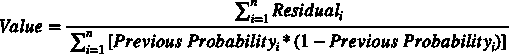

# 用于分类的梯度增强树——最好的机器学习算法之一

> 原文：<https://towardsdatascience.com/gradient-boosted-trees-for-classification-one-of-the-best-machine-learning-algorithms-35245dab03f2?source=collection_archive---------4----------------------->

## 机器学习

## 梯度增强在分类树中如何工作的分步指南

# **简介**

梯度提升树是我最喜欢的算法之一，它被许多数据科学家广泛使用。无论您是为自己的项目建立模型，还是试图赢得 Kaggle 比赛，梯度推进总是值得考虑的。


梯度推进分类-添加更多决策树后模型预测概率如何变化。图片由[作者](https://solclover.medium.com/)提供。

在这个故事中，我将带您了解算法实际工作的细节，并提供 Python 代码资源供您在自己的项目中使用。

# **内容**

*   梯度提升树属于哪一类算法
*   定义和基本原理
*   基于示例的梯度增强树的解释
*   Python 代码资源

# 梯度提升属于哪一类算法？

梯度推进是一种基于树的算法，它位于机器学习的监督分支之下。注意，它既可以用于分类问题，也可以用于回归问题。然而，在这个故事中，我将把重点放在分类方面。

> 旁注，由于神经网络独特的机器学习方法，我已经将它们归为一类。然而，它们可以用于解决广泛的问题，包括但不限于分类和回归。下图是**互动**所以一定要点击👇在不同的类别上对**进行放大并揭示更多的**。

机器学习算法分类。由[作者](https://solclover.com/)创建的互动图表。

***如果你喜欢数据科学和机器学习*** *，请* [*订阅*](https://solclover.com/subscribe) *每当我发布一个新故事时，你都会收到一封电子邮件。*

# **定义和基础**

为了理解梯度推进树是如何形成的，我们需要熟悉逻辑回归和决策树概念。

*   **回归树—** 这一开始可能听起来很奇怪，但是梯度推进分类算法并不使用分类树。相反，它使用回归树。这是因为梯度增强树中的目标是残差，而不是类别标签。如果你对此感到困惑，也不要担心。一旦我们开始看这个例子，它会变得更清楚。
*   **残差**——观测值与估计值(预测值)之差。我们将使用残差来计算 MSE 和树预测。
*   **MSE(均方误差)** —有多种方法可以找到树节点中的最佳分割，MSE 是回归树最常用的方法之一。因此，我们将在算法中使用 MSE。*注意，“观察”和“预测”是每个数据记录的实际值和模型预测值。* `*Residual = (Observed — Predicted).*`


*   **比值比** —它只是事件和非事件数量之间的比率。比方说，如果您的数据包含 3 封垃圾邮件和 2 封非垃圾邮件，则几率为 3:2(十进制表示法为 1.5)。
*   **Log(odds)** —是比值比的自然对数。所以如果，`the odds are 3:2 = 1.5, then log(odds) = log(1.5) = 0.405...`
*   **概率与赔率** —很容易将赔率转换成概率，反之亦然。例如如果，`the odds are 3:2, then the probability is 3/5 = 0.6.`你可以用下面的等式在概率和赔率之间进行转换:


*   **通过 log(odds)——**表示的概率是我们进行模型计算时需要的最后一部分:


注意，如果你想对以上概念有更深入的理解，可以参考我讲的关于 Logistic 回归的故事:

[](/logistic-regression-in-python-a-helpful-guide-to-how-it-works-6de1ef0a2d2) [## Python 中的逻辑回归——如何工作的有用指南

### 算法的详细解释以及如何用 Python 构建模型的有用示例

towardsdatascience.com](/logistic-regression-in-python-a-helpful-guide-to-how-it-works-6de1ef0a2d2) 

# **梯度增强树——基于实例的解释**

首先，让我与您分享一个过程图，以帮助您了解如何将每个步骤结合在一起，以产生一个梯度增强树模型。


梯度增强树的过程图。图片由[作者](https://solclover.medium.com/)提供。

## **开始**

首先，让我们看看我们将使用的数据。

我们有来自澳大利亚天气数据集的 9 个观测值，其中“阵风速度”和“下午 3 点的湿度”作为我们的两个模型特征(独立变量)。“明日雨旗”是我们想用模型预测的。

注意，我们使用了一组很小的数据，因为我们想让解释更容易。但是，该算法同样适用于更大的数据集。

我们的数据包含明天下雨= 1 的 5 个观测值和明天下雨= 0 的 4 个观测值。

初始预测只是从所有观测值中得出的概率`Probability = 5 / 9 = 0.56.`同时，分别为每个观测值计算残差，在这种情况下，取两个值中的一个:`Residual = Observed — Predicted = 1 — 0.56 = 0.44 or 0 — 0.56 = -0.56.`

由于我们正在构建一个分类模型，我们还需要计算 log(odds)。当初始预测是`Probability = 0.56`时，初始叶的 log(odds)值是:`Log(odds) = log(5/4) = log(1.25) = 0.22.`注意，在构建树 1 之后，来自初始叶的 log(odds)将用于重新计算残差。

## 树 1

让我们现在建立第一棵树。下面是我们在这个具体例子中使用的模型超参数。在这个阶段，我只想强调其中的几个，但是我将在本文结尾的 Python 部分提供完整的 Python 代码。

虽然树的默认大小的最大深度是 3，但为了简化示例，我们将其设置为 1。这意味着我们正在建造的树将是决策树桩。总的来说，我们的模型将包含 3 个学习设置为 0.5 的决策树桩。

> 重要的是要重申，使用梯度增强，我们不是预测类别标签(下雨/不下雨)，而是预测残差(见下表)。

让我们看看第一棵决策树(stump ),看看它是如何被创建的。


第一棵决策树(树桩)。图片由[作者](https://solclover.medium.com/)提供。

要回答的第一个问题是:“为什么算法选择了这个特定的节点分裂(下午 3 点的湿度≤ 45.5)？”

*   通过使用“下午 3 点的湿度”计算每个可能分割的**的 MSE，并使用“阵风速度”计算每个**可能分割的**的 MSE，确定最佳分割**
*   然后，该算法比较所有这些分割的**并挑选具有最低 MSE** 的分割。您可以在下面看到所选分割的 MSE 计算。

我们需要回答的第二个问题:“树内‘值’的用途是什么，它是如何计算的？”

*   该算法使用叶“值”来重新计算残差，然后在构建下一棵树时将其用作目标。
*   “值”通过以下公式计算:



现在，让我们将所有这些知识付诸实践，并计算树中的每个指标:


第一个决策树(stump)中每个计算的细节。图片由[作者](https://solclover.medium.com/)提供。

在转到树 2 之前，剩下的最后一部分是重新计算残差(模型目标)。按照上述流程图中的步骤，我们需要重新计算每个观察值的残差:

```
**'New Log(odds)' = 'Log(odds) from the initial prediction' + 'Value from Tree 1' * 'Learning Rate'.**Obs1 = 0.22 + 0.643 * 0.5 = 0.54 <-- Example for leaf 2
Obs6 = 0.22 + -2.25 * 0.5 = -0.91 <-- Example for leaf 1
```

注意，上面的计算给出了新的日志(赔率)。然而，为了获得新的残差，我们首先需要使用以下公式将对数(赔率)转换回概率:


```
New Predicted Probability (Obs1) = 1/(1+e^(-0.54)) = 0.63
New Predicted Probability (Obs6) = 1/(1+e^(0.91)) = 0.29Note how the above probabilities are steps in the right direction for both observations.
```

最后，我们使用类别标签和新的预测概率来计算新的残差。

```
New Residual (Obs1) = 1 - 0.63 = 0.37
New Residual (Obs6) = 0 - 0.29 = -0.29
```

下表包含了所有观察值的重新计算值:

一个有趣的观察是，对 Obs7 和 Obs9 的新预测实际上比以前更糟糕。这就是为什么我们需要建立许多树的原因，因为有更多的树将导致所有观测预测的改进。你可以在本文开头的 gif 图片中看到这一点。

## 树 2

现在我们可以使用新的残差来构建第二棵树。注意，我不会再次列出所有的公式，因为它们与树 1 中的相同。但是，如果您想自己尝试计算，请记住使用在树 1 之后创建的表中的新值。


第二棵决策树(树桩)。图片由[作者](https://solclover.medium.com/)提供。

该算法将阵风风速≤49 确定为第二棵树中的最佳节点分裂，其中在叶 1 中有 8 个观察值(样本),而在叶 2 中只有 1 个观察值。

> *注意，当从一个大数据集构建一个更大的树时，建议限制一个叶子中允许的最小观察数量，以减少过度拟合的机会。*

既然我们已经知道如何计算叶值，让我们直接寻找新的残差。

```
**'New Log(odds) T2' = 'Log(odds) from the initial prediction' + 'Value from Tree 1' * 'Learning Rate' + 'Value from Tree 2' * 'Learning Rate'.**Obs1 = 0.22 + 0.643 * 0.5 + 0.347 * 0.5 = 0.72 <-- T1L2-T2L1
Obs6 = 0.22 + -2.25 * 0.5 + 0.347 * 0.5 = -0.73 <-- T1L1-T2L1
Obs7 = 0.22 + 0.643 * 0.5 + -2.724 * 0.5 = -0.82 <-- T1L2-T2L2As before we convert the above to New Predicted ProbabilitesPred Prob T2 (Obs1) = 1/(1+e^(-0.72)) = 0.67
Pred Prob T2 (Obs6) = 1/(1+e^(0.73)) = 0.33
Pred Prob T2 (Obs7) = 1/(1+e^(0.82)) = 0.31
```

然后，我们计算新的残差，并将它们放入下表，用于 3 号树的目标:

## **第三棵树……**

当构建额外的树时，重复相同的过程，直到达到指定的树数量，或者改进变得太小(低于某个阈值)。有趣的是，这是 3 号树桩的样子:


第三棵决策树(树桩)。图片由[作者](https://solclover.medium.com/)提供。

由于我们将我们的模型限制为只有 3 棵树，剩下的最后一部分是通过遵循上述方法结合对数(赔率)来获得最终的预测集。我相信你现在已经掌握了窍门，所以我就不重复了。相反，让我们直接进入 Python 代码。

[](https://solclover.com/membership)[](https://www.linkedin.com/in/saulius-dobilas/)

# **Python 代码资源**

既然你已经理解了梯度增强树是如何工作的，那么让我们使用完整的观察集来建立一个模型，但是使用与之前相同的两个特征。这样我们就可以生成下面的 3D 图来演示模型预测。

梯度增强树-预测平面。图片由[作者](https://solclover.medium.com/)提供。

## **设置**

我们将使用以下数据和库:

*   [来自 Kaggle 的澳大利亚天气数据](https://www.kaggle.com/jsphyg/weather-dataset-rattle-package)
*   [Scikit-learn 库](https://scikit-learn.org/stable/index.html)，用于将数据拆分成[训练测试](https://scikit-learn.org/stable/modules/generated/sklearn.model_selection.train_test_split.html?highlight=train_test_split#sklearn.model_selection.train_test_split)样本，建立[梯度提升分类模型](https://scikit-learn.org/stable/modules/generated/sklearn.ensemble.GradientBoostingClassifier.html)和[模型评估](https://scikit-learn.org/stable/modules/generated/sklearn.metrics.classification_report.html?highlight=classification_report#sklearn.metrics.classification_report)
*   [Plotly](https://plotly.com/python/) 用于数据可视化
*   用于数据操作的[熊猫](https://pandas.pydata.org/docs/)和 [Numpy](https://numpy.org/)

让我们导入所有的库:

然后我们从 Kaggle 获取澳大利亚的天气数据，你可以按照这个链接下载:[https://www . ka ggle . com/jsphyg/weather-dataset-rattle-package](https://www.kaggle.com/jsphyg/weather-dataset-rattle-package)。

我们接收数据并推导出一些新的变量用于模型中。


一小段 [Kaggle 的澳大利亚天气数据](https://www.kaggle.com/jsphyg/weather-dataset-rattle-package)做了一些修改。图片由[作者](https://solclover.medium.com/)提供。

## **模特培训**

接下来，我们定义一个用于模型训练的函数，并运行模型以产生结果:

*   步骤 1—将数据分为训练样本和测试样本
*   步骤 2-设置模型参数并训练(拟合)模型
*   步骤 3-使用我们的模型预测训练和测试数据上的类别标签
*   步骤 4-生成模型摘要统计数据
*   步骤 5-运行模型并显示结果

这些是上述函数返回的模型评估指标。


梯度增强树-模型结果。图片由[作者](https://solclover.medium.com/)提供。

最后，您可以使用 below 函数生成如上所示的 3D 图形。

# 结论

虽然这个故事很长，有很多细节，但梯度推进算法是数据科学家最需要理解的算法之一。我真诚地希望你在阅读它的时候感到愉快，并且这个算法对你来说不再神秘。

干杯！👏
**索尔·多比拉斯**

***如果你已经花光了这个月的学习预算，下次请记得我。*** *我的个性化链接加盟媒介是:*

[](https://solclover.com/membership) [## 通过我的推荐链接加入 Medium 索尔·多比拉斯

### 作为一个媒体会员，你的会员费的一部分会给你阅读的作家，你可以完全接触到每一个故事…

solclover.com](https://solclover.com/membership) 

此外，如果您对本文感兴趣，这里还有一些关于替代算法的资源。

[](/adaboost-algorithm-remarkably-capable-but-with-one-interesting-limitation-cf95905bf8a0) [## AdaBoost 机器学习算法:如何提高难以预测案例的性能

### 对自适应 Boosting 算法及其与其他基于决策树的机器的区别的直观解释…

towardsdatascience.com](/adaboost-algorithm-remarkably-capable-but-with-one-interesting-limitation-cf95905bf8a0) [](/naive-bayes-classifier-how-to-successfully-use-it-in-python-ecf76a995069) [## 朴素贝叶斯分类器——如何在 Python 中成功使用？

### 算法背后的理论的详细解释，以及 6 个 Python 例子

towardsdatascience.com](/naive-bayes-classifier-how-to-successfully-use-it-in-python-ecf76a995069)