# 概率分布的梯度增强

> 原文：<https://towardsdatascience.com/gradient-boosting-for-probability-distributions-6848a049d8a2?source=collection_archive---------29----------------------->

## TLDR-关于多维输出的梯度增强以及如何将其应用于生成概率分布的一些想法。如果您需要的不仅仅是对 boosting 问题的点估计，本文可能会有所帮助。

伊恩·基夫在 [Unsplash](https://unsplash.com/s/photos/trees?utm_source=unsplash&utm_medium=referral&utm_content=creditCopyText) 上拍摄的照片

# 介绍

梯度推进可以说是当今最流行的机器学习算法之一。将多个弱学习者结合起来以产生一个强学习者似乎好得不像是真的。

然而，像 [xgboost](https://xgboost.readthedocs.io/en/latest/) 这样的软件包经常在许多在线比赛中大放异彩。“只工作”的能力也使助推模型成为行业应用的有利工具。

像 [lightGBM](https://lightgbm.readthedocs.io/en/latest/) 或 said xgboost 这样的流行库为各种不同的用例提供了许多工具。然而，一个特殊的功能，即任意多输出升压，似乎还没有在这些包中可用。

快速的谷歌搜索会提供一些关于如何在这种情况下使用 sklearn 的 MultiOutputRegressor 的解释。

这种解决方案可以适用于合适的损失函数。尽管如此，还是有多输出处理器方法失败的情况。在这些情况下，我们需要更深入地了解渐变增强的背景，并手动实现一些元素。

> “有些情况下，多输出梯度提升的直观解决方案会失败。在这些情况下，我们需要更深入地研究 boosting 算法的理论，并手动实现一些元素。”

因此，今天，我想给你一些想法，如何多输出梯度升压可以'手动'完成。重点是提升目标变量概率分布的多个参数。如果你对这个理论不感兴趣，可以跳过下面的部分。

# 理论(根据你的喜好跳过这一部分)

梯度增强背后的一般思想可以概括为三个步骤:

1.  使用一个初始的浅薄的学习者来最小化给定的损失
2.  让第二个浅层学习者学习预测相对于第一个浅层学习者预测的损失导数
3.  将第二个学习者的预测乘以一个常数加到第一个学习者的预测上

选择 3)中的常数，使得组合预测最小化目标损失。之后，我们分别重复步骤 2)和 3 ),直到达到最大迭代次数。

**注**:梯度提升的解释大多考虑 2)中的负导数。在标准梯度下降中，这是最小化所必需的。假定 3)中的学习常数可以具有任一符号，然而导数的符号可以忽略。

为了简单起见，让我们研究正导数。

## 对步骤 1)初始化的深入解释

从技术上讲，我们从迭代的初始预测开始 *k=0* :

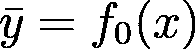

该初始预测可以是优化的常数

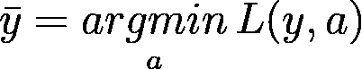

对于一个任意的损失。为了简单起见，我们将定义一个固定常数，而不首先优化它。

对于连续目标，损失函数通常是均方误差(MSE ),尽管这不是唯一的可能性。正如你在 [xgboost 文档](https://xgboost-clone.readthedocs.io/en/latest/parameter.html#learning-task-parameters)中看到的，有更多的选项可用。

对损失的唯一要求是，它必须相对于预测是可微的。

## 步骤 2)的深入解释)——梯度估计

显然，在这一步我们需要计算损失函数的导数。最简单的方法是从一般的公式开始，然后看一个具体的例子。对于任意的、可适当微分的损失，我们有:

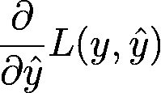

接下来，让我们使用 MSE 作为一个实际的例子。MSE 很简单

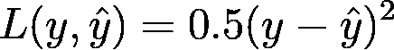

将这个代入上面的导数公式，我们得到

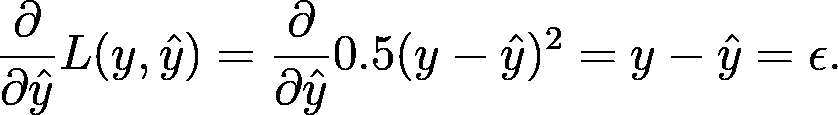

因此，对 MSE 损失的梯度提升等同于使用估计残差。请注意，这不是梯度增强的一般情况。

下一次迭代学习者现在必须估计残差:

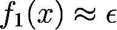

或者，对于一般情况:

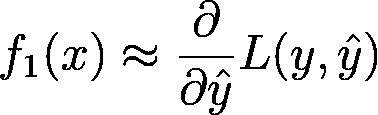

这是针对数据集中的每个观测值进行的。为了清楚起见，让我们引入下标索引 *i* 来表示单个实例:

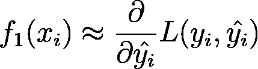

## 步骤 3)的深入解释)-模型更新

最后，我们需要更新完整的模型，如下所示:

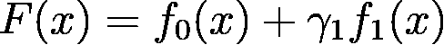

这是通过对大小为 *N* 的完整数据集的简单优化问题来完成的:

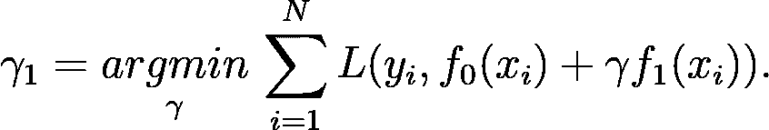

我们可以向优化器提供梯度信息，或者使用例如*scipy . optimize . minimize*进行黑盒(没有显式导数)优化。

从这里开始，我们只需要重复上述步骤，直到我们得到一个总共有 *K+1* 个浅层学习者的模型:

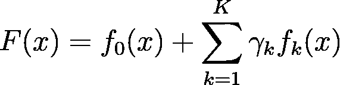

就我个人而言，我发现如此简单的算法在实践中却能产生如此好的结果，这真是太神奇了。

# 多输出梯度升压

最后，我们可以切换到本文的实际主题。对于这种情况，我们最重要的元素是一个合适的多输出损失函数。这种损失必须能够将多个模型的输出压缩成一个量。

让我们为具有 *M* 个输出的多输出情况介绍一些符号:

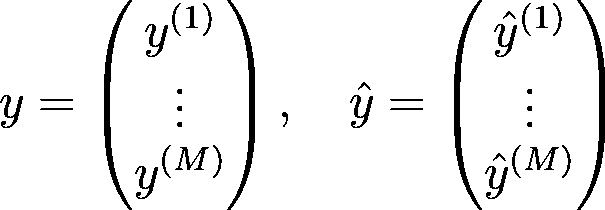

## 多输出 MSE

多输出连续回归最简单的扩展是单个均方误差的总和:

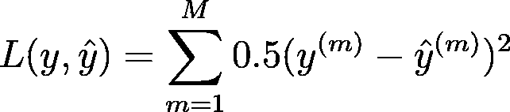

现在，我们需要计算每个输出的导数

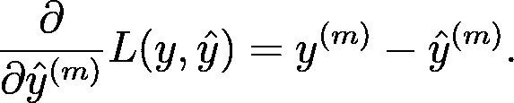

这基本上告诉我们，我们可以为每个输出运行单独的梯度增强实例。在这种情况下，*多路输出处理器*会立即工作。

为了证明为什么这种分离不一定是可能的，考虑一个目标类为 *M* 的多类问题。

## 多级梯度提升

我们使用多类交叉熵损失和 softmax 变换输出来获得有效的类概率。这产生了

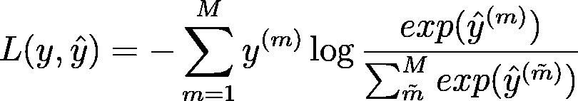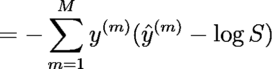

对目标使用 onehot-encoding，上述和中只有一个元素非零。我们将此表示为 *m^star* ，并去掉总和:

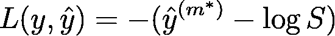

现在，对于导数，我们得到

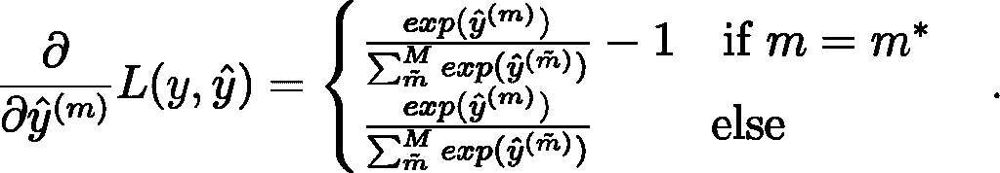

如您所见，每个输出的导数取决于所有其他渐变增强实例的输出。因此，不再可能仅仅将这个多输出问题作为单独的问题来处理。

这不同于上面的 MSE 例子。

更广泛的含义是，如果损失函数合适，我们只能使用以前的*多输出处理器*方法。一旦每个输出的导数不仅仅依赖于相应的输出，由此产生的梯度提升问题就变得不那么简单了。

> "一旦每个输出的导数不仅仅依赖于相应的输出，由此产生的梯度提升问题就变得不可忽视."

对于多类问题，我们幸运地在标准库中准备了必要的算法。然而，更好的东西可能需要手动实现。

# 概率分布的梯度增强

其中一件更有趣的事情是预测条件概率分布的参数。考虑一个一般的概率回归设置:

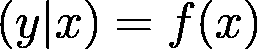

我们的目标是在给定输入 *x* 的情况下，预测目标 *y* 的概率分布。在简单线性回归中，这通常如下所示:

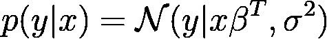

这个条件概率只是一个高斯函数，其均值线性依赖于输入。方差被假定为常数。利用[最大似然](https://en.wikipedia.org/wiki/Maximum_likelihood_estimation)可以很容易地估计出各个参数。

现在，让我们用梯度推进模型来代替线性均值和恒定方差项:

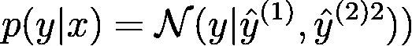

为了优化我们的模型，我们使用负对数似然函数作为损失函数

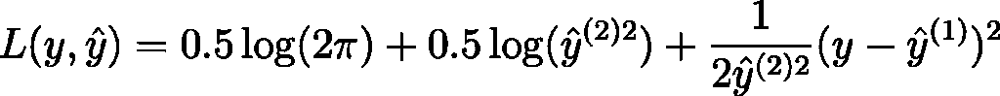

请注意，对于两个分布参数，这确实是一个多输出问题。然而，目标变量本身仍然是一维的。

> “条件高斯模型确实是一个两个分布参数的多输出问题。然而，目标变量本身仍然是一维的。”

最后，我们可以计算必要的导数。对于平均值的梯度提升模型，我们有:

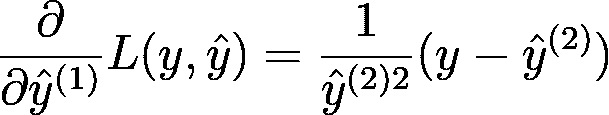

对于标准差的梯度推进模型，我们有

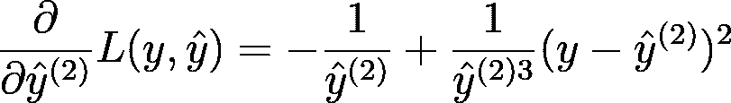

理论部分到此结束。我们现在准备构建 POC 级别的实现。

# 快速演示

Numpy、sklearn 和 scipy 提供了我们进行概念验证所需的一切。

## 损失和导数函数

首先，我们定义简单正态分布的对数似然函数:

为了正确使用 *scipy.optimize.minimize* ，我们创建了一个包装函数。该包装器可以作为 lambda 函数插入到优化器中。

请注意，对数似然现在有负号，因为我们想要最大化对数似然。这对于使用实际最小化算法来最大化对数似然是必要的。

最后，我们需要损失函数的导数:

## 抽样资料

我们的数据生成过程应该是非线性的，并且具有非恒定的方差。为了可视化，我们还保持输入数据是一维的。

满足这些要求的一个简单过程是

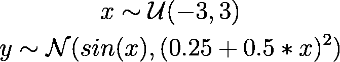

这个选择完全是任意的。我们只想看看我们的模型在这一点上是否可行。

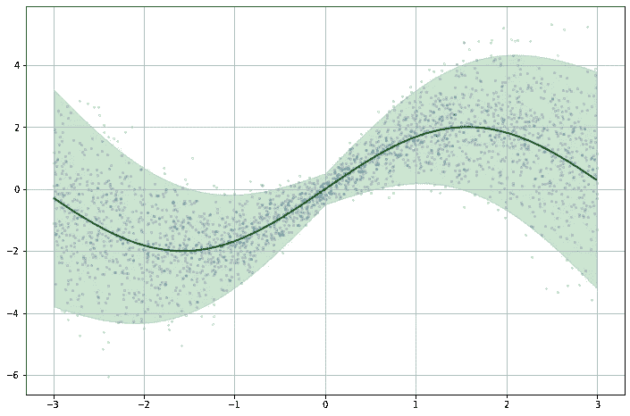

来自数据生成过程的样本数据(蓝点)，具有非线性平均值(绿线)和非恒定方差(绿色区域表示平均值的两个标准偏差)

## 运行模型

为了尽可能简单，我们不使用任何 Python 类。如果您想在这个基本实现的基础上构建一些东西，请随意构建包装器类。

我们的基础学习者将是简单的决策树树桩，比如 100 个。

为了跟踪训练预测和γ，我们总共使用 4 个 numpy 数组。这意味着我们对均值和方差模型使用不同的伽玛。一方面，这引入了更多的过度拟合风险。

另一方面，增加灵活性可以改善结果。这是一个需要考虑的权衡，选择使用单独的 gammas 也是任意的。

我们将初始平均预测值设置为零；初始标准偏差预测被设置为 1。

此外，我们将所有训练预测存储在一个*N×N _ trees*矩阵中，并将所有伽马存储在一个*1×N _ trees*矩阵中。这使我们能够简单地对聚合的增强输出的各个预测和伽马列进行相乘和求和。

基础学习者将存储在列表中供以后使用。

现在我们可以运行训练循环。如前所述，我们将在这里使用 *scipy.optimize.minimize* 。为了不使这篇文章过于臃肿，我们把它作为一个黑盒优化器。这意味着我们不向函数提供任何梯度或 hessian 信息。

在生产就绪的实现中，我们可能希望这样做—结果可能会改善。

评估过程类似于培训过程:

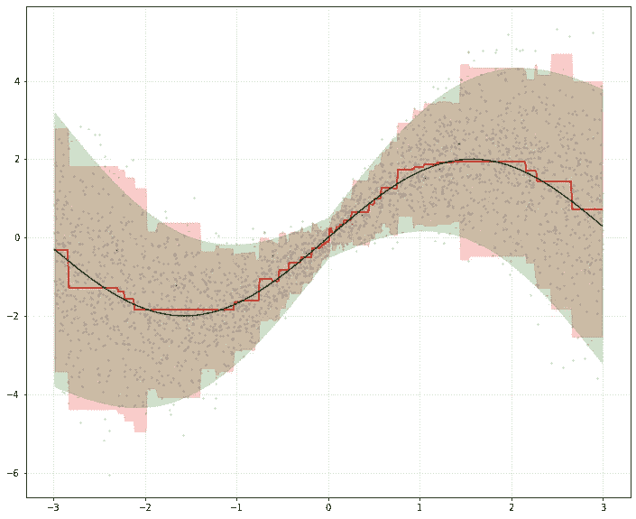

预测的均值函数(红线)和相应的方差(红色区域=均值的 2 个标准差)

均值和标准差的结果看起来都是合理的。我们可能会通过更多的微调来改善结果，以下是一些想法:

*   **使用更强大的优化程序**如前所述，我们应该为优化器提供理想的梯度和 hessian 函数。像 tensorflow 和 PyTorch 这样的自动签名包可以自动完成这项工作。
*   **微调模型超参数**树的数量和它们各自的深度将是明显的起点。
*   **使用更复杂的提升算法**我们的提升算法非常简单。有许多变化和进步可以轻松超越这种实现。

这些考虑可能有助于进一步改善我们的结果。

# 结论——我们还能做什么？

正态分布可能是最明显的选择，但是还有许多更有趣的选择。

例如，考虑高斯分布的[偏斜版本。实际上，大多数数据远非围绕平均值对称。解释这种行为可能会相当有利。](https://en.wikipedia.org/wiki/Skew_normal_distribution)

然而，随着分布参数数量的增加，我们无疑会增加过度拟合的风险。我们的目标分布中的每个新参数都意味着另一个梯度推进模型。

为了减少这种风险，正规化是必要的。最简单的正则化形式可能是在我们的算法中减少树桩的数量( *n_trees* )。在我们考虑更复杂的正则化方法之前，这已经足够了。

总而言之，如果您需要评估目标变量中的噪声，带有概率输出的梯度提升会非常有帮助。我在这里写了另外两篇文章[这里写了](https://numbersandcode.com/why-probability-and-uncertainty-should-be-an-integral-part-of-regression-models-part1)和[这里写了](https://numbersandcode.com/why-probability-and-uncertainty-should-be-an-integral-part-of-regression-models-ii)为什么我认为这是一个好主意。

> “总而言之，如果您需要评估目标变量中的噪声，带有概率输出的梯度提升会非常有帮助。”

如果你有任何问题或反馈，请在评论中告诉我。

*原载于 2021 年 7 月 26 日*[*【https://sarem-seitz.com】*](https://sarem-seitz.com/blog/multi-output-gradient-boosting-for-probability-distributions/)*。*