# 梯度下降算法——深度探索

> 原文：<https://towardsdatascience.com/gradient-descent-algorithm-a-deep-dive-cf04e8115f21?source=collection_archive---------0----------------------->

## 梯度下降法为机器学习和深度学习技术奠定了基础。让我们来探索它是如何工作的，何时使用它，以及它对各种功能的表现如何。

来自 [Pixabay](https://pixabay.com/) 的 [JohnsonMartin](https://pixabay.com/users/johnsonmartin-724525/) 图片

# 1.介绍

**梯度下降** (GD)是一种迭代一阶优化算法，用于寻找给定函数的局部最小值/最大值。这种方法通常用于*机器学习* (ML)和*深度学习* (DL)，以最小化成本/损失函数(例如，在线性回归中)。由于其重要性和易于实现，这种算法通常在几乎所有机器学习课程的开始时教授。

然而，它的使用不仅限于 ML/DL，它还被广泛应用于以下领域:

*   控制工程(机器人，化学等。)
*   电脑游戏
*   机械工程

这就是为什么今天我们将深入探讨一阶梯度下降算法的数学、实现和行为。我们将直接导航自定义(成本)函数以找到其最小值，因此不会像典型的 ML 教程中那样有底层数据——我们将在函数的形状方面更加灵活。

这种方法是在现代计算机时代之前提出的，其间有一个密集的开发，导致了它的许多改进版本，但在本文中，我们将使用 Python 中实现的基本/普通梯度下降。

# 2.功能需求

梯度下降算法并不适用于所有函数。有两个具体要求。功能必须是:

*   **可微**
*   **凸面**

首先，它必须是**可微的**是什么意思？如果一个函数是可微的，那么它对定义域中的每个点都有导数——不是所有的函数都满足这些标准。首先，让我们看一些满足这个标准的函数的例子:

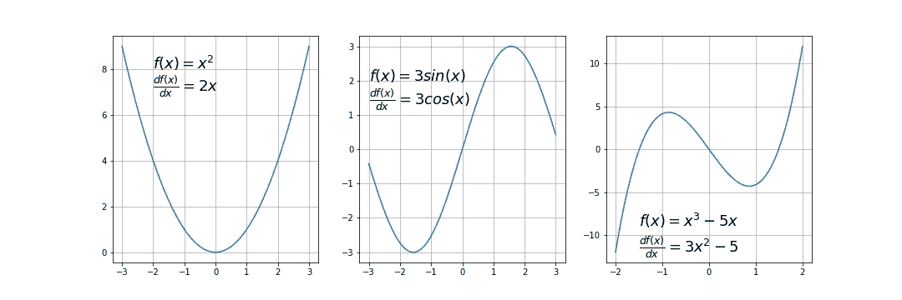

可微函数的例子；作者图片

典型的不可微函数有一个台阶，一个尖点或一个不连续点:

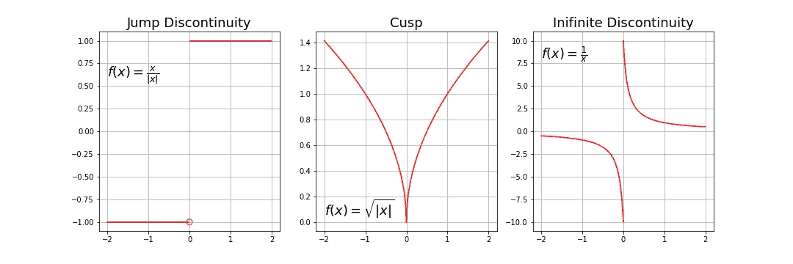

不可微函数的例子；作者图片

下一个要求— **函数必须是凸的**。对于一元函数，这意味着连接两个函数点的线段位于曲线上或曲线上方(不与曲线相交)。如果是，这意味着它有一个局部最小值，而不是一个全局最小值。

数学上，对于位于函数曲线上的两点 x₁、x₂，该条件表示为:

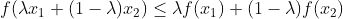

其中，λ表示剖面线上的点的位置，其值必须介于 0(左点)和 1(右点)之间，例如，λ=0.5 表示位置在中间。

下面有两个带有示例剖面线的函数。

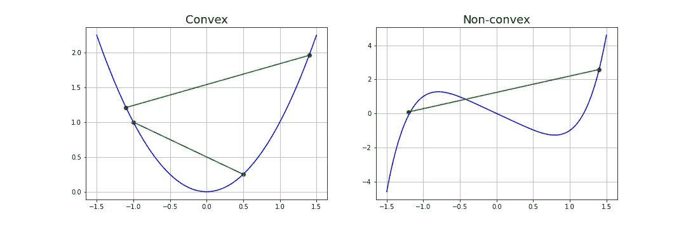

示例性凸函数和非凸函数；作者图片

从数学上检查一元函数是否凸的另一种方法是计算二阶导数，并检查其值是否总是大于 0。

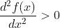

我们来做一个简单的例子(*警告:前方微积分！*)。

GIF via [giphy](https://media.giphy.com/media/l4FGni1RBAR2OWsGk/giphy.gif)

让我们研究一个简单的二次函数，由下式给出:

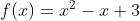

它一阶和二阶导数是:

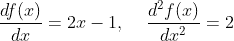

因为二阶导数总是大于 0，所以我们的函数是严格凸的。

也可以使用**准凸函数**和梯度下降算法。然而，通常它们有所谓的**鞍点**(也称为极大极小点)，算法可能会在这里卡住(我们将在本文后面演示)。准凸函数的一个例子是:

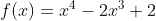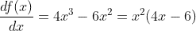

让我们在这里停一会儿。我们看到，在 x=0 和 x=1.5 时，一阶导数等于零。这些位置是函数极值(最小值或最大值)的候选位置，那里的斜率为零。但是首先我们要先检查二阶导数。

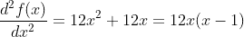

对于 *x=0* 和 *x=1* ，该表达式的值为零。这些位置被称为拐点——曲率改变符号的地方——意味着它从凸变到凹，或者反之亦然。通过分析这个等式，我们得出结论:

*   对于 x <0: function is convex
*   for 0
*   for x> 1:函数再次凸

现在我们看到点 *x=0* 的一阶和二阶导数都等于 0，这意味着这是一个鞍点，而点 x=1.5 是一个全局最小值。

让我们看看这个函数的图形。根据之前的计算，鞍点在 *x=0* 处，最小值在 *x=1.5* 处。

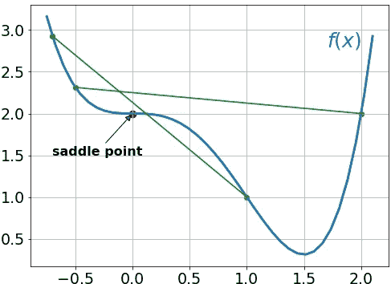

具有鞍点的半凸函数；作者图片

对于多元函数来说，检查一个点是否是鞍点最合适的方法是计算一个 Hessian 矩阵，这涉及到一些更复杂的计算，超出了本文的范围。

二元函数中鞍点的例子如下所示。

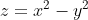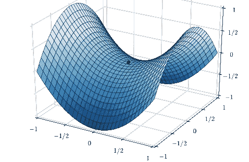

Nicoguaro，CC BY 3.0，通过维基共享

# 3.梯度

在开始编写代码之前，还有一件事必须解释一下——什么是梯度。直观上，它是曲线在指定方向上给定点的斜率。

在**为一元函数**的情况下，它只是在选定点的**一阶导数。在**是多元函数**的情况下，它是在每个主方向(沿着可变轴)上导数**的**向量。因为我们只对一个轴上的斜率感兴趣，而不关心其他的，所以这些导数叫做**偏导数**。**

n 维函数 f(x)在给定点 p 的梯度定义如下:

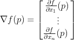

倒三角是所谓的 *nabla* 符号，你读它“del”。为了更好地理解如何计算，让我们手动计算一个示例性的二维函数。

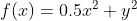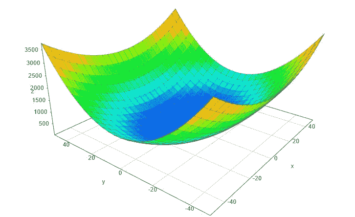

3D 绘图；作者图片

假设我们对点 p(10，10)处的梯度感兴趣:

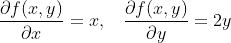

因此:

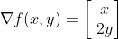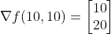

通过查看这些值，我们得出结论，y 轴上的斜率要陡两倍。

# 4.梯度下降算法

梯度下降算法使用当前位置的梯度迭代计算下一个点，缩放它(通过学习率)并从当前位置减去获得的值(进行一步)。它减去了这个值，因为我们想要最小化这个函数(最大化它就是相加)。这个过程可以写成:

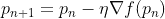

有一个重要的参数 **η** ，它缩放梯度，从而控制步长。在机器学习中，它被称为**学习率**，对性能有很大的影响。

*   学习率越小，GD 收敛的时间越长，或者在达到最优点之前可能达到最大迭代
*   如果学习率太大，算法可能不会收敛到最优点(跳跃)，甚至完全发散。

综上所述，梯度下降法的步骤是:

1.  选择一个起点(初始化)
2.  计算该点的梯度
3.  在与梯度相反的方向上按比例步进(目标:最小化)
4.  重复第 2 点和第 3 点，直到满足其中一个标准:

*   已达到最大迭代次数
*   步长小于公差(由于缩放或小梯度)。

下面是梯度下降算法的示例性实现(具有步长跟踪):

这个函数有 5 个参数:

1.在我们的例子中，我们手动定义它，但是在实践中，它通常是一个随机的初始化

2.**梯度函数** n -必须提前指定

3.**学习率** -步长的比例因子

4.最大迭代次数

5.有条件停止算法的容差(在这种情况下，默认值为 0.01)

# 5.示例 1 —二次函数

让我们用一个简单的二次函数来定义:

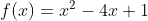

因为梯度函数是一元函数，所以它是:

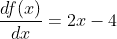

让我们用 Python 写这些函数:

对于这个函数，通过取 0.1 的学习率和 x=9 的起点，我们可以很容易地手工计算每一步。让我们开始前三步:

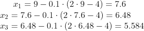

python 函数由以下函数调用:

下面的动画显示了学习率为 0.1 和 0.8 时 GD 算法所采取的步骤。如你所见，对于较小的学习速率，随着算法接近最小值，步长逐渐变小。对于更大的学习速率，它是在收敛之前从一边跳到另一边。

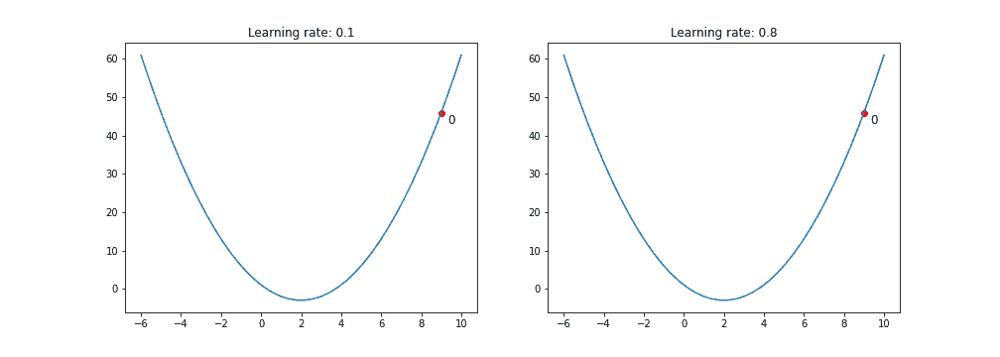

GD 为小学习率和大学习率采取的前 10 个步骤；作者图片

不同学习速率下的轨迹、迭代次数和最终收敛结果(在公差范围内)如下所示:

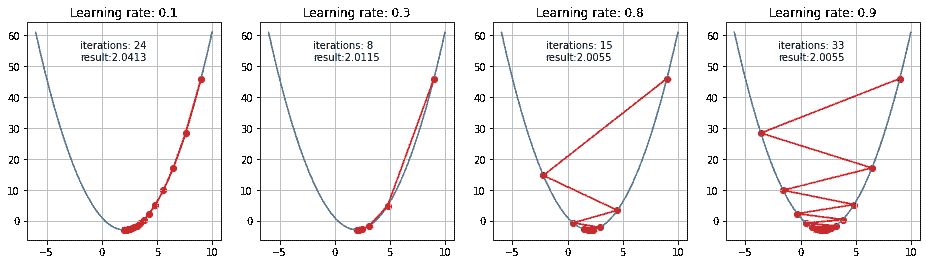

不同学习速度的结果；作者图片

# **6。示例 2 —具有鞍点的函数**

现在让我们看看这个算法将如何处理我们之前用数学方法研究过的半凸函数。

下面是两种学习速度和两种不同起点的结果。

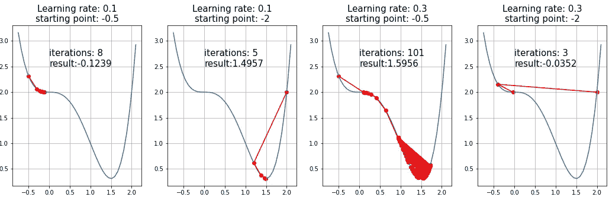

GD 试图逃离一个鞍点；作者图片

下面是一个学习率为 0.4，起点为 *x=-0.5* 的动画。

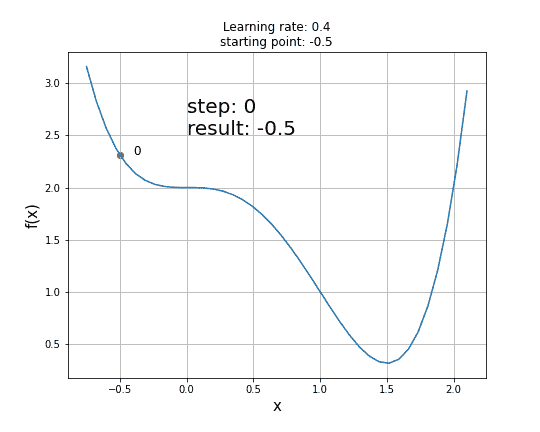

GD 试图逃离一个鞍点的动画；作者图片

现在你可以看到，鞍点的存在对 GD 等一阶梯度下降算法提出了真正的挑战，并且不能保证获得全局最小值。二阶算法更好地处理这些情况(例如，牛顿-拉夫森方法)。

鞍点的研究以及如何逃离它们是正在进行的研究的主题，并且提出了各种解决方案。例如，金池和 m .乔丹提出了一种扰动梯度下降算法——你可以在[他们的博客文章](https://bair.berkeley.edu/blog/2017/08/31/saddle-efficiency/)中找到细节。

# 7.摘要

在本文中，我们检查了梯度体面算法如何工作，何时可以使用它，以及使用它时有哪些常见的挑战。我希望这将是一个很好的起点，让你探索更先进的基于梯度的优化方法，如动量或内斯特罗夫(加速)梯度下降，RMSprop，ADAM 或二阶方法，如牛顿-拉尔夫森算法。