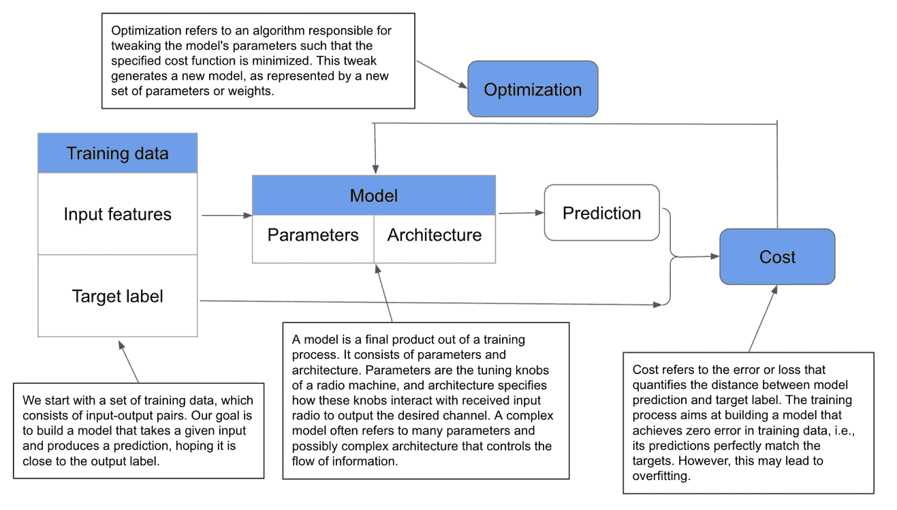

# 深度神经网络中的动态梯度编辑

> 原文：<https://towardsdatascience.com/gradient-editing-on-the-fly-in-deep-neural-networks-4f060360e95d?source=collection_archive---------14----------------------->

## 介绍优化深度神经网络时调整梯度的不同方法，包括梯度裁剪、扰动、掩蔽和替换

梯度是深度学习世界中的一个重要组成部分。它支持最受欢迎的算法之一——梯度下降算法，该算法通过根据模型成本相对于这些参数的当前梯度反复更改神经网络的值来优化神经网络的参数。虽然在每次更新中是一种简单的方法，但梯度下降算法家族，特别是随机梯度下降，一直是深度学习模型良好泛化性能的驱动力之一。

然而，人们更多地关注算法本身，而不是梯度。部分原因是梯度大部分是自动计算的，并被插入到优化过程中。这种自动计算机制，例如使用 PyTorch 中的自动签名模块，省去了手动推导的麻烦，从而使我们更容易专注于整体算法。本系列教程旨在弥补这一差距，并演示如何动态编辑梯度，以便我们可以在利用自动微分的同时获得梯度。对于本系列的第 1 部分，我们将介绍整个模型训练过程，作为后面部分的必要背景知识。

如图 1 所示，典型的模型训练过程由四个部分组成:数据、模型、成本和优化过程。模型训练过程从一些训练数据开始。在监督学习任务中，训练数据由输入-输出对组成。每个输入条目可以包含从不同角度描述一个观察的多个特征。相应的输出包含目标标签，作为指导训练过程的正确答案。模型训练旨在生成一个映射函数，一个模型，它将给定的输入正确地映射到相应的输出。



图 1 典型模型训练过程示例。工作流从可用的训练数据开始，并逐渐调整模型。调整过程需要将模型预测与目标标签进行匹配，其中通过特定的成本函数来测量差距，并将其用作下一轮调整的反馈。每次调整都会产生一个新的模型，我们希望寻找成本最低的模型。图片由作者提供。

# 数据

模型训练过程从一些训练数据开始。在监督学习任务中，训练数据由输入-输出对组成。每个输入条目可以包含从不同角度描述一个观察的多个特征。相应的输出包含目标标签，作为指导训练过程的正确答案。我们将以 MNIST 为例。以下代码下载并加载 MNIST 数据集。

```
*# download MNIST dataset***from** torchvision **import** datasets**from** torchvision.transforms **import** ToTensortrain_data **=** datasets**.**MNIST(root **=** 'data',train **=** **True**,transform **=** ToTensor(),download **=** **True**,)test_data **=** datasets**.**MNIST(root **=** 'data',train **=** **False**,transform **=** ToTensor())*# preparing data for training with DataLoaders***from** torch.utils.data **import** DataLoaderloaders **=** {'train' : torch**.**utils**.**data**.**DataLoader(train_data, *# data source to be loaded*batch_size**=**100, *#  the number of training samples used in one iteration*shuffle**=True**), *# samples are shuffled and loaded in batches*'test'  : torch**.**utils**.**data**.**DataLoader(test_data,batch_size**=**100,shuffle**=True**)}
```

# 模型

经过训练的模型由两部分组成:参数和体系结构。参数是模型不可或缺的组成部分，而体系结构指定了这些组件如何与输入数据进行交互以生成最终的预测输出。为了说明的目的，我们将定义一个简单的两层全连接神经网络。

```
**import** torch.nn **as** nn**class** simpleNN(nn**.**Module):**def** __init__(self):super(simpleNN, self)**.**__init__()self**.**fc1 **=** nn**.**Linear(28*****28, 100)self**.**fc2 **=** nn**.**Linear(100, 10)self**.**relu **=** nn**.**ReLU()**def** forward(self, x):x **=** x**.**view(x**.**size(0), **-**1)x **=** self**.**fc1(x)x **=** self**.**relu(x)x **=** self**.**fc2(x)x **=** self**.**relu(x)**return** x
```

我们可以使用 torchsummary 包获得模型架构的概要。

```
**from** torchsummary **import** summarysummary(model, input_size**=**(1, 28, 28))
```


图 2 模型架构。图片作者。

# 费用

然后，将该预测值与地面实况的目标标签进行比较，以共同产生标量误差度量。这里，误差表示当前成本，即预测值和实际值之间的距离。

在计算成本时，我们将首先使用 softmax 转换将原始预测集转换为概率，然后使用交叉熵损失(CEL)导出单值成本度量。CEL 是分类任务中常用的成本度量，因为它直观地符合好的和坏的预测之间的预期成本行为。请参见图 3 和图 4，了解转型和成本构建流程的详细信息。


图 3 Softmax 变换。图片作者。


图 4 交叉熵损失。图片作者。

我们可以使用下面图 5 中的两个简单例子来验证成本构成。


图 5 验证交叉熵损失的直观性。图片作者。

# 最佳化

在特定的优化过程之后，训练过程调整模型参数，并且有时调整架构以降低训练成本。调整权重后，再次计算新的误差，形成反馈环。最广泛使用的优化程序是梯度下降，如下图 6 所示。


图 6 梯度下降算法。图片作者。

我们可以将优化部分定义如下。

```
*# Define the procedure***from** torch **import** optimlr **=** 0.01optimizer **=** optim**.**SGD(model**.**parameters(), lr **=** lr)
```

# 一次迭代的训练

让我们在一次迭代中结合上述组件，观察输出层偏差的变化。


图 7 一次迭代的训练。图片作者。

图 7 显示，在一次迭代后，使用相应的梯度改变了偏差。由于在优化过程中明确使用了梯度，我们可以想出不同的方法来编辑它们，包括剪辑、遮罩、扰动和替换。

# 渐变剪辑

可能是避免梯度爆炸和递减问题的最广泛使用的技术。


图 8 渐变裁剪。图片作者。

# 梯度掩蔽

应用一系列二进制掩码来确定需要进行梯度更新的特定权重集。


图 9 渐变遮罩。图片作者。

# 梯度扰动

噪声已被证明非常有助于提高模型的泛化性能，包括向数据、标签和优化过程本身注入噪声。在这里，我们展示了如何添加噪声和扰动梯度，这将是一个有趣的实验领域，并观察其对性能的影响。


图 10 梯度扰动。图片作者。

# 梯度置换

替换渐变也是另一个有趣的实验。取代依赖梯度下降机制本身，我们可以设计一些新的机制来提出(希望)更明智的梯度，从而更好地将更新导向全局最优。


图 11 渐变替换。图片作者。

完整详细的演练，请访问下面的 youTube 视频。

完整的笔记本可以通过下面的链接访问。

<https://github.com/jackliu333/gradient_editing/blob/main/Gradient_editing_on_the_fly.ipynb> 