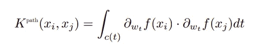
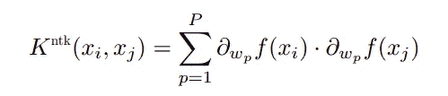
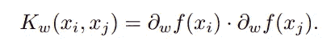
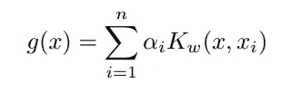
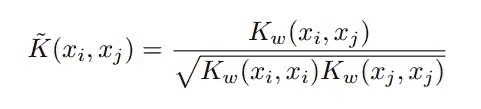
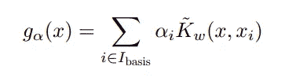
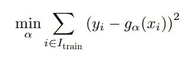
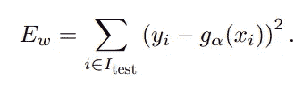
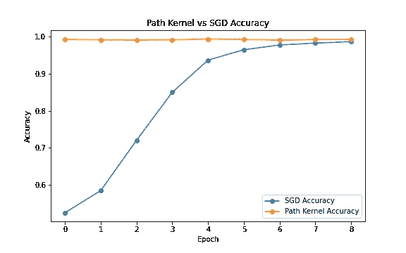
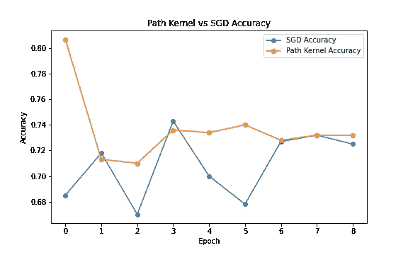

# 梯度核回归

> 原文：<https://towardsdatascience.com/gradient-kernel-regression-e431f0f29750?source=collection_archive---------26----------------------->

## 未经训练的装配

在这篇文章中，使用神经正切核[1，2]展示了一个令人惊讶的结果。这个内核用于执行内核回归。令人惊讶的是，回归的准确性独立于底层网络的准确性。

为了得到那个结果，并欣赏它所带来的惊喜，我们需要研究内核的构造以及它是如何在内核回归模型中使用的。

梯度核回归，因为它不需要通过梯度下降来进行艰苦的训练，所以可以作为模型架构设计的有用工具。这通过一个使用迁移学习的例子来说明。

# 梯度核

在[1]中，作者在通过使用随机梯度下降训练的深度神经网络进行监督学习的背景下，引入了他们所谓的*路径核*。路径核测量两个输入点的相似性， *x* ᵢ和 *x* ⱼ为，

在两个点处评估的网络梯度之间的内积，在梯度下降期间在*c(t)*上积分，网络 *f* 的参数 *w* 所采用的路径。路径核是*神经正切核*【3】的特例，

在求和发生的参数中， *w* ₚ更为通用。

给定一个数据集{ *x* ᵢ，*y*ᵢ} for 1≤*I*≤*n*，以及一个模型*f(x；w)* 由 *w* 参数化(例如一个神经网络)，在 *w* 、 *x* ᵢ、 *x* ⱼ的*梯度核*计算为:

这只是在参数向量 *w* 的单个值处评估的神经正切内核。使用术语梯度核是因为没有具体要求基础模型是神经网络。请注意，我们使用的是单变量值函数 *f* (例如二进制分类器)，然而，将所描述的方法扩展到多变量函数 *f* 是非常简单的。

# 梯度核回归

一旦拥有了一个核函数，就很容易在回归环境中使用这个核函数。也就是说，为了符合表格的功能，

一个数据集。然而，有几个实际问题需要解决。

现代神经网络模型可以拥有包含数百万个示例的数据集。形成全核矩阵需要 *O(n )* 空间来存储这个矩阵。降低这些要求的一个众所周知的方法是选择一个小得多的例子子集作为基本例子。这将是这里采取的方法。基示例的选择本身是一个有趣且深入的研究主题，但这将被忽略，基示例将简单地从训练示例集中随机选择。

我们感兴趣的是检查当参数 *w* 被应用于网络的梯度下降修改时，使用梯度核的核回归如何执行。不幸的是，梯度下降使梯度核陷入病态和数值不稳定的状态。为了解决这个问题，不直接使用梯度核，而是将其归一化为余弦相似形式，

其具有更好的数值特性。

*梯度核回归*执行和评估如下。给定一个数据集的例子点{ *x* ᵢ， *y* ᵢ}，一个函数*f(x；w)* 由 *w* 参数化我们把例子分成训练集和测试集。从训练集中选择一组基本示例。线性回归模型，

通过最小二乘法来拟合训练数据，

并且在测试数据上测量其误差，

令人感兴趣的是误差对基础模型参数 *w* 的依赖性。

# MNIST 的例子

众所周知的 MNIST 数据集[4]用于研究梯度核回归的性能。MNIST 数据由手写数字图像和每个图像的类别标签组成。

使用的底层神经网络模型取自 PyTorch 机器学习库[5]中提供的示例。它由 2 个卷积层和 2 个全连接层组成。如给定的，该模型产生对应于多类数字分类问题的 10 维输出。该模型被改变为二元分类器。选择的数据是两位数(“1”和“7”)，分类任务是区分 1 和 7。

对于实验，选择了 1000 个训练样本和 1000 个测试样本。两组各有 500 个 1 和 500 个 7。基本示例是从训练集中随机选择的，并且这些示例也与 50 个 1 和 50 个 7 相平衡。使用默认 PyTorch 设置用随机值初始化网络。

进行梯度下降的重复时期。每个历元对应于训练数据的一次完整通过，在这种情况下，包括由随机批次的 100 个
训练示例驱动的 10 个梯度下降步骤。对于每个时期，对训练数据进行线性回归拟合，并对测试数据进行测试，如前一节所述。测试结果通过准确度分数来总结，该准确度分数将回归函数大于 0.5 的实例指定为“1”级，将回归函数小于 0.5 的实例指定为“7”级。

令人惊讶的是，梯度核回归的精度与底层网络的精度无关。基础网络(蓝线)以随机参数开始，因此在开始时具有随机的 50%精度。但是梯度核回归(橙色线)从一开始就以 99%的准确率工作。随着梯度下降时期的进行，基础网络逐渐变得更好，但它最多只能匹配梯度核回归在整个路径上保持的精度水平。

> 梯度核回归的准确性不依赖于基础模型参数的质量。它适用于随机参数设置，也适用于训练参数设置。

# CIFAR10 示例

上一节的结果表明，梯度核回归可以揭示网络固有的准确性，而不需要训练和所有的时间、精力和不确定性。因此，它可以作为设计网络架构的强大工具。

例如，迁移学习是一种采用现有模型并将其用作新模型的起点的方法。具体而言，通过用针对新问题定制的层替换其最终层，可以修改基于数百万个示例训练的大型复杂深度神经网络。那么只有这个新层在一些较小的数据集上被训练。梯度核回归可用于有效地探索该最终层的可能形式。

这里迁移学习应用于 ResNet-50 [6]深度神经网络(如 PyTorch 中所提供的)。ResNet-50 网络的最后一层被替换为两个完全连接的层，并且最终输出被修改为二进制分类器。

这个修改后的网络被训练来对来自 CIFAR10 [7]图像数据集(也在 PyTorch 中提供)的鸟和猫图像进行分类。迁移学习为梯度核回归方法提供了一个有趣的用例。非常宽/深的网络的梯度可能涉及大量参数(ResNet-50 有超过 2000 万个)。对每个训练示例的这么多参数取内积在计算上是昂贵的(尽管，必须注意，比梯度下降训练需要的少得多)。迁移学习只训练添加到网络的附加层，对于这里的例子，仅超过一百万个参数。

实验装置与 MNIST 的例子相同。从 CIFAR10 数据中随机选择 1000 个训练和 1000 个测试示例。两个数据集都有 500 张鸟和 500 张猫的图片。100 个训练样本被作为基本样本，还平衡了 50 个鸟和 50 个猫的图像。再次，执行 9 个梯度下降时期，并且在每个时期构建核。

该图按时期显示了核回归和神经网络的精度。如前所述，梯度核回归支配着训练好的神经网络的性能。

> 梯度核回归的准确性可以用作在迁移学习问题中比较训练层的不同架构的容易计算的基准。

# 结论

这里给出的例子证明了梯度核回归可以产生与通过实际经历梯度下降训练过程获得的模型一样好或者更好的性能。

梯度核回归提供了一种测试网络性能的机制，而无需经历梯度下降训练过程。当使用梯度下降进行训练时，这一侧会遇到许多复杂的问题。当使用基于梯度核的简单线性回归时，学习率选择和调度、停止规则和缺乏收敛性都消失了。

[1] [通过梯度下降学习的每个模型近似为一个核机器](https://arxiv.org/abs/2012.00152v1)

[2] [深度神经网络的神经正切核的平均场行为](https://arxiv.org/abs/1905.13654)

[3] [神经正切核:神经网络中的收敛和泛化](https://arxiv.org/abs/1806.07572)

[4][MNIST 数据集](http://yann.lecun.com/exdb/mnist/)

[5] [PyTorch:命令式的高性能深度学习库](https://arxiv.org/abs/1912.01703)

[6] [用于图像识别的深度残差学习](https://arxiv.org/abs/1512.03385)

[7][CIFAR-10 数据集](https://www.cs.toronto.edu/~kriz/cifar.html)