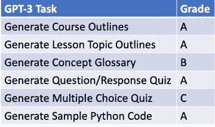
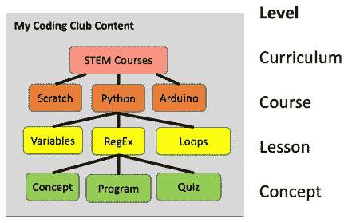
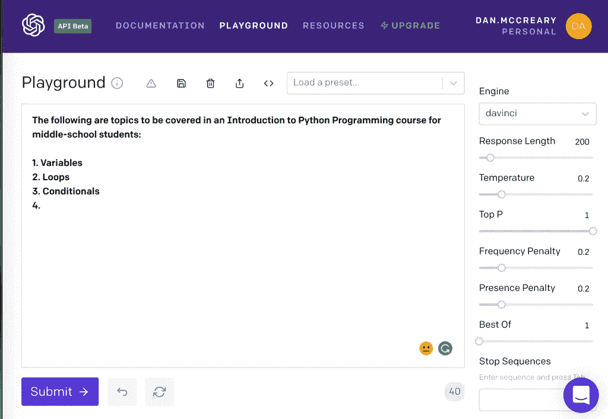
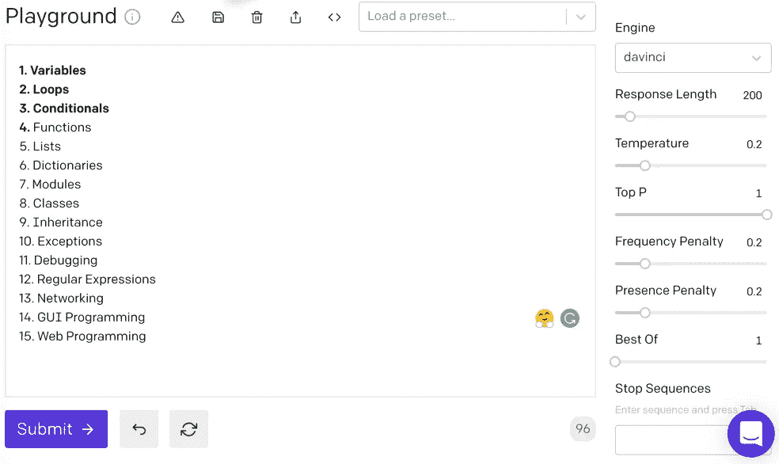
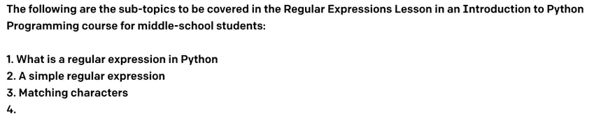
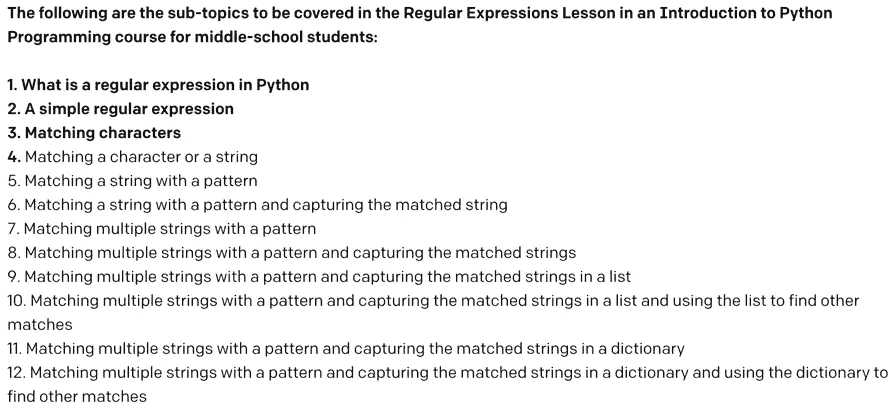
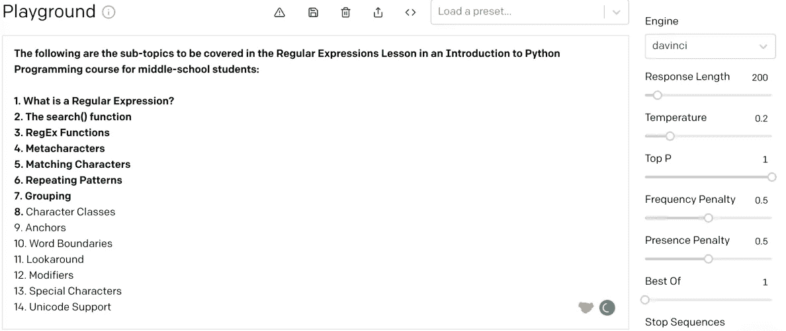
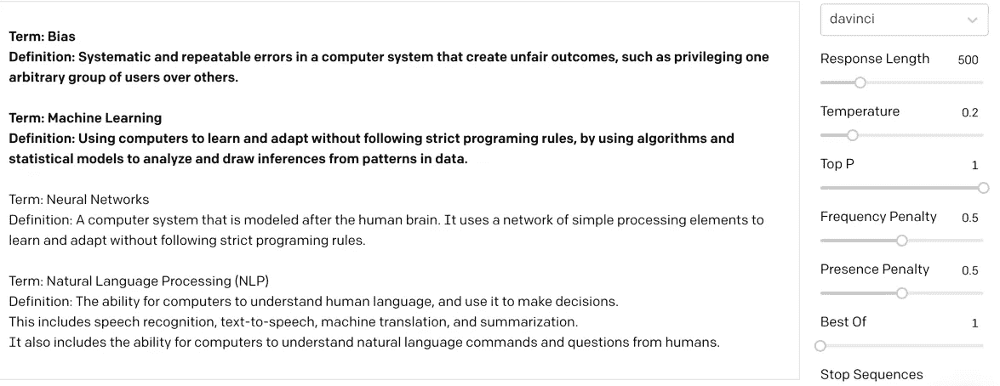
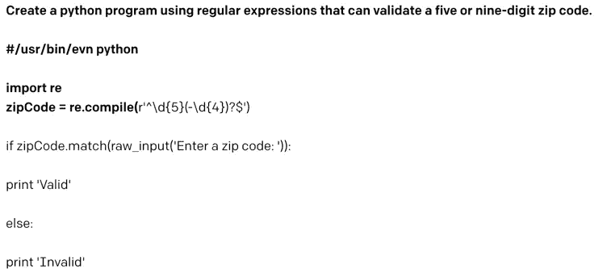

# STEM 课程计划内容生成的 GPT-3 评分

> 原文：<https://towardsdatascience.com/grading-gpt-3-for-stem-lesson-plan-content-generation-c8d9d1f59806?source=collection_archive---------37----------------------->

我在为 STEM 课程生成课程内容方面的 GPT 综合成绩为 3 分。分数更多地反映了我产生正确提示的技能。图片由作者提供。

本博客描述了如何使用 OpenAI [GPT-3](https://en.wikipedia.org/wiki/GPT-3) 生成式自然语言处理模型为 STEM 课程生成教案内容。我们将向您展示课程的哪些组成部分易于生成，以及如何调整提示以获得更好的结果。我们还将展示如何调整生成的内容，使其适合您的教室。

这些过程也应该为非 STEM 课程生成内容。然而，我的重点是帮助内容管理者从简单的文本描述中生成技术内容，如样本代码、数学[公式](https://github.com/shreyashankar/gpt3-sandbox) (LaTeX)、图表、化学符号和建筑图。这就是为什么我在标题中指出了 STEM 课程。

自 2020 年 12 月初以来，我一直拥有我宝贵的 GPT-3 许可证密钥。假期里我很忙，为没有花更多的时间在钥匙上而感到有点内疚。但现在，我已经开始尝试为 STEM 课程制定教案，这是我为[双城编码俱乐部](https://www.coderdojotc.org/)在线编码俱乐部做志愿者工作的一部分。说实话，这真的很有趣！

正如你将看到的，现在并不是所有的结果都很好，但我学到了很多关于知识如何编码在巨大的 175B 参数 GPT-3 *达夫尼奇*模型中，以及如何哄它得到我想要的。使用这些复杂的工具需要时间来获得一个直观的感觉，当你没有产生你希望的结果时，你可以期待什么以及如何解决问题。我的生成器的失败更多地反映了我对如何设计高质量提示的无知。

这个博客是关于使用人工智能、自然语言处理(NLP)和知识图来支持在线编码俱乐部服务提供商(CCSPs)的一系列博客的一部分。其他相关博客包括:

*   [利用人工智能生成教案](https://dmccreary.medium.com/using-al-to-generate-detailed-lesson-plans-29a5af200a6a)
*   [预测在线编码俱乐部的成功](https://dmccreary.medium.com/predictive-graph-models-for-the-success-of-coding-clubs-69b45f3db0a5)
*   [在线编码俱乐部将如何改变教育](https://dmccreary.medium.com/how-online-coding-clubs-will-transform-education-550faccff1f)
*   [迷失在【知识】空间](https://dmccreary.medium.com/lost-in-knowledge-space-14be123ea083)

这个名单不包括 AI 赛车联盟上的博客。COVID 已经暂停了这个项目，直到我们的编码俱乐部在虚拟环境中稳定下来。

在这个博客中，我正在定义 STEM **课程**的材料，它由一系列**课程主题**组成。每一课的主题都被分成一系列的子主题**概念**。每个子主题**概念**包括一系列其他详细的概念、示例程序、测验和资源。这些内容级别如下图 1 所示:

图 1:编码俱乐部服务提供商(CCSPs)必须快速生成为特定主题和年级定制的高质量内容。图片由作者提供。

以下是我做过的一些事情，主要按照 GPT 的表现排序:

1.  对于给定的**课程**，我们已经生成了课程主题的大纲。这些课程主题应该适合每个受众的年龄。
2.  对于每节**课的**主题，我们已经生成了每节课的子主题列表。本课程的子主题也针对适龄受众进行了调整。
3.  接下来，在一个课程主题中，我们可以生成一个更细粒度的概念列表**来涵盖该课程。**
4.  在一门课程中，我们还可以生成一个**概念词汇表**，其中包含一门课程的定义。
5.  对于给定的课程主题，我们可以为测验生成**简答题/答案对。**
6.  我还将为测验创建一个课程主题选择题示例。承认，GPT-3 确实正确地产生了问题和正确的反应。然而，不正确的回答不是很好，需要一个真实的人一段时间才能在课堂上有用。显然，GPT-3 不太理解如何产生不正确的多项选择的概念。欺骗是一个复杂的概念。
7.  我还从英语语言描述中生成了示例 Python 程序。这是 GPT-3 的一个众所周知的用途。

在我向您展示示例之前，您应该知道 OpenAI API GPT-3 密钥非常短缺。截至 1 月下旬，似乎仍然有一个基于抽签的系统来分发它们。我真的不知道为什么我和我的朋友 Ravi K .得到了他们，但其他人还没有得到他们。我的建议是上 [OpenAI API 等候名单](https://share.hsforms.com/1Lfc7WtPLRk2ppXhPjcYY-A4sk30)并写很多关于你将如何教别人如何使用 GPT-3 的博客。:-)

## OpenAI API GPT 概念

我使用 OpenAPI Playground(一个简单的浏览器文本框接口)和 Python 生成了上面的结构。Playground 使用起来很简单，大多数人在获得 API 密匙后几分钟内就可以开始使用它。

一个警告，网上有许多视频使用的是旧版本的操场，界面已经改变。所以要小心你正在看的视频，因为界面上还没有版本控制。自 2020 年 12 月以来制作的视频应该是最新的。

我不会在这里重复 [API 手册](https://beta.openai.com/docs/introduction)中的所有内容。我只想回顾一些关键概念。

1.  GPT-3 接口是**一个简单的文本输入文本输出接口**。您发送简单的指令和一系列您要寻找的样本作为输入，它会在操场文本区域以完整文本的形式返回结果。
2.  我们将提供一个包含模板序列的**提示**。
3.  API 将返回一个包含我们正在寻找的文本的**完成**。
4.  每个 API 调用的价格基于一种叫做**的标记**，它与文本中音节的总数密切相关。小词通常是单个标记，但多音节是多个标记。我运行的大多数查询被设置为返回大约 200 个令牌，每个令牌的运行成本大约为 1 美分。

## 入门:为 Python 类入门生成课程

让我们从一个简单的例子开始。我们将为适合中学生的 Python 编程入门课程生成一个主题列表。

首先，我们需要设置以下参数:

*   **发动机:** *达夫尼奇—* 这是最大最贵的型号。我们总是从这一点开始，并调整我们关心的成本的复杂性。因为我们的例子在这些演示中很小，所以我将坚持使用这个模型。对于我价值 100 美元的免费入门套件，每次查询我都要花费大约 1 便士。
*   **温度:**. 2——这就是我们希望回应有多“有创意”。设置为 0 是一个纯粹的确定性值，将始终返回相同的结果。更接近 1 的值将增加输出的随机性，并且更有创造性。使用相同输入的每个人都会得到稍微不同的输出。
*   **响应长度**(代币):200——对于一个四小时的简短入门课程来说，这足以构成一个合理的课程大纲。
*   **频率惩罚和存在惩罚:**. 2——这些参数用于避免结果重复。我已经将它们都设置为一个合理的低值，以便开始使用。

还有其他参数，但我们现在将忽略它们，只使用默认值。

OpenAI API 操场输入屏幕如下图 1 所示:

图 OpenAPI Playground 准备好让我们点击提交按钮。请注意，参数在主文本区域的右侧进行了更改。在右下角，您可以看到我们的输入包含 40 个令牌。图片由作者提供。

现在让我们点击场景左下角的紫色**提交**按钮，看看会发生什么！

图 2:GPT-3 的 1750 亿个参数的达芬奇引擎生成我们在中学生 Python 入门课程的剩余课程的结果。我不得不向下滚动来显示结果。图片由作者提供。

结果会在几秒钟内返回。这个列表非常准确。在我们为 CoderDojo 设计的[实际 Python 类中，我们在类中包含了函数、列表、字典、调试、正则表达式。我们决定将模型、类和继承移至高级类，但是其他教师将它们留在了初级类中。GPT 在这里没有错，我们只是不同意！对于这项工作，我会给 GPT-3 一个 A。](https://www.coderdojotc.org/python/)

我也对 GPT-3 返回建议课程主题的**命令**感到惊讶。我担心，因为 GPT-3 并不真正理解一些课程如何依赖于先前的课程，所以返回的顺序将是随机的。但是顺序和我们设计课程的顺序很像。我相信这是因为当 GPT-3 扫描包含 Python 教程的网页时，最常见的开始主题出现得更频繁，因此在 Python 概念和开始课程概念之间具有更强的权重。

现在，让我们来看看 GPT-3 如何会有点偏离轨道，以及如何纠正它。

## 生成课程子主题:正则表达式

为了向您展示 GPT 如何需要高质量的提示，让我们创建一个不够具体的提示。

在课程中生成子主题的示例提示。图片由作者提供。

第一次尝试的结果不是很好:

由于模糊的提示和太低的重复惩罚，这不是一个非常有用的结果。图片由作者提供。

这个问题的解决方案是找到一些使用正则表达式的示例教程，从这些示例中提取 1 级标题，并将其用作我的前 7 个提示。下面的结果更符合我的预期。

这是一个更详细的提示，并且将频率和存在惩罚从 0.2 调整到 0.5 的结果。图片由作者提供。

## 生成词汇表术语

我还试图使用 GPT-3 为我们正在进行的[儿童人工智能](http://www.coderdojotc.org/ai-for-kids/)课程生成一组课程词汇表中使用的术语。虽然它在产生新术语方面很有效，但是定义有时是提示示例的重复。下图显示了我如何将术语/定义对定义为提示。

为儿童人工智能课程生成术语表的尝试。要考虑的新术语列表很好，但是许多定义与术语不匹配。图片由作者提供。

我会在术语列表上给 GPT-3 打 A，但在找到正确的定义上打 C。

## 生成代码

我的下一步是探索 GPT-3 的详细程序生成方面，以纳入课程中。使用 GPT-3 从简短的描述性文本中生成 Python 代码的例子还有很多。下面的示例生成一个程序，该程序将检查邮政编码是五位还是九位。我给它的提示是粗体的。

使用 GPT-3 生成验证五位或九位邮政编码的代码。提示以粗体显示。图片由作者提供。

## 结论

我只是刚刚开始理解如何为 OpenAI GPT-3 模型设计高质量的提示。但它显然显示出了希望。我敢大胆地说，如果我有一个预先构建并测试了提示的高质量 web 应用程序，它将节省我创建新的 STEM 课程的时间。

因为我在某种程度上是这些编程主题的专家，所以我可以根据自己的个人知识来检查 GPT-3 生成的结果。如果我不是专家，我会希望所有的内容都由专家来审查。

关于这个练习，最让我惊讶的是，我有时会在为一门课程创建大纲或填写细节时产生思维障碍。GPT-3 非常善于抛出我能很快同意或抛弃的想法。一旦我完成了，我就有了更多的信心，相信 GPT-3 和我一起已经达到了一门课程或一课的关键点。当我创建新课程时，GPT-3 真的成了我的“认知助手”。