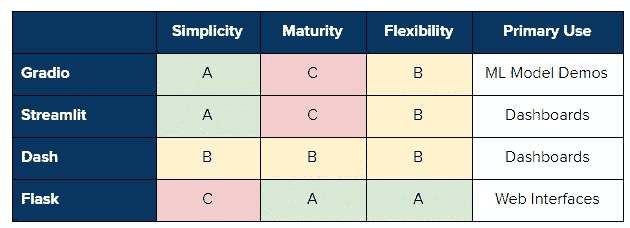

# Gradio vs Streamlit vs Dash vs Flask

> 原文：<https://towardsdatascience.com/gradio-vs-streamlit-vs-dash-vs-flask-d3defb1209a2?source=collection_archive---------6----------------------->

## 比较几种数据科学的 web UI 工具！

塞萨尔·卡利瓦里诺·阿拉贡在 [Unsplash](https://unsplash.com/?utm_source=unsplash&utm_medium=referral&utm_content=creditCopyText) 上拍照

# 介绍

机器学习模型令人兴奋且强大，但它们本身并不十分有用。一旦一个模型完成，在它能够交付任何种类的价值之前，它可能必须被部署。同样，能够部署一个初步的模型或者原型来从其他涉众那里获得反馈也是非常有用的。

最近，出现了几种工具，数据科学家可以使用这些工具快速轻松地部署机器学习模型。在这篇文章中，我们将看到 4 种可以用来部署机器学习模型的替代方案:Gradio、Streamlit、Dash 和 Flask。

*请记住，这是一篇固执己见的文章，完全基于我对这些工具的了解和经验。*

# 总结:该用哪个？

作者创建的图像

**Gradio** : Gradio 是专为机器学习模型打造的。因此，如果你想专门为你建立的机器学习模型创建一个 web 用户界面，Gradio 简单的语法和设置是一个不错的选择。

如果您想要快速启动并运行一个仪表板，并且能够灵活地添加许多组件和控件，Streamlit 非常有用。同样，Streamlit 允许您比 Dash 或 Flask 更快地构建 web UI 或仪表板。

**Dash** :如果你想成为一家大公司的生产就绪仪表板，选择 Dash，因为它主要是为企业量身定制的。

**Flask** :如果你有 Python/HTML/CSS 编程的知识，想完全从零开始构建自己的解决方案，就选择 Flask。

# 格拉迪欧

*见网站* [*此处*](https://www.gradio.app/) *。*

Gradio 是一个用于创建机器学习模型用户界面的强大工具。它是一个 python 包，可以完美兼容 PyTorch、TensorFlow 等几个机器学习框架。它还可以用来围绕任意的通用 Python 脚本创建 ui。

Gradio 的受欢迎程度正在迅速增加。它正在被思科和亚马逊等大公司的机器学习实验室以及斯坦福医学等学术机构使用。

# 优点:

*   Gradio 提供了几个可定制的 UI 组件，针对机器学习模型进行了优化。例如，Gradio 提供了易于使用的拖放式图像分类，该分类针对用户进行了高度优化。
*   设置 Gradio 非常简单快捷。可以通过 pip 直接安装。此外，在 Gradio 中创建接口只需要几行代码。
*   Gradio 创建了可共享的链接，这可能是在用户面前部署机器学习的最快方式
*   与其他包不同，Gradio 可以在 Jupyter/Colab 笔记本或独立的 Python 脚本中的任何地方运行。

# 缺点:

*   虽然 Gradio 在官方网站上有很好的文档，但很难找到关于它提供的具体功能的信息和足够的例子。
*   Gradio 的社区比其他一些软件包要小，所以很难找到关于它的资源。
*   Gradio 专门为机器学习模型构建 ui，而不是仪表盘。

# 细流

*参见网站* [*这里*](https://www.streamlit.io/) *。*

Streamlit 是另一个用于创建用户界面的流行工具。它是一个开源 Python 库，用于为数据科学和机器学习构建强大的定制 web 应用程序。Streamlit 兼容几个主要的库和框架，如 Latex、OpenCV、Vega-Lite、seaborn、PyTorch、NumPy、Altair 等。

像 Gradio 一样，Streamlit 也很受欢迎，并在大型行业领导者中使用，如优步和 Google X

# 优点:

*   理解 Python 的每个人都可以访问 Streamlit。对 HTML 和 CSS 没有要求。
*   它有广泛的用户界面组件。它几乎涵盖了所有常见的 UI 组件，如复选框、滑块、可折叠的侧边栏、单选按钮、文件上传、进度条等。此外，这些组件非常易于使用。
*   它支持 Latex、OpenCV、Vega-Lite 等多种交互式可视化库。

# 缺点:

*   虽然不难，但 Streamlit 确实需要一些时间来学习它自己的语法。
*   Streamlit 没有那么灵活。它仅基于 Python，提供有限的小部件，并且不与 Python 笔记本集成。
*   数据上传限制只有 50Mb。
*   对视频/动画的支持有限。

# 破折号

*见网站* [*此处*](https://www.dash.org/) *。*

Dash 是一个开源 Python 库，用于创建反应式 web 应用程序。这是一个用户界面库。Dash 是构建分析性 web 应用程序的强大工具。

# 优点:

*   Dash 可用于各种领域，如数据探索、数据分析、建模、可视化、仪器控制和报告。
*   使用起来非常简单。可以通过 pip 直接安装。
*   除了 Python，它还可以和 R，Julia，Jupyter 一起使用。
*   Dash 应用是被动的。
*   Dash 比 Streamlit 更容易定制。此外，Dash 提供了更好的性能。
*   Dash 有一个更好的、定期更新的、易于遵循的文档。

# 缺点:

*   Dash 更侧重于企业市场，并不包括开源版本中所有可用的功能。
*   Dash 比 Gradio 或 Streamlit 更冗长；与其他框架相比，您必须编写更多代码来创建简单的 web 应用程序。

# 瓶

*参见网站* [*这里*](https://flask.palletsprojects.com/en/1.1.x/) *。*

Flask 是一个用于构建 web 应用程序的 python web 框架。它为 web 开发提供了几个模块，使得开发人员的工作更加容易。Flask 也有资源部署机器学习模型，尽管任何前端工作都必须由开发人员完成。这意味着作为一名数据科学家，您还必须熟悉 HTML、CSS 和 JavaScript。

# 优点:

*   因为它是一个框架，你可以根据自己的需求从头开始构建一切。
*   使用 flask，更容易构建可定制的应用程序。
*   使用 Flask 可以构建更通用的 web 应用程序。
*   烧瓶非常成熟稳定；用 flask 构建的东西更有可能在未来继续工作。
*   有大量关于 Flask 和相关库的文档。

# 缺点:

*   Flask 没有为机器学习或数据科学应用程序提供任何类型的 UI 组件。
*   需要具备中级 Python 知识，以及 HTML、CSS 和 JavaScript 知识。
*   从头开始构建解决方案可能会耗费大量资源。

# 感谢阅读！

我希望在决定使用什么工具时，您会发现这些信息非常有用！在一天结束的时候，我会选择你觉得最舒服的。:)

一如既往，我祝你学习一切顺利！

不确定接下来要读什么？我为你挑选了另一篇文章:

 [## 2021 年成为数据科学家的完整 52 周课程

### 连续 52 周，每周学点东西！

towardsdatascience.com](/a-complete-52-week-curriculum-to-become-a-data-scientist-in-2021-2b5fc77bd160) 

**又一个！**

 [## 2021 年数据科学的 10 大 Python 库

### 你应该学习什么以及如何学习它们

towardsdatascience.com](/top-10-python-libraries-for-data-science-in-2021-b122f168ae62) 

# 特伦斯·申

*   ***如果你喜欢这个，*** [***跟我上媒***](https://medium.com/@terenceshin) ***了解更多***
*   ***有兴趣合作吗？让我们连线上***[***LinkedIn***](https://www.linkedin.com/in/terenceshin/)
*   ***报名我的邮箱列表*** [***这里***](https://forms.gle/tprRyQxDC5UjhXpN6) ***！***