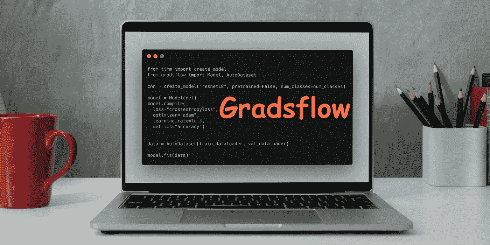
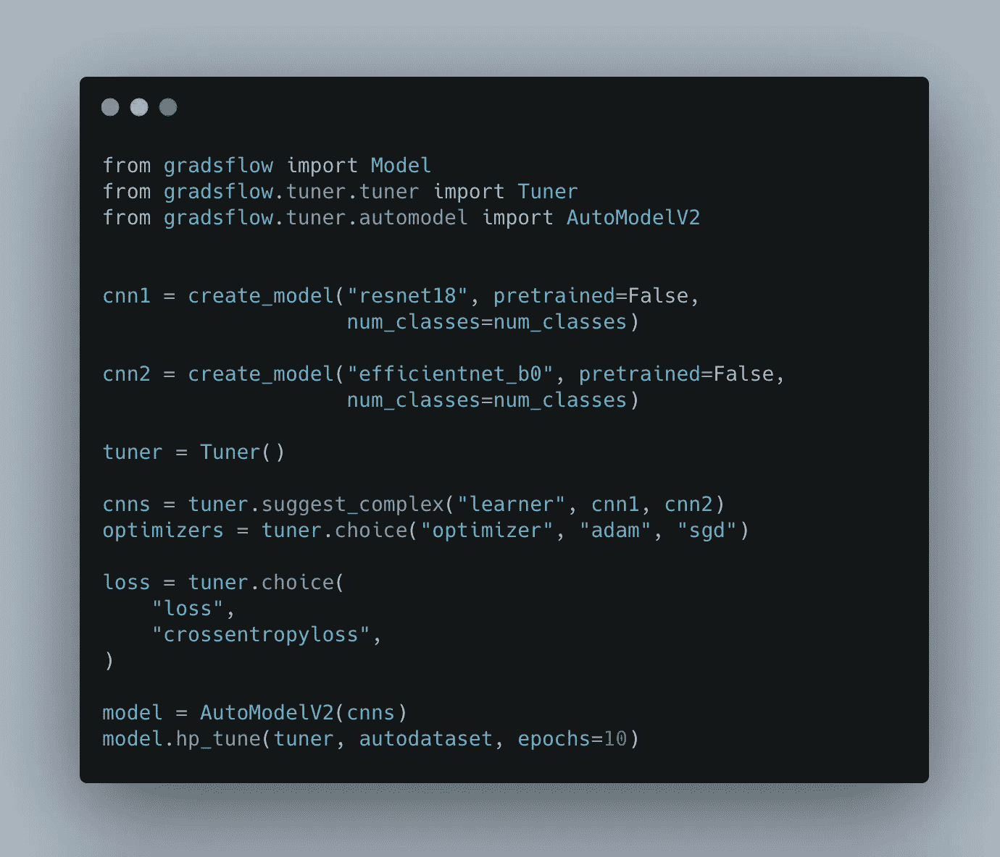
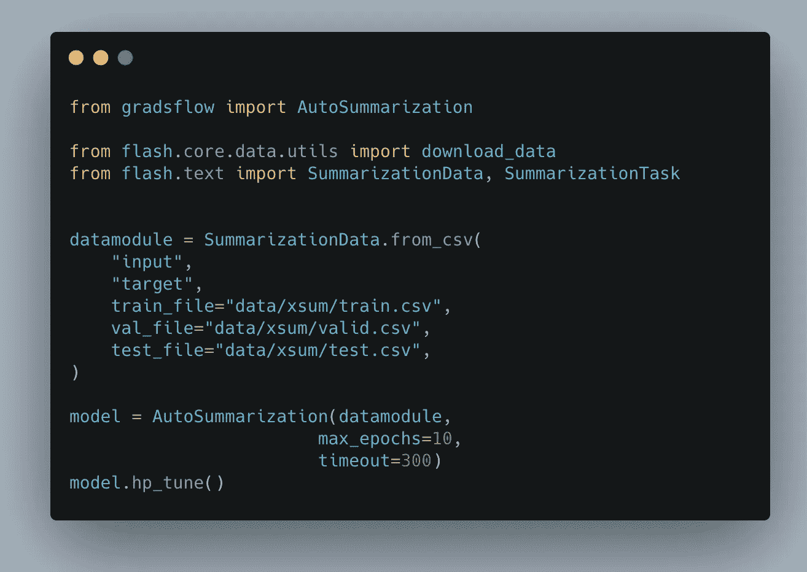

# grads flow——用 AutoML 使人工智能民主化

> 原文：<https://towardsdatascience.com/gradsflow-democratizing-ai-with-automl-9a8a75d6b7ea?source=collection_archive---------19----------------------->

## GradsFlow 是一个基于 PyTorch 的开源 AutoML & Model 训练库。我们的目标是使人工智能民主化，让每个人都可以使用它。

作者图片

Gradsflow 可以在你的笔记本电脑上自动训练不同任务的深度学习模型，或者直接从你的笔记本电脑上训练到远程集群。它提供了一个强大且易于扩展的[模型训练 API](https://docs.gradsflow.com/en/latest/gradsflow/models/model/) ，可以用来训练几乎任何 PyTorch 模型。

# 谁应该使用 Gradsflow

## 你是没有机器学习经验的人吗？

你可以使用 [**自动任务**](https://docs.gradsflow.com/en/latest/gradsflow/tasks/) 功能来自动构建和训练模型，而无需编写任何跨包括视觉和文本在内的各个领域的机器学习代码。目前，它支持图像分类、文本分类、情感分析和文本摘要。只需转储数据，就可以开始训练模型了。

## 你是 ML 专家吗？

使用 Gradsflow，您不仅可以自动构建和训练模型，还可以编写和训练自定义 PyTorch 模型。它提供了一个功能强大、易于使用且易于扩展的 [**模型**](https://docs.gradsflow.com/en/latest/gradsflow/models/model/) 类，可用于训练任何自定义 PyTorch 模型。你不需要写一个训练循环，但是如果有必要，你可以定制训练过程的任何部分。继续阅读，了解更多关于模型 API 的知识。

> 让我们不要浪费时间去看神奇的🪄✨吧

# 模型训练 API

Gradsflow 为模型训练提供了一个类似 Keras 的 API 接口。您可以将 PyTorch 模型传递给[***Model***](https://docs.gradsflow.com/en/latest/gradsflow/models/model/)类，该类会自动准备您的模型，以便将其移动到适当的设备(CPU/CUDA)，启用浮点精度或分布式训练。一旦从模型类中创建了一个对象，就可以编译模型来实例化优化器、学习率、损失函数和准确性或 F1 分数等指标。现在，要训练你的模型，只需运行 *model.fit(data_loader)。*

作者图片

模型 API 不仅简单，而且完全可定制。为了训练 Pix2Pix GAN，你可能需要定制**训练步骤**和模型初始化。这很容易做到，也很简单。在下面的例子中，为了保持简单，大部分代码都被抽象了，但是如果你想更深入地研究，那么请到我们的[文档](https://docs.gradsflow.com)页面的示例部分，学习使用 Gradsflow 进行 Pix2Pix 训练的全部代码。

首先，您可以定制 *__init__* 方法来覆盖模型初始化。这里创建了两个模型——一个[生成器](https://developers.google.com/machine-learning/gan/generator)和一个[鉴别器](https://developers.google.com/machine-learning/gan/discriminator)，然后使用 super 关键字将模型传递给父 *__init__* 方法。

作者图片

接下来，您可以定义自己的*编译*方法来加载优化器。

作者图片

最后，覆盖 *train_step* 方法。这是数据通过模型的方法，您可以计算反向传播的损失。在这里，您可以看到生成器和鉴别器都经过了训练和反向传播。要跟踪和打印指标，您可以使用 [**跟踪器**](https://docs.gradsflow.com/en/latest/gradsflow/models/tracker/) ，它保存打印到进度条的值，或在任何其他时间点使用它，如提前停止回调。

作者图片

现在，像往常一样，初始化模型，编译它，然后调用 **model.fit** 。

作者图片

如需更多定制示例，请访问文档页面。

# AutoML 或超参数优化在哪里？

有两种方法可以在 Gradsflow 中构建和调整您的模型超参数。

Gradsflow 提供了一个 [**AutoModel**](https://docs.gradsflow.com/en/latest/gradsflow/tuner/) 类(实验性的🚨)这和你刚才看到的*型*级很像。您可以使用 *Tuner* 类注册想要调整的超参数，只需对代码进行最少的更改，您就可以使用超参数优化模式训练您的模型。

在本例中，调谐器将针对 *cnn1* 和 *cnn2* 架构以及 *adam* 和 *SGD* 优化器进行优化。

作者图片

这就是如何使用 Model 和 AutoModel 类进行超参数调优。

另一种自动建立和训练模型的方法是<https://docs.gradsflow.com/en/latest/gradsflow/tasks/>**。Autotask 为图像分类、文本分类&文本摘要等各种任务提供低代码模型构建和训练类。它由 [PyTorch 闪电](https://lightning-flash.readthedocs.io/en/latest/#lightning-flash)供电。**

****

**作者图片**

# **奖金**

**在 2021 年的黑客啤酒节上找到我的演讲🎉**

**📚要了解更多关于 Gradsflow 的信息，您可以访问文档页面[https://docs.gradsflow.com/en/latest](https://docs.gradsflow.com/en/latest/)。你可以找到用于训练自动图像分类、自动文本摘要、Pix2Pix GAN 训练和 HuggingFace 模型训练的例子。**

**🙏🏻Gradsflow 从 API 中获得灵感，并利用一些优秀的开源软件库，包括 Ray️、HuggingFace Accelerate、PyTorch Lightning TorchMetrics、Keras & fast.ai**

**🌟喜欢这个项目？在 [GitHub](https://github.com/gradsflow/gradsflow/) 上给我们一颗星**

**有问题吗？加入我们的松弛社区[🧡和我们一起聊天。](https://join.slack.com/t/gradsflow/shared_invite/zt-ulc0m0ef-xstzyowuTgYceVmFbJlBmg)**

**在 [Twitter](https://twitter.com/aniketmaurya) 或 [LinkedIn](https://linkedin.com/in/aniketmaurya) 上关注我。**