# 深度学习的语法纠错

> 原文：<https://towardsdatascience.com/grammar-error-correction-af365dad794?source=collection_archive---------7----------------------->


图片来自 Unsplash

# 目录

1.  介绍
2.  问题定义
3.  先决条件
4.  数据源
5.  理解数据
6.  探索性数据分析
7.  数据预处理
8.  数据准备和数据管道
9.  基准解决方案(标准编码器-解码器模型)
10.  注意机制
11.  单调注意
12.  推理(贪婪搜索与波束搜索)
13.  结果和模型比较
14.  模型部署和预测
15.  未来的工作
16.  Github 知识库和 Linkedin
17.  参考

# 1.介绍

顾名思义，语法纠错是对文本中的错误进行检测和纠正的过程。这个问题看起来很容易理解，但实际上很难，因为一门语言有不同的词汇和规则。此外，我们不仅要找出错误，而且还需要纠正。

## 应用:

*   这个问题有很多应用，因为写作是分享想法和信息的一种非常普遍的方式。这可以帮助作者加快他们的工作速度，把出错的可能性降到最低。
*   此外，可能有许多人不精通某一种语言。因此，这些类型的模型确保语言不会成为交流的障碍。

# 2.问题定义

现在我们将把手头的任务定义为一个机器学习问题。我们正在处理的问题是一种 NLP(自然语言处理)问题。NLP 是机器学习的领域，处理人类语言和计算机之间的交互。我建议浏览一下[这篇](https://www.researchgate.net/publication/344160222_Recent_Trends_in_the_Use_of_Deep_Learning_Models_for_Grammar_Error_Handling)论文，以了解用于解决问题的方法的进展。

我们要研究的方法是序列对序列模型。简而言之，深度学习模型将接收一个序列(在这种情况下是不正确的文本)，它将输出另一个序列(在这种情况下是正确的文本)。

## 绩效指标

现在，我们已经将我们的问题定义为机器学习问题，还有另一个非常重要的想法需要处理，那就是性能指标。性能指标是一种数学度量，有助于理解我们的机器学习模型的性能。

NLP 问题的一个非常流行的性能指标是 **BLEU(双语评估替角)分数**，因此我们也将它用于我们的模型。你可以参考[这个](https://www.youtube.com/watch?v=DejHQYAGb7Q)视频来了解更多关于 BLEU 的分数。

# 3.先决条件

在我们深入这个案例研究的细节之前，我假设读者知道机器学习和深度学习的概念。具体来说，LSTMs、编码器-解码器、注意机制的概念应该是熟悉的。

路上我会尽量提供一些好的参考。

# 4.数据源

正如我上面提到的，这个问题很难解决，原因之一是没有高质量的数据集。在我的研究中，我发现其中一些很有用，并考虑了以下两个数据集。

1.  Lang-8 数据集
2.  新加坡国立大学社交媒体文本规范化和翻译语料库

如果您有兴趣使用它们，这两个数据集都是公开的。

# 5.理解数据

## 5.1 Lang-8 数据集

这是一个致力于语言学习的日本网站。用户可以用他们正在学习的语言发表帖子，该帖子将出现在母语为该语言的人面前以供更正。来自此网站的数据集在以下列中包含数据，以\t:

*   校正次数
*   序列号
*   句子编号
*   0 是标题
*   英语学习者写的句子
*   更正的句子(如果存在)

由此，我们已经为这些句子都存在的那些数据点提取了**输入句子和校正句子**对。

## 5.2 新加坡国立大学社交媒体文本规范化和翻译语料库

这是新加坡国立大学(NUS)的数据集，是社交媒体数据文本数据。数据集大小为 2000 个数据点。对于每个数据点，原始形式的数据有三行。

*   第一行是社交媒体文本
*   第二行是正确的正式英语翻译文本
*   第三行是中文翻译数据。

除此之外，我们可以使用每个数据点的前两行来解决我们的问题。

# 6.探索性数据分析

一旦我们以所需的形式提取了数据，现在是一个非常重要的步骤，即探索性数据分析，这是一个理解和培养对数据集的良好感觉的机会。

我已经以所需的形式提取并预处理了数据集，这将在下一节中讨论。

## 6.1 基本统计

首先，我们将收集关于数据集的整体信息，如数据点的数量、数据类型、数值数据的平均值或中值等。

```
# TOTAL DATAPOINTS
df.shape
# CHECK FOR NULL VALUES
df.info()
```

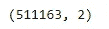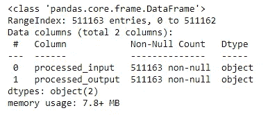

因此，大约有 50 万个数据点，不存在空值。

数据集中有两列，一列是输入，另一列是输出或目标。让我们逐一查看每一列的分析。

## 6.2 文本长度和字数分布分析

## 不正确的文本

输入是文本特征，我们可以分析文本的长度分布和字数分布。

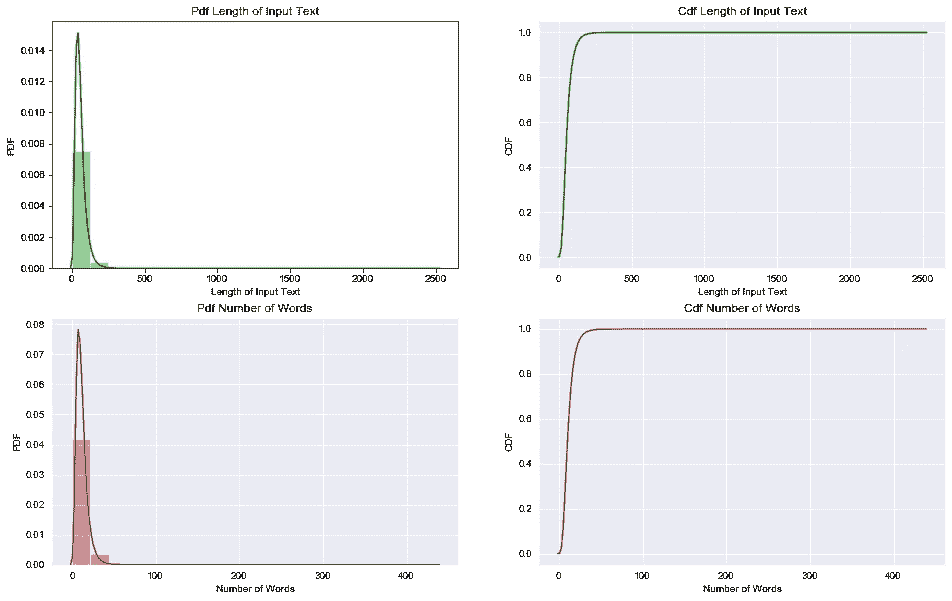

*   输入中字符长度和单词数量的分布是高度倾斜的。
*   两种分布几乎遵循相同的模式。
*   输入的字符数可能高达 2000 个，单词数高达 400 个。
*   较长的单词或字符的比例明显较小。
*   超过 99%的输入字符数少于 200，单词数少于 50。

## 更正的文本

输出文本也是如此。

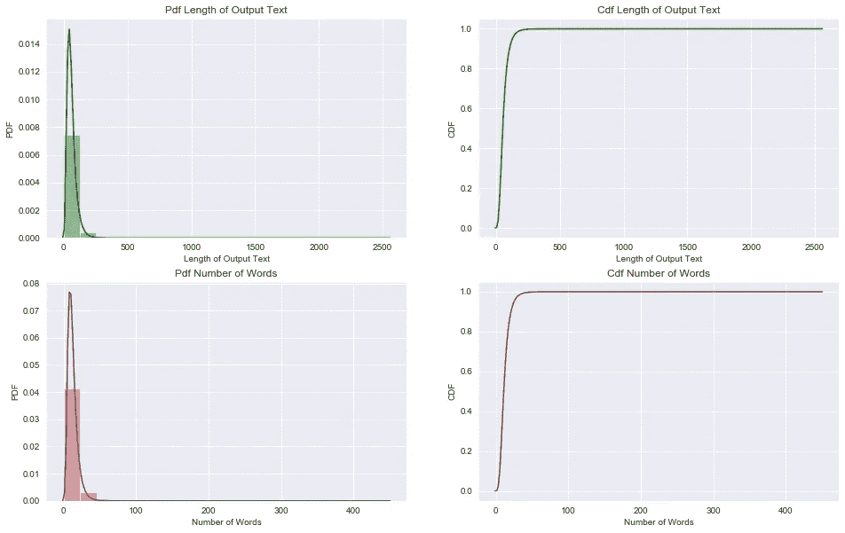

令人惊讶的是，对输入文本的观察同样适用于输出文本。

## 6.3 不正确和已更正文本的词云分析

单词云是一个很好的可视化工具，可以用来了解整个文本中出现频率最高的单词。


用于输入文本的词云


用于输出文本的词云

两种文本中最常见的单词是:

*   想
*   想要
*   今天
*   日本
*   英语

## 6.4 错别字和更正字分析

这里的**错别字**是那些在输入中存在但在目标句子中不存在的字，**纠正字**是那些在目标句子中存在但在输入句子中不存在的字。我把这些词都提取出来，对它们做了词云分析。


*   在观察了不正确和正确的单词图像后，我们可以观察到所用动词形式的变化。

```
go ==> going
go ==> went
study ==> studying
use ==> using
```

## 6.5 位置标记

在这部分的分析中，我们将把单词和它们的词类联系起来，并画出最常出现的 10 个词类。以下是情节:

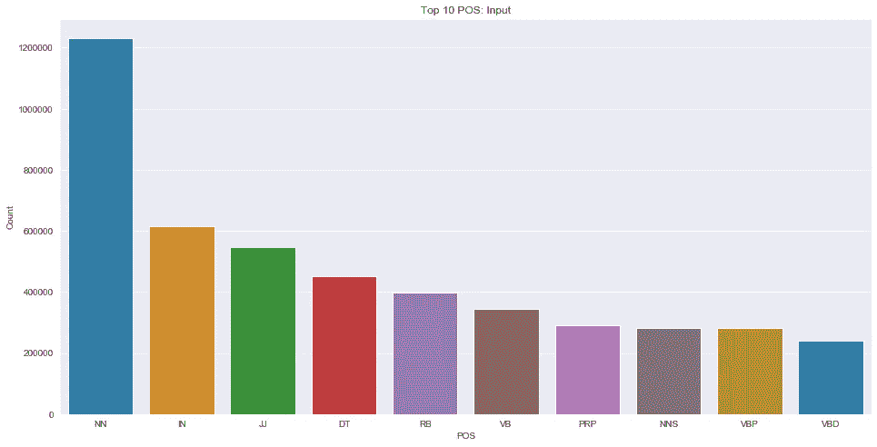

输入文本的前 10 个位置

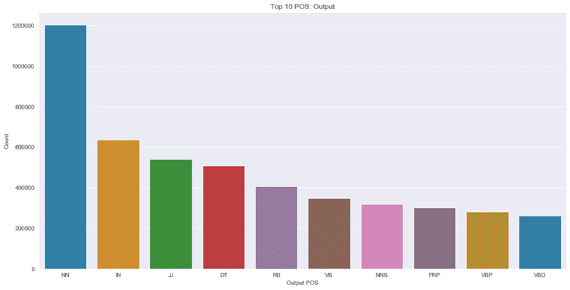

输出文本的前 10 个位置

*   这表明使用次数最多的词类是名词(NN)，其次是介词(IN)。
*   输入和输出句子的词类总数保持不变，但 NNS(名词、复数)和 PRP(人称代词)的词类数量有所不同

# 7.数据预处理

现在，我们将了解如何从数据集中删除不需要的数据。我们知道数据是文本格式的，因此需要删除所有特殊字符和不需要的空格，并对缩写词进行去压缩。我们还将把所有的文本转换成 lower，以降低问题的复杂性。下面的代码用于完成上述所有操作:

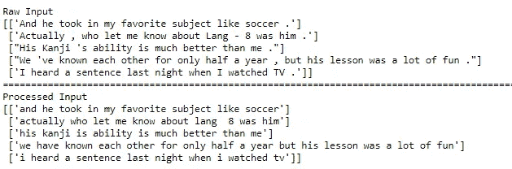

接下来，我们还可以执行一些其他操作，即删除空值和重复数据删除，这些操作在 pandas 库中可用。

# 8.数据准备和数据管道

在我们将数据输入 DL 模型之前，需要将其转换成机器能够理解的形式。所以对于这个问题，我们要用记号化和填充把数据集转换成一个长度相同的整数序列。

在形成模型的数据管道时，我们将填充序列以形成长度相等的所有数据点。用于填充的最大长度是字数分布的第 99 个百分位数。

## 数据管道

数据必须成批转换，以便输入到深度学习模型中。以下代码用于形成数据集的管道

# 9.基准解决方案(标准编码器-解码器模型)

对于基准测试解决方案，我将使用普通序列到序列模型，也称为编码器-解码器模型。该模型以序列形式接受输入，并预测另一个序列作为输出。由于这一点，它在机器翻译问题中有许多应用。

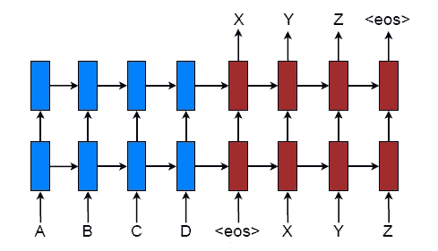

图片来自论文**基于注意力的神经机器翻译的有效方法**

以下代码用于形成模型中的编码器-解码器层。

[这个](/word-level-english-to-marathi-neural-machine-translation-using-seq2seq-encoder-decoder-lstm-model-1a913f2dc4a7)真的是一个深入了解编码器-解码器模型的好博客。

我已经尝试了许多普通编码器-解码器模型的变体，比如使用 Word2Vec 和 FastText 的预训练嵌入，你可以在我的 [GitHub](https://github.com/pushapgandhi/Grammer_error_correction) 个人资料中查看它们。

在对这些模型进行实验之后，我发现对于我的情况来说，可训练的嵌入比预训练的嵌入工作得更好，因此它将被用于高级模型。

对于我们的数据集，编码器-解码器获得的蓝色分数是 0.4603。

# 10.注意机制

注意机制是机器学习中一个非常巧妙的想法，它克隆了人类获取信息的方式。此外，注意模型克服了简单编码器-解码器模型的某些缺点。今天使用的一些流行的注意机制技术是 Bahdanau 注意机制、Loung 注意机制。

让我简单介绍一下我在案例研究中广泛使用的休闲注意机制的步骤。具体来说，这种想法被称为**全局注意力机制。**

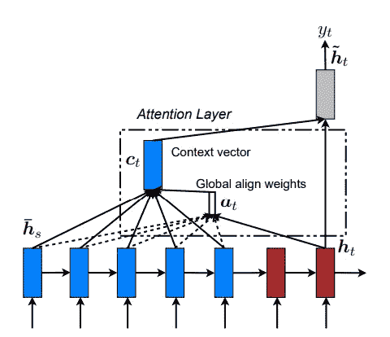

图片来自论文**基于注意力的神经机器翻译的有效方法**

编码器部分与标准编码器-解码器保持相同，输出输入序列的隐藏状态。现在，在解码器部分，对于每个时间步长，我们必须计算一个叫做**的上下文向量**。该上下文向量保存来自编码器的关于在该时间步长中预测的单词的相关信息。这听起来可能很复杂，但一旦你知道它是如何计算的，一切都会水到渠成。

*   首先，当我们从 RNN 获得所有编码器隐藏状态(ht)和解码器先前隐藏状态(hs)时，我们找到α值()。

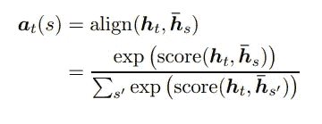

在论文中，Loung 和其他人提供了三种计算分数的方法。

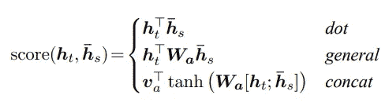

*   一旦计算出阿尔法值，就将上下文向量计算为所有编码器隐藏状态的加权平均值，其中权重是阿尔法值。
*   给定目标隐藏状态和源侧上下文向量，简单级联层如果用于组合来自两个向量的信息，以产生如下的注意隐藏状态:

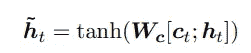

*   然后，注意力向量 h \t 通过 softmax 层，按顺序产生下一个单词。

> 这种类型的注意机制被称为全局注意机制，因为编码器的所有隐藏状态都在解码器的每个时间步长被考虑以产生上下文向量。

在这个案例研究中，我通过模型子类化从零开始实现了 Loung 注意机制。下面是**点**型评分的关注层代码。完整的代码，你可以参考我的 [GitHub](https://github.com/pushapgandhi/Grammer_error_correction) 简介。

注意力模型的性能指标明显优于我们的基准模型。

```
 BLEU Score
Dot Scoring         0.5055
General Scoreing    0.5545
Concat Scoreing     0.5388
```

# 11.单调注意

在我们进入单调注意的细节之前，让我们看看简单注意机制的一些缺点以及什么是单调注意的需要。

我们知道在注意机制中，在每个解码器时间步长，需要参考所有的编码器隐藏状态。这产生了**二次时间复杂度**，这阻碍了它在**在线设置**中的使用。

因此，为了克服这个缺点，引入了单调注意的概念，简单地说，没有必要在每个时间步长检查所有的注意权重。我们将按照特定的顺序(在英语中从左到右)检查隐藏状态，并在每个时间步选择一个隐藏状态作为上下文向量。一旦检查了某个特定条目，则在下一个时间步骤中不会再检查它。

> 这种方法最重要的优点是线性时间复杂度，因此可以用于在线设置。

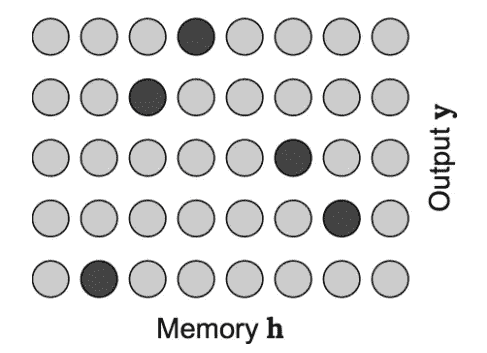

Softmax 注意:图片来自[这篇](https://colinraffel.com/blog/online-and-linear-time-attention-by-enforcing-monotonic-alignments.html)博客

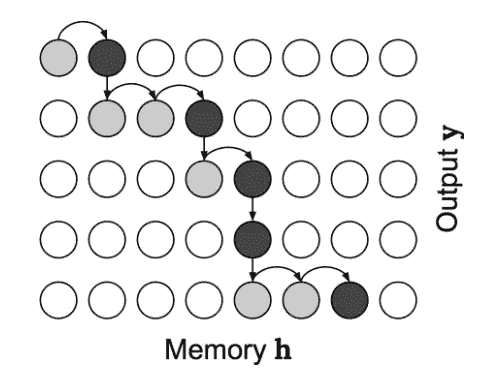

单调的注意力:图片来自[这个](https://colinraffel.com/blog/online-and-linear-time-attention-by-enforcing-monotonic-alignments.html)博客

在这里，我们将实现一个非常简单的单调注意力类型，如[这篇](https://colinraffel.com/blog/online-and-linear-time-attention-by-enforcing-monotonic-alignments.html)博客和论文中所解释的。必须记住的是，这些变化只会发生在关注层，而编码器和解码器层将保持不变。这些是单调注意力的步骤:

*   给定之前的隐藏状态，我们将计算分数或能量，我们将使用与上面在休息注意力机制中使用的相同的方法。

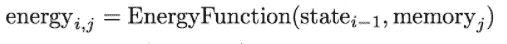

*   分数计算出来后，通过 sigmoid 函数转换成概率。

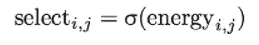

*   当前时间步长的注意力通过以下公式计算:

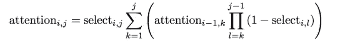

*   一旦我们获得注意力权重，我们就按照计算加权和的类似步骤来获得上下文向量，并将其连接到解码器的隐藏状态，以通过 softmax 层。

在这个案例研究中，我只实现了单调注意力层的一个变体。有关更多信息，请参考 Colin Raffel 的博客和代码，他给出了该层的完整实现。

单调注意的性能与简单注意相当，但是正如在论文中提到的，它在时间复杂性方面提供了一些优势。

# 12.推理(贪婪搜索与波束搜索)

如果你知道序列对序列模型，那么你会意识到这样一个事实，我们必须对模型进行某些改变，以预测推理时所需的输出。

同样，我们有两种选择，一种是贪婪搜索，另一种是波束搜索。让我们一个一个来看看他们两个。

## 贪婪搜索

在每个时间步长的贪婪搜索中，我们考虑具有最大概率的记号，并忽略所有剩余的记号，即使它们在 softmax 层之后具有可比较的概率值。

在代码中，您可以在密集的 softmax 激活层的输出上看到 argmax 函数。

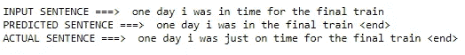

贪婪搜索预测

这有一个缺点，因为如果任何一个时间步的预测字是错误的，未来时间步的结果也会受到影响。

## 波束搜索

一种更好的预测方式是波束搜索，其中在每个时间步长，为最顶端的可能记号提供一个选择，这些记号的数目等于**波束宽度**，并且每个预测序列的总得分等于序列中每个单词的概率的乘积。

在本案例研究中，我将波束宽度设为 3。更多的见解，你可以浏览这个[博客](https://machinelearningmastery.com/beam-search-decoder-natural-language-processing/)。

[代码参考](https://github.com/mmehdig/lm_beam_search/blob/master/beam_search.py.)。

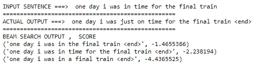

波束搜索预测

# 13。结果和模型对比

在这个案例研究中，我一共尝试了 12 个有一定变化的模型。下面是结果。

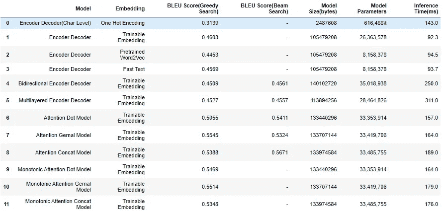

*   注意机制的结果优于简单的编码器-解码器，并且在注意模型中，性能相差不大。
*   我们还可以观察到，波束搜索的 BLEU 分数比预期的贪婪搜索好。

# **14。模型部署和预测**

我已经为**单调注意模型**做了模型部署，它正在用**点积**计算分数。你可以在[这个](http://ec2-3-15-32-206.us-east-2.compute.amazonaws.com:8080/)链接查看模型。

上述模型的一些预测如下:

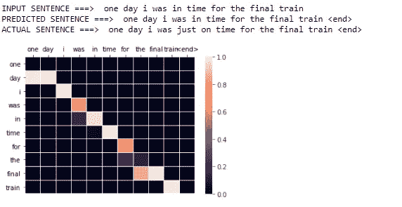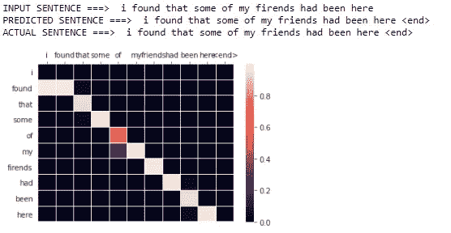

# 15.未来的工作

*   在未来的工作中，我很乐意研究单调注意机制的其他变体。
*   如果一个更好的数据集可以公开获得，这将真正提高模型的性能。

# 16.Github 知识库和 Linkedin

我试着简单介绍一下我在这个项目中所做的工作。如果你想看我对每一行都做了注释的完整详细的代码，请查看我的 [Github](https://github.com/pushapgandhi/Grammer_error_correction) 库。在 Linkedin 上随意联系。

**如果到目前为止，帮我留言完善内容。这对我意义重大:)**

# 17.参考

*   [https://Colin raffel . com/blog/online-and-linear-time-attention-by-enforcing-monotonic-alignments . html](https://colinraffel.com/blog/online-and-linear-time-attention-by-enforcing-monotonic-alignments.html)
*   应用人工智能课程 Hina Sharma 指导下的项目:[https://www . Applied AI Course . com/Course/11/Applied-Machine-learning-Course](https://www.appliedaicourse.com/course/11/Applied-Machine-learning-course)
*   休息室注意事项:[https://arxiv.org/pdf/1508.04025.pdf](https://arxiv.org/pdf/1508.04025.pdf)
*   单调注意论文:[https://arxiv.org/pdf/1409.0473.pdf](https://arxiv.org/pdf/1704.00784.pdf)
*   单调注意的实现:[https://github . com/craffel/mad/blob/b 3687 a 70615044359 c 8 ACC 440 e 43 a5 e 23 DC 58309/example _ decoder . py # L22](https://github.com/craffel/mad/blob/b3687a70615044359c8acc440e43a5e23dc58309/example_decoder.py#L22)
*   博客作者 [**日尚 Prashnani**](/deep-text-corrector-using-monotonic-attention-with-dataset-creation-1e1a3f5a1b9e)