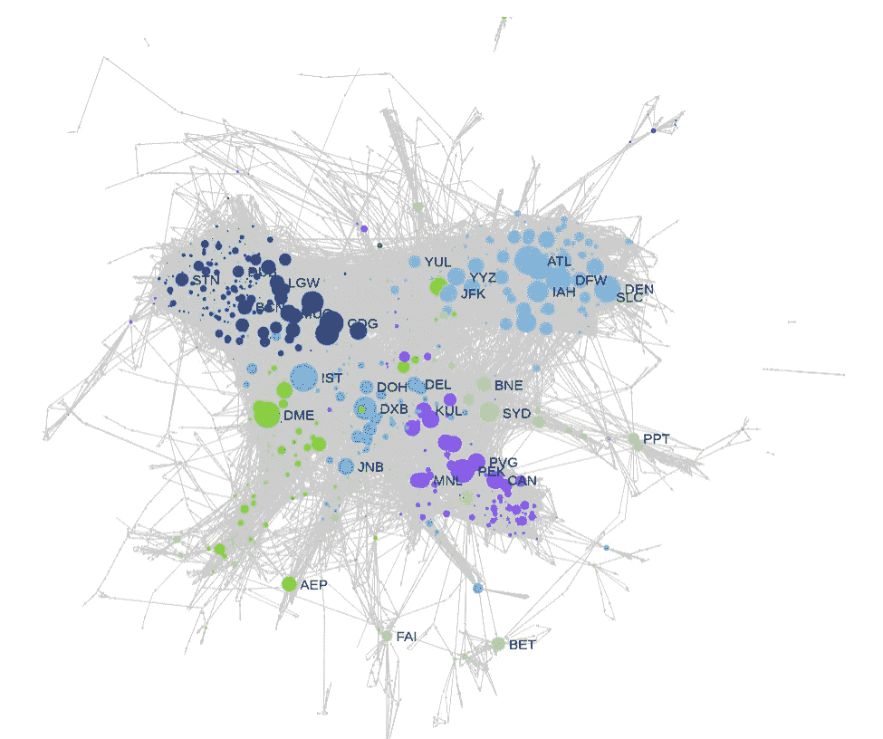

# 大西格马杰斯

> 原文：<https://towardsdatascience.com/grand-sigmajs-c475ec0bde68?source=collection_archive---------20----------------------->

## 将 SigmaJS 网络可视化与 GRAND stack (GraphQL、React、Apollo、Neo4j)集成


使用 SigmaJS 可视化机场路线。图片作者。

我做过几个基于图形数据的项目，它们的一个共同点是需要一个定制的网络可视化/交互工具。在我之前的文章中，我研究了如何将 [VisJS 整合到大堆栈框架](/network-visualizations-with-grandstack-a07deb0a0c3a)中。不幸的是，VisJS 在处理成千上万的节点和关系时伸缩性不好。幸运的是，我的朋友[简·扎克](https://medium.com/u/72aa7be0a59f?source=post_page-----c475ec0bde68--------------------------------)给我指了指[西格玛杰斯](https://www.sigmajs.org/)图书馆，它应该更擅长可视化大型网络。我通常害怕创建包含超过 1000 个节点和关系的可视化，因为它们很容易使你的浏览器崩溃，但现在多亏了 SigmaJS 的性能。上面的机场航线可视化包含大约 3500 个节点和 35000 个关系，运行良好。我想说 SigmaJS 是面向更严肃的网络可视化开发的，因为你可以定制网络可视化和开发用户交互以获得更好的体验。查看他们的[演示应用](https://www.sigmajs.org/demo/index.html)以获得它能做什么的一些提示。

在这篇博文中，我将结合 SigmaJS 使用 GRAND stack 来创建好看的网络可视化。


大堆栈。图片来自[https://grandstack.io/](https://grandstack.io/)。内容由 4.0 在 CC 下授权。

GRAND stack 使用 Neo4j 作为数据存储。前端通常有一个 React 应用程序，React 和 Neo4j 之间的数据交换由 GraphQL 处理。查看[官方文档](https://grandstack.io/docs/getting-started-neo4j-graphql)获取详细解释。

我已经准备了一个 [GitHub 存储库](https://github.com/tomasonjo/grand-sigmaJS)，其中包含了播种 Neo4j 数据库的所有代码和指令。在这篇博文中，我将带您快速浏览代码和数据结构。

## Neo4j 图形构造

首先，我们需要播种数据库。我们将使用来自 [OpenFlights](https://openflights.org/) 网页的数据。OpenFlights 是一个工具，可以让您绘制全球航班地图，如果您愿意，还可以与公众分享您的航班。所有数据都可以在开放数据库许可下获得。我已经从 Kaggle 下载了 routes [数据集，并将其放在我的 Git 存储库中以简化播种过程。](https://www.kaggle.com/open-flights/flight-route-database)


机场航线图表模式。图片作者。

我们有一个简单的图形模型，其中包含机场和机场之间的路线。此外，我们还有一些关于机场的附加数据，比如它们的国家和位置。路由关系是有向和加权的。关系的权重表示两个机场之间有多少条路线，可能由不同的航空公司提供。如果您使用的是 Linux 或 MacOS，您可以用一个简单的脚本来播种数据。

```
cat seed_data.cql | docker exec -i neo4j cypher-shell -u neo4j -p letmein
```

我不熟悉 Windows bash 脚本，但如果你使用 Windows，你可以简单地将[密码查询](https://github.com/tomasonjo/grand-sigmaJS/blob/main/seed_data.cql)复制/粘贴到 Neo4j 浏览器中。

除了导入路线之外，该脚本还将执行 PageRank 和 Louvain 算法。PageRank 是一种中心性算法，用于查找图中最重要或最有影响力的节点，而 Louvain 算法用于检测图的社区结构。我们将使用 PageRank 分数来确定可视化和 Louvain 社区中节点的大小，并相应地为节点着色。

## GraphQL 服务器

接下来，我们需要开发一个 GraphQL 服务器，它将从 Neo4j 获取信息，并使其在我们的 React 应用程序中可用。幸运的是，一个 [Neo4j GraphQL 库](https://neo4j.com/product/graphql-library/)让这个过程变得轻而易举。这是一个低代码库，设计用于在 Neo4j 图形数据库上构建 GraphQL 应用程序。我们需要定义 GraphQL 模式类型，该库将自动创建解析器函数来获取或更新 Neo4j 中的数据。

这就是我们拥有一个正常工作的 GraphQL 服务器所需的所有配置。我们已经定义了一种类型*机场。*类型名应该和 Neo4j 中的节点标签一致。您可以简单地指定想要公开的节点属性及其类型。我还排除了创建、更新和删除操作，因为我只对从 Neo4j 中检索数据感兴趣，而不是更新它。传入和传出路由字段定义了我们希望在传入或传出方向上遍历路由关系。我们还可以通过指定接口并将其作为关系的属性字段来添加关系属性。

当然，如果您愿意，也可以添加授权和自定义解析器。查看[文档](https://neo4j.com/docs/graphql-manual/current/)了解更多信息。

## 用 SigmaJS 反应应用程序

我准备了两个版本的机场航线可视化。一种使用 Force Atlas 布局算法来计算可视化中节点的布局。



机场航线用 Force Atlas 布局算法。图片由作者提供。

既然我们有可用的纬度和经度信息，我想测试一下我们是否可以将它们作为 x 和 y 坐标输入，然后看看结果如何。


带地理布局的机场航线。图片作者。

我不习惯事情在盒子外工作，所以这是一个惊喜。我还复制了 SigmaJS 官方演示中的一些功能。在左侧，我们有缩放和中央可视化按钮，在右侧，我添加了类别过滤器，您可以使用它们来过滤可视化中的国家。

例如，我们可以在可视化中排除除美国以外的所有国家。


美国机场间的机场航线。图片作者。

## 结论

时代在变。您不必再害怕必须生成具有成千上万个节点和关系的网络可视化。在这个例子中，我们可视化了 3500 个节点和 38000 个关系，而浏览器却毫不费力。从我的初学者 React 的角度来看，SigmaJS 有很大的潜力来增加定制和用户交互性。如果你计划在 Neo4j 上开发一个定制的网络可视化或交互工具，我肯定会推荐将 SigmaJS 集成到 GRAND stack 中。如果你有什么好主意可以添加到这个项目，请打开一个问题或拉请求。

和往常一样，代码可以在 [GitHub](https://github.com/tomasonjo/grand-sigmaJS) 上获得。