# 格兰杰因果网络与间接反馈

> 原文：<https://towardsdatascience.com/granger-causal-networks-and-indirect-feedback-676549ba99e?source=collection_archive---------46----------------------->

## 结构变量的非参数变量选择

在过去十年中，最常用的计量经济学工作流程之一是使用向量自回归模型。从学者所做的研究到经济学家告知政策实施，都以某种形式或迭代利用了 VAR 模型[想想向量误差修正模型(VECM)或结构 VAR(SVAR)]。这可能是为了脉冲响应研究、内生变量预测或简单的争论时间变量之间的交叉相关性。

不幸的是，VAR 研究未能解决的一个问题是将一个内生变量在一个时间点对另一个的影响分解为*****间接*** 和 ***合计*** 反馈。直观地说，这可以理解为，如果一个变量直接影响另一个*变量*，那么我们可以在一个任意方程中显式地连接这两个变量:**

**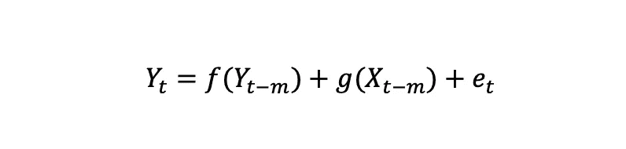**

**x 在结构上影响着 Y**

**但是，如果一个变量对另一个变量只有中间反馈，我们可以隐式地将它们连接起来:**

**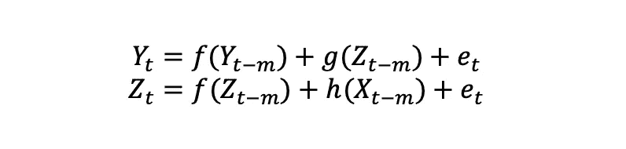**

**x 只通过对 Z 的影响来影响 Y**

**尽管我们能够通过正交脉冲响应函数来衡量总体影响，但我们仍然不能将其分解为*间接*和*直接*反馈，因为这需要我们通过风险值模型中的每个方程来追踪影响。这是一场计算噩梦！**

***【读者可能会尝试使用 SEM 模型，但它们也要求我们先验地定义变量之间的关系，然后看看数据与我们的假设有多吻合；我们在这里试图解决的问题是“首先是什么关系？”】***

**这篇文章介绍了计量经济学界的一个小话题。 ***因果网络图*** 。因果图的概念很简单:**

1.  **如果一个变量 A，*导致了*变量 B，那么我们可以从 A - > B 开始画一条边。**
2.  **我们对数据集中的所有变量对都这样做。因果关系的方向也很重要。a 可以导致 B，但反之亦然。**
3.  **使用变量/节点和边的集合形成的图被称为因果网络图， *G(e，d)* 。其中 *e* 是边的数量，而 *d* 是数据集中顶点(变量)的数量。**
4.  **出于计算目的，我们使用邻接矩阵来表示 *G(e，d)* 。**

**因果网络图在面板数据研究中变得重要，作为一种可视化变量以及它们如何与其他变量相联系的方法。结果，图表成为快速和廉价的推断测量的容易的候选者。在这里，我们将尝试使用现实生活中的数据建立一个 *G(e，d)* 并且用通俗的语言探索这些网络如何帮助我们开始理解两个内生变量之间的直接和间接影响。**

**对于我们可重复的例子，让我们看看跟踪纳斯达克 100 指数的 ETF 的日志回报。此外，我们还将查看一些技术指标，如相对强弱指数(RSI)、布林线百分比 B(pctB)、成交量、范围和另一种证券的价格——SPY，并查看网络图是否能帮助我们了解*结构上的* *因果关系*这些指标如何影响 QQQ 的日常价格变动(如果有的话)。我们将适当地变换这些变量，以确保平稳性。下面是我们将使用的变量的初始图:**

**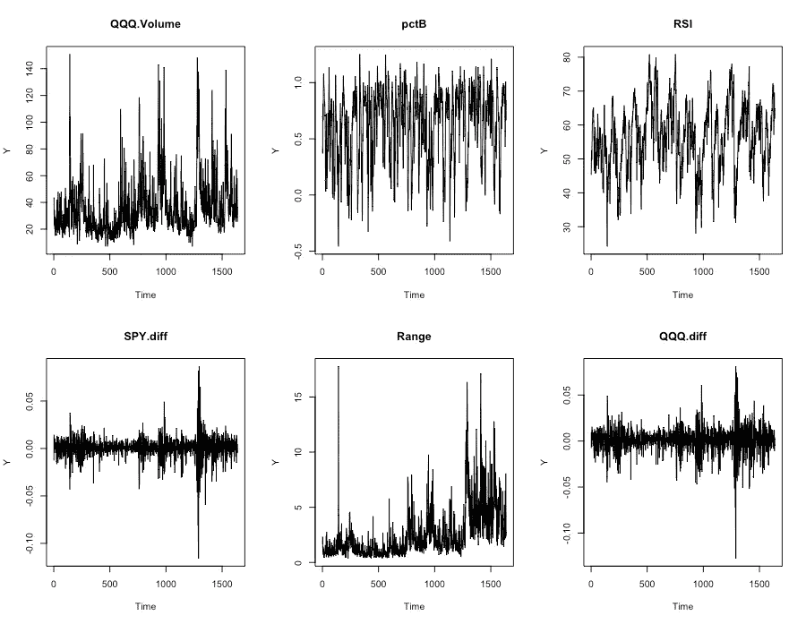**

***G(e，d)* 的新奇来自于我们用来构建它的 ***规则*** 。构建 *G(e，d)* 最简单的方法之一是查看这些变量之间的相关性，并只选择高度相关(cor > |0.6|)的边来制作图表。使用此规则构建的网络图的输出如下所示:**

**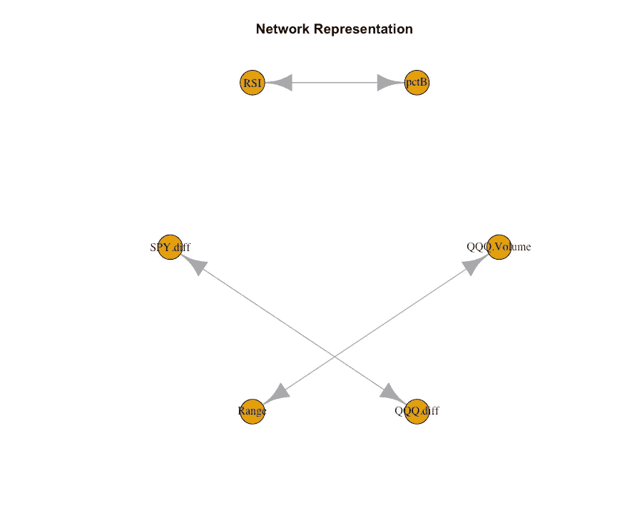**

**相关矩阵网络表示**

**似乎所有的变量都在两个方向上相互关联。双向连接可以传递关于*哪些*变量被连接的信息，而不是*它们如何*相关的信息。对于使用相关系数作为构建图边的规则的网络图，我们不需要给定隐含对称性的有向图。不幸的是，该图没有给我们任何额外的洞察力。我们知道**相关性不等于因果关系**。这是一个测试，数字也是一致的。**

**接下来，让我们利用成对格兰杰因果关系来构建一个*双变量* *格兰杰*因果网络图。这里方向很重要，我们可以建立一个有向网络。对于 *G(e，d)，*每条边表示自变量的滞后在解释因变量在其自身滞后之上的变化时是否达到给定的显著性水平。这是通过运行如下所示的受限和非受限模型，并比较 f 检验统计的分布来实现的:**

**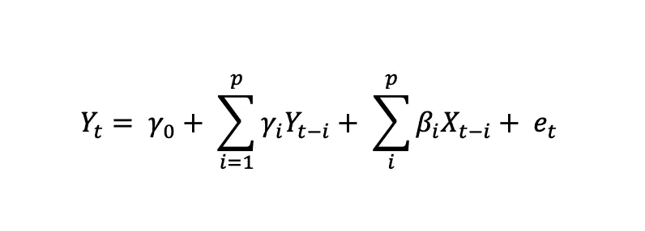**

**无限制二元模型**

**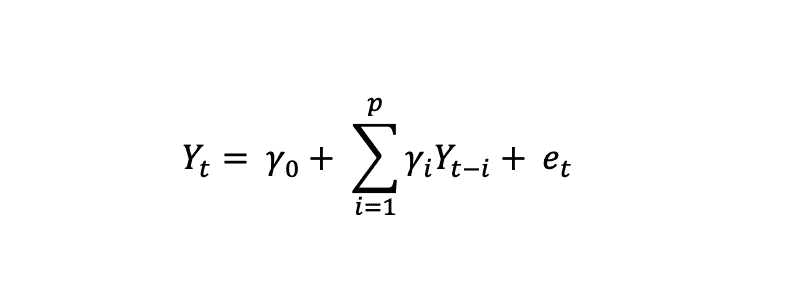**

**受限二元模型**

**以 1%为 p 值截止点，使用 AIC 最小化标准来选择格兰杰检验的最佳滞后(9)，我们数据集的*双变量格兰杰因果图*如下所示:**

**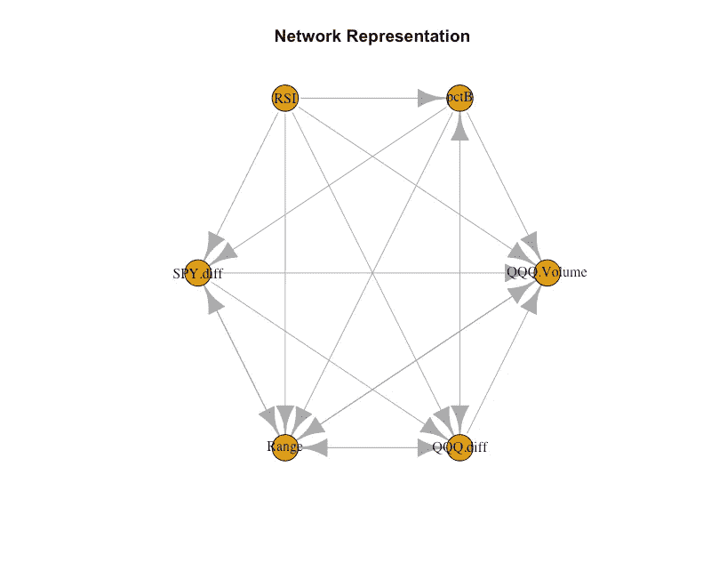**

**成对格兰杰因果网络表示[99%置信区间，滞后= 9]**

**现在我们有点进展了。虽然 RSI 似乎与 QQQ 日志回报非常每周相关，但它对 QQQ 日志回报有 99%的显著*成对格兰杰因果*效应。**

**QQQ 日志的回报似乎有 ***聚合*** 的因果含义:**

1.  **RSI**
2.  **范围**
3.  **间谍日志返回**
4.  **pctB**

**请注意，QQQ 日志返回与 QQQ 数量没有直接的因果关系。但是，如果我们考虑链— *卷>范围> QQQ* 日志回报，我们可以说卷对 QQQ 日志回报也有一个 ***中间*** 因果关系。**

**其他变量呢？以下是我们从 RSI 到 QQQ 日志回报的一些途径:**

1.  **RSI > QQQ.diff ***【二元直接】*****
2.  **RSI > SPY.diff > QQQ.diff ***【中级】*****
3.  **RSI > pctB > QQQ.diff ***【中级】*****
4.  **RSI > pctB > spy . diff > qqq . diff***【中级】*****
5.  **RSI > spy . diff > Range > qqq . diff***【中级】*****
6.  **RSI > SPY.diff > QQQ。音量>范围> QQQ.diff ***【中级】*****

**请记住，这个列表并不详尽。基于上述网络，从 RSI 到 QQQ 日志回报还有多种其他途径。**

**仅仅通过将我们的数据可视化为一个网络，我们就可以开始让直接和间接反馈的想法更加直观！**

**不幸的是，一个问题就摆在我们面前——使用*成对*格兰杰因果关系来推导数据中的结构变量，我们最终总是孤立地测量两个变量之间的因果关系，而这应该考虑数据集中隐含的所有动态。网络图揭示了在两个变量之间可以有许多 ***中间*** 反馈路径以及它们的集合效应。了解如何在*直接*和*中间*影响之间划分总体因果关系变得至关重要，以量化一个变量对另一个变量的结构重要性。例如，如果集合信号显示 RSI granger 导致 QQQ.diff，但是该效应几乎完全通过中间反馈，则在网络图表示中，RSI 和 QQQ.diff 不应通过直接边连接；它们应该躺在同一条路上。**

**孤立地测量双向格兰杰因果关系可能有助于变量选择，但不能帮助我们挖掘有关过程的结构信息。理所当然，这是对格兰杰因果关系最大的批评之一——它有助于样本内拟合，而不是样本外预测。**

****结构因果性是一种绝对的度量**。因此，任何结构性因果关系的测量都应该能够控制每个中间效应或路径，以便能够将一个变量命名为结构性因果关系。**

**作为一种解决方案，人们可能会争辩说，如果我们使用整个时间序列块，即使用限制和不限制变量，包括所有其他感兴趣的变量，我们可以衡量一个变量对另一个变量的结构重要性，也可以看到直接的影响。**

**是和不是。下面是来自 VAR 的相关方程的样子:**

**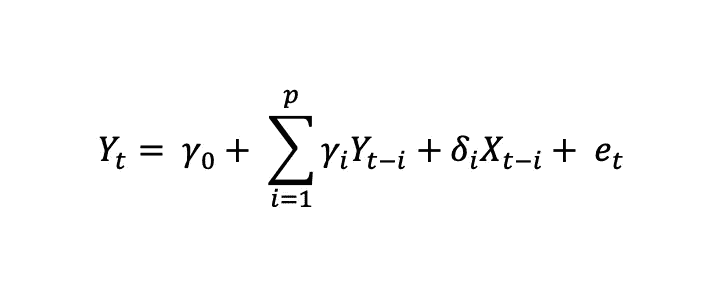**

**来自受限 VAR 模型的方程**

**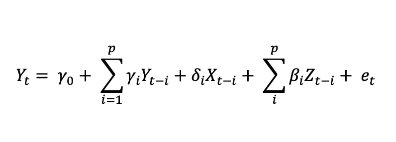**

**来自无限制 VAR 模型的方程**

**变量有助于更好地理解格兰杰因果关系的*总量*方面，因为所有感兴趣的变量都被使用了。不幸的是，这一次我们无法单独控制直接和中间反馈来测量它们的强度——类似于双变量的情况，我们仍然在孤立地测量因果关系。因此，基于双变量和 VAR 的规则的结果构建了非常相似的网络图。下面是通过多元方法构建的图表:**

**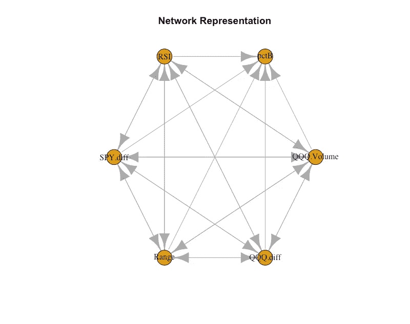**

**基于风险值的格兰杰因果关系表示[99%置信区间，滞后= 9]**

**这里的一个很大的不同是，现在我们看到一些反馈被溢出到 RSI 和 pctB，与双变量情况相比，在给定的显著性水平上，双向因果边缘很明显。**

**这里看一下与二元情况相比，我们的每个设置给出的附加边:**

**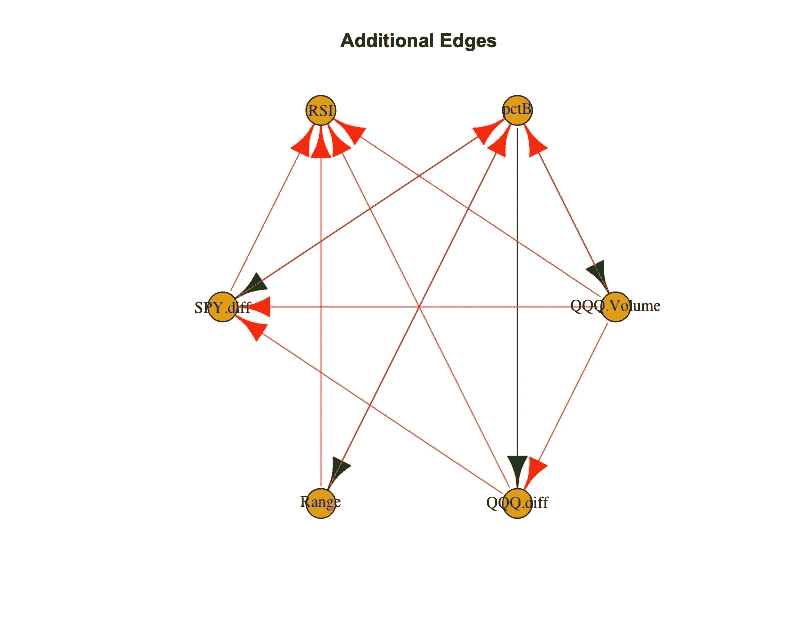****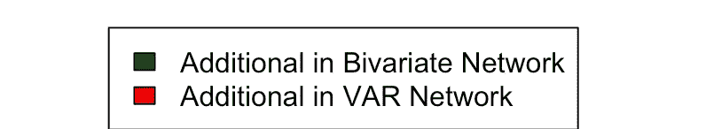**

**这让我们对数据中的一些中间反馈路径有了进一步的了解。现在，不仅中间反馈的想法“看起来”很直观，而且使用 2 种不同规则产生的网络差异也有助于我们更好地理解效果:**

1.  ****在双变量情况下，PctB 对 QQQ.diff 有很强的解释力，但当我们包括其他变量，即 VAR 网络时，PctB 就消失了—**qqq . diff 的校准方程如下。此外，还有 QQQ.diff 对 pctB 的正交脉冲响应:**

**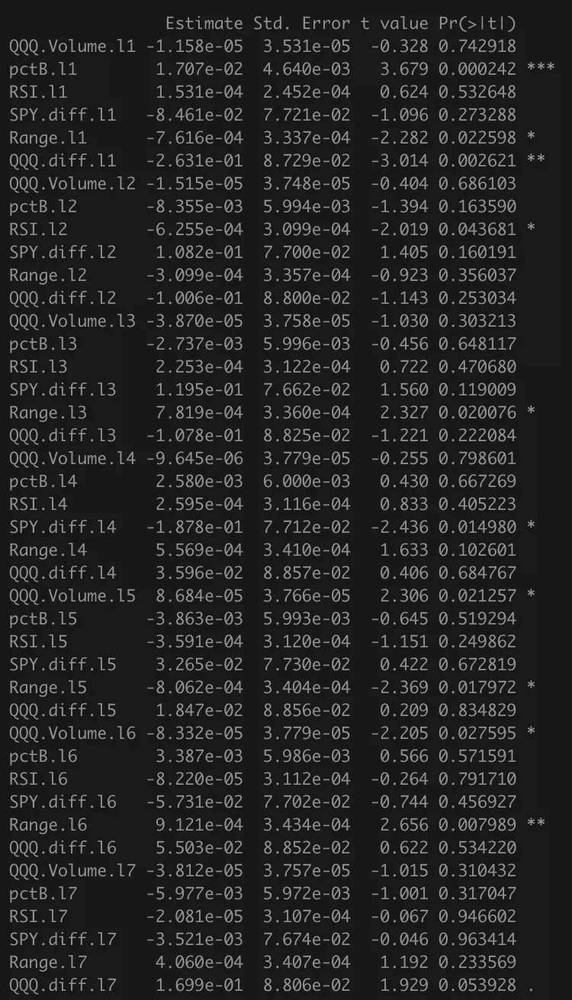****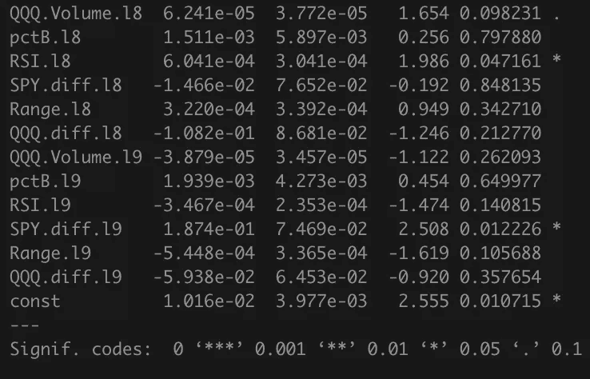**

**QQQ.diff 的 VAR 等式**

**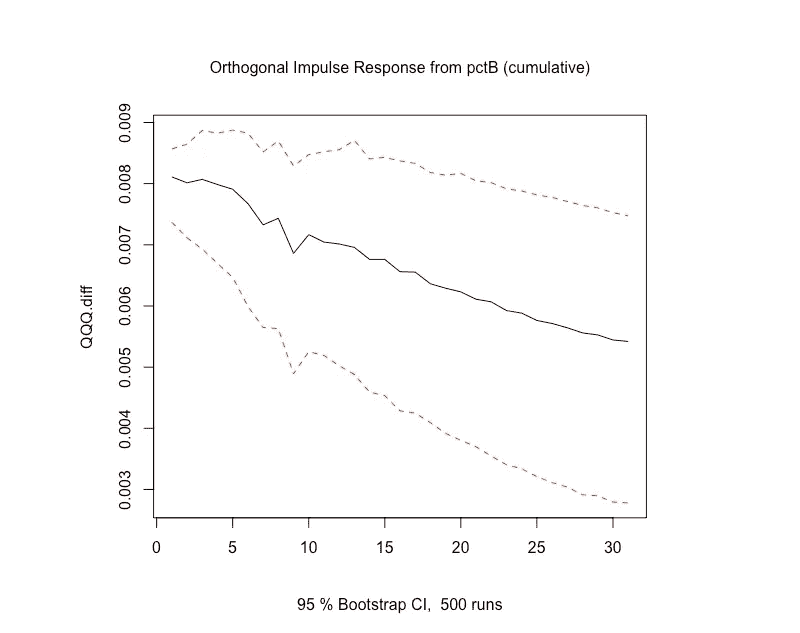**

**只有 pctB 的第一个滞后在等式中是重要的。pctB 增加一个单位会导致 QQQ.diff 增加 0.01707 个单位，直接基于以下等式。但是脉冲响应测量 1 个周期内大约 0.008 单位增加的影响。*这意味着有一个更强的中间反馈来抵消渗透到系统中的直接影响。*或许，pctB 会影响其他渠道，进而影响 QQQ 日志回报，而不仅仅是直接影响。交易者是否应该考虑通过其他指标配对使用 pctB 的买入/卖出信号，而不是直接使用日志回报(至少对于这个数据集来说)？**

**2. **QQQ。在双变量情况下，交易量对 QQQ.diff 没有任何解释力，但在 VAR 情况下，交易量对 QQQ 有任何解释力，只有****交易量的第 5、第 6 和第 8 个滞后在 QQQ 中是显著的。diff 等式，但我们在第一阶段看到来自 QQQ.diff 的显著脉冲响应，因为我们冲击音量:****

****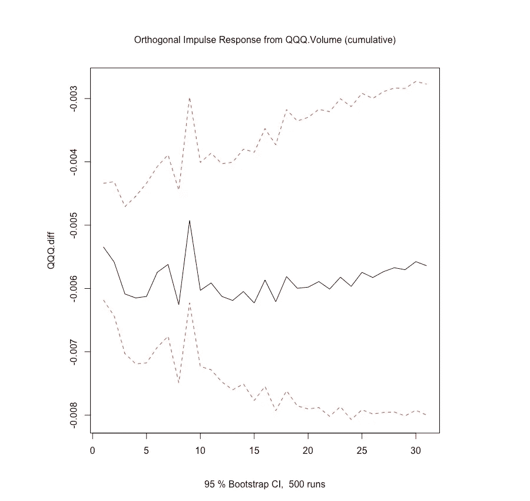****

****这个推论让我们相信，在最初的几个滞后期，QQQ.volume 对 QQQ.diff 的影响严重偏向于中间反馈，而不是直接影响。****

****3. **SPY.diff 在双变量情况下对 RSI 没有任何解释能力，但在风险值网络中会弹出一个信号—**SPY.diff 的滞后在风险值模型中并不显著，但当 spy . diff 受到冲击时，我们会看到来自 RSI 的显著正交响应:****

****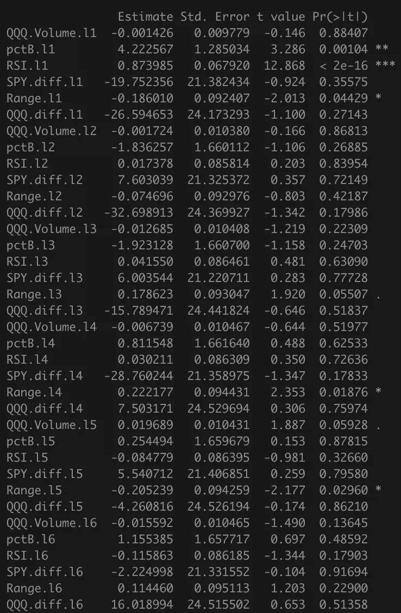********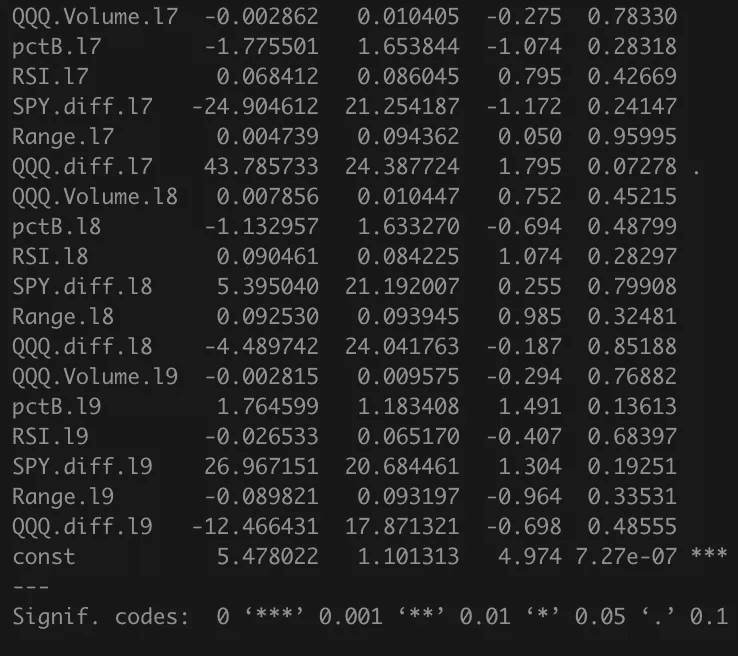****

****RSI 的 VAR 方程****

****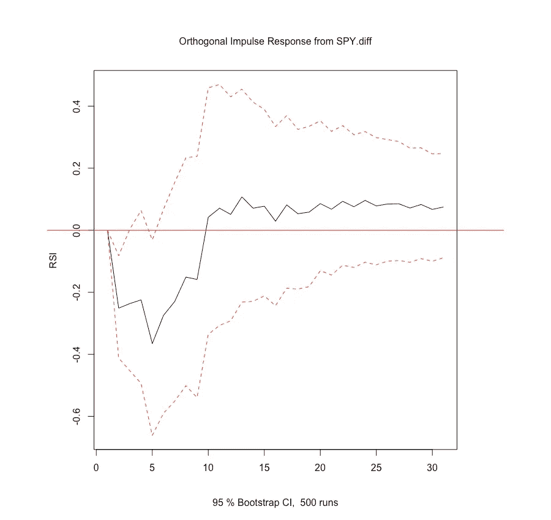****

****在这里，我们可以再次看到网络图如何帮助挖掘从 SPY.diff 到 QQQ RSI 的间接反馈，如果校准系数缺乏显著性，我们不会注意到这一点。****

****我们可以继续其他边的练习，并开始做出类似的推论。首先，我们能够评论在同样的滞后期，一个变量对另一个变量的总效应如何在直接和间接效应之间达到平衡；第二，直接影响和间接影响之间的平衡是如何随着滞后而变化的。****

****由于这个网络是两个图之间的差异，我们只能知道*强*间接反馈存在于两个变量之间，但是 ***我们不能:*******

1.  *******评论一段时间内直接间接影响的分布或强度。*******
2.  *******评论两个变量之间间接反馈的路径，只说明它存在。*******
3.  *******评论变量间微弱的间接反馈。*******

****我们可以从网络图中获得的洞察力是一种未开发的资源。如果我们改变我们用来画 G(e，d)的规则，我们几乎可以立刻得出新的见解。****

****网络图使用的扩展，更重要的是格兰杰因果网络图是我们如何使用这些图中隐含的 ***拓扑*** 来更好地理解我们的数据集。我正在积极构建一个条件格兰杰因果网络方法，并分析其拓扑方面，以揭示直接和间接的影响。假设——存在数据频域之外的关键结构信息；如果我们将域从频率转移到邻接矩阵，我们也许能够恢复变量之间更深层次的关系。**也许我们可以在没有任何先验假设的情况下，得到数据中隐含的 SVAR 的结构方程。******

****对于时间序列，VAR 建模将从这些进步中获得最大收益，因为变量选择仍然严重依赖于相关时间序列的瞬时信息。如果这篇文章帮助你得到了一些想法，请随时联系我们！****

****韦丹特·贝迪是万事达卡的分析师，在不结盟运动投资组合开发团队工作。Vedant 拥有 NYU 大学的数学和经济学学士学位(2019 年优等生)，对数据科学、计量经济学及其在金融中的许多应用有浓厚的兴趣。****

*****韦丹特还是美国历史最悠久的学术荣誉团体 Phi Beta Kappa(纽约分会)的成员。*****