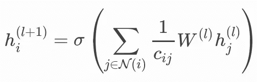

# 引擎盖下的图形注意力网络

> 原文：<https://towardsdatascience.com/graph-attention-networks-under-the-hood-3bd70dc7a87?source=collection_archive---------4----------------------->

## [GRL 系列](https://towardsdatascience.com/tagged/grl-series)

## 从数学到数字的逐步指南


图形注意力网络层——图片来自[Petar veli kovi](https://github.com/PetarV-/GAT)

G 图形神经网络(GNNs)已经成为从图形数据中学习的标准工具箱。gnn 能够推动不同领域中高影响问题的改进，例如内容推荐或药物发现。与图像等其他类型的数据不同，从图形数据中学习需要特定的方法。根据迈克尔·布朗斯坦的定义:

> [..]这些方法基于图中某种形式的消息传递，允许不同的节点交换信息。

用于完成图形上的特定任务(节点分类、链接预测等。)，GNN 层通过所谓的*递归邻域扩散*(或*消息传递*)来计算节点和边表示。根据这一原则，每个图节点接收并聚合来自其邻居的要素，以表示本地图结构:不同类型的 GNN 层执行不同的聚合策略。

最简单的 GNN 层公式，如图形卷积网络(GCNs)或 GraphSage，执行各向同性聚合，其中每个邻居同等地贡献以更新中心节点的表示。这篇博客文章致力于分析图注意力网络(GATs)，它定义了递归邻域扩散中的各向异性操作。利用各向异性范式，通过注意机制提高学习能力，该机制对每个邻居的贡献赋予不同的重要性。

*如果您对 GNNs 和相关概念完全陌生，我邀请您阅读以下介绍性文章*:

</understanding-the-building-blocks-of-graph-neural-networks-intro-56627f0719d5>  

## GCN vs 加特——数学热身

*本次预热基于深度图库* [*网站*](https://docs.dgl.ai/en/0.4.x/tutorials/models/1_gnn/9_gat.html) *报道的 GAT 详情。*

在理解 GAT 层的行为之前，让我们回顾一下 GCN 层执行的聚合背后的数学原理。



GCN 层—聚合函数

*   *N* 是节点 *i.* 的一跳邻居的集合，也可以通过添加自环将该节点包含在邻居中。
*   *c* 是基于图形结构的归一化常数，定义了各向同性的平均计算。
*   *σ* 是一个激活函数，它在变换中引入了非线性。
*   *W* 是用于特征变换的可学习参数的权重矩阵。

GAT 层扩展了 GCN 层的基本聚合功能，通过关注系数为每条边赋予不同的重要性。


GAT 层方程

*   **等式(1)** 是下层嵌入 *h_i，*的线性变换， *W* 是其可学习的权重矩阵。这种转换有助于获得足够的表达能力，将输入特征转换成高级和密集的特征。
*   **等式(2)** 计算两个邻居之间的成对非归一化注意力分数。这里，它首先连接两个节点的 *z* 嵌入，其中||表示连接。然后，它取这种连接和可学习的权重向量的点积。最后，将 LeakyReLU 应用于点积的结果。关注分数指示邻居节点在消息传递框架中的重要性。
*   **等式(3)** 应用 softmax 来归一化每个节点的传入边上的注意力分数。softmax 将上一步的输出编码成一个概率分布。因此，不同节点之间的关注分数更具可比性。
*   **方程式(4)** 类似于 GCN 聚合(见本节开头的方程式)。来自邻居的嵌入被聚集在一起，通过关注分数来缩放。这个缩放过程的主要结果是从每个邻域节点学习不同的贡献。

## NumPy 实现

第一步是准备表示简单图形的成分(矩阵)并执行线性转换。

**NumPy 代码**

**输出**

```
----- One-hot vector representation of nodes. Shape(n,n)[[**0 0 1 0 0**] # node 1
 [0 1 0 0 0] # node 2
 [0 0 0 0 1]
 [1 0 0 0 0]
 [0 0 0 1 0]]----- Embedding dimension3----- Weight Matrix. Shape(emb, n)[[-0.4294049   0.57624235 **-0.3047382**  -0.11941829 -0.12942953]
 [ 0.19600584  0.5029172   **0.3998854**  -0.21561317  0.02834577]
 [-0.06529497 -0.31225734  **0.03973776**  0.47800217 -0.04941563]]----- Adjacency Matrix (undirected graph). Shape(n,n)[[**1 1 1 0 1**]
 [**1** 1 1 1 1]
 [**1** 1 1 1 0]
 [**0** 1 1 1 1]
 [**1** 1 0 1 1]]
```

第一个矩阵定义了节点的独热编码表示(节点 1 以粗体显示)。然后，我们定义一个权重矩阵，利用定义的嵌入维数。我突出显示了第三列向量 *W* ，因为，正如您将很快看到的，这个向量定义了节点 1 的更新表示(在第三个位置初始化 1 值)。我们可以从这些成分开始执行线性变换，以获得足够的节点特征表达能力。该步骤旨在将(一位热码编码的)输入特征转换成低密度表示。


GAT 层(等式 1)

**NumPy 代码**

**输出**

```
----- Linear Transformation. Shape(n, emb)

[[**-0.3047382   0.3998854   0.03973776**]
 [ 0.57624235  0.5029172  -0.31225734]
 [-0.12942953  0.02834577 -0.04941563]
 [-0.4294049   0.19600584 -0.06529497]
 [-0.11941829 -0.21561317  0.47800217]]
```

下一步操作是为每个边引入自我关注系数。我们连接源节点的表示和目的节点的表示来表示边。邻接矩阵 *A* 支持这种连接过程，它定义了图中所有节点之间的关系。


GAT 层(等式 2)

**NumPy 代码**

**输出**

```
----- Concat hidden features to represent edges. Shape(len(emb.concat(emb)), number of edges)

[[**-0.3047382   0.3998854   0.03973776 -0.3047382   0.3998854   0.03973776**]
 [-0.3047382   0.3998854   0.03973776  0.57624235  0.5029172  -0.31225734]
 [-0.3047382   0.3998854   0.03973776 -0.12942953  0.02834577 -0.04941563]
 [-0.3047382   0.3998854   0.03973776 -0.11941829 -0.21561317  0.47800217]
 [ **0.57624235  0.5029172  -0.31225734 -0.3047382   0.3998854   0.03973776**]
 [ 0.57624235  0.5029172  -0.31225734  0.57624235  0.5029172  -0.31225734]
 [ 0.57624235  0.5029172  -0.31225734 -0.12942953  0.02834577 -0.04941563]
 [ 0.57624235  0.5029172  -0.31225734 -0.4294049   0.19600584 -0.06529497]
 [ 0.57624235  0.5029172  -0.31225734 -0.11941829 -0.21561317  0.47800217]
 [**-0.12942953  0.02834577 -0.04941563 -0.3047382   0.3998854   0.03973776**]
 [-0.12942953  0.02834577 -0.04941563  0.57624235  0.5029172  -0.31225734]
 [-0.12942953  0.02834577 -0.04941563 -0.12942953  0.02834577 -0.04941563]
 [-0.12942953  0.02834577 -0.04941563 -0.4294049   0.19600584 -0.06529497]
 [-0.4294049   0.19600584 -0.06529497  0.57624235  0.5029172  -0.31225734]
 [-0.4294049   0.19600584 -0.06529497 -0.12942953  0.02834577 -0.04941563]
 [-0.4294049   0.19600584 -0.06529497 -0.4294049   0.19600584 -0.06529497]
 [-0.4294049   0.19600584 -0.06529497 -0.11941829 -0.21561317  0.47800217]
 [**-0.11941829 -0.21561317  0.47800217 -0.3047382   0.3998854   0.03973776**]
 [-0.11941829 -0.21561317  0.47800217  0.57624235  0.5029172  -0.31225734]
 [-0.11941829 -0.21561317  0.47800217 -0.4294049   0.19600584 -0.06529497]
 [-0.11941829 -0.21561317  0.47800217 -0.11941829 -0.21561317  0.47800217]]
```

在前一个块中，我突出显示了代表连接到节点 1 的 4 条入边的 4 行。每行的前 3 个元素定义了节点 1 邻居的嵌入表示，而每行的其他 3 个元素定义了节点 1 本身的嵌入(正如您所注意到的，第一行编码了一个自循环)。

在这一操作之后，我们可以引入关注系数，并将它们与连接过程产生的边缘表示相乘。最后，漏 Relu 函数应用于该乘积的输出。

**NumPy 代码**

**输出**

```
----- Attention coefficients. Shape(1, len(emb.concat(emb)))

**[[0.09834683 0.42110763 0.95788953 0.53316528 0.69187711 0.31551563]]**

----- Edge representations combined with the attention coefficients. Shape(1, number of edges)

[[ **0.30322275**]
 [ 0.73315639]
 [ 0.11150219]
 [ 0.11445879]
 [ 0.09607946]
 [ 0.52601309]
 [-0.0956411 ]
 [-0.14458757]
 [-0.0926845 ]
 [ 0.07860653]
 [ 0.50854017]
 [-0.11311402]
 [-0.16206049]
 [ 0.53443082]
 [-0.08722337]
 [-0.13616985]
 [-0.08426678]
 [ 0.48206613]
 [ 0.91199976]
 [ 0.2413991 ]
 [ 0.29330217]]

----- Leaky Relu. Shape(1, number of edges)
[[ **3.03222751e-01**]
 [ 7.33156386e-01]
 [ 1.11502195e-01]
 [ 1.14458791e-01]
 [ 9.60794571e-02]
 [ 5.26013092e-01]
 [-9.56410988e-04]
 [-1.44587571e-03]
 [-9.26845030e-04]
 [ 7.86065337e-02]
 [ 5.08540169e-01]
 [-1.13114022e-03]
 [-1.62060495e-03]
 [ 5.34430817e-01]
 [-8.72233739e-04]
 [-1.36169846e-03]
 [-8.42667781e-04]
 [ 4.82066128e-01]
 [ 9.11999763e-01]
 [ 2.41399100e-01]
 [ 2.93302168e-01]]
```

在这个过程的最后，我们为图表的每条边获得了不同的分数。在上面的方框中，我突出显示了与第一条边相关的系数的演变。然后，为了使不同节点之间的系数易于比较，对每个目的节点的所有邻居的贡献应用 softmax 函数。


GAT 层(等式 3)

**数字代码**

**输出**

```
----- Edge scores as matrix. Shape(n,n)

[[ 3.03222751e-01  7.33156386e-01  1.11502195e-01  0.00000000e+00
   1.14458791e-01]
 [ 9.60794571e-02  5.26013092e-01 -9.56410988e-04 -1.44587571e-03
  -9.26845030e-04]
 [ 7.86065337e-02  5.08540169e-01 -1.13114022e-03 -1.62060495e-03
   0.00000000e+00]
 [ 0.00000000e+00  5.34430817e-01 -8.72233739e-04 -1.36169846e-03
  -8.42667781e-04]
 [ 4.82066128e-01  9.11999763e-01  0.00000000e+00  2.41399100e-01
   2.93302168e-01]]

----- For each node, normalize the edge (or neighbor) contributions using softmax

[0.26263543 0.21349717 0.20979916 0.31406823 0.21610715 0.17567419
 0.1726313  0.1771592  0.25842816 0.27167844 0.24278118 0.24273876
 0.24280162 0.23393014 0.23388927 0.23394984 0.29823075 0.25138555
 0.22399017 0.22400903 0.30061525]

----- Normalized edge score matrix. Shape(n,n)

[[**0.26263543 0.21349717 0.20979916 0\.         0.31406823**]
 [0.21610715 0.17567419 0.1726313  0.1771592  0.25842816]
 [0.27167844 0.24278118 0.24273876 0.24280162 0\.        ]
 [0\.         0.23393014 0.23388927 0.23394984 0.29823075]
 [0.25138555 0.22399017 0\.         0.22400903 0.30061525]]
```

为了解释定义归一化边分数的最后一个矩阵的含义，让我们回顾一下邻接矩阵的内容。

```
----- Adjacency Matrix (undirected graph). Shape(n,n)[[**1 1 1 0 1**]
 [1 1 1 1 1]
 [1 1 1 1 0]
 [0 1 1 1 1]
 [1 1 0 1 1]]
```

如您所见，我们重新调整了每个邻居的贡献，而不是用 1 值来定义边。最后一步是计算邻居聚合:来自邻居的嵌入被合并到目的节点中，并根据关注分数进行缩放。


GAT 层(方程式 4)

**数字代码**

**输出**

```
Neighborhood aggregation (GCN) scaled with attention scores (GAT). Shape(n, emb)

[[**-0.02166863  0.15062515  0.08352843**]
 [-0.09390287  0.15866476  0.05716299]
 [-0.07856777  0.28521023 -0.09286313]
 [-0.03154513  0.10583032  0.04267501]
 [-0.07962369  0.19226439  0.069115  ]]
```

## 后续步骤

在以后的文章中，我将描述多头 GAT 层背后的机制，我们将看到一些链接预测任务的应用。

## 参考

*   下面的[笔记本](https://github.com/giuseppefutia/notebooks/blob/main/gnns/gat.ipynb)里有代码的运行版本。您还会发现一个 DGL 实现，这对于检查实现的正确性很有用。
*   Petar Velič ković、Guillem Cucurull、Arantxa Casanova、Adriana Romero、Pietro Liò、Yoshua Bengiois 关于图形注意力网络的原始论文可在 arXiv 上获得。
*   为了更深入地解释这个话题，我还推荐来自[Aleksa gordi](https://www.youtube.com/watch?v=uFLeKkXWq2c)的视频。

【https://towardsdatascience.com/tagged/grl-series】:，你可以通过以下链接关注我的系列。

*如果你喜欢我的文章，你可以支持我使用这个链接*<https://medium.com/@giuseppefutia/membership>**成为一名中等会员。**