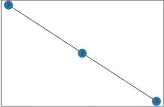
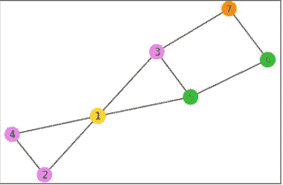
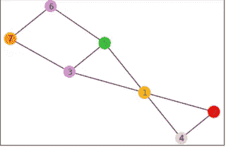
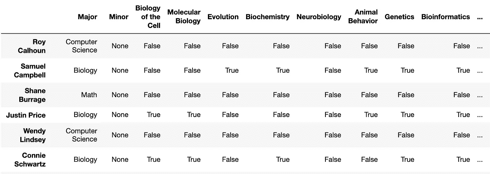
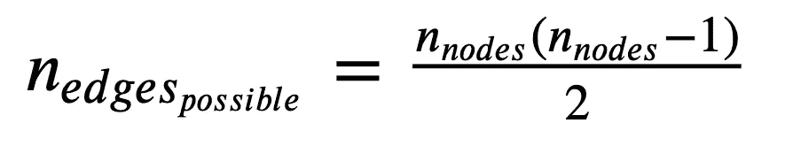
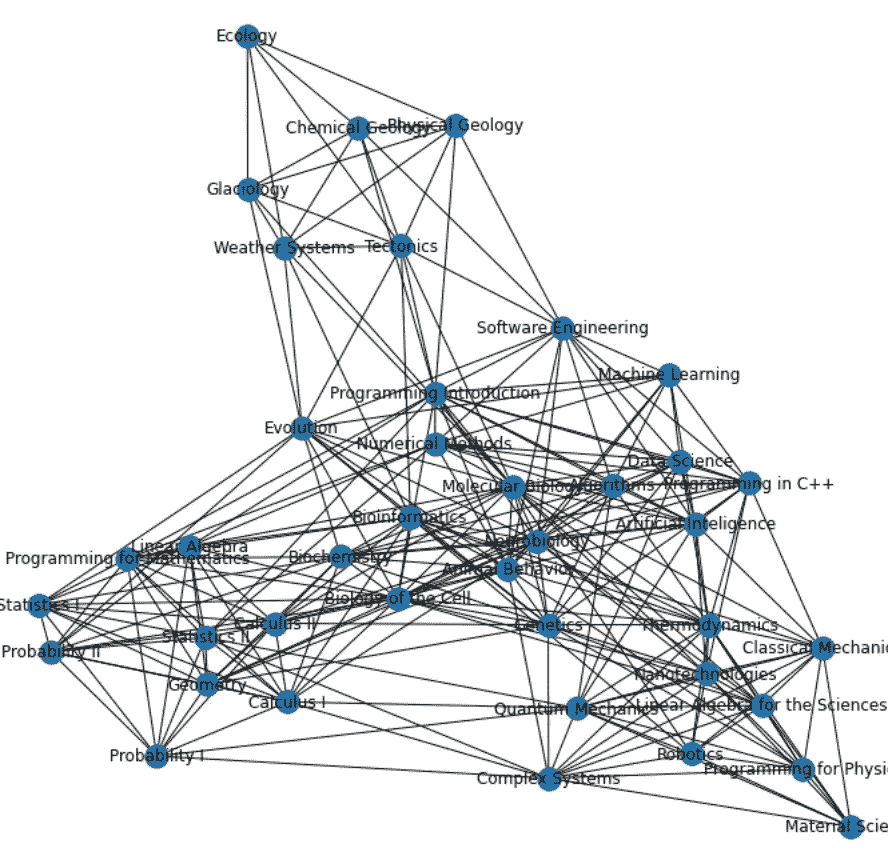
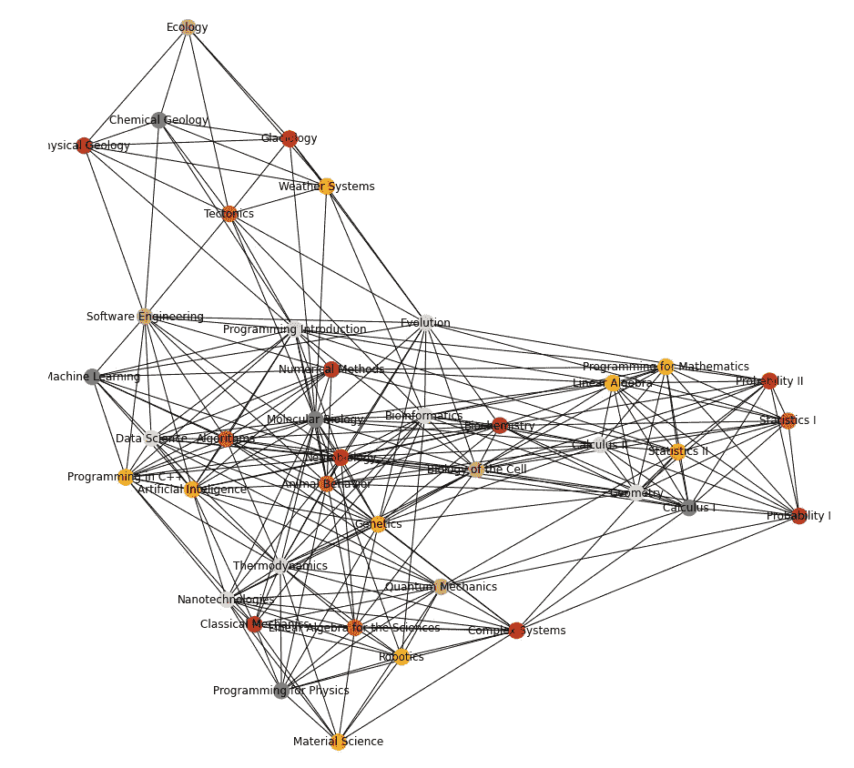
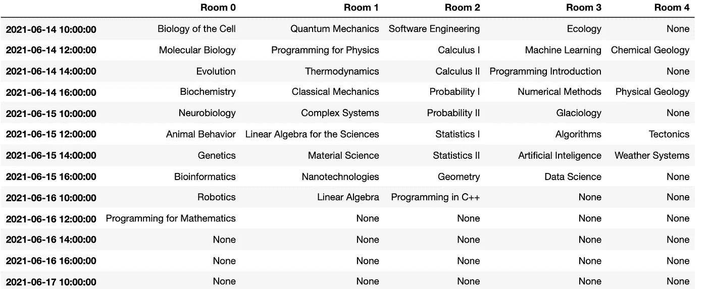

# 网络图着色

> 原文：<https://towardsdatascience.com/graph-coloring-with-networkx-88c45f09b8f4?source=collection_archive---------4----------------------->

## 图着色问题的解决方案在概念上很简单，但在应用上却很强大。本教程将向您展示如何使用 python 技能来解决这个问题。

让我们从一个可能的现实生活挑战开始，我想让你相信网络理论和在这个领域发展起来的数学工具可以为你解决这个问题。

想象你现在在一所学校的行政部门工作了几年。制定考试时间表是很痛苦的，但到目前为止，用纸和笔还是可以做到的。但是学校发展得非常快，整个时间安排变得令人不堪重负。注册的学生如此之多，你希望他们都能在放假前参加考试。如果学生在假期后不得不回来参加考试，那将是多么可怕。你打算怎么解决这个问题？

我认为，到本文结束时，你可以从野外获取数据，例如学生名单和他们参加的课程，并建立一个考试时间表，这样没有学生会遇到考试日期冲突的尴尬情况。着色问题不仅对考试时间表有用，而且在许多不同的情况下都有用。也许你想出了另一个主意，我会很高兴在评论区听到你的意见！


[罗汉](https://unsplash.com/@rohankrishnann?utm_source=medium&utm_medium=referral)在 [Unsplash](https://unsplash.com?utm_source=medium&utm_medium=referral) 上拍照

在我们开始这个简短的教程之前，我想和你分享一下这篇文章的学习目标，你可以边学习边核对。

# 目录

1.  python 中的网络与库网络 x
2.  图着色问题，是什么，怎么解决？
3.  解决实际问题

# Python 中的网络

我假设你熟悉网络理论或也称为图论。如果没有，让我们回顾一下网络中最基本的模块，同时了解 networkx 的功能。

```
import networkx as nx
```

如果您的计算机或虚拟环境中没有 networkx，请使用

```
pip install networkx
```

或者

```
conda install networkx
```

让我们用这个库创建一个网络，称之为 network。

```
network = nx.Graph()
```

网络由节点和连接节点的边组成。让我们在网络中添加三个节点和两条边。

对于多个节点，我们可以提供节点名称列表。在这种情况下，节点被称为 1、2 和 3..

```
network.add_nodes_from([1,2,3])
print(f"This network has now {network.number_of_nodes()} nodes.")
```

这个网络现在有 3 个节点..

要在两个节点之间添加边，请命名要相互连接的第一个和第二个节点。

```
network.add_edge(1,2)
network.add_edge(1,3)
```

我们也可以绘制这个网络来获得视觉上的理解。

```
nx.draw_networkx(network, with_labels=True)
```



简单图的非常简单的图

所以总结这一段，我们知道网络是由什么组成的，如何用 networkx 来构建和可视化。如果我想描述这个图，我会说，这个图 G 由三个节点组成，分别叫 1，2，3。其中节点 2 与节点 1 相邻，节点 3 与节点 1 相邻。节点 1 与节点 2 和 3 相邻。好了，现在够了。让我们继续着色问题。

# 图着色问题

图着色问题定义为:

```
Given a graph G and k colors, assign a color to each node so that adjacent nodes get different colors.
```

从这个意义上说，颜色是类别的另一个词。让我们看看前面的例子，添加两到三个节点，并给它们分配不同的颜色。

```
network.add_nodes_from([4,5,6,7])network.add_edge(1,4)
network.add_edge(1,5)
network.add_edge(2,4)
network.add_edge(3,5)
network.add_edge(5,6)
network.add_edge(7,3)
network.add_edge(7,6)
```

好的，让我们手动给这个图着色，来解决着色问题。

```
color_list = ["gold", "violet", "violet", "violet",
              "limegreen", "limegreen", "darkorange"]
nx.draw_networkx(network,node_color=color_list, with_labels=True)
```



解决着色问题的首次尝试

好吧，这不是我们想要的。节点 5 和 6 颜色相同但相邻，节点 4 和 2 也相邻但颜色相同。我们必须解决这个问题。

```
color_list = [“gold”, “red”, “violet”, “pink”, “limegreen”,
              “violet”, “darkorange”]
```



着色问题的有效解决方案

好的，这看起来是解决图表着色问题的一个可能的解决方案。但是你可能会问自己，我怎么知道我需要多少种颜色？我们现在来看一个制作考试时间表的玩具例子，这个例子变得更加清晰。

# 实际例子

在这个实际的例子中，我们试图为一个学期的考试安排找到一个最优的解决方案。

我创建了一个由 250 名学生组成的人工数据集，这些学生就读于我们的虚拟学校，该学校提供 5 个专业，也可以作为辅修专业。每个学生可以注册 5 门课，如果她或他注册了辅修专业和主修专业的组合(有 10%的学生注册了),那么她或他可以选择主修专业的 3 门课和辅修专业的 2 门课。否则，如果他们只学习一个专业，他们会从他们的主要科目中选择所有 5 个讲座。每个科目提供 6 至 9 门课程(班)。

我在 kaggle 上用下面的[链接](https://www.kaggle.com/yvesboutellier/synthetic-school-enrollment-data)上传了这个数据集。我们下载它并用熊猫来阅读 csv。csv 具有以下结构。行显示学生，列 1 显示专业，列 2 显示辅修专业，如果她或他有一个。第 3 栏到第 42 栏是不同的主题。

```
import pandas as pdstudent_data = pd.read_csv("synthetic_school_enrollment_data.csv")
```



摘自我们的数据

到目前为止，我还没有告诉你我们将如何防止学生有冲突的考试日期。但是现在我们已经为解决这个问题做好了一切准备。

我之前提到过，在着色问题中，我们希望防止相邻(邻近)节点具有相同的颜色。在我们的例子中，我们希望避免学生不得不同时参加两次考试。

这两个问题听起来差不多！

因此，我们可以提出这样的想法，我们希望将课程建模为节点，将考试日期建模为颜色，如果这些节点共享参与的学生，则它们是连接的。因此，当没有相邻的课程/节点具有相同的日期/颜色时，我们的考试安排被解决。好的，让我们创建一个网络，将我们的 40 门课程作为节点，如果参与的学生共享，就将它们连接起来。

创建一个我们 40 门课程的列表。

```
courses = list(student_data.columns)[2:]
```

使用 networkx 创建一个网络对象，并为 40 个课程中的每一个课程添加一个节点

```
class_network = nx.Graph()
class_network.add_nodes_from(courses)
```

让我们添加边来连接节点。如果 A 班和 b 班至少有一个学生，那么这两个班之间就有一条边。

每个学生参加 5 门课程。我想把它们打包到一个列表中，这样我就可以在这个列表中所有可能的组合之间创建边，因为这个学生不能同时参加这 5 个考试中的任何一个。因此，我在学生中循环，并为每个学生列出一个清单。

```
without_subj = student_data.drop([‘Major’, ‘Minor’], axis=1) # We don’t need major and minor for the moment
without_subj = without_subj.T # transposelist_of_overlaps = []
for student in name_list:
list_of_overlaps.append(list(without_subj.loc[without_subj[student]].index))
```

下一步使用一个库(itertools ),它有一个很酷的功能，叫做组合。第一个参数是您想要组合的列表，第二个参数表示一个组合由多少个元素组成。我提供了一个小例子，让您熟悉这个功能。

```
import itertoolsfor pair in itertools.combinations([1,2,3],2):
 print(pair)(1, 2)
(1, 3)
(2, 3)
```

因此，我们循环遍历为每个学生创建的重叠列表，然后将列表中的每门课程与其他课程相结合。这使我们能够获得线对并在它们之间形成边。

```
for sublist in list_of_overlaps:
   for pair in itertools.combinations(sublist, 2):
      class_network.add_edge(pair[0], pair[1])
```

这个过程产生了 259 个类之间的连接。

```
n_edges_total = len(list(class_network.edges))print(n_edges_total)
259
```

描述一个图可能有多少个连接或边的公式是。



公式背后的直觉非常简单，试着说服自己从一个 3 节点的网络开始，到 4 和 5。

```
n_nodes = len(list(class_network.nodes))
n_edges_possible = (n_nodes*(n_nodes-1))/2
```

该图中有 780 条可能的边，我们在学校示例中的特定图有 259 条，因此实现了 33%的可能边。

我们可以看看我们学校的网络，上面显示了课程和共享的学生。

```
fig = plt.figure(figsize=(12,12))
nx.draw_networkx(class_network, with_labels=True)
```



我们虚构的学校例子中的班级

好了，让我们为着色问题建立算法。首先，我想说这是一个 NP 完全问题，也就是说只能用强力算法才能找到解决方案。所以基本上，我们做的是:

1.  随机排列节点
2.  给颜色排序(如果颜色代表日期，从你的第一个日期开始)
3.  一次处理一个节点，将列表中的第一个合法颜色分配给我们的节点

因为这是一个 NP 完全问题，我们不能得到比这个贪婪算法更好的算法。

[贪婪算法**是一种简单、直观的**算法**，用于最优化问题。**算法**在每一步都做出最优选择，试图找到解决整个问题的整体最优方法。**](http://Greedy Algorithms | Brilliant Math & Science Wiki)

**并且不同的排序(步骤 1)可以为相同的图给出不同的结果。**

**为了证明这一点，我们将运行该算法几次以获得一个示例。**

**如果你感兴趣，这个[视频](https://youtu.be/h9wxtqoa1jY)给出了数学基础的解释。有一点我想说的很重要，就是算法在 max 使用 max n+1 个颜色，其中 n 是我们网络中最高度的数字。节点 v_i 的度表示一个特定的节点 v_i 连接了多少个节点。**

**我们可以通过调用 network.degree 来找出我们的网络有多少度，这可以转换成一个字典，我们取最大值。**

```
max(dict(class_network.degree).values())
```

**它在我们的网络 23 中。但请记住，这是上限，也许我们可以做得更好。24 (23+1)真的是一个好数字吗？我们必须看看我们提供了多少门课程，看看我们是否可以将考试日期缩短。**

```
len(courses)
```

**哦，我们有 40 节课！因此，至少可以节省 16 个日期，这是令人鼓舞的。也许更少的日期是可能的？为了节约起见，我将准备 24 种不同的颜色(来自 matplotlib)，这是我们需要的最大数量的颜色。**

```
colors = [
"lightcoral", "gray", "lightgray", "firebrick", "red", "chocolate", "darkorange", "moccasin", "gold", "yellow", "darkolivegreen", "chartreuse", "forestgreen", "lime", "mediumaquamarine", "turquoise", "teal", "cadetblue", "dogerblue", "blue", "slateblue", "blueviolet", "magenta", "lightsteelblue"]
```

**我们还需要 24 个可能的考试日期，我们可以将考试分配到这些日期，还需要一个将颜色转换为日期时间对象的字典。**

```
from datetime import datetime
dates = []
calendar = {}
for i in list(range(14,20)):
    for j in list(range(10,18,2)):
        date = datetime(2021, 6, i, j, 0)
        dates.append(date)
        calendar[date] = []
```

**我们的翻译词典:**

```
from_color_to_date = {col: dates[i] for i, col in enumerate(colors)}
```

**现在我们可以编写我们的贪婪算法了…**

```
def **greedy_coloring_algorithm**(network, colors):
    nodes = list(network.nodes()) 
    random.shuffle(nodes) # **step 1** random ordering
    for node in nodes:
        dict_neighbors = dict(network[node])# gives names of nodes that are neighbors
        nodes_neighbors = list(dict_neighbors.keys())

        forbidden_colors = []
        for neighbor in nodes_neighbors:
            example.nodes.data()[1]
            len(example.nodes.data()[1].keys())
            if len(network.nodes.data()[neighbor].keys()) == 0: 
                # if the neighbor has no color, proceed
                continue
            else:
                # if the neighbor has a color,
                # this color is forbidden
                example.nodes.data()[1]['color']
                forbidden_color = network.nodes.data()[neighbor]
                forbidden_color = forbidden_color['color'] forbidden_colors.append(forbidden_color) # assign the first color 
        # that is not forbidden
        for color in colors:
            # **step 2**: start everytime at the top of the colors,
            # so that the smallest number of colors is used
            if color in forbidden_colors:
                continue
            else:
                # **step 3**: color one node at the time
                network.nodes[node]['color'] = color
                break
```

**运行算法**

```
greedy_coloring_algorithm(class_network, colors)
```

**是时候看结果了。让我获取每个节点的颜色值，并将其传递给一个名为 colors_node 的列表。**

```
colors_nodes = [data[‘color’] for v, data in class_network.nodes(data=True)]nx.draw(class_network, node_color=colors_nodes, with_labels=True)
```

****

**我们的解决方案至少在视觉上，看起来不需要太多的颜色**

**这张图表看起来很有希望。有点乱。但是我们也可以查看颜色列表，看看我们最终需要多少种颜色或日期。**

```
len(set(colors_nodes))
```

**10!我们的 40 次考试只需要 10 次约会。谁会想到呢？对我来说，这是惊人的。如此强大的工具。**

**但是如前所述，这种算法不会可靠地生成 10 个类别，它肯定会生成 24 个或更少，但是会有多少，取决于我们给节点着色的顺序。**

**让我们对不同的排序做一个简短的比较，看看我们能得到什么，如果我们能得到比 10 更好的话。**

```
number = []
for i in list(range(0,50)):
    greedy_coloring_algorithm(class_network, colors)
    colors_nodes = [data['color'] for v, data in class_network.nodes(data=True)]
    num_col = len(set(colors_nodes))
    number.append(num_col)[10, 10, 10, 10, 10, 10, 10, 10, 10, 10, 10, 10, 10, 10, 10, 10, 10, 10, 10, 10, 10, 10, 10, 10, 10, 10, 10, 10, 10, 10, 10, 10, 10, 10, 10, 10, 10, 10, 10, 10, 10, 10, 10, 10, 10, 10, 10, 10, 10, 10]
```

**好的，看起来这个网络很容易解决着色问题。我们每次都得到同样的结果。**

**我们的最终目标是为我们学校的校长提供一份考试时间表。我们假设考试持续 1.5 小时，学生有 30 分钟的休息时间。**

```
for v, data in class_network.nodes(data=True):
    calendar[from_color_to_date[data['color']]].append(v)max_number_exams_sync = len(max(list(calendar.values()),key=len))rooms = ["Room "+str(i) for i in list(range(max_number_exams_sync))]pd.DataFrame.from_dict(calendar, orient='index', columns=rooms)
```

****

**我们的最终结果，显然是可以对持续暂停等提供更多的约束。**

**开始了。我们可以自豪地把考试时间表交给校长，他会惊讶地发现我们只用了 2.5 天就能完成所有的考试。**

## **结论**

**我声称你将能够使用一些数据和图形着色算法来自动完成困难的任务。您已经看到了如何使用 networkx 创建图形，以及如何在 python 中应用这样的图形着色算法。我用一个很好的应用程序向你展示了这个相当理论化的算法，如果你在一所希望防止考试日期冲突的学校工作，你会看到一个可能的解决方案。但如果没有，我希望你仍然可以将这些知识转移到你的领域。让我知道它是否帮助你在你面临的挑战中找到了解决方案。**