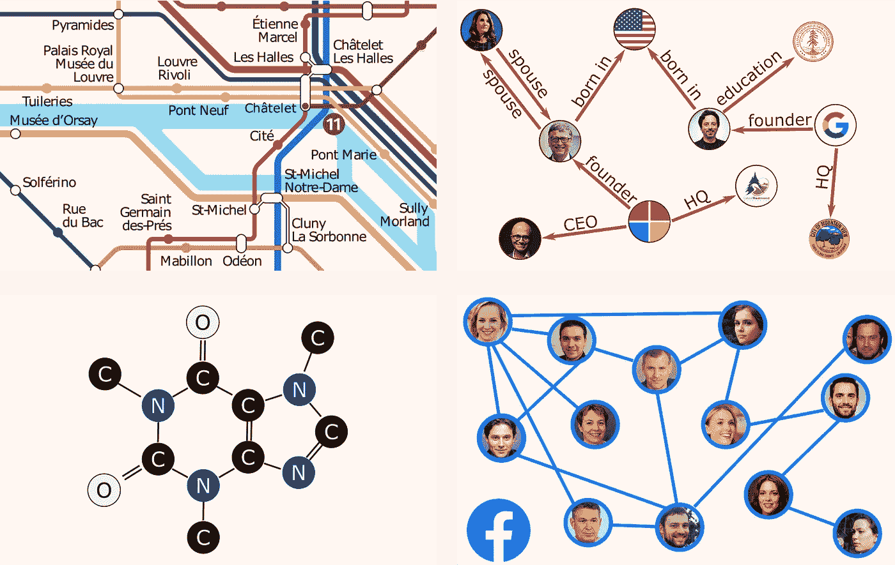
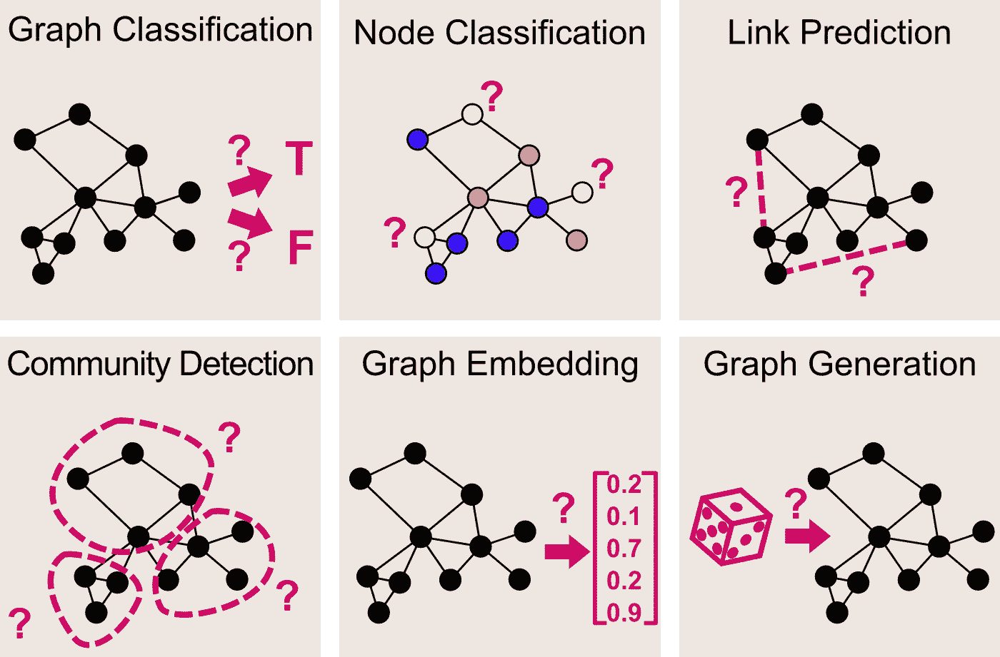
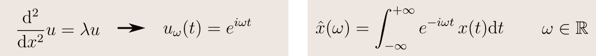
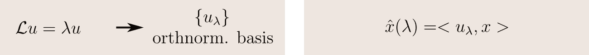
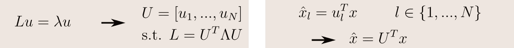
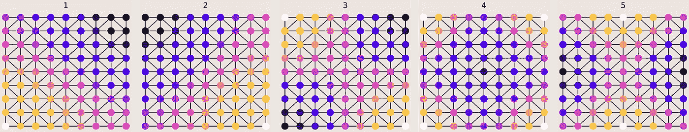
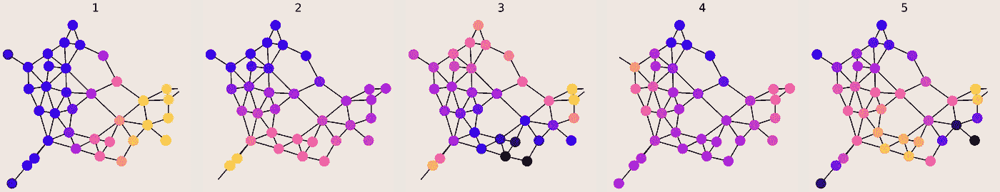
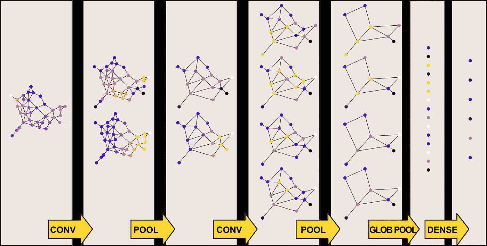
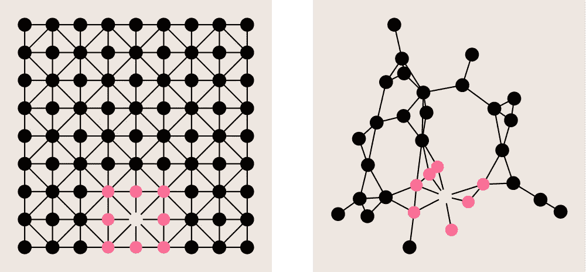

# 图形卷积网络——图形上的深度学习

> 原文：<https://towardsdatascience.com/graph-convolutional-networks-deep-99d7fee5706f?source=collection_archive---------0----------------------->

## [理解大数据](https://towardsdatascience.com/tagged/making-sense-of-big-data)

[阿丽娜·格鲁布尼亚](https://unsplash.com/@alinnnaaaa?utm_source=unsplash&utm_medium=referral&utm_content=creditCopyText)在 [Unsplash](https://unsplash.com/s/photos/networks?utm_source=unsplash&utm_medium=referral&utm_content=creditCopyText) 上的照片

# 为什么是图表？

图表是最通用的数据结构之一，这要归功于它们强大的表达能力。在各种领域中，机器学习模型已经被成功地用于提取和预测关于图表上的数据的信息，以对复杂元素及其关系进行建模。这里只是一些例子。

*   [道路网络交通模式预测](https://arxiv.org/abs/1802.07007)
*   [推断知识图中的缺失信息](https://arxiv.org/abs/1706.05674)
*   [为药物研发预测蛋白质相互作用](https://papers.nips.cc/paper/2017/file/f507783927f2ec2737ba40afbd17efb5-Paper.pdf)
*   [基于社交网络数据的推荐系统](https://arxiv.org/abs/1902.07243)

机器学习在图上的应用(图片由作者提供)

更一般地，当处理图形时，可以处理相当多不同的机器学习任务。

*   [图形分类](https://paperswithcode.com/task/graph-classification) —给定一个图形，预测它属于一组类中的哪一个
*   [节点分类](https://paperswithcode.com/task/node-classification) —给定一个节点标签不完整的图，预测剩余节点的类别
*   [链接预测](https://paperswithcode.com/task/link-prediction) —给定一个带有不完全邻接矩阵的图，预测每对节点是否相连
*   [社区检测(也称为图聚类)](https://paperswithcode.com/task/community-detection) —给定一个图，根据其边缘结构将其节点划分为聚类
*   [图形嵌入](https://paperswithcode.com/task/graph-embedding) —给定一个图形，将其映射到一个矢量中，同时保留相关信息
*   [图形生成](https://paperswithcode.com/task/graph-generation) —学习一组给定图形的分布，并从该分布中采样以生成新的相似图形

图上的机器学习任务(图片由作者提供)

不幸的是，图形数据是非结构化和非欧几里得的，因此建立机器学习模型来解决这些任务并不是立即显而易见的。一方面，节点之间的连接携带重要的信息，另一方面，找到一种处理这种信息的方法是很重要的。

在本帖中，我们将看到如何使用图形卷积网络(GCN)解决这个问题，它将经典卷积神经网络(CNN)推广到图形结构数据的情况。本帖主要来源于 [Kipf 等人 2016](https://arxiv.org/abs/1609.02907) 、 [Defferrard 等人 2016](https://arxiv.org/abs/1606.09375) 和 [Hammond 等人 2009](https://arxiv.org/abs/0912.3848) 的作品。

# 为什么是回旋？

卷积神经网络(CNN)已被证明在提取复杂特征方面具有令人难以置信的效率，卷积层如今代表了许多深度学习模型的主干。CNN 已经成功地处理了任何维度的数据:

*   在 1D，处理音频信号—例如[用于声音分类](https://ieeexplore.ieee.org/document/8605515)
*   在 2D，处理图像—例如[用于早期龋齿检测](https://journals.sagepub.com/doi/full/10.1177/0022034519871884)
*   在 3D 中，处理扫描——例如用于 MRI 大脑配准的

CNN 如此有效的原因是它们能够学习一系列过滤器来提取越来越复杂的模式。特别地，这些卷积滤波器的特征在于它们的紧密支持，以及平移不变的特性。

稍加创新，我们可以将这些相同的想法应用到图表数据上。与处理欧几里得数据(1D、2D 或 3D)相比，更难解决的问题是，不规则图形上的平移是一个无意义的概念，因此我们需要找到另一种方法来定义图形卷积。

# 定义图形卷积

在欧几里得域上，卷积通过取平移函数的乘积来定义。但是，正如我们所说的，平移在不规则图上是未定义的，所以我们需要从不同的角度来看这个概念。

关键思想是使用傅立叶变换。在频域中，由于[卷积定理](https://en.wikipedia.org/wiki/Convolution_theorem)，两个信号的(未定义)卷积成为其变换的(明确定义的)分量乘积。因此，如果知道如何计算定义在图上的函数的傅立叶变换，我们可以将卷积定义为

卷积定理(图片作者提供)

这就引出了下一个问题:我们如何定义一个图形的傅立叶变换？

我们将通过与经典的傅立叶变换进行类比来找到这个问题的解决方案。让我们以定义在实直线上的函数为例。其傅里叶变换是其频率项的分解，通过将函数投影到正弦波的正交基上获得。事实上，这些波正是拉普拉斯的本征函数:

1D 的傅立叶变换(图片由作者提供)

因此，如果我们推广这个想法，我们可以将函数的傅立叶变换定义为它在拉普拉斯算子的本征函数的正交基上的投影:

广义傅立叶变换(图片由作者提供)

在图论中，[拉普拉斯矩阵](https://en.wikipedia.org/wiki/Laplacian_matrix)定义为 **L = D-A** ，其中

*   **D** ，[度矩阵](https://en.wikipedia.org/wiki/Degree_matrix)，是包含每个顶点所依附的边数的对角矩阵；
*   **A** 、[邻接矩阵](https://en.wikipedia.org/wiki/Adjacency_matrix)为每对顶点指示它们是否由边连接。

如果我们假设图中的边是间接的(但定义可以推广)，那么拉普拉斯 **L** 是实对称正半定矩阵。因此存在使其对角化的标准正交矩阵 **U** ，并且由在每个 **N** 顶点处的值的 **N** 维向量表示的图形信号的图形傅立叶变换可以在此基础上被定义为其投影:

图形傅立叶变换(图片由作者提供)

既然一张图胜过千言万语，那我们就用具体的例子来看看这一切意味着什么。如果我们取对应于规则 2D 网格的[德劳内三角剖分](https://en.wikipedia.org/wiki/Delaunay_triangulation)的图，我们看到该图的傅立叶基精确地对应于自由方形膜的振动模式。这是有意义的，因为振动板的基本模式正是拉普拉斯的本征函数。

正方形的拉普拉斯特征函数(图片由作者提供)

如果我们取一个随机生成的图，我们仍然可以(在某种意义上！)通过查看它的正交傅立叶基，可以看到图形的振动模式。

随机图的拉普拉斯特征函数(图片由作者提供)

既然我们知道了如何定义图形傅立叶变换，因此也知道了如何定义图形卷积，我们就可以理解图形卷积网络的架构了！

# 构建完整的神经网络

用于图像识别的所有卷积网络的架构倾向于使用相同的结构。对于像 [VGG16](https://arxiv.org/abs/1409.1556) 这样的简单网络来说确实如此，但对于像 [ResNet](https://arxiv.org/abs/1512.03385) 这样的复杂网络来说也是如此。

1.  将 **HxWxC** 输入图像通过一系列局部卷积滤波器和池层来提取特征。
2.  使用例如[全局池层](https://paperswithcode.com/method/global-average-pooling)将得到的特征通道映射到固定大小的向量中。
3.  最后，使用几个完全连接的层来产生最终的分类输出。

图卷积网络的架构遵循完全相同的结构！

图形卷积网络(图片由作者提供)

在 GCN 的情况下，我们的输入由以下元素表示:

*   **NxC** 数组 **x** 包含图的每个 **N** 节点的 **C** 特征
*   **NxN** 邻接矩阵

为了充分理解上面显示的架构，我们仍然需要澄清最后两个概念:如何定义池层和如何保证卷积过滤器具有紧凑的支持。

关于池层，我们可以选择任何图聚类算法，将节点集合并在一起，同时保留局部几何结构。鉴于最优图聚类是一个 NP-hard 问题，在实践中使用快速贪婪近似。一个流行的选择是 [Graclus](https://pubmed.ncbi.nlm.nih.gov/17848776/) 多层聚类算法。

关于卷积滤波器的紧支持，我们如何保证我们的 GCN 的卷积层在本地操作？通常，输入 **x** 被 **g** 过滤为

在图表上过滤信号(图片由作者提供)

然而，在没有进一步假设的情况下，这样的滤波器不具有紧支撑，而且学习**ĝ(λ)**的所有分量具有 **O(N)** 的复杂度。为了解决这两个问题，我们将改为使用次数为 **K** 的ĝ**的多项式参数化:**

紧凑滤波器多项式参数化(图片由作者提供)

这就把学习复杂度降低到了 **O(K)** ，因为我们只需要学习 **θ_0，…，θ_{K-1}** 。除此之外，可以看出 **ĝ** 是 **K** 局部化的，即如果图上连接两个节点的最小边数大于 **K** ，则以节点 **i** 为中心的 **ĝ** 的节点 **j** 处的值为 **0** 。通常情况下，经常使用 **K=1** ，对应图像上的 **3x3** 卷积滤波器:

方形和不规则形状上的紧凑过滤(图片由作者提供)

关于计算优化的最后观察。计算滤波后的信号 **ĝ(L)x** 的成本仍然和**o(n^2**一样高，因为乘法涉及 **U** 。但是这个成本可以通过用[切比雪夫多项式](https://en.wikipedia.org/wiki/Chebyshev_polynomials)来表示多项式，从而减少到 **O(EK)** (其中 **E** 是边数)，这有一个非常方便的递归公式。

# 结论

*   从知识图到社交网络，图的应用无处不在。
*   卷积神经网络已经在许多领域取得了成功，并且可以推广到图卷积网络。
*   图上的卷积是通过图的傅立叶变换来定义的。
*   图形傅立叶变换又被定义为拉普拉斯算子的特征值的投影。这些是图表的“振动模式”。
*   对于传统的 CNN，GCN 由几个用于特征提取的卷积层和汇集层组成，后面是最终的全连接层。
*   为了确保卷积滤波器具有紧支撑，我们使用多项式参数化。切比雪夫多项式允许降低计算复杂度。