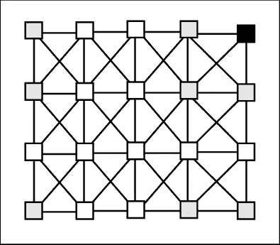
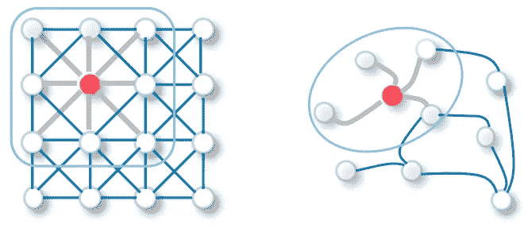
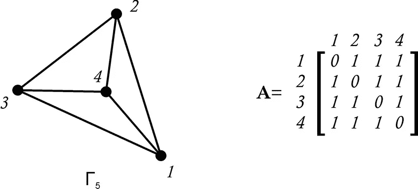

# 图形卷积网络—解释

> 原文：<https://towardsdatascience.com/graph-convolutional-networks-explained-d88566682b8f?source=collection_archive---------13----------------------->

## 对图论和机器学习的不复杂的看法

艾莉娜·格鲁布尼亚克在 [Unsplash](https://unsplash.com/s/photos/network?utm_source=unsplash&utm_medium=referral&utm_content=creditCopyText) 上的照片

在我上一篇关于图论的文章中，我简要介绍了我最近感兴趣的话题:图卷积网络。如果你在这里想“这些词是什么意思？”，你来对地方了。在本文中，我们将一步一步地分解这个主题。

**第一部分:这个图表是什么？**

如果这是你第一次听到“图形”这个词，我很抱歉，但你有一些功课要做。在我们深入这个话题之前，你应该看看我的[上一篇文章](https://medium.com/mlearning-ai/why-graph-theory-is-cooler-than-you-thought-4df73e2a4950)简要介绍了图论(以及我们为什么关注它)。我会在这里等！

好了，现在你回来了，让我们进一步解释一下。图论是一种数学理论，它简单地将图定义为:

*G = (v，e)* 其中 *G* 是我们的图， *(v，e)* 表示一组顶点或**节点(计算机科学家倾向于称之为**)，以及**边**，或这些**节点之间的连接。**图论的存在是因为我们需要一种通过计算和数学的方式来*表示* ***事物*** *之间的关系。这些东西可以是任何东西:社交媒体平台上的用户、社区中的物理邻居、地图上的地址或位置(坐标)、图像中的像素或我们大脑中的神经元。特别是与机器学习相关的图论的基础是，当我们可以表示它的关系时，我们的许多数据可以得到最好的理解。因此，我们希望有一种方法来嵌入这些关系，这样我们就可以处理所有的数据。*

但是，让我们不要走得太远——我们还有一些术语要定义。

**第二部分:卷积？这听起来…令人费解。**

让我们把它带回到与我们想了解的其他*事物*有关系的*事物*上。很简单，对吧？让我们考虑，例如，我们在一个图像中有像素。这些像素总是与图像中的其他像素相关。该图像具有固定的结构，并且像素以固定的方式保持在其他像素附近。让我们来看看:

角落像素邻域表示法，由 Marco Balsi 通过[来源](https://www.researchgate.net/profile/Marco-Balsi/publication/266178373/figure/fig4/AS:669372586663951@1536602269858/Neighborhood-of-a-corner-pixel-in-a-CNN-defined-on-a-2-torus.png)提供。

如果你能看出来，这符合我们对图形的定义。不言而喻，一幅图像*被一种不同类型的神经网络[卷积神经网络](/a-comprehensive-guide-to-convolutional-neural-networks-the-eli5-way-3bd2b1164a53?gi=36cb8c030e2f)视为一幅图。在本文中，我将浏览卷积神经网络的基本概念来解释图卷积网络。然而，如果你不知道 CNN 的，我强烈建议你在阅读完这篇文章后看看链接的源代码，以便对所有这些主题有一个全面的了解。*

从它们的名字中，你可以直觉地看出图形卷积网络和卷积神经网络有一些共同之处。你这样想是正确的——GCN 和 CNN 背后的直觉非常相似。

但是我们的 CNN 用上面这张图片做什么呢？如果从技术上来说这是一个图表，为什么我们需要这个其他的东西？嗯，很高兴你问了！

图像是像素连接到其他像素的隐含图形，但它们总是具有固定的结构。当我们的卷积神经网络在相邻单元之间共享权重时，它是基于一些假设来这样做的:例如，我们可以将 3 x 3 的像素区域评估为“邻域”。我们的卷积神经网络工作的假设依赖于二维常规数据(如果你精通领域术语，也称为*欧几里德*数据)。

然而，我们的社交媒体网络、分子结构表示或地图上的地址并不是二维的。它们也没有必要的大小或结构。当我们试图将非欧几里德或任意结构的数据塞进 CNN 时，我们会遇到困难，因为这是它们达到极限并不再有用的地方。

**第三部分:网络**

像素表示与任意结构图，由[来源](https://arxiv.org/pdf/1901.00596.pdf)提供。

我们已经确定，我们有这些任意构造的东西网络，不适合我们传统的卷积神经网络。事实上，它们并不真正适用于许多不同种类的神经网络。因此，有[图形神经网络](https://medium.com/analytics-vidhya/getting-the-intuition-of-graph-neural-networks-a30a2c34280d)，其中图形卷积网络是一个基本的变体。

在本文中，我不会涉及图形卷积网络背后的数学(尽管这很有趣)——我只想讨论直觉。*(别急—我在* [*下一篇*](/what-makes-graph-convolutional-networks-work-53badade0ce9?source=your_stories_page-------------------------------------) *系列文章中覆盖了数学。)*

实际上，嵌入表示为结点和边的要素的主要困难在于空间使用的随意性，以及缺少相邻要素之间的欧氏距离。有了这些方面，我们必须基于不同的假设。在这里，我将主要讨论图卷积网络，因为它们已经由 [Kipf & Welling](http://arxiv.org/abs/1609.02907) 讨论过，尽管有各种方法。

我们已经了解了神经网络中的*卷积*是一种在邻居之间共享权重的方法。首先，为了确定邻居，我们需要提供一些数据。

在正常的神经网络前向传播函数通过评估我们的当前层的*权重、特征表示和偏差*来确定*下一个*隐藏层的特征表示的情况下，我们的图形卷积网络将把*邻接矩阵*添加到等式中。还有我们的非线性激活函数，因为我试图不要太数学化，我现在在我们的考虑中忽略它。

我们还记得邻接矩阵是什么样子吗？这里有一个复习:

简单图形及其邻接矩阵，由 Safet Penji 通过[来源](https://www.researchgate.net/figure/Simple-graph-G-5-and-its-adjacency-matrix_fig3_273062204)提供。

什么是 A 是我们的图中的连接的矩阵表示，𝝘₅.每个行或列标签代表具有相同数字标签的节点，交叉行/列中的 *1* 代表这些节点之间的边。

对于那些已经熟悉机器学习的人来说，这看起来有点像*稀疏矩阵，*对吗？看，这毕竟不是什么新鲜事。

实际上，将我们的图表示为邻接矩阵使我们能够以张量的形式提供给网络，这是我们的模型可以处理的。

在我们将这个矩阵交给传播方程之前，我们需要确保我们的值是标准化的。这背后的直觉类似于我们通过神经网络输入的任何数据的标准化:数量级差异极大的值可能会导致我们的网络学习到不应该学习的值的更高权重，只是因为这些值最初比其他值高得多。出于我们的目的，我们将只提到规范化。我将在下一篇文章中更深入地探讨 Kipf & Welling 的方法论和直觉。

一旦我们将数据标准化，我们将在相邻节点之间执行某种聚合—例如，取平均值。这里半监督学习的直觉是相似的节点很可能共享相同的标签。我们可以把这个过程想象成一条消息的传递，GCN 的每一层都收集一个邻居节点的数据，并把它传递到下一个节点。

因此，如果我们有一个三层 GCN，我们可以卷积每个节点的“三阶”邻域。用人类的术语来说，这意味着我们可以将消息传递到三个“跳”之外的每个节点的邻居，并有效地嵌入我们的图的社区结构。然而，如果我们有一个有更多“跳”的图，我们将需要更多的层来有效地嵌入我们的图结构。

如果你和我第一次钻研这个话题时一样，你可能已经准备好休息了。在我让你摆脱困境之前，让我们来看看我们学到了什么:

1.  我们已经概括了图论的要点，并理解了作为机器学习工程师和数据科学家，我们为什么关心这个问题。
2.  我们已经研究了卷积神经网络，简要评估了术语“卷积”,并讨论了它们的局限性。
3.  我们已经简单地了解了图形卷积网络背后的直觉，我们基本上理解了它们为什么工作！

好吧，现在休息一下，别忘了鼓励自己！你在短时间内学到了很多东西。我期待着下一次，在那里我们将深入研究使所有这些工作的数学，并学习如何开始编码我们自己的 GCN。