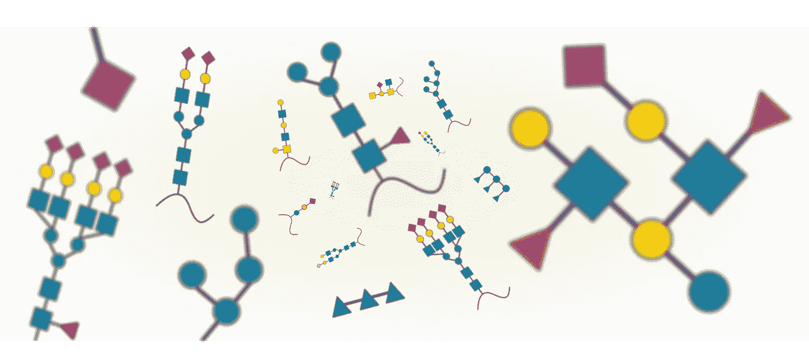
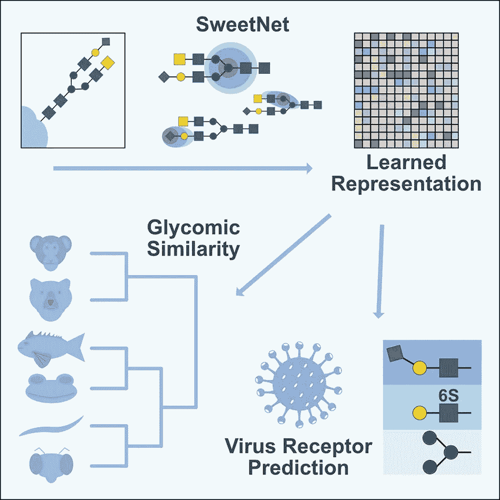
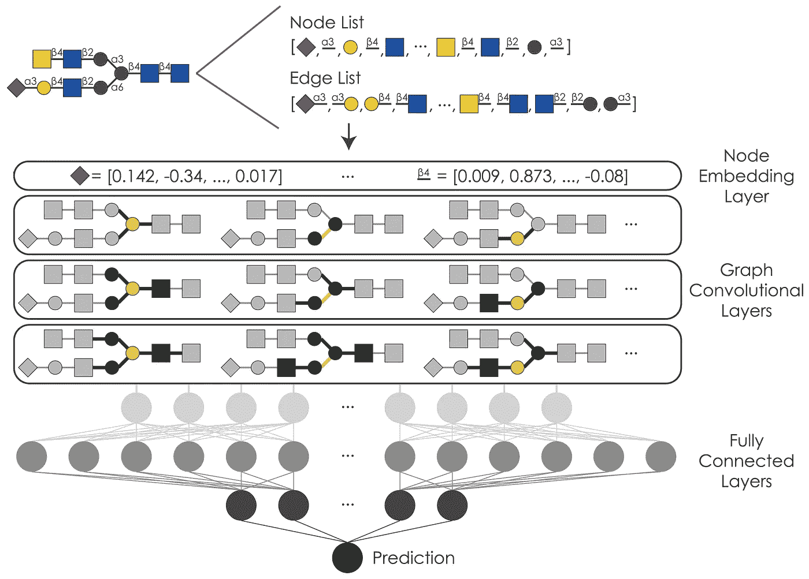
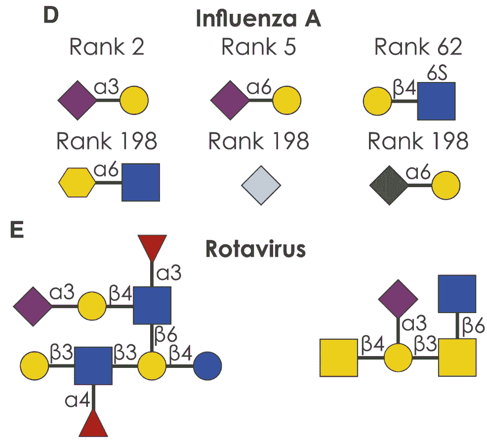

# 用于分析复杂碳水化合物的图形卷积神经网络

> 原文：<https://towardsdatascience.com/graph-convolutional-neural-networks-to-analyze-complex-carbohydrates-91f6bae297de?source=collection_archive---------14----------------------->

## 使用 PyTorch 几何处理生物数据

复杂碳水化合物多样性一瞥。来源:丹尼尔·博亚尔

在过去的几年里，图形卷积神经网络(gcn)吸引了越来越多的关注，越来越多的学科开始使用它们。这也已经扩展到生命科学，因为 gcn 已经被用于分析[蛋白质](https://www.nature.com/articles/s41467-021-23303-9)、[药物](https://www.biorxiv.org/content/10.1101/2020.04.07.030908v2)，当然还有[生物网络](https://academic.oup.com/bib/article/22/2/1515/5964185)。支持这种扩展的 GCNs 的一个关键优势是，与自然语言等更线性的数据结构相比，它们能够处理非线性数据格式。由于这一特性，我们还为自己感兴趣的主题实施了 GCNs，即复杂碳水化合物或[聚糖](https://www.ncbi.nlm.nih.gov/books/NBK310274/)的研究。

[聚糖](https://en.wikipedia.org/wiki/Glycan)在生物学中无处不在，修饰着每一个细胞，在病毒感染或肿瘤免疫逃避等过程中发挥着[关键作用](https://academic.oup.com/glycob/article/27/1/3/2527575)。它们也是极其多样的生物序列，由数百个独特的构件组成，相比之下，蛋白质只有 20 个，DNA/RNA 只有 4 个，它们也可以在不断增长的聚糖链中以几种不同的构型组合。最后，聚糖是唯一的非线性生物序列，自然形成广泛的分支，其本身可以进一步分支。因此，它们是图的子类，即树的一部分。这使得多糖成为 GCNs 在生物学中适当应用的主要候选物。

之前，我们开发了分析聚糖序列的技术，将它们视为一种生物语言。我们使用了一个[递归神经网络](https://www.cell.com/cell-host-microbe/fulltext/S1931-3128(20)30562-X)设置来研究聚糖序列的非线性，以预测它们的免疫原性、致病性和分类来源。这在一定程度上工作得很好，超过了基线，例如使用基于基序频率的随机森林。然而，我们相信，更强大的算法，能够适应多聚糖的树状结构，将改善现有的应用，并使多聚糖研究的新方法成为可能。这就是为什么我们求助于 GCNs 来建立一个分析多聚糖的[新技术](https://www.cell.com/cell-reports/fulltext/S2211-1247(21)00616-1)。

图形卷积神经网络在多聚糖分析中的应用综述。来源:[https://www . cell . com/cell-reports/full text/s 2211-1247(21)00616-1](https://www.cell.com/cell-reports/fulltext/S2211-1247(21)00616-1)

gcn 通过经由图中节点的邻居来表征节点，或者更准确地说，通过邻居节点的特征来学习图(或树)中的关系。在我们的例子中，我们将单糖(如葡萄糖或半乳糖等聚糖构件)及其连接链视为节点。虽然将单糖视为节点，将连接视为边可能更自然，但我们决定不这样做，以适应仅由一个单糖和一个连接组成的短而重要的聚糖。为了让我们的 GCN 学习节点邻域的特征，我们首先实现了节点嵌入，以便每个单糖和连接类型通过嵌入特征来表示，这些嵌入特征可以由我们的模型学习并用于表征节点邻域。为了最好地表达多聚糖的丰富多样性，我们采用了 128 维包埋法。

接下来，我们必须选择用于执行图形卷积的图形内核。这个过程是上述的通过它的邻居和它们的特征(在我们的例子中，节点类型的嵌入特征)学习节点的过程。在测试了各种图形内核之后，我们最终得到了 [k 维图形神经网络操作符](https://arxiv.org/abs/1810.02244)，它们受到 Weisfeiler-Leman 算法的启发，用于测试图形同构，并且在我们的数据集上表现出了最佳性能。GCNs 的伟大之处在于，在一个模型中可以有多个图形卷积层。这允许您在不同的粒度级别分析图表/聚糖。虽然第一层可能只考虑直接连接的节点进行分析，但后续层可以扩展这个所谓的感受域，并考虑节点与图中进一步移除的节点的关系。在我们的案例中，我们选择了一个具有其中三层的模型作为最佳模型。

SweetNet 模型架构。来源:[https://www . cell . com/cell-reports/full text/s 2211-1247(21)00616-1](https://www.cell.com/cell-reports/fulltext/S2211-1247(21)00616-1)

这种连续图形卷积层的方法允许模型学习图形邻域，甚至可以预测监督设置中的下游分类任务的特征主题。为了总结从这些步骤中学到的特性，我们使用了汇集层，它从图形卷积层中为后续层浓缩了重要信息。在每个图形卷积层之后，我们首先使用一个 [topk 池层](https://arxiv.org/abs/1905.05178)，它根据学习到的投影分数将图形投影到一个更小的图形。然后，我们连接来自全局平均池和全局平均池操作的结果。

该最终图形表示跨越三个图形卷积层，然后通过完全连接的神经网络进行路由，以达到相应任务的最终预测。除了标准(泄漏)ReLU、漏失和批量归一化设置之外，我们还将所谓的 [boom 层](https://arxiv.org/abs/1911.11423)纳入该器件。通常，卷积后的表示的维数在最后部分朝着低维模型输出缓慢减少。然而，boom 层暂时增加了维度(与瓶颈相反),以允许模型摆脱局部最小值并提高性能。我们将这款最终产品命名为 SweetNet，以此向更为人们所熟知和喜爱的碳水化合物致敬。现在，我们可以看看使用多聚糖 GCN 可以做些什么有趣的事情了！

在构建 SweetNet 时，我们确保在所有报告的任务上，我们的预测性能优于之前报告的架构，如上述递归神经网络。这些任务之一是预测聚糖序列是否会被人类免疫系统识别。这是相关的，因为聚糖可能具有很强的免疫原性，例如在过敏原或血型不匹配的情况下，但也具有免疫抑制性，例如在肿瘤免疫逃避的情况下。在我们的数据集上，SweetNet 实现了约 95%的测试集准确率，完全基于聚糖序列。然后，我们提取了这些序列的图形表示，这些序列是通过 SweetNet 模型学习的，该模型在预测聚糖免疫原性方面进行了训练，紧跟在图形卷积层之后。当对此进行可视化时，很明显该模型已经学会了区分两类免疫原性/非免疫原性聚糖。此外，在非免疫原性聚糖中，可以看到一种精细的结构，这种结构让人想起不同类别的人类聚糖(当然，在一个类别中，它们具有序列相似性)。糖脂和 O-聚糖与免疫原性聚糖部分重叠，因为这些聚糖存在于我们的粘膜表面，并被具有免疫原性的微生物[模仿](https://www.cell.com/cell-host-microbe/fulltext/S1931-3128(20)30562-X)。

通过 SweetNet 模型学习的聚糖嵌入预测聚糖免疫原性。来源:[https://www . cell . com/cell-reports/full text/s 2211-1247(21)00616-1](https://www.cell.com/cell-reports/fulltext/S2211-1247(21)00616-1)

除了其他应用，我们还将这种多聚糖 GCN 与用于分析蛋白质序列的递归神经网络相结合，以预测病毒和多聚糖之间的相互作用。从流感病毒到新型冠状病毒病毒，大多数病毒都需要宿主细胞上的特定聚糖才能感染它们。事实上，病毒和宿主聚糖的匹配可以决定病毒的宿主范围。在流感病毒的情况下，一种特定的蛋白质血凝素负责在细胞进入和感染之前与细胞的聚糖结合。不同的流感病毒株具有不同的血凝素序列，这可以影响它们的聚糖结合特异性。这方面的一个例子是禽流感病毒和哺乳动物流感病毒之间的差异。虽然这两种类型的流感病毒主要识别一种称为 Neu5Ac 的特定单糖，即一种唾液酸，但禽流感病毒通常只与α2–3 构型的 Neu5Ac 结合，而哺乳动物流感病毒更喜欢α2–6 构型的 Neu5Ac。一个微妙的结构转变，然而这是防止禽流感病毒“跳过”感染人类的唯一屏障。使鸟类血凝素发生突变，以α2–6 构型与 Neu5Ac 结合，你就能突然用这种突变的禽流感病毒感染人类。

血凝素序列和聚糖结合特异性之间的这种明确关系使我们假设，我们可以使用一种模型来了解这些联系，并预测流感病毒和其他病毒的基于病毒聚糖的受体。因此，我们建立了一种配对模型，给定血凝素序列和聚糖，在回归设置中预测这是否会导致结合。我们很幸运，因为我们有一个实验观察到的来自各种流感病毒株的血凝素和一组聚糖的相互作用的大数据集，我们可以用它来训练和评估我们的模型。

来自 SweetNet 模型的病毒受体预测，该模型被训练用于预测病毒-聚糖相互作用。来源:[https://www . cell . com/cell-reports/full text/s 2211-1247(21)00616-1](https://www.cell.com/cell-reports/fulltext/S2211-1247(21)00616-1)

经过训练后，我们确实可以证明，一个经过训练的模型重现了禽流感病毒与α2–3 连接的 Neu5Ac 和哺乳动物流感病毒与α2–6 连接的 Neu5Ac 的基序。此外，该模型还预测了可能与流感病毒结合相关的其他基序，如硫酸化聚糖基序，这些基序在过去被[认为](https://academic.oup.com/bioinformatics/article/30/5/706/245129)可能是流感受体。我们随后表明，这项研究也可以扩展到其他病毒，如轮状病毒，这是婴儿感染的常见原因。在这里，我们可以表明，一个经过训练的模型预测高度复杂的母乳聚糖与轮状病毒蛋白结合，这些蛋白已经被[独立地证明](https://pubmed.ncbi.nlm.nih.gov/25048705/)能够结合和中和轮状病毒，证明了母乳的保护作用。通过紧密结合病毒并阻止其结合细胞，聚糖的这种中和作用被我们的身体在各种情况下使用，并且也可以提供一个机会，使用我们的模型来设计具有改善的结合特性的新聚糖，在未来，可以作为一种新型的抗病毒药物。

这就是在多聚糖分析中了解 GCNs 现状的全部内容！反正大部分都是。前往[报社](https://www.cell.com/cell-reports/fulltext/S2211-1247(21)00616-1)了解更多细节。或者前往[新闻](https://www.gu.se/en/news/new-ai-model-helps-understand-virus-spread-from-animals-to-humans-0) [新闻稿](https://brancoweissfellowship.org/news-2021/ai-model-helps-understand-viruses-likely-to-jump-from-animals-to-humans.html)获取更容易理解的关于我们研究的含义的信息。当然，这里是 SweetNet 的[代码](https://github.com/BojarLab/SweetNet)，所有使用的数据可在 GitHub repo 或本文的补充表格中找到。如果您对这一领域感兴趣，请不要犹豫，关注此空间，了解机器学习和数据科学应用于糖生物学的未来令人兴奋的发展！