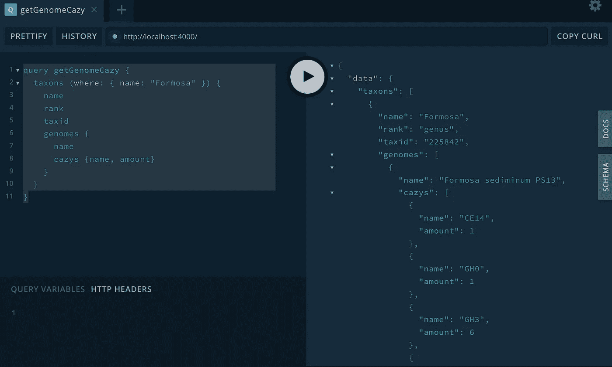

# 碳水化合物活性酶的图形数据库、GraphQL 和机器学习

> 原文：<https://towardsdatascience.com/graph-database-graphql-and-machine-learning-for-carbohydrate-active-enzymes-dba8500b45cf?source=collection_archive---------30----------------------->

## 使用 Neo4j 加速您的碳水化合物基因组分析

> 本文展示了如何:
> 
> 1.将 CAZy 数据库转换为 Neo4j
> 
> 2.分析福尔摩沙沉香 KMM 3901 的命名以获得新的见解
> 
> 3.为语言无关的数据访问构建一个 GraphQL API
> 
> 4.为纤维素降解预测执行图形嵌入和节点分类

世界上最丰富的聚合物是什么？答案可能会让很多人吃惊:[纤维素](https://en.wikipedia.org/wiki/Cellulose)。它是一种在植物细胞壁中发现的多糖。我们把它做成纸、t 恤和玻璃纸。而第二名也被一种多糖占据:[甲壳素](https://www.nature.com/articles/s41598-018-19940-8)。它存在于真菌的细胞壁、鱼的鳞片、蟹、虾和龙虾的外壳中。事实上，所有细胞生物都离不开多糖。


图一。植物含有纤维素，真菌含有几丁质，这是地球上最丰富的两种生物聚合物。在 [Unsplash](https://unsplash.com/s/photos/cellulose?utm_source=unsplash&utm_medium=referral&utm_content=creditCopyText) 上[sanga Rima Roman Selia](https://unsplash.com/@sxy_selia?utm_source=unsplash&utm_medium=referral&utm_content=creditCopyText)拍照。

多糖是碳水化合物的一种形式。顾名思义，多糖是由多个单糖组成的，也就是简单的糖。单糖通过糖苷键连接在一起。有几种类型的单糖(葡萄糖、木糖等)和几种类型的糖苷键(α-1，4 和β-1，3 等)。单糖和糖苷键的各种组合创造了多糖的多样性。例如，糖原、淀粉和昆布多糖也是多糖。但它们是储存化合物，在细胞中充当能量储存库。在一个叫做水解的过程中，细胞可以很容易地将这些分子分解成单糖，然后氧化单糖以获得燃料。相比之下，纤维素和甲壳质都是结构成分。它们很难分解，因此它们可以支持和保护它们的宿主细胞。人类消耗糖原和淀粉，但既不能消化纤维素，也不能消化几丁质。

这就是真菌和细菌出现的地方。每当你看到腐烂的木头，木头腐烂的真菌就在工作。食草动物可以分解纤维素，因为它们的胃肠道中有一群分解纤维素的微生物。几丁质主要被真菌和细菌降解。因此，由于他们的工作，我们的星球还没有被这两种多糖覆盖。


图二。CAZy 数据库的主页。cazy.org 的截图。

这些真菌和细菌能够完成如此伟大的壮举，是因为它们产生某种酶来破坏纤维素或甲壳质中的糖苷键。合成或降解多糖的酶被称为碳水化合物活性酶(CAZymes)。对 CAZymes 的研究不仅仅是关于制造和营养。也给我们带来了生态学的新知识。最终，它也是下一代生物燃料的关键。为了更好地了解多糖的生物循环，由 Henrissat 教授领导的一组研究人员建立了一个名为 [CAZy](http://www.cazy.org/Welcome-to-the-Carbohydrate-Active.html) 的数据库，这是碳水化合物活性酶的缩写。他们收集了超过一百万个 CAZyme 序列，并根据它们与碳水化合物底物的相互作用将它们分为六类:

1.  糖苷水解酶是水解或重排糖苷键的酶。
2.  糖基转移酶(GTs)是形成糖苷键的酶。
3.  多糖裂解酶(PLs)是进行糖苷键非水解裂解的酶。
4.  碳水化合物酯酶(CEs)水解碳水化合物酯。
5.  辅助活性(AAs)是与 CAZymes 一起作用的氧化还原酶。
6.  碳水化合物结合模块(CBMs)是 CAZymes 的非催化域。CBMs 将 CAZyme 和碳水化合物结合在一起，从而发生催化反应。

在每个类别中，研究人员根据序列相似性将序列分成不同的家族甚至亚家族。在撰写本文时，有 171 个 GH 系列和 114 个 GT 系列。


图 3。详细 GH13。cazy.org 的截图。

因为 CAZy 是基于序列相似性，并且相似的序列不一定具有相同的功能活性，所以 CAZyme 家族通常包含作用于不同碳水化合物或不同糖苷键的不同成员。有时，一个家族中的底物是相似的。例如，支链淀粉酶(欧共体 3.2.1.41)和α-淀粉酶(欧共体 3.2.1.1)的序列见于 GH13(图 3。)，两者都是带有α糖苷键的多糖。

CAZy 团队还注释了来自古细菌、细菌、真核生物和病毒的 10，000 多个基因组，并将结果放在了网站上。一个有机体中的所有酶构成了它的酶名。CAZynome 决定生物体可以代谢哪些碳水化合物，即合成或降解。

CAZy 数据库对于基因组分析来说是一个非常有价值的资源。然而，CAZy 网站更像是一个文本网站，而不是一个数据门户。显示描述性信息，但不提供下载或 API。它不提供序列注释服务(他们只接受离线学术合作)。而且它的访问有时是不稳定的。

为了让 CAZy 更容易理解，我之前写过一篇关于用 AWS 批处理进行 [CAZy 注释的文章。在这篇文章中，我在云端实现了 CAZy 最受欢迎的特性请求之一。我的下一个目标是为我自己的数据分析建立一个 CAZy 网站镜像。我之前已经展示了如何使用](https://aws.plainenglish.io/parallel-blast-against-cazy-with-aws-batch-8239a45d8116) [Neo4j 来托管基因组注释](https://medium.com/geekculture/analyzing-genomes-in-a-graph-database-27a45faa0ae8)，因为图形数据库是存储具有复杂关系的数据的绝佳选择。构建用于数据访问的 GraphQL APIs 也非常容易。最后，Neo4j 可以进行图嵌入和节点分类，用于机器学习。这种能力对于生物信息学中的代谢预测非常有用。

[我之前的文章](https://medium.com/geekculture/analyzing-genomes-in-a-graph-database-27a45faa0ae8)解释了如何开始一个 Neo4j 项目。在本文中，我在 [Neo4j 桌面](https://neo4j.com/download/)中创建了一个名为`cazy`的项目，并启用了 APOC 和图形数据科学库插件。后来我通过 Apollo 和`neo4j-graphql.js`为数据库设置了 GraphQL。最后，我用 Neo4j Graph 数据科学库预测了哪些基因组能够降解纤维素。

这个项目的代码存放在我的 Github 仓库中:

[](https://github.com/dgg32/neo4j_cazy) [## dgg32/neo4j_cazy

### 这个存储库包含我的文章“Neo4j for CAZy”的代码和数据。convert.ipynb 用于数据处理和…

github.com](https://github.com/dgg32/neo4j_cazy) 

# 1.下载并处理数据

为了这个项目，我收集了所有细菌和古细菌基因组的分类学和 CAZy 注释，以及来自 CAZy 的家族描述。从 KEGG 数据库中检索所有四位数 EC 号的描述，即没有通配符的 EC。此外，我从原始菌株描述文件和细菌元数据数据库 [BacDive](https://bacdive.dsmz.de/) 中注释了 186 个基因组的纤维素降解能力。纤维素降解者的纤维素值为 1，而非降解者的纤维素值为 0。2 代表未知。Neo4j 中的数据结构如下:


图 4。项目的数据模型。图片由作者提供。

所有用于下载和后处理的脚本都可以在我的存储库中找到，还有原始数据和格式化数据。将“data_for_neo4j”中的所有 CSV 文件放入`cazy`的“import”文件夹中。然后，在 Neo4j 浏览器中使用以下命令导入和索引数据:

导入后，我们可以计算一些关于数据库的基本统计数据。例如，下面的查询计算所有基因组中 GH 家族的平均数量。结果是 16 个 GH 家庭。

接下来，我重新审视了 [*福尔摩沙琼菲拉* KMM 3901](https://pubmed.ncbi.nlm.nih.gov/23995932/) 基因组中的生长激素家族，我的同事 Alexander Mann 在 2013 年对其进行了分析，但其 CAZy 注释已被更新。


图 5。KMM 的 GH 家庭 3901。图片由作者提供。

这种细菌是从绿藻*acrosiconia sonderi*中分离出来的，可以降解多种藻类多糖。上图显示，KMM 3901 拥有 37 个 GH 家族，是平均 16 个家族的两倍多。与 Mann *等人*所做的注释相比。GH130、GH149、GH158、GH168 和 GH171 是 GH 类别中的新成员。

# 2.Neo4j 中的 CAZynome 分析

在这一部分，我可以做一些类似于[在图数据库](https://medium.com/geekculture/analyzing-genomes-in-a-graph-database-27a45faa0ae8)中分析基因组的分析。我再次以[*台湾沉香* KMM 3901](https://pubmed.ncbi.nlm.nih.gov/23995932/) 的基因组为例。截至本文撰写之时，福尔摩沙属有五个注释的基因组。


图 6。CAZy 资料库中的五个福尔摩沙基因组。图片由作者提供。

我可以通过发出以下命令快速展示 KMM 3901 的独特 CAZy 系列:

结果显示，KMM 3901 有八个独特的天然气水合物和两个独特的天然气水合物，但在天然气水合物、天然气水合物或煤层气类别中没有新的发现。PL28 和 PL37 都含有 ulvan 裂解酶。这是一种降解 ulvan 的酶，ulvan 是一种复杂的硫酸多糖，存在于绿藻 *Ulva* ( *绿藻门*)的细胞壁中。在天然气水合物类别中，清单包含 GH86。该家族包含β-琼胶酶和β-卟啉酶。两者都攻击红藻中的硫酸化碳水化合物。此外，GH168 含有内切-α-(1，3)-L-岩藻聚糖酶( [EC3.2.1.211](https://www.qmul.ac.uk/sbcs/iubmb/enzyme/EC3/2/1/211.html) )，该酶破坏岩藻聚糖中的(1→3)-α-L-岩藻糖苷链，岩藻聚糖是一种硫酸多糖，主要存在于不同种类的海藻中。最后，独特的 GH28、GH78 和 GH105 参与果胶降解。[果胶或类似果胶的碳水化合物存在于绿藻中](https://www.frontiersin.org/articles/10.3389/fpls.2012.00082/full)。总之，这些新结果揭示了 KMM 3901 独特的琼胶分解生命策略及其远离其姐妹的生态位。他们还为 Mann 等人的研究增加了一些重要的细节..

接下来，我将 KMM 3901 的 GH 家族组合与数据库中所有的细菌和古细菌基因组进行了比较。在最相似的基因组中，四姐妹甚至不在前一百名。

来自门*拟杆菌门*的成员已经完成了十大名单。在分类学上，*粘质类*、*几丁质类*和KMM 3901 在类群水平上有所不同。令人惊讶的是，与 KMM 3901 不同，所有这十种细菌都是从陆地上分离出来的。不幸的是，关于它们的碳水化合物降解能力的信息是不充分的，只有一些关于它们的分类邻居的信息是可用的。例如，*muclinic abacter*包含成员，如 *M* 。*帕卢迪斯*和*米*。*能降解果胶、木聚糖和海带多糖的纤细藻*。不幸的是，他们的基因组都没有在 CAZy 中被注释。

# 3.为 CAZy 提供 GraphQL

虽然 Cypher 是一种容易学习的查询语言，但它不是我们从 Neo4j 获取数据的唯一方式。GraphQL 是另一种选择。一方面，它的执行是语言不可知的，因此没有掌握 Cypher 的开发人员也可以访问数据。另一方面，现代微服务架构经常需要每个组件通过 HTTP APIs 进行通信。而 GraphQL 是在 HTTP 中公开 Neo4j 的数据的好方法。与 REST 相比，用户可以微调他们的请求，以避免过多的数据交付。要了解更多，请阅读我以前的文章“[在 AWS](https://medium.com/star-gazers/build-your-own-graphql-genbank-in-aws-a9e9eaeb712a) 中构建自己的 GraphQL GenBank”。

在 Neo4j 中为 GraphQL 设置一个 Apollo 服务器非常容易。Neo4j 团队开发了一个名为`neo4j-graphql.js`的 Javascript 库。这个库自动生成查询和解析器代码。事实上，用户唯一需要做的事情就是定义 typeDefs 模式。然后，客户端可以查询数据，甚至不需要一行密码。`index.js`中的以下 58 行代码可以为整个项目启动一个 GraphQL 服务器(请先在第 48 行填写数据库的密码):

第 5-44 行定义了访问分类单元、基因组、cazy 和 ec 数据的模式。DataPoint 类型帮助我们检索每个 CAZy 家族的数量。

在终端中运行该脚本:

```
nodemon index.js
```

要测试 API，请将您的浏览器指向`[http://localhost:4000](http://localhost:4000.)`。在左侧面板中输入以下查询，然后按圆形按钮:



图 7。台湾岛及其五个子代基因组的分类信息检索。图片由作者提供。

仅用一个查询，GraphQL 就返回了*福尔摩沙*的分类细节及其所有五个物种的名称。数据是 JSON 格式的。Python 客户端非常简单:

为 Neo4j 修改 GraphQL 中的数据也很容易。有关更多详细信息，请参考页面右侧的“DOCS”和“SCHEMA”选项卡(图 7。).

# 4.用节点分类预测纤维素降解

CAZy 注释中的一个目标是预测一个生物体可以代谢什么样的碳水化合物。虽然确切的百分比一直在争论中，但是很明显大多数微生物还没有在实验室中培养出来。幸运的是，我们仍然可以通过宏基因组学或单细胞基因组学获得它们的基因组，而无需培养它们。如果我们能预测它们的碳水化合物底物，我们就能推测它们在自然栖息地的生态作用和它们的工业潜力。这些预测也许能帮助我们找到合适的培养基来培养它们。

使用机器学习来完成这项任务是合乎逻辑的。但是我们需要两个好的数据源:特征(x)和目标(y)。由于 CAZy 完全是关于碳水化合物代谢的，并且数据库中已经注释了超过 10，000 个基因组，所以它们是很好的特征。然而，突出的问题是缺乏目标生化数据。一方面，CAZy 中的许多注释物种尚未进行生物化学研究。另一方面，许多已经被生化研究过的细菌还没有被测序。两者的重叠部分非常小。

对于这个项目，我手动注释了 186 个基因组的纤维素降解能力作为模型训练数据。我的来源是主要的菌株描述和 BacDive。其中，43 个为阳性，另外 143 个为纤维素降解阴性。所有其他的基因组都作为保留样本。

在以某种方式管理了目标数据之后，我继续关注特性数据。类似于自然语言处理(NLP)，在机器学习之前，我必须用固定长度的向量来表示所有的基因组。但是我们的基因组是图中的节点，每个节点都有不同的连接组合。好在 Neo4j 中的图形数据科学库为我们提供了[图形嵌入](https://neo4j.com/developer/graph-data-science/graph-embeddings/)。类似于 NLP 中的单词嵌入，图嵌入基于其图拓扑为每个节点生成一个固定长度的向量。然后，我们可以只使用这些向量作为机器学习的特征。

`gds.graph.create`部分创建内存中的图形投影，以保存机器学习所需的所有数据。`gds.fastRP.mutate`部分计算图形嵌入，并将结果写回内存图形。

接下来，我调用了`nodeClassification.train`方法开始训练。在幕后，Neo4j 使用多类节点逻辑回归。我还设置了五重交叉验证，并将“F1 加权”配置为指标。


图 8。培训和测试分数。图片由作者提供。

67%的培训分数和 65%的测试分数都很低(图 8。).我尝试了其他参数，它们并没有改善结果。

尽管如此，我仍然应用该模型来预测维持数据中的纤维素降解:

该模型预测了 11 个对纤维素降解呈阳性的基因组:

其中，首先， [*碳小单孢菌*是已知的纤维素酶产生菌，它降解*疫霉菌*](https://cdnsciencepub.com/doi/abs/10.1139/b96-078?journalCode=cjb1) 的纤维素细胞壁。然而，[傅*等人*。](https://www.nature.com/articles/s41598-020-60677-0)报道其姊妹 HM134，榜单第二名，纤维素降解阴性。他们的结果有点令人惊讶，因为 HM134 分享了 M*M*的 61 个 CAZy 家族中的 58 个。*碳类*和三个例外(GH154、GT75 和 CBM22)与纤维素代谢无明显联系。第三，*链霉菌*菌株。已知 SirexAA-E 能够分解木质纤维素生物质[。第四，*黄单胞菌*柑橘 pv。citri UI7 是](https://pubmed.ncbi.nlm.nih.gov/24607362/)[一种分解纤维素的植物病原体，引起 A 型柑橘溃疡病](https://journals.plos.org/plosone/article?id=10.1371/journal.pone.0151017)。第五，根据 BacDive*链霉菌* ATCC 13879 能否降解纤维素[未确定](https://bacdive.dsmz.de/strain/15047)。最后，名单中的其余六人鲜为人知。

# 结论

本文再次展示了 Neo4j 是一个用于生物信息学研究的强大分析平台。CAZy 中连接丰富的数据在图形数据库中比在关系数据库(如 MySQL)中建模更好。密码语言简单易学，给使用者带来了一种新的思维方式。CAZy 注释现在在一个图中，其中基因组通过它们共享的 CAZymes 连接，CAZy 家族通过共享的 EC 号连接。这可以从数据中带来新的发现，因为对我们人类来说，在上下文中分析复杂的事情更自然。总的来说，这些见解已经存在于数据中，Neo4j 只是让它更加明显。

GraphQL 可以交付来自不同数据源的数据，只要它们符合其规范。它允许没有密码知识的开发人员有效地提取数据。而且肯定能把 Neo4j 转化成更大应用的微服务。但是，它不能取代 Cypher。GraphQL 无法为我们提供连接驱动的查询体验，更不用说聚合和机器学习功能了。

生物信息学中的圣杯之一是根据基因组数据预测新陈代谢。纤维素降解预测的实践突出了这些挑战。小的训练数据集当然导致了低的训练和测试分数。但我们也需要问自己，基于序列相似度的 CAZy 是否真的适合用机器学习进行代谢预测。到目前为止，还没有在这方面取得成功的研究发表。也许基于函数相似性的 EC 数是比 CAZy 更好的特征？

基因组测序变得越来越便宜和容易。宏基因组学和单细胞基因组学也越来越好。因此，基因组数据不再是瓶颈。相比之下，代谢数据很难生成。事实上，基因组和代谢数据之间的差距在未来只会越来越大。生化测试是劳动密集型的，容易出错。细菌菌株描述论文经常忽略提及碳水化合物代谢。此外，结果的数字化是耗时的。最后，已经有许多基因组序列的专用数据库，但是在 2012 年 BacDive 数据库发布之前，没有发现代谢数据。自那以后，更多的代谢数据已经可用，但它们仍然不足以用于任何大规模的机器学习项目。

为了缩小数据差距，BacDive 团队一方面努力从原始研究论文中收集更多的生化元数据。另一方面，他们正计划在他们的[散居](https://diaspora-project.de/)项目中测试许多已测序的细菌菌株。此外，菌株描述应该标准化，并要求对其出版物进行强制性生化检验。

最后，虽然文章使用了 Neo4j Desktop，但是将其无服务器地迁移到云中实际上是相当容易的。欲了解更多信息，请阅读由[威廉·里昂](https://medium.com/@lyonwj?source=post_page-----eee2bf1afad--------------------------------)撰写的优秀文章“[在云中使用 Neo4j GraphQL 中的空间数据](https://blog.grandstack.io/working-with-spatial-data-in-neo4j-graphql-in-the-cloud-eee2bf1afad)”。一旦迁移到云中，Neo4j CAZy 就可以对公众或定义的一组用户开放，并具有高可用性。无服务器选项也降低了成本。

最后，我衷心感谢 CAZy 团队的辛勤工作。你可以在他们的出版物中读到更多关于这个数据库的信息:https://pubmed.ncbi.nlm.nih.gov/24270786/。

[](https://dgg32.medium.com/membership) [## 加入媒介与我的介绍链接-黄思兴

### 作为一个媒体会员，你的会员费的一部分会给你阅读的作家，你可以完全接触到每一个故事…

dgg32.medium.com](https://dgg32.medium.com/membership)