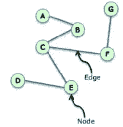
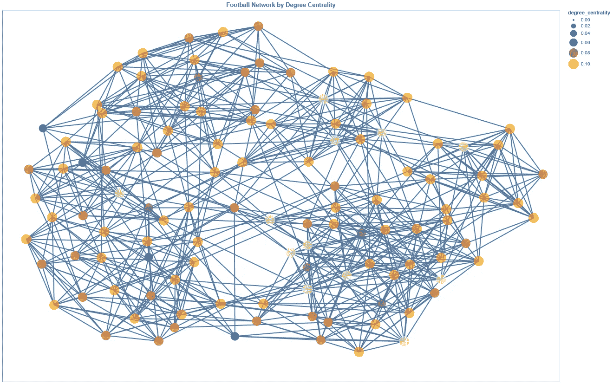
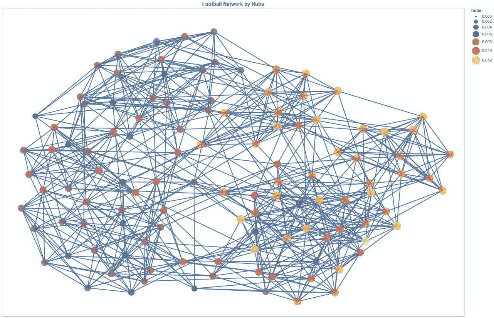

# 用 Python 进行图机器学习第 1 部分:基础、度量和算法

> 原文：<https://towardsdatascience.com/graph-machine-learning-with-python-pt-1-basics-metrics-and-algorithms-cc40972de113?source=collection_archive---------0----------------------->

## 通过足球数据集上的关键度量和算法介绍网络


[足球网](https://networkx.org/documentation/stable/auto_examples/graph/plot_football.html)。作者图片

基于图的方法是当今数据科学世界中最迷人和最强大的技术之一。即便如此，我相信我们正处于广泛采用这些方法的早期阶段。在这个系列中，我将从度量和算法的概述开始，提供图形机器学习的广泛演练。我还将通过 Python 提供实现代码，以尽可能保持应用性。在开始之前，让我们讨论一下基于图的方法的价值。

# 目录

1.  为什么是图表？
2.  网络基础
3.  网络连接
4.  网络距离
5.  网络聚类
6.  网络度分布
7.  网络中心性
8.  摘要

# 为什么是图表？

> 图是描述和分析具有关系/交互的实体的通用语言

从计算机网络到社交网络到疾病路径，图表在我们身边随处可见。网络通常被认为是自然出现的图形，但界限很模糊，它们确实可以互换使用。

Jure Leskovec 博士在他的图形机器学习课程中概述了几个例子，例如:

图表(作为代表):

*   信息/知识被组织和链接
*   软件可以用图形来表示
*   相似性网络:连接相似的数据点
*   关系结构:分子、场景图、3D 形状、基于粒子的物理模拟

网络(也称为自然图):

*   社交网络:社会是 70 多亿个人的集合
*   通信和交易:电子设备、电话、金融交易
*   生物医学:基因/蛋白质之间的相互作用调节生命
*   大脑连接:我们的思想隐藏在数十亿神经元之间的连接中

将数据表示为图形允许我们将复杂的结构信息作为特征嵌入。这在某些领域产生了更高的性能，因为关系结构可以提供大量有价值的信息。除了更强的特征表示，基于图的方法(专门用于深度学习)利用表示学习来自动学习特征，并将它们表示为嵌入。因此，可以在稀疏空间中编码大量高维信息，而不会显著牺牲速度/性能。利用图表的另一个值得注意的好处是可以使用它们完成各种任务。Leskovec 博士提供了对经典应用的见解:

*   节点分类:预测节点的属性。示例:对在线用户/项目进行分类
*   链接预测:预测两个节点之间是否存在缺失的链接。示例:知识图完成、推荐系统
*   图表分类:对不同的图表进行分类。示例:分子性质预测
*   聚类:检测节点是否形成一个社区。示例:社交圈检测
*   图形生成:药物发现
*   图形演化:物理模拟


[Jure Leskovec，斯坦福 CS224W:用图进行机器学习](http://web.stanford.edu/class/cs224w/)

我在这里说得很简短，但是如果你想更深入地了解图形机器学习的应用，我强烈建议你看一看 Leskovec 博士第一堂课的幻灯片。

虽然我们能够嵌入高维数据来实现各种任务的更高性能模型，但网络可能会非常复杂。这是因为:

1.  任意大小和复杂拓扑结构
2.  没有固定的节点排序或参考点
3.  通常是动态的并且具有多模态特征

我们经常需要统计分析、模型和算法来帮助我们理解和推理网络。由于网络固有的关系结构，网络模型有助于模拟信息通过网络的分散和级联。这产生了对*如何*知识、信息等的巨大洞察力。传播而不仅仅是传播什么。

# 网络基础

网络(或图)是一组项目之间的联系的表示。这种表示法通常写成 *G=(V，E)* ，其中 *V={V1，…，Vn}* 是一组节点(也叫**顶点**)和 *E={{Vk，Vw}，..，{Vi，Vj}}* 是边的两个集合(两个元素的集合)的集合(也称为**链接**，表示属于 *V* 的两个节点之间的连接。在网络可视化中，距离和位置没有任何意义。



作者图片

网络也可以采用一系列不同的结构和属性。

*   无方向:没有方向，适用于关系对称的情况
*   定向:有方向，对不对称的关系有用
*   循环:路径在同一个节点开始和结束，无休止的循环可能会在不小心的情况下阻止终止
*   非循环:路径在不同的节点开始和结束，这是许多算法的基础
*   加权:并非所有的关系都是平等的，有些关系更有分量
*   未加权:所有关系都是平等的(根据网络),通过平等/不存在的加权来显示
*   稀疏:子集中的每个节点可能都没有到其他每个节点的路径
*   密集:子集中的每个节点都有到其他每个节点的路径
*   单部分、二部分和多部分:节点是只连接到一种其他节点类型(例如，喜欢电影的用户)还是连接到许多其他节点类型(例如，喜欢电影的用户)

Neo4J 提供了一个很好的可视化摘要:


[Mark Needham 和 Amy E. Hodler 的图形算法](https://learning.oreilly.com/library/view/graph-algorithms/9781492047674/)

网络也有一些高级方法和技术所依赖的基本属性。

*   一个图的**阶**就是它的顶点数 *|V|* 。一个图的**大小**是它的边数 *|E|* 。
*   顶点的**度**是与其相邻的边的数量。图 *G* 中顶点 *v* 的**邻居**是与 *v* 相邻的所有顶点所诱导的顶点 *Vi* 的子集。
*   图 *G* 中顶点 *v* 的**邻域图**(也称自我图)是 *G* 的子图，由与 *v* 相邻的顶点和连接与 *v* 相邻的顶点的所有边组成。

有许多带有预加载网络结构的数据集可供使用。这要归功于研究和应用社区分享他们的工作和数据集的热情。为了开始我们自己的网络，我们可以加载这些 NetworkX 的数据集之一，作为一个体育迷，我会选择[足球数据集](https://networkx.org/documentation/stable/auto_examples/graph/plot_football.html) (M .格文和 M. E. J .纽曼，社会和生物网络中的社区结构，Proc。自然。阿卡德。Sci。美国 99，7821–7826(2002 年))。该数据集由格文和纽曼开放许可，并显示在 [NetworkX 数据集](https://networkx.org/documentation/stable/auto_examples/graph/plot_football.html)上。


作者图片

```
Graph Summary:
Number of nodes : 115
Number of edges : 613
Maximum degree : 12
Minimum degree : 7
Average degree : 10.660869565217391
Median degree : 11.0...
```

# 网络连接

连通图是指每对节点之间都有一条路径的图。在一个图中，可以有多个连接的组件；这些是节点的子集，使得:1 .子集中的每个节点都有到所有其他节点的路径，2。没有其他节点有到子集中任何节点的路径。

强连通分量被认为是节点的子集。子集中的每个节点都有到所有其他节点的路径，2。没有任何其他节点有往返于该子集中每个节点的路径。


标有强连通分量的图。[维基百科](https://en.wikipedia.org/wiki/Strongly_connected_component)

弱连通分量是节点的子集，使得用无向边替换其所有有向边产生连通(无向)图，或者所有分量通过某个路径连接，忽略方向。

```
Graph Summary:
Number of nodes : 115
Number of edges : 613
Maximum degree : 12
Minimum degree : 7
Average degree : 10.660869565217391
Median degree : 11.0

Graph Connectivity
Connected Components : 1...
```

# 网络距离

两个节点之间的距离是它们之间最短路径的长度。路径长度由从 x 到 y 节点从头到尾包含的步数来确定。

寻找这个距离，特别是对于大比例的图形，计算起来非常昂贵。这里有两种算法是图论的核心:

*   广度优先搜索(BFS):根据连通性“发现”层中的节点。它从根节点开始，并在进一步遍历图之前找到最直接的连接层中的所有节点。


发现节点的顺序。[维基百科](https://en.wikipedia.org/wiki/Breadth-first_search)

*   深度优先搜索(DFS):“访问”节点的方法是，在沿着图中不同的路径前进之前，从根节点一直遍历到它的第一个叶节点。


访问节点的顺序。[维基百科](https://en.wikipedia.org/wiki/Depth-first_search)

当我们想要将它聚合到图形级别时，有两种常见的方法可以做到:

1.  平均距离:每对节点之间的平均距离。当网络未连接时，这通常限于最大的组件。
2.  直径:任意一对节点之间的最大距离。

它们中的每一个都应该与您建模为图形的数据的领域知识成对使用。

```
Graph Summary:
Number of nodes : 115
Number of edges : 613
Maximum degree : 12
Minimum degree : 7
Average degree : 10.660869565217391
Median degree : 11.0

Graph Connectivity
Connected Components : 1

Graph Distance
Average Distance : 2.5081617086193746
Diameter : 4...
```

# 网络聚类

聚类是对网络开始分解和理解其复杂性的重要评估。图中的三元闭包是指共享边的节点连接起来的趋势。当人 A 是人 B 的朋友，人 B 是人 C 的朋友时，这通常在社交网络图中进行，因此对人 A 的建议可能是与人 C 交朋友。这是有证据表明在大多数现实世界网络中，主要是社交网络中，节点倾向于创建由相对高密度的关系表示的紧密结合的组。

衡量图中聚集趋势的一种方法是聚集系数。有两种常用的方法来测量聚类系数:局部和全局。

局部聚类系数:彼此是朋友的节点的朋友对的分数。

公式:A 的朋友对的数量/A 的朋友对的数量

全局聚类系数有两种方法:

1.  图中所有节点的平均本地聚类系数。
2.  传递性:网络中三角形“开放三元组”的百分比。这将赋予度数较高的节点较大的权重。

```
Graph Summary:
Number of nodes : 115
Number of edges : 613
Maximum degree : 12
Minimum degree : 7
Average degree : 10.660869565217391
Median degree : 11.0

Graph Connectivity
Connected Components : 1

Graph Distance
Average Distance : 2.5081617086193746
Diameter : 4

Graph Clustering
Transitivity : 0.4072398190045249
Average Clustering Coefficient : 0.40321601104209814
```

# 网络度分布

无向图中一个节点的度是它拥有的邻居的数量。图的度分布是整个网络度的概率分布。

在无向图中，它被简单地称为度，但是对于有向图，我们得到了入度和出度分布。入度分布表示图中每个节点的入链分布。有人认为，在现实世界的网络(特别是社交网络)中，当我们在双对数标度上绘制学位/学位分布时，它代表幂律分布。人们一直在争论，当使用统计上严格的技术时，这些[无标度网络](https://en.wikipedia.org/wiki/Scale-free_network)实际上是非常罕见的，其他人认为对其进行测量过于严格。在任何情况下，评估程度分布对于理解你的网络都是重要的，但是它并不能洞察网络如何随时间演变。


作者图片

# 网络中心性

虽然我们正在处理一个*非常*小并且可以理解的网络，但是这些可以很容易地扩展到难以理解的复杂性。当网络变得如此庞大时，使用中心性度量来指导我们理解数据是势在必行的。

中心性是一种考虑图中节点/边重要性的方法。根据您的领域/数据，您应该使用不同的假设，这自然会引导您评估不同的中心性度量。你可以用一些方法来量化网络中的“重要性”:连接度的数量，到其他节点的平均接近度，通过节点的最短路径的比例，等等。

集中性测量的一些应用可用于:

*   在社交网络中寻找有影响力的节点
*   识别向许多节点传播信息或防止流行病的节点
*   交通网络中的枢纽
*   网络上的重要页面
*   防止网络崩溃的节点
*   还有更多！

你可以使用大量中心性；我将在这里讨论几个关键指标，但是我强烈建议阅读 NetworkX 的图形文献文档，以找到适合您的领域的关键指标。


作者图片

对于网络可视化，我将使用 [nx-altair](https://github.com/Zsailer/nx_altair) ，因为它提供了简单的交互和编辑功能。在下面的图片中看不到交互，但是如果你在笔记本上运行这段代码，你可以很容易地添加过滤器和悬停。

## 程度中心性

假设:重要节点有很多连接。

这是中心性的最基本的衡量标准:邻居的数量。它对无向网络使用度，对有向网络使用入度或出度。度中心性值通常通过除以简单图 n-1 中的最大可能度来归一化，其中 n 是 g 中的节点数。


作者图片



作者图片

## 接近中心性


假设:重要节点靠近其他节点。

这是所有 n-1 个可达节点中到一个节点的平均最短路径距离的倒数。如果节点是断开的，那么您可以仅基于可以到达它的节点来考虑它的接近中心性，或者您可以仅考虑可以到达它的节点，并通过它可以到达的节点的分数来归一化该值。


作者图片


作者图片

## 中间中心性


假设:重要节点靠近其他节点。

节点 v 的介数中心性是通过 v 的所有对最短路径的分数的总和。该公式主要查看通过节点 v 的节点 s 和 t 之间的最短路径的数量，并将其除以 s 和 t 之间的所有最短路径的数量(并对不以 v 开头或结尾的所有路径求和)。在有很多节点的图中，介数中心值会更大。为了对此进行控制，我们将中心性值除以图中节点对的数量(不包括 v)。当网络中有多条最短路径时，这种度量就变得复杂了。

因为这种计算可能非常昂贵，所以通常为节点对的样本计算这种度量。这个度量也可以用来寻找重要的边。


作者图片


作者图片

## 特征向量中心性


假设:重要节点与中心节点相连。

特征向量中心性基于其邻居的中心性来计算节点的中心性。它测量网络中一个节点的影响力。基于到高得分节点的连接比到低得分节点的同等连接对所讨论节点的得分贡献更大的概念，相对得分被分配给网络中的所有节点。高特征向量分数意味着一个节点连接到许多本身具有高分数的节点。


作者图片


作者图片

## PageRank

假设:重要节点是那些有许多来自其他重要节点的内链接的节点。

算法:

1.  从一个随机节点开始。
2.  给所有节点分配 1/n 的 PageRank。
3.  随机选择一条输出边，并沿着它到达下一个节点。
4.  执行基本的 PageRank 更新规则:每个节点将其当前 PageRank 的相等份额给予它所链接的所有节点。
5.  每个节点的新 PageRank 是它从其他节点接收的所有 PageRank 的总和。
6.  重复 k 次。

这就是臭名昭著的谷歌的 PageRank 算法。它从超链接网络结构来衡量网页的重要性。它根据每个节点有多少来自其他节点的链接，给每个节点分配一个重要性分数。在大型网络中，比例 PageRank 是首选，因为它带有一个“阻尼参数”alpha。这是在算法中随机选择一条输出边跟随另一个节点的概率，当网络中存在输出节点的闭环时，这尤其有益。


作者图片


作者图片

## 枢纽和权威机构(点击量)

假设:具有来自好的中心的输入边的重要节点是好的管理机构，具有到好的管理机构的输出边的节点是好的中心。

算法:

1.  给每个节点分配一个权限和中心分数 1。
2.  应用权限更新规则:每个节点的权限分数是指向它的每个节点的中心分数的总和。
3.  应用中心更新规则:每个节点的中心分数是它所指向的每个节点的权限分数的总和。
4.  通过每个节点的总得分来标准化每个节点的权威和中心得分。
5.  重复 k 次。

HITS 算法从一个根或一组高度相关的节点(潜在的权威)开始。那么链接到根节点的所有节点都是潜在的集线器。基础被定义为根节点和链接到根节点的任何节点。连接基本集合中节点的所有边都被考虑，并且这集中在与特定查询相关的网络的特定子集上。


作者图片



作者图片


作者图片


作者图片

# 摘要

图形机器学习的基础是实体之间的连接。随着图变得非常大，使用度量和算法来理解和获得图的特征是必要的。根据您的环境，不同的度量和算法将被证明是有用的，更重要的是，对您的用例有意义。

此外，我们可以在监督或无监督的学习任务中使用这些度量作为特征，但我们必须小心使用，因为它们可以添加与信号一样多的噪声。

除了更多的度量和算法，深度图 ML 涵盖了广泛的监督和非监督学习任务。从幼稚到先进的技术，我们可以使用图形结构和推理来超越结构化数据。在未来的章节中，我将介绍这些机器学习任务(节点、边和图形级别)的真实数据。

**参考文献**

[1] [足球数据集](https://networkx.org/documentation/stable/auto_examples/graph/plot_football.html) (M .格文和 M. E. J .纽曼，社会和生物网络中的社区结构，Proc。自然。阿卡德。Sci。美国 99，7821–7826(2002 年))

[2]克劳迪奥·斯塔米尔，奥尔多·马尔祖洛，恩里科·德乌塞比奥，[图机器学习](https://learning.oreilly.com/library/view/graph-machine-learning/9781800204492/)

[3]马克·李约瑟，艾米·e·霍德勒，[图算法](https://learning.oreilly.com/library/view/graph-algorithms/9781492047674/)

[4] Estelle Scifo，[使用 Neo4j 进行动手图形分析](https://learning.oreilly.com/library/view/hands-on-graph-analytics/9781839212611/)

## 您可以在这里找到本系列的第 2 部分:

[](/graph-machine-learning-with-python-pt-2-random-graphs-and-diffusion-models-of-cryptopunks-trading-99cd5170b5ea) [## 用 Python 进行图机器学习第 2 部分:随机图和密码扩散模型…

### 通过图形模拟和建模密码朋克交易数据

towardsdatascience.com](/graph-machine-learning-with-python-pt-2-random-graphs-and-diffusion-models-of-cryptopunks-trading-99cd5170b5ea)