# 基于 Python 的图机器学习第 2 部分:加密朋克交易的随机图和扩散模型

> 原文：<https://towardsdatascience.com/graph-machine-learning-with-python-pt-2-random-graphs-and-diffusion-models-of-cryptopunks-trading-99cd5170b5ea?source=collection_archive---------7----------------------->

## 通过图形模拟和建模密码朋克交易数据

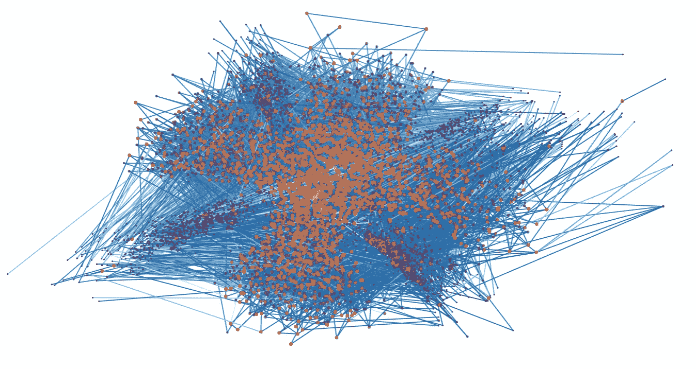

在第 1 部分中，我们讨论了网络基础知识、网络连通性、网络距离、网络聚类和网络度分布。如果你刚刚开始，我建议你先从这里开始:[https://towardsdatascience . com/graph-machine-learning-with-python-pt-1-basics-metrics-and-algorithms-cc 40972 de 113](/graph-machine-learning-with-python-pt-1-basics-metrics-and-algorithms-cc40972de113)

在第二部分中，我将深入探究我们如何推理网络，并开始通过随机图、扩散模型、模拟和建模对它们进行建模。

在我们开始之前，先简要回顾一下什么是加密朋克:

CryptoPunks 是以太坊区块链上的 NFT(不可替换令牌)集合。这是交易量最大、价格最高的非金融交易之一。crypto、NFTs 和 Web3.0 的深度远远超出了本故事的范围，但现在您需要知道的是，这些都是非常令人垂涎的数字令牌(想象图像)，每个都是唯一标识和验证的。由于它们的受欢迎程度，它们经常被出价并以高价售出，就像今天实物艺术品的个人拍卖一样。你可以在 [OpenSea](https://opensea.io/collection/cryptopunks) 上查看这里的收藏。

# 目录

1.  介绍
2.  网络拓扑结构
3.  随机图
4.  扩散模型
5.  摘要

# 介绍

Bojan Tunguz 将[的 CyptoPunks 数据集](https://www.kaggle.com/tunguz/cryptopunks)上传到 Kaggle 上。下面是数据集的简要简介，据作者介绍，“数据集由 2017 年以来的所有 CryptoPunk 交易，以及 10，000 名 Punk 的 PNG 图像组成。交易包括 2017 年的初始朋克“索赔”、用户之间的朋克销售，以及以 ETH 和美元等值的销售价格、出价和报价；业主可以在 ETH(报价)中列出任何价格的朋克，钱包中有 ETH 的任何人都可以出价购买朋克，业主有权决定是否接受”。

在开始之前，让我们做一些基本的数据操作，使数据帧处于适当的状态，以将数据建模为图形。数据集包含有关“撤回投标”、“投标”、“售出”、“报价”、“转让”、“索赔”、“T6”、“撤回报价”、“包装”和“取消包装”交易的信息，但我们将只过滤投标和售出交易，以保持最初的可控性。

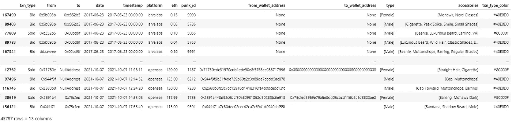

作者图片

每笔交易都是通过以太坊进行的，它很可能类似于一个对数分布——大量的价值处于较低的金额，较少的价值位于右尾。

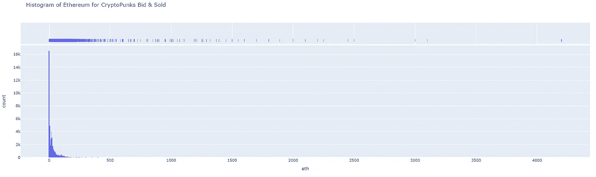

密码朋克买卖的以太坊直方图。作者图片

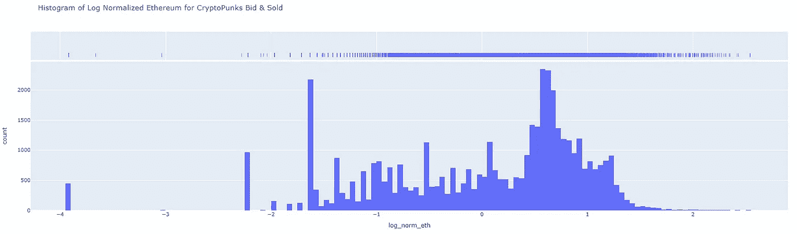

密码朋克买卖的对数归一化以太坊直方图。作者图片

当我们在图中建模时，将以太坊值标准化和规范化会有很大帮助，因此编码(颜色、大小等。)并没有扭曲到你根本看不出多少的地步。

# 网络拓扑结构

我们可以从第 1 部分中讨论的相同概念开始评估网络拓扑——度量和可视化。由于网络是巨大的，可以占用大量的计算资源来可视化，我们现在只绘制一个子集。

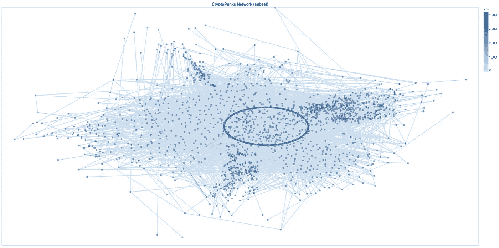

密码朋克网络(子集)。作者图片

理解一个网络的第一个突出的方法是用它的度数频率。大多数真实世界的网络倾向于遵循幂律度数频率分布，其中有许多度数较低的节点和少数度数较高的节点。

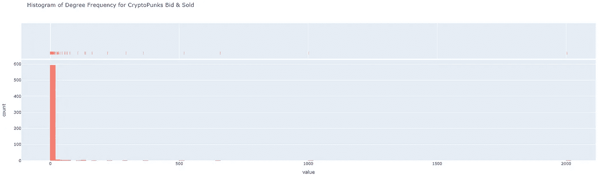

密码朋克买卖的度数频率直方图。作者图片

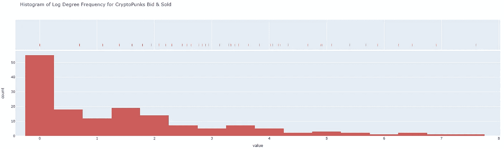

密码朋克买卖的对数度频率直方图。作者图片

度数频率分布严重向右倾斜，但是网络看起来确实像大多数真实世界的网络一样。作为其自然结果，由于形成三元组的高趋势，典型的网络具有低平均距离和高聚集系数。这实质上意味着我们有小而紧密的社区——社交网络通常倾向于通过社区中的共享节点将人们联系在一起。

```
Graph Summary:
Number of nodes : 6672
Number of edges : 31033
Maximum degree : 618
Minimum degree : 1
Average degree : 9.302458033573142
Median degree : 3.0

Graph Connectivity
Strongly Connected Components : 3959
Weakly Connected Components : 20

Graph Distance
Average Shortest Lengths of Strongly Connected Components : 0.0014808991156887005

Graph Clustering
Transitivity : 0.03990005247307336
Average Clustering Coefficient : 0.06520058506424808
```

我们在这里看到一个非常低的聚集系数&传递性，但重要的是要记住，网络是建立在数字市场的交易(出价和出售)基础上的，而不是建立在彼此是朋友的基础上的。事实上，分散加密世界的整个前提和承诺是匿名化和自治，所以我们没有看到三元闭包的高趋势实际上是有意义的。

类似于我们在第 1 部分中看到的，我们还可以为每个节点创建中心性度量来表示重要性。不过，在这一部分，我将创建一个新的度量标准，它是中间中心性的变体——“流中心性”。工程学教授路易斯·阿马拉尔称之为流中心性，他声称这是网络中实体重要性的一个强有力的标志。我强烈建议[亲自阅读论文](https://amaral.northwestern.edu/media/publication_pdfs/journal.pone.0010937.pdf)，尤其是如果你对体育分析感兴趣，或者你可以等待我计划在未来写的关于我将心流中心性应用于 NBA 比赛的故事。简而言之，流中心性是中间中心性的归一化对数。

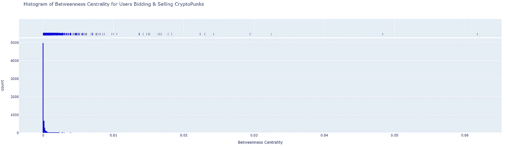

投标和出售密码朋克的用户的介数中心性直方图。作者图片

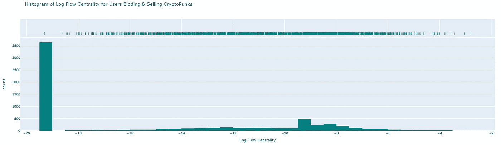

投标和出售密码朋克的用户的日志流中心性直方图。作者图片

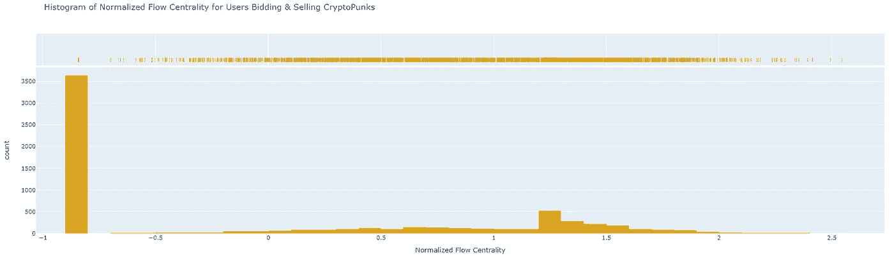

竞价和出售密码朋克的用户的归一化流中心性直方图。作者图片

由于它是一个经济网络，很容易有一个节点没有指向它的边(没有交易出售给没有创造其他人可以出价的东西的人),这就是为什么我们看到如此大量的低价值交易。

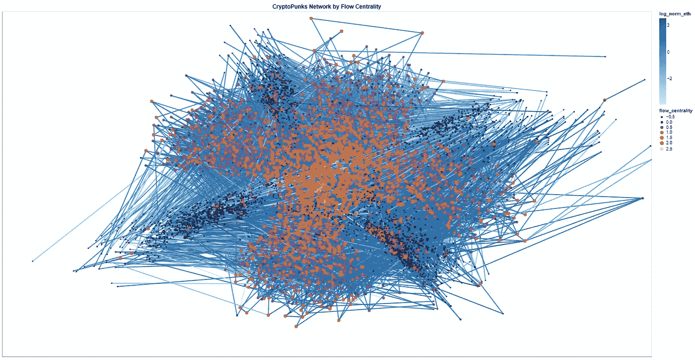

基于流中心性的密码朋克网络。作者图片

为我们的网络添加流量中心的颜色，创造了一个令人难以置信的加密朋克交易网络的视图。我们可以清楚地看到它确定了我们网络的某些社区和纵向部分。

虽然这种观点看起来很吸引人，但我们并不能从中得出什么结论。度量和算法是分析网络的最天真的方法，但是我们也可以模拟随机图来模拟人工网络效应，并在封闭的环境中研究我们的现象。

# 随机图

到目前为止，我们对图的总体了解有多少？已经发现的，可能更常见于社交网络图的是:

*   由于三元闭合，聚类系数较高
*   小平均距离
*   类似幂律的度分布
*   群落结构

本质上，这意味着社交网络图中的节点或人具有形成三元组或“与朋友的朋友建立链接”的高倾向，不具有他们所链接的长的节点链，只有少数节点具有高的度值，但是大多数具有低的度值，并且具有形成社区或子图的内在性质。

有了这些知识，我们就可以对随机图进行建模，因为如果我们可以创建具有这些属性的图，那么它就允许我们进行模拟，测试假设，并最终帮助我们更好地理解为什么现实世界的网络具有它们所具有的属性。

一个很好的起点是查看我们网络的度数频率的对数图。

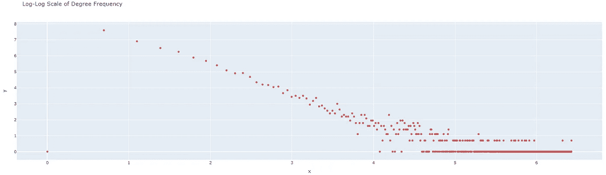

度频率的双对数标度。作者图片

## erdős–rényi 模型

算法:

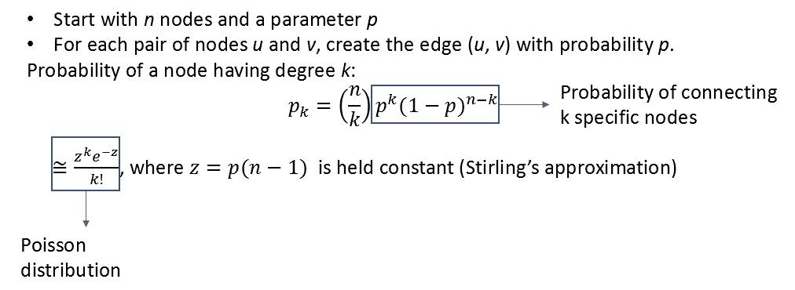

作者图片

这是一个简单的网络模型，因为它没有利用任何假设，这有其缺点，因为它通常不会产生现实的网络。由于泊松分布，它不允许网络有很高的度数，所以没有集线器。通常会产生较低的聚类系数，因为随着节点数的增加，聚类系数会收敛到 0。因此也没有社区结构，但一个好处是它的平均距离很短。

除了对模拟网络进行建模，我们还可以快速创建许多这样的模型，然后查看传递性和聚类系数的分布，以评估相似性。

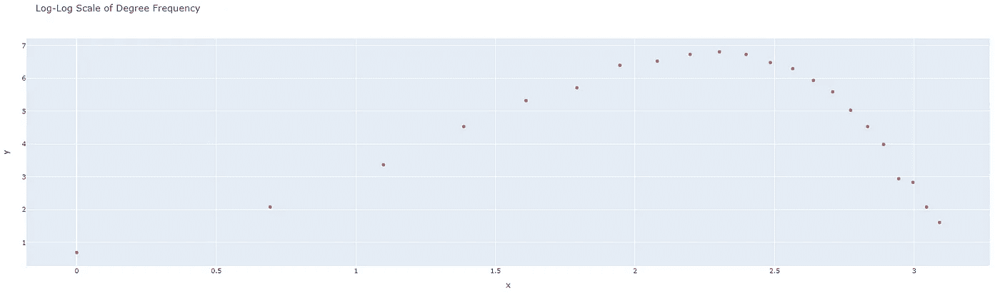

erdős–rényi 模型度频率的双对数标度。作者图片

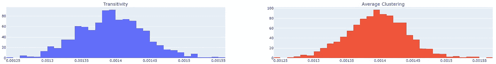

模拟 erdős–rényi 模型的传递性和平均聚类系数。作者图片

我们看到对数度频率直方图不遵循幂律模式，并且我们的传递性和平均聚类最终比我们所拥有的低一个数量级(~0.03)。

## 偏好依附模型

算法:

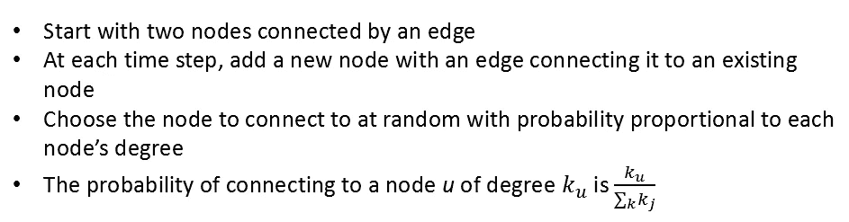

作者图片

这个模型创建了更丰富的效果，因为随着节点的增加，度分布接近幂律。因此，这通常会产生与真实世界网络相似的度数分布。

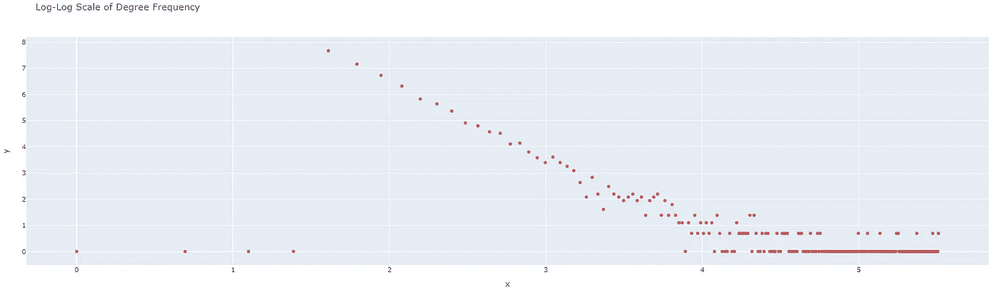

偏好依附模型度频率的双对数标度。作者图片

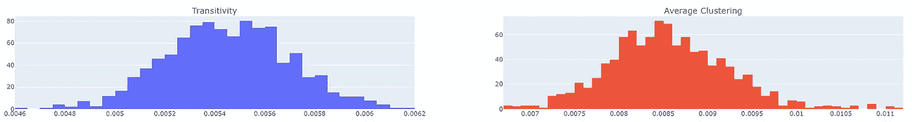

模拟偏好依恋模型的传递性和平均聚类系数。作者图片

我们可以确认这个学位分布和我们差不多！传递性和平均聚类系数比较接近，但仍然相当低；我想通过对超参数的一些调整，我们将能够使这个模型更接近我们的网络。

这个模型的一个变体(powerlaw_cluster_graph)实现了这一点，还增加了一个额外的步骤，即添加一条以概率 p 闭合三角形的边。

## 小世界网络

算法:

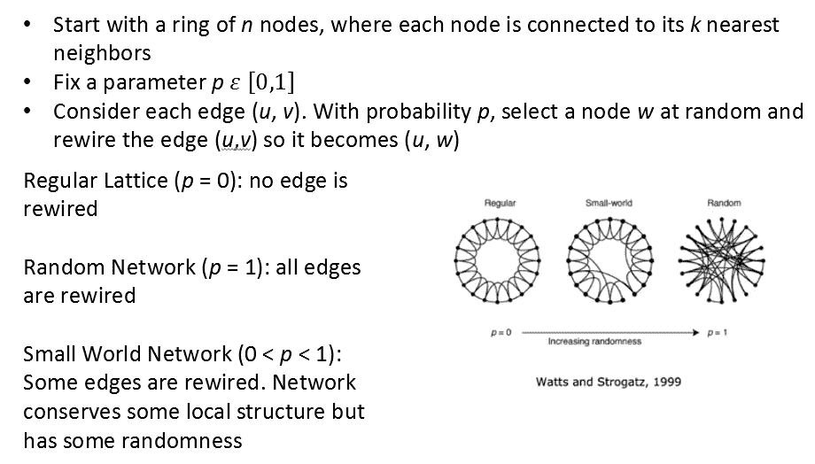

作者图片

这个模型并没有真正捕捉到度分布的幂律分布，但是它在平均距离和聚类系数方面有更大的灵活性。随着 p 从 0 增加到 0.01，平均距离迅速减小，平均聚类系数缓慢减小。

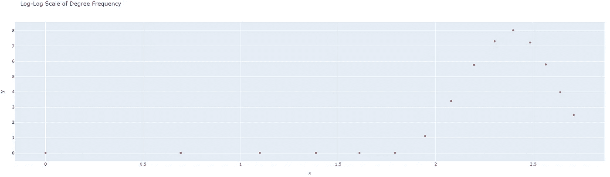

小世界网络度频率的双对数标度。作者图片

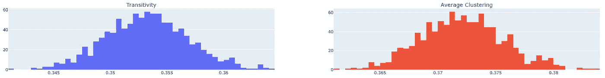

模拟小世界网络的传递性和平均聚集系数。作者图片

度分布和我们的一点都不像，而且传递性和聚集系数也比较大。我们很可能没有一个网络可以很容易地用这个来建模。

默认情况下，此模型是断开连接的，这有时是不可取的。这个模型的一个变体可以运行 t 次，直到它返回一个连通的小世界网络。另一个变体，newman_watts_strogatz_graph，运行一个类似于小世界的模型，但是不是重新布线边，而是以概率 p 添加新的边。

这些随机图的价值在于，我们可以找到一个能够很好地模拟我们的网络的图，然后进行各种实验或测试假设，以推断一个进化的网络。扩散模型就是一个很好的例子。由于巨大的计算成本，这通常可以在与我们的网络匹配良好的随机图上进行，但在这种情况下，我们可以只使用我们正在工作的网络。

# 扩散模型

网络传播帮助我们回答这样的问题:一个想法、一种行为或一种病毒是如何在人群中传播的？它考虑了传染病的性质或可能对传播产生重大影响的想法:它的传染性如何，传染期有多长，想法是好是坏，等等。此外，受影响人群的网络结构对传播的发生也非常重要。

每个模型都有不同的超参数，这取决于它们的功能和假设。此外，我们还需要指定种子节点——或者最初被“感染”的节点。这可以是总节点的百分比、随机子集或基于指标的前/后 N 个节点(这是我们将使用的)。

扩散模型分为几类，主要的有:流行病、意见网络、动态网络模型。流行病是这个故事的主要焦点(有些是关于动态网络模型的)，因为我们正在处理我们网络中的具体传输——无论一个用户向另一个用户出价还是出售一个密码朋克。如果我们在处理模糊的想法或行为，意见网络可能更有效(ps。看看[认知观点动态模型](https://ndlib.readthedocs.io/en/latest/reference/models/opinion/COD.html)，挺有意思的！).动态网络模型是流行病模型的一个特殊子集，它研究具有可以随时间演化的拓扑结构的网络。

## SI 模型

“易受感染”模型假设个人在流行病期间经历两个阶段:

*   易感:未被感染的节点
*   被感染的:已经被感染并且可以感染其他节点的节点

模型动态:

*   从一组受感染的种子节点开始。
*   在每次迭代中，每个被感染的节点都会以一定的概率 *p.* 将疾病传播给其易感染的邻居(如果网络是有向的，则是它所指向的节点)
*   一旦一个节点被感染，它将永远被感染。

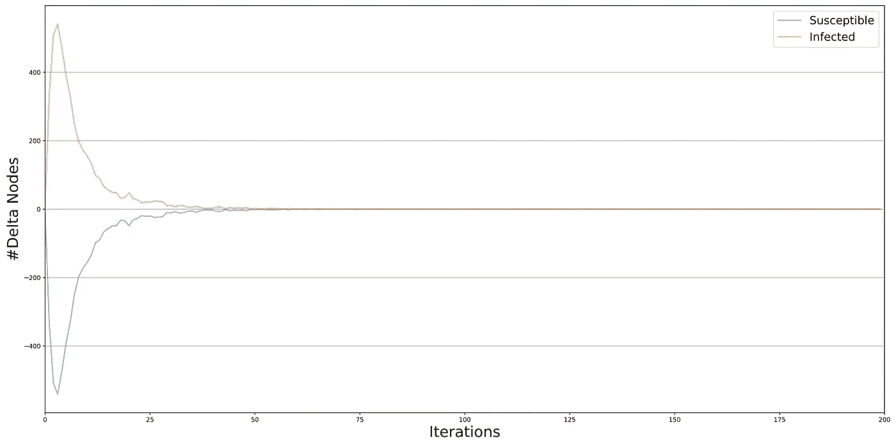

SI 的扩散率。作者的图像

我们通过选择具有最高流中心性值的前 25 个节点来识别种子节点。感染的概率被统一设置为 0.1，我们发现该模型在大约 50 次迭代后收敛。在这个模型中，所有可以从种子节点到达的节点最终都会被感染。

## SIS 模型

“易受感染易受感染”模型假设节点可以从感染中恢复并再次变得易受感染(从疾病中恢复或失去传递信息的兴趣)。

在这个模型中，节点只是暂时被感染。

模型动态:

*   从一组受感染的种子节点开始。
*   在每次迭代中，每个被感染的节点将:1 .以概率 *p* 和 2 将疾病传染给易感的邻居。有可能变得敏感 *s.*

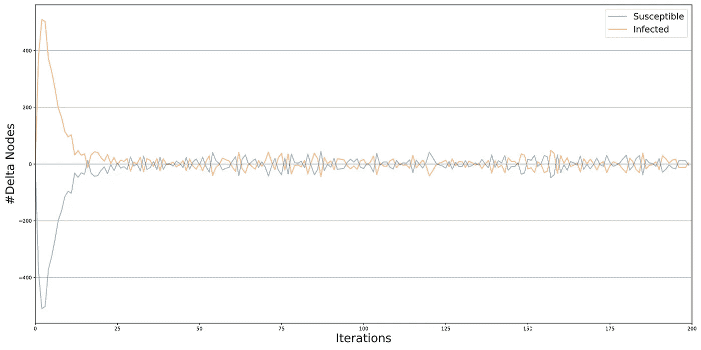

SIS 的扩散率。作者的图像

这个模型与之前的模型采用了相同的参数，但是我们还增加了一个 5%的重磁化率参数。这也显示在我们的流行图中，因为它似乎不会在 200 次迭代内收敛；这是由于一些节点再次受到感染。在这个模型中，级联将继续，直到没有被感染的节点。

## SIR 模型

“易感染已感染已移除”模型假设被感染可能会使您完全没有资格再次感染相邻节点(即因感染病毒而发生的死亡)。

节点被暂时感染，然后它们被“移除”,并且不能再感染它们的邻居。

模型动态:

*   从一组受感染的种子节点开始。
*   在每次迭代中，每个感染节点将以概率 *p* 将疾病或思想传递给其易感邻居，并以概率*r*将其移除

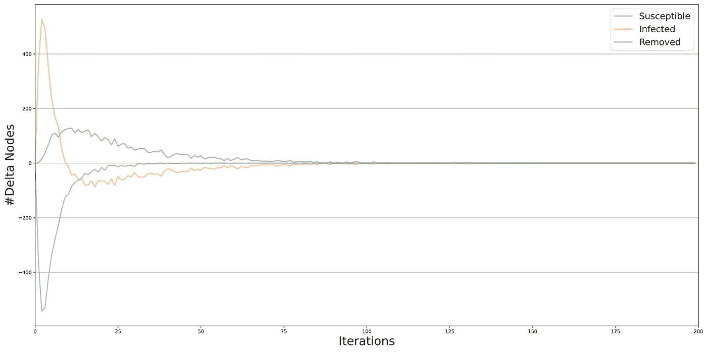

SIR 的扩散率。作者的图像

我们增加了一个节点被移除的 5%的概率，现在我们看到该模型在大约 100 次迭代后收敛。这可能意味着所有节点都已被感染，或者足够多的关键节点已被感染并被删除，因此其他节点都不会被感染，这意味着在该模型中节点可能仍然易受感染。在这个模型中，随着被删除的概率增加，越来越少的节点在早期被感染，并且最终被删除的节点的数量减少。

## 独立级联模型

该模型假设每条边可以具有唯一的传输概率，这意味着传输取决于节点的关系/影响因素的性质。

模型动态:

*   从一个网络开始，与每个边( *e* ， *v* )相关联的概率 P( *u* ， *v* )，以及在时间 t=0 时感染节点的初始集合。
*   在每个时间步 *t* ，在时间 *t* -1 被感染的任何节点 *u* 将以概率 P( *u* 、 *v* )感染每个未被感染的邻居 *v* 。

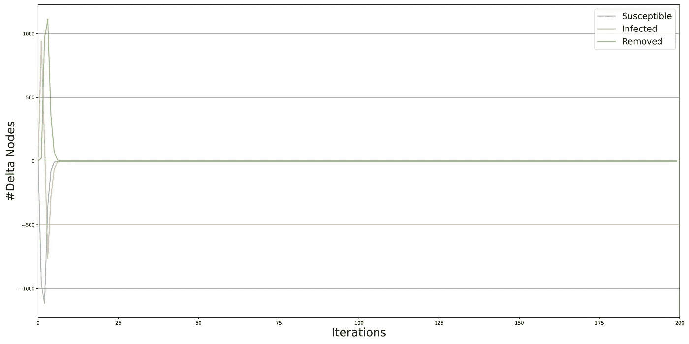

独立级联的扩散优势。作者的图像

在许多方面，这个模型是一个广义的 SIR 模型，因为当没有新的节点被感染时，该过程结束。我们的网络没有那么多长链，这就是为什么我们发现它在大约 15 次迭代时收敛得相当快。这个模型是一个概率模型，引入了一定程度的随机性。

## 线性阈值模型

这个模型通常与行为和想法非常一致。它假设想法、行为、创新或传染病的复杂性，或者需要多次接触才能接受它。

节点在[0，1]中有一个阈值，表示它们对采用该行为的敏感程度。边具有表示一个节点对另一个节点是否会采用该行为有多大影响的权重。如你所料，一个节点的所有传入边的权重总和必须为 1，因为这些是唯一有可能产生影响的节点。如果一个节点有一组已经采用该行为的邻居，并且它们的边的权重加起来至少达到该节点的阈值，则该节点将采用该行为。

模型动态:

*   从一组受感染的种子节点开始。
*   在每个时间步 *t* ，如果“足够多”的采用邻居被感染，则任何节点 *u* 被感染。
*   特例:如果一个节点 *u* 的邻居中至少有一部分被感染，那么这个节点就会被感染

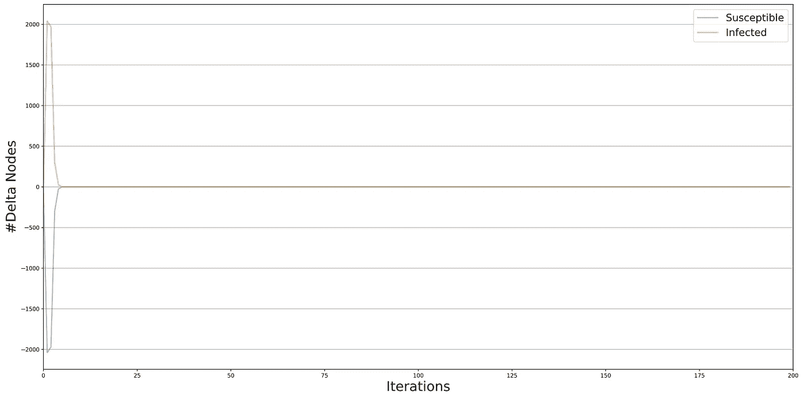

线性阈值的扩散流行。作者的图像

我们在这里看到最快的收敛，大约 10 次迭代，这可能是由于选择了 25 个最大的流中心性节点。在平均距离较低的网络中选择这么多“中心”节点，本质上意味着最初被感染的种子节点集很有可能控制扩散。在确定了边的权重、节点的阈值和初始采用者之后，这个模型是完全确定的。在你固定了节点和初始采纳者的边的权重之后，这个模型是完全确定的。

# 摘要

在这个故事中，我们超越了度量和算法的网络拓扑，进入了模拟和建模的世界。这是为什么图形不仅非常有价值，而且非常迷人的一个非常重要的方面。我们能够以一种动态的、进化的方式来检验假设和进行实验，否则这是不可能的。如果你把这个话题放到贝叶斯网络中，即使这个话题本身也有其独特的深度，但这将被保存到一个单独的故事中。

在本系列的以下部分中，我将从无监督、有监督和深度学习的角度深入社区结构和实际的机器学习任务。感谢你现在的阅读和学习，为了乐趣跟随吧！

**参考文献**

[1] Bojan Tunguz，[crypto 朋克](https://www.kaggle.com/tunguz/cryptopunks)

[2]克劳迪奥·斯塔米尔，奥尔多·马尔祖洛，恩里科·德乌塞比奥，[图机器学习](https://learning.oreilly.com/library/view/graph-machine-learning/9781800204492/)

[3]马克·李约瑟，艾米·e·霍德勒，[图算法](https://learning.oreilly.com/library/view/graph-algorithms/9781492047674/)

[4] Estelle Scifo，[使用 Neo4j 进行实际图表分析](https://learning.oreilly.com/library/view/hands-on-graph-analytics/9781839212611/)

[5]伊斯利，大卫和克莱恩伯格，乔恩。2010.网络、人群和市场:关于高度互联世界的推理

## 您可以在这里找到本系列的第 3 部分:

[](/graph-machine-learning-with-python-part-3-unsupervised-learning-aa2854fe0ff2) [## 使用 Python 的图机器学习第 3 部分:无监督学习

### 大都会艺术博物馆中绘画的聚类和嵌入

towardsdatascience.com](/graph-machine-learning-with-python-part-3-unsupervised-learning-aa2854fe0ff2)