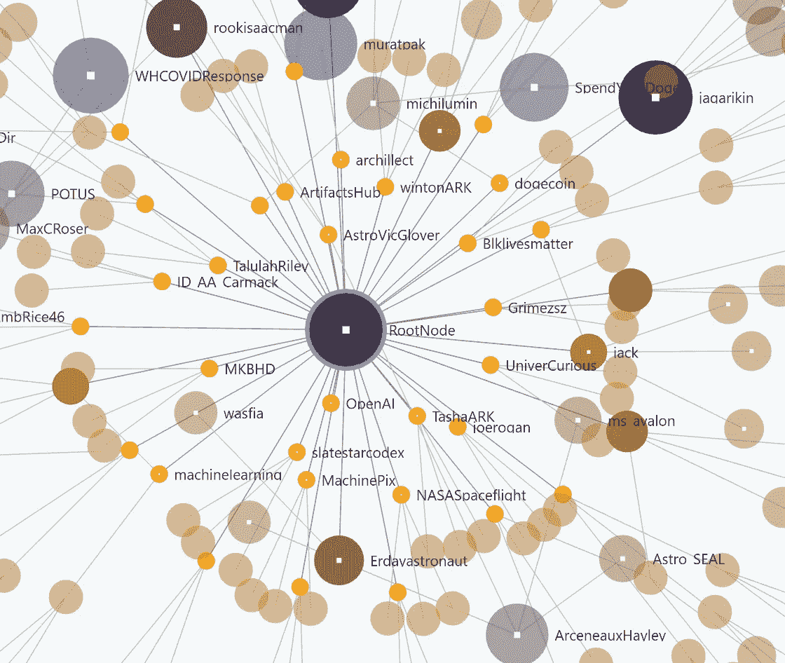
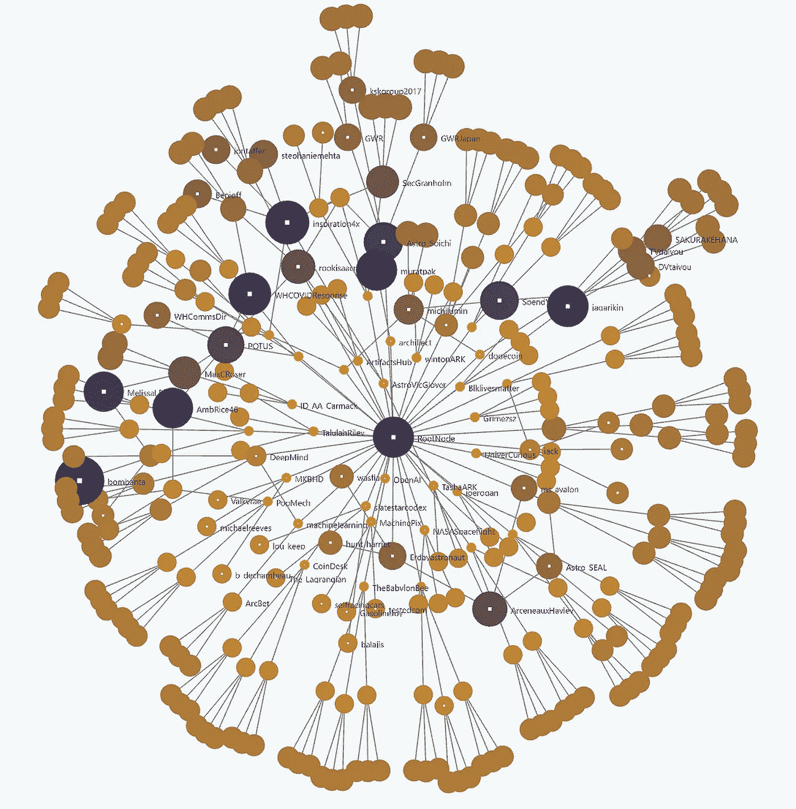

# 从埃隆·马斯克的推特图中我们能学到什么？

> 原文：<https://towardsdatascience.com/graph-mining-2dd6c4c1f1b1?source=collection_archive---------20----------------------->

## 只有几行代码的图形挖掘

图形挖掘允许我们从任何给定的实体集合中收集数据并构建节点和边的图表。像 Louvain method 或 PageRank 这样的算法提供了有意义的工具来分析经过挖掘和构建的图。这篇文章用几行 Python 代码描述了构建图表的过程。

图表分析是一个令人难以置信的令人兴奋和快速发展的数据分析领域。它从社区检测延伸到其他复杂的任务，如模式识别。Graph analytics 也可以被视为使搜索引擎巨头能够将**额外的相互关联的结果维度**添加到您的搜索结果中的动力之一(基本上，他们依赖于所谓的**知识图**)、在您的手机上弹出的相关每日新闻或您最喜欢的在线商店的购买推荐。

> 附带说明:谷歌的搜索是基于以前开发的 Freebase，虽然已经停止，但是仍然可以部分访问——链接[这里](https://developers.google.com/freebase)。

虽然有许多算法可用于分析，但当想到图形时，Louvain 方法和 PageRank 可能是人们首先想到的算法。Louvain 方法允许检测各种网络中的社区，而 PageRank(以 web *pages* 命名，而不是其共同发明人和谷歌联合创始人拉里·佩奇)发现了在整个图中的节点之间随机跳跃时到达节点的稳态概率(马尔可夫链)——后者可能是该科学领域最知名的算法，因为它被视为谷歌搜索的基础工作。

另一种流行的分析方法是查看通过大量三角形连接来表征的图表。找到这样的图表是一个现实世界的问题，猎头、社交媒体和营销专家可能会特别感兴趣。

> “三角形计数在社交网络分析中变得流行起来，它被用来检测社区并测量这些社区的凝聚力。它还可以用来确定一个图的稳定性，并经常被用作计算网络指数的一部分，如聚类系数— [Neo4j](https://neo4j.com/docs/graph-algorithms/current/labs-algorithms/triangle-counting-clustering-coefficient)

一篇令人难以置信的来自斯坦福大学的 6 页论文可以在本文最后的附录中找到。在你的程序中集成三角形计数的一个简单方法在这里解释:

</identify-well-connected-users-in-a-social-network-19ea8dd50b16>  

## 起点

为了给这种分析提供有意义的数据，本文允许您遵循几个简单的步骤从 Twitter 中挖掘真实世界的图表。下面显示的函数从“**根节点”埃隆马斯克**开始，迭代他的追随者，追随者的追随者，等等。

如果你想使用自己的帐户作为起点，你需要先获得你的起始 ID。这不能通过前端完成，但是 Twitter 的 GitHub 上有一个简单的脚本([用户查找](https://github.com/twitterdev/Twitter-API-v2-sample-code/tree/master/User-Lookup))可以帮助你。



与 Elon 的直接联系 Argo Lite 中作者提供的图片

对于这个项目，我使用了 **Elon 的跟随**。使用 follows 是有意义的，因为我们想探索 Elon 的网络，而不是 Elon 只是其中一部分的其他人的网络。**这个逻辑同样适用于所有其他节点——**我们只关心关注者，不关心关注者。要知道，通过 Twitter 收集节点需要相当长的时间，因此，图中所示只是 Elon 整个网络的一小部分。“埃隆·马斯克图表”可以通过简单地点击节点来**可视化地浏览** ( [链接](https://poloclub.github.io/argo-graph-lite/#c9b7fba6-ae4b-4c5a-b260-9c059014ddfd))——拖动它们以更好的方式组织它们。节点大小被表征为具有较高的 PageRank 值，这也通过着色来表达。较暗(蓝色)的颜色表示较高的 PageRank 分数，黄色、较亮的颜色表示较低分数的节点。如果需要，还可以通过节点的度数(outdegree)来表示节点。

> *感谢 Duen Horng Chau 教授(佐治亚理工学院)提供可视化工具。如果你对 Argo Lite 如何工作感兴趣(它使用的是 D3)，* [*关注 GitHub 资源库。*](https://github.com/poloclub/argo-graph-lite)

在浏览图表和/或进入挖掘功能之前，请考虑以下约束条件:

1.  Twitter 每 15 分钟只允许 15 次 API 调用。这是一个非常小的数字。在初始迭代中从 40 个用户开始，这意味着我们在这次运行中只能分析 14 个用户(1 次运行用于根节点)。所以你最好准备好你的覆盆子馅饼。
2.  对于根节点获得的用户必须有一个**限制**
3.  对于节点的**节点。这个极限应该比第一个还要小。经验法则是≤5——否则图形会 ***变得非常大，API 调用会*** 不堪重负。**



作者在 Argo Lite 中对“局部”图形图像的整体提取

这一切都从探索 Twitter API 开始。我不是他们文档的最大粉丝(特别是这个 *v1.0* 到 *v2.0* 有时会令人困惑)，但是他们在 GitHub 上的示例代码很棒。

要开始您的项目，您需要以下两个构件:

1.  Twitter 开发人员页面上的一个现成项目——这是稍后获取授权 API 调用的密钥所必需的。
2.  根节点的 ID——这是脚本遍历所有“follows”的起点

下面显示的代码只是从 Twitter dev 的 GitHub 复制的，并为我们的程序构建起点。额外的导入(比如日志记录)并不是必需的，但是，当需要跟踪更大图形的进度时，可能会很有用。再次提醒，Twitter 只允许数量少得令人不满意的 API 调用——所以日志在某些时候可能会派上用场。

感谢[推特开发者](https://github.com/twitterdev/Twitter-API-v2-sample-code)

鉴于上述前提条件，我简单地将样板代码打包到一个函数中，每次迭代都要调用这个函数。代码基本上接受我们传递给函数的节点标识符( *id* )，并检索节点/人员的关注者的完整列表。

我们还需要设置限制参数。这是必要的，因为对于一个普通甚至高度参与的用户来说，由于 Twitter 网络的规模，这个挖掘任务将会花费难以置信的长时间。

1.  *迭代*:这允许我们定义多长时间跟踪一次节点，并选择这些节点作为下一次迭代的起点。*参见下面的* *****
2.  *迭代= 0* 简单定义一个计数器变量。
3.  *request_count* :限制调用次数所需。这个计数器确保我们不会触及(非常小的)API 限制
4.  *start_limit* 定义在第一次迭代中检索的节点数
5.  *限制*定义任何后续迭代的节点数

```
* Iterations:
0 — [RootNode -> **n Users**]
1 — [RootNode -> n Users -> **m Users** ], 
2 — [RootNode -> n Users -> m Users -> **m Users**]# where n is the *start_limit* and m is *limit*.
# You can push this iterative process to any number you like, 
# just make sure it comes to end within the next decade.
```

第一块代码基本上只定义了用户的检索( *get_follows* )以及为挖掘过程设置参数。

现在真正有趣的事情开始了，我们获得了初始节点(RootNode)的第一批追随者。为了再次强调这一点，我使用了 Python 的内置日志库，这是一种跟踪进度和识别程序可能遇到的问题的可靠方法——只是要注意您的程序可能会运行许多小时、几天...—所以“*print”*很可能不是一个好的选择。

这个函数的另一个重要方面是我们仔细观察了**传播节点**。我们使用 *follows_checked* 来跟踪我们已经**访问过的节点，并将它们从堆栈** ( *new_nodes* )中移除，否则我们创建了一个无限循环。

我们基本上是迭代一个用户列表，并将所有元素添加到边和节点中。主要的挑战是跟踪我们已经用来获取用户列表的节点。为此，我们保持:

1.  ***follows _ check***只是一个排除列表。这里的每个条目将不再被用来调用数据检索
2.  ***节点*** 是所有节点的列表，在所有迭代中追加
3.  ***new_nodes*** :跟踪我们刚刚介绍的节点
4.  ***next_nodes*** :只是一个我们用来和排除列表进行比较的临时数组。

第一次迭代很简单，我们只需遍历所有节点并添加节点和边列表。请注意，该列表中的节点可能不是唯一的。如果您的用例需要的话，请确保您准备好清除重复的输出。

当我们看到想要跟随的附加“层”时，更复杂的任务出现了。这里很重要的一点是**跟踪检查过的节点，并且我们单独存储新引入的节点**。再仔细想想。

## 结论

这篇短文展示了如何迭代地收集数据并将其存储在一个可用于构建图表的结构中。关键是，大数据时代给我们带来了各种新的挑战，图表是更好地了解数据的一种主要方式。

无论是在简单的 CSV 文件中(对于小型图表)，还是在数据库中，甚至是分布在几台计算机上(例如 [Spark GraphX](https://spark.apache.org/docs/latest/graphx-programming-guide.html) )，图表都可以轻松存储，并且可以使用强大且经过验证的算法来探索其内容。

## 进一步延伸内容

如果 PageRank 是你正在寻找的，我推荐阅读这篇文章，它不是太难理解，而且抓住了要点:

</pagerank-algorithm-fully-explained-dc794184b4af>  

如果你不仅对用户之间的联系感兴趣，而且对 T2 发了什么样的推文、推文的情感或者用户写的内容感兴趣，你可能会想看看 T4 的自然语言处理和/或相似性度量。我曾经创建了一个迭代方法来评估文本中某些单词的**重要性，这可能对你的项目有用:**

</find-text-similarities-with-your-own-machine-learning-algorithm-7ceda78f9710>  

{下次再见，注意安全}

*再次衷心感谢 Duen Horng (Polo) Chau 教授和所有参与的同学(佐治亚理工学院)，他们提供了在线图形可视化工具 Argo Lite-Polo 教授也是真正激发我对图形分析兴趣的人。*

*佐治亚理工学院#CS 6242 数据和可视化分析*

## 附录

计算三角形(CS167) —斯坦福大学出版


克林特·王茂林在 [Unsplash](https://unsplash.com?utm_source=medium&utm_medium=referral) 上拍摄的照片