# 2022 年的图表 ML:我们现在在哪里？

> 原文：<https://towardsdatascience.com/graph-ml-in-2022-where-are-we-now-f7f8242599e0?source=collection_archive---------3----------------------->

## [思想和理论](https://towardsdatascience.com/tagged/thoughts-and-theory)，最新技术文摘

## 热门趋势和主要进展

对于 Graph ML 来说，这是不平凡的一年——数以千计的论文、无数的会议和研讨会……我们如何跟上身边发生的这么多有趣的事情呢？嗯，我们也感到困惑，并决定呈现一个结构化的图形 ML 高亮显示🔥趋势和主要进展。

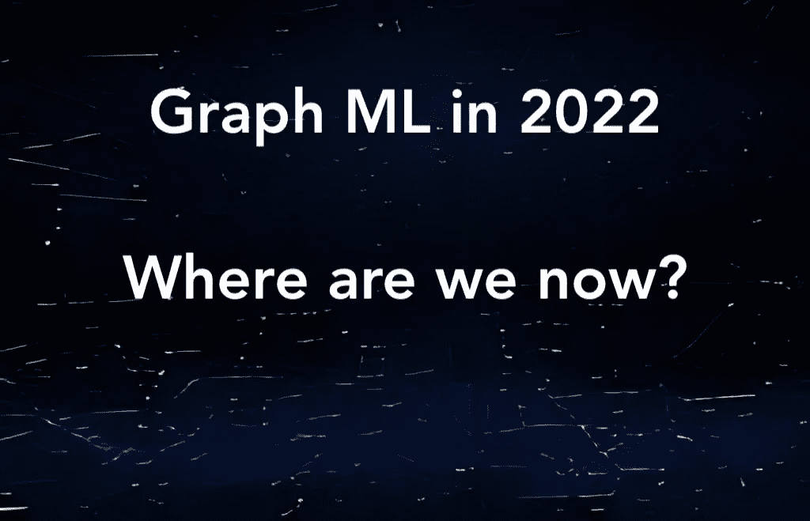

图像是由 [ruDALL-E](https://rudalle.ru/en/) 生成的，并带有提示“图形漂浮在太空中”。

无论您正在研究一个更窄的主题，还是刚刚开始使用 Graph ML——我们希望这篇文章是一个很好的参考点。

当然，这个领域是如此之大，以至于任何这样的评论都有点短视，所以如果我们错过了一些重要的东西，请在评论中告诉我们！

**目录:** [1。图形变形金刚+位置特征](#6d56)
[2。等变 GNNs](#f9bd)
[3。生成模型为分子](#c8c4)
[4。GNNs +组合优化&算法](#72d1)
[5。子图 GNNs:超越 1-WL](#28f1)
6。可扩展和深度 GNNs: 100 层及以上
[7。知识图表](#93ee)
[8。一般酷研用 GNNs](#2ddd)
[9。新的数据集、挑战和任务](#ffd2)
[10。课程和书籍](#6dfa)
[11。库&开源](#0d69)
[12。如何保持更新](#3a5d)

# 图形转换器+位置特征

gnn 在普通(通常是稀疏的)图上操作，而图转换器(GTs)在全连接图上操作，其中每个节点都连接到图中的每个其他节点。一方面，这带来了节点数量 N 的 O(N)复杂度。另一方面，GTs 不会遭受长距离消息传递的常见问题——过度平滑。全连通图意味着我们有来自原始图的“真”边和从全连通图转换中添加的“假”边，我们想要区分它们。更重要的是，我们需要一种方法来赋予节点一些位置特征，否则 GTs 就会落后于 GNNs(如 Dwivedi 和 Bresson 的 [2020 论文所示)。](https://arxiv.org/pdf/2012.09699)

也许今年最引人注目的两个图形转换器模型是[三](https://github.com/DevinKreuzer/SAN)(光谱注意力网络)和[图形转换器](https://github.com/microsoft/Graphormer)。**桑** by [**克罗伊泽、比艾尼等人**](https://arxiv.org/pdf/2106.03893) 采用拉普拉斯算子的前 k 个特征值和特征向量，表明仅谱特征就可以区分被 1-WL 检验认为同构的图。由于将光谱特征与输入节点特征连接在一起，SAN 在许多分子任务上优于稀疏 gnn。

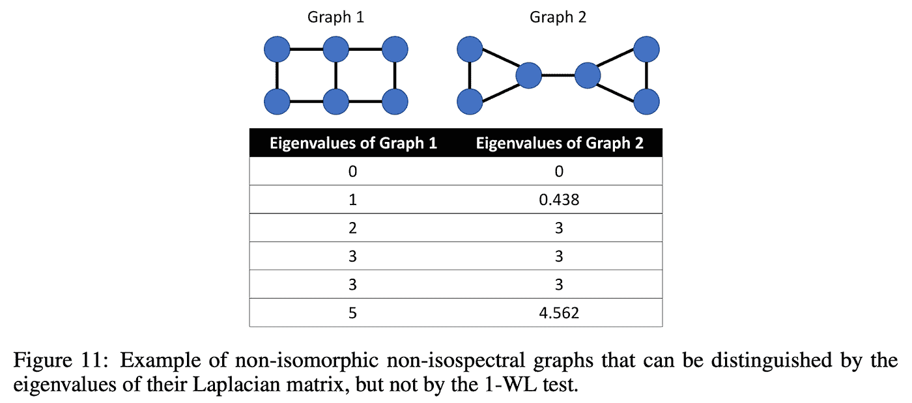

来源: [**克罗伊泽、比艾尼等人**](https://arxiv.org/pdf/2106.03893)

**英等人**的笔形器**采用了不同的方法，利用了空间特性。首先，用*中心性编码*丰富了节点特征——可学习的入度和出度嵌入。然后，注意力机制有两个偏置项:节点 *i* 和 *j* 之间最短路径的 1️⃣距离；依赖于一条可用最短路径的 2️⃣边要素编码。**

**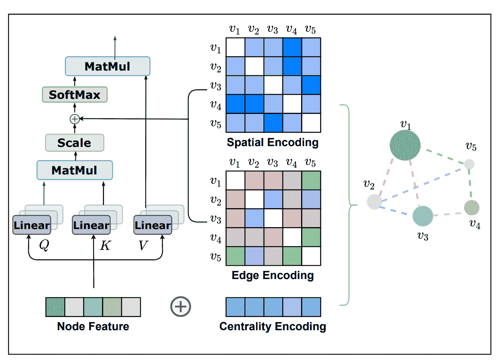**

**笔形位置编码方案。来源: [**应等人**](https://openreview.net/pdf?id=OeWooOxFwDa)**

**🏅Graphormer 完成了 2021 年 Graph ML 大满贯:在 *OGB 大型挑战赛*和 *Open Catalyst 挑战赛*的图形回归任务中获得第一名！(下面将详细介绍这些挑战)**

**🤔未决问题:**可扩展性**和**计算开销**。SAN 和 Graphormer 在分子任务上进行了评估，其中图相当小(平均 50-100 个节点),例如，我们可以运行 O(N ) Floyd-Warshall 所有对最短路径。此外，图转换器仍然受到 O(N)注意机制的限制。放大到比分子更大的图形会解决这些问题。你刚才是不是想到了 NLP 的[线性变压器？😉是的，他们可能会帮忙，但由于他们从来没有实现注意力矩阵，你需要找到一个聪明的方法来把边缘特征放在这样的模型中。当然，我们会在 2022 年看到更多关于这方面的研究！](https://github.com/google-research/long-range-arena)**

# **等变 GNNs**

> **Geoffrey Hinton 承认 equivariance 的独特之处是什么？**

**一般来说，等方差定义在某些变换群上，例如，三维旋转形成的 SO(3)群，三维中的特殊正交群。等变模型风靡了 ML🌪2021 年，在 Graph ML 中，它在许多分子任务中特别具有破坏性。应用于分子，等变 gnn 需要节点特征的额外输入-即，将在 n 维空间中旋转/反射/平移的分子的物理坐标的一些表示。**

**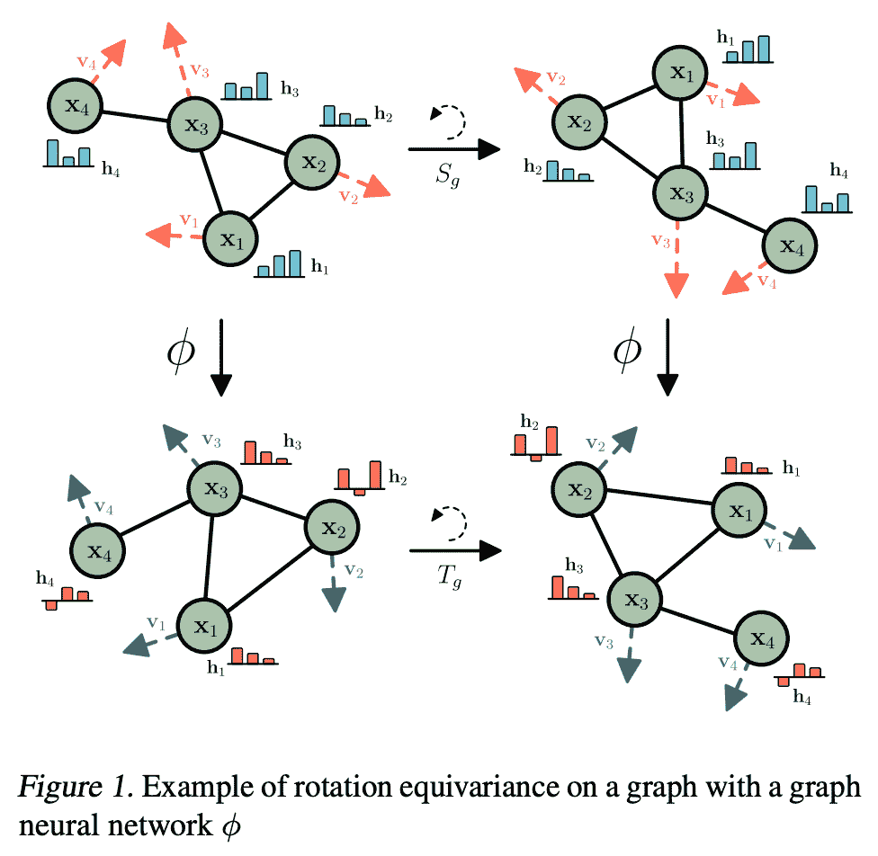**

**有了等变模型，不管变换的顺序如何，我们都会到达相同的最终状态。来源: [**萨托拉斯、胡格博姆、韦林**](https://arxiv.org/pdf/2102.09844.pdf)**

**[**Satorras、Hoogeboom、Welling**](https://arxiv.org/pdf/2102.09844.pdf) 提出 [EGNN](https://github.com/vgsatorras/egnn) 、E(n)等变 GNNs，其与 vanilla GNNs 的重要区别在于在消息传递和更新步骤中加入了物理坐标。情商。3👇将相对平方距离与消息 m 和 Eq 相加。4 更新位置特征。EGNN 在建模 n 体系统、作为自动编码器以及在量子化学任务(QM9 数据集)中显示出令人印象深刻的结果。**

**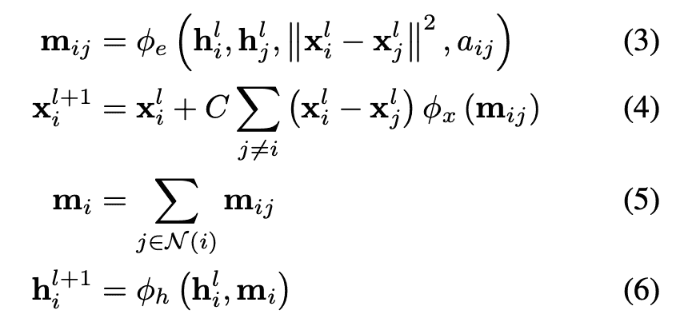**

**与普通 GNNs 的重要区别:等式 3 和 4 将物理坐标添加到消息传递和更新步骤中。来源: [**萨托拉斯、胡格博姆、韦林**](https://arxiv.org/pdf/2102.09844.pdf)**

**另一种选择是结合原子之间的角度，就像 T2、克利茨佩拉、贝克尔和 T4、T5 在 GemNet 中所做的那样。这可能需要将输入图转换为线图，例如边的图，其中原始图的边成为线图中的节点。这样，我们可以将角度作为边缘特征合并到新的图形中。**

**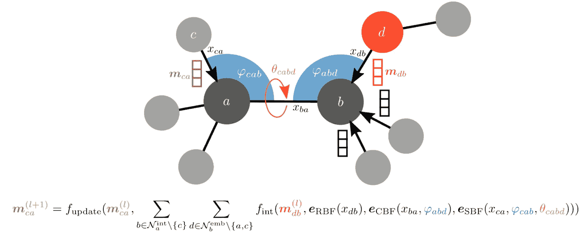**

**使用角度作为主要坐标。来源: [**克利茨佩拉、贝克尔、居内曼**](https://arxiv.org/pdf/2106.08903.pdf)**

**GemNet 在分子动力学任务上显示了强大的结果:COLL、MD17 和 Open Catalyst20。很明显，等方差区只是🛫的起飞，我们将在 2022 年看到更多的进步！**

# **分子的生成模型**

**药物发现(DD)的整个领域得到了显著的推动🚀2021 年感谢几何 DL。DD 的许多关键挑战之一是生成具有所需属性的分子(图形)。这个领域很大，所以我们只强调模型的三个分支。**

*   ****规范流程。**
    [Satorras、Hoogeboom 等人](https://arxiv.org/pdf/2105.09016.pdf)应用上述等变框架创建能够生成具有位置和特征的 3D 分子的 **E(n)等变归一化流**💪**

**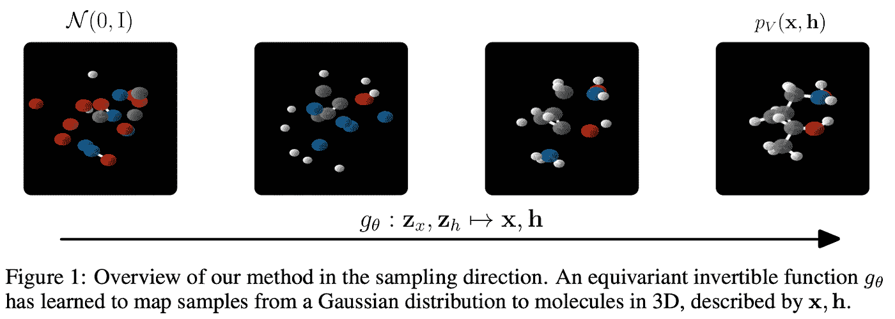**

**资料来源: [Satorras，Hoogeboom 等人](https://arxiv.org/pdf/2105.09016.pdf)**

*   ****概率模型。石，罗等研究给定一个图，生成三维构象体，即三维结构的问题。模型 **ConfGF** 估计原子坐标对数密度的梯度场。这些场是旋转平移等变的，作者提出了一种将这种等变性质纳入估计量的方法。Conformer 采样本身是通过退火的 Langevin dynamics 采样完成的。****

**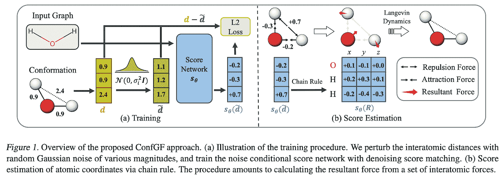**

**资料来源:[石、罗等](https://arxiv.org/pdf/2105.03902.pdf)**

*   **RL 方法。用一种非常非科学的方式描述，这些方法通过一步一步地添加“积木”来生成分子。我们可以从某种程度上对这些方法进行分类，它们决定了这个构建过程。**

**例如，[高、梅尔卡多和科利](https://arxiv.org/pdf/2110.06389.pdf)将合成能力作为构建过程的条件，即我们是否能在实验室中实际创造出这种分子。为此，他们首先学习如何创建积木的合成树(一种模板)。**

**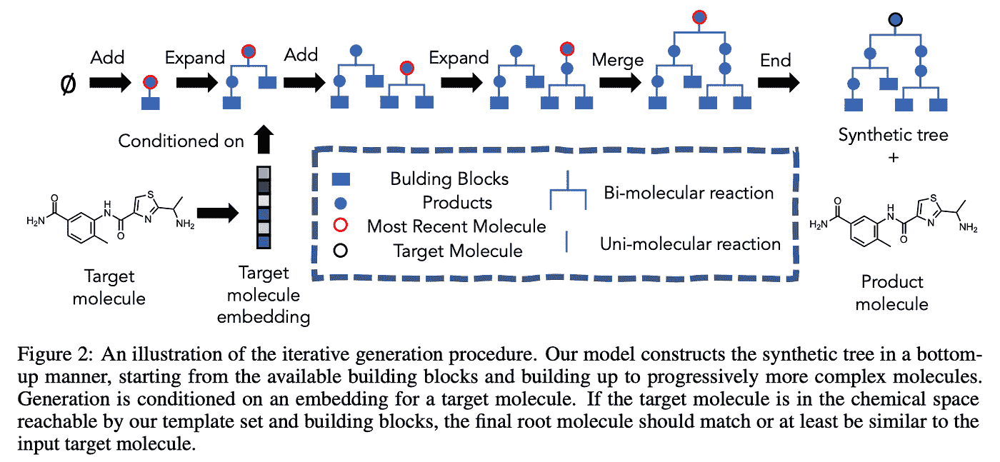**

**来源:【高、梅尔卡多、科利】**

**由 Yoshua Bengio 领导的 Mila 和 Stanford 研究人员团队[提出了一个更加通用的框架，他们引入了**生成流网络(GFlowNets)** 。很难用几句话来概括——首先，当我们想要对多样化的候选对象进行采样时，GFlowNets 可以用于主动学习案例中，采样概率与一个奖励函数成正比。此外，他们最近的 NeurIPS'21 论文](https://arxiv.org/pdf/2111.09266.pdf)显示了 GFlowNets 应用于分子生成任务的好处。查看 Emmanuel Bengio 的博客文章，这篇文章更详细地描述了这个框架，并提供了更多的实验证据。**

# **GNNs +组合优化和算法**

**2021 年是这个新兴子领域的重要一年！**

**[**徐等人**](https://arxiv.org/pdf/2009.11848.pdf) 在他们杰出的 21 论文中研究了神经网络的外推，并得出了几个惊人的结果。利用[算法比对](https://openreview.net/forum?id=rJxbJeHFPS)的概念(由相同的作者在聚焦 ICLR 的 20 篇论文中介绍)，作者表明 gnn 与*动态编程(DP)* 很好地对齐(查看图示👇).与 ICLR 20 的论文相比，这里作者讨论了一个更强的外推条件— *线性*排列到 DP。事实上，比较寻找最短路径的经典贝尔曼-福特算法的迭代和消息通过 GNN 的聚合-组合步骤，你会发现许多共性。此外，作者表明，在对特定的 DP 算法建模时，为 GNN 选择合适的聚合函数至关重要，例如，对于 Bellman-Ford，我们需要一个*min*-聚合器。我还推荐看一下斯蒂芬妮·杰格尔卡的一个非常有说明性的演讲，他解释了这项工作在深度学习和组合优化 2021 研讨会上的主要成果。**

**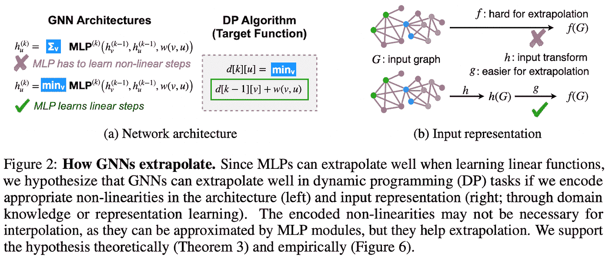**

**来源:[徐等](https://arxiv.org/pdf/2009.11848.pdf)**

**为了更全面地介绍这个领域，我想强调一下 Cappart 等人 所做的 IJCAI'21 [**综合调查，它涵盖了组合优化中的 gnn。这篇文章首次展示了**神经算法推理**蓝图，该蓝图后来由**](https://arxiv.org/pdf/2102.09544.pdf)**[**veli kovi 和**](https://www.sciencedirect.com/science/article/pii/S2666389921000994)Blundell 以 Patterns 的形式在立场文件中进行了描述。****

**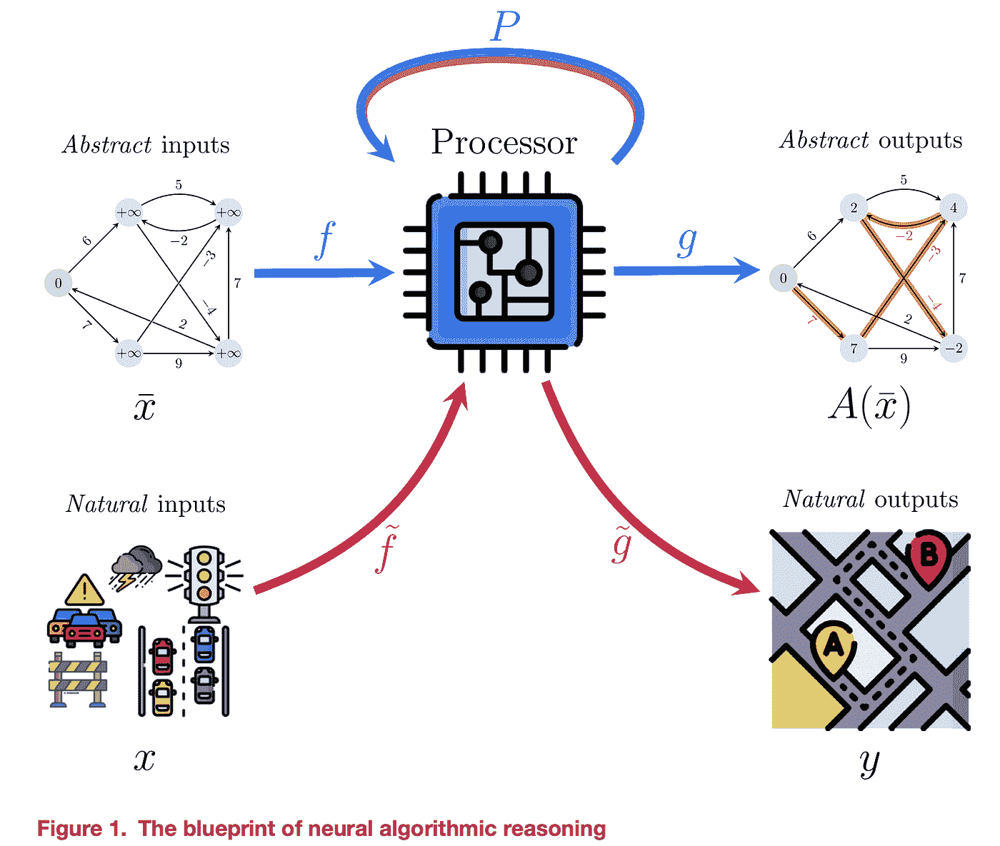**

**来源:[veli kovi 和 Blundell](https://www.sciencedirect.com/science/article/pii/S2666389921000994)**

**📘蓝图解释了神经网络如何在嵌入空间中模仿和授权通常离散的算法的执行过程。在*编码-处理-解码*方式中，抽象输入(从自然输入中获得)由神经网络(处理器)处理，其输出被解码成抽象输出，然后抽象输出可以被映射到更自然的特定任务输出。例如，如果抽象的输入和输出可以用图形表示，那么 gnn 可以是处理器网。离散算法的一个常见预处理步骤是*将我们所知道的任何关于问题的信息压缩到标量中，如“*距离*或“*边容量*，并在这些标量上运行算法。相反，矢量表示和神经执行使得启用高维输入而不是简单的标量变得容易，并附加了一个用于优化处理器的反向投影。欲了解更多信息，请参见 Petar Velič ković的演讲🎥。***

**这个蓝图越来越多地被采用——neur IPS ' 21 展示了一些很酷的作品！ [**Xhonneux 等人**](https://arxiv.org/pdf/2110.14056.pdf) 研究迁移学习是否可以应用于将学习到的神经执行器推广到新任务； [**Deac 等人**](https://proceedings.neurips.cc/paper/2021/file/82e9e7a12665240d13d0b928be28f230-Paper.pdf) 发现了强化学习中算法推理和内隐规划之间的联系。2022 年还会有更多！**

# **子图 GNNs:超越 1-WL**

**🤝如果 2020 年是第一次尝试离开 GNN 的 1-WL-兰迪亚的一年，我们可以确认 2021 年是在*beyond-1WL-兰迪亚*与外星人建立稳固联系的一年👾。这种联系无疑证明了它们是有用的，因为我们现在已经有了一些强大的和更具表现力的架构，它们将消息传递扩展到更高阶的结构，如单纯复形(**网[、和王等人](https://arxiv.org/pdf/2103.03212.pdf))、细胞复形( **CW 网**)或子图。****

**对于后者，看看这篇由迈克尔·布朗斯坦、莱昂纳多·科塔、法布里齐奥·弗拉斯卡、哈盖·马龙、和赵在子图 GNNs 上发表的 [**新的精彩博文**](/using-subgraphs-for-more-expressive-gnns-8d06418d5ab) ！**

**如果你想真正深入研究 WL 最近的研究，请查看克里斯多夫·莫利斯、亚龙·李普曼、哈盖·马龙和合著者的最新调查 [**韦斯费勒和莱曼围棋机器学习:迄今为止的故事**](https://arxiv.org/pdf/2112.09992v1.pdf) 。**

# **可伸缩性和深度 GNNs: 100 层以上**

**如果你在使用 2-4 层的 gnn 时，对 100 层以上的深网或巨大的变形金刚感到嫉妒，那么是时候庆幸了🤩！2021 给我们带来了两篇论文，它们随意地训练了**100-1000 层**的 gnn，以及一篇关于几乎恒定大小的邻域采样的工作。**

**[**李等人**](https://arxiv.org/pdf/2106.07476.pdf) 提出了两种机制，在训练极深度超参数化网络时，将 GPU 内存消耗从 L 层的 *O(L)* 大幅降低到 *O(1)* 。作者[展示了](https://github.com/lightaime/deep_gcns_torch/tree/master/examples/ogb_eff/ogbn_proteins)如何在 CV 中使用多年的 1️⃣可逆层[或高效变压器架构，如](https://arxiv.org/abs/1707.04585)[重整器](https://arxiv.org/abs/2001.04451)；2️⃣在各层之间分享重量(捆绑重量)。然后可以训练多达 1000 层的 gnn👀。下面的图表展示了在 GPU 需求适中的情况下，层的数量的不断扩展。**

**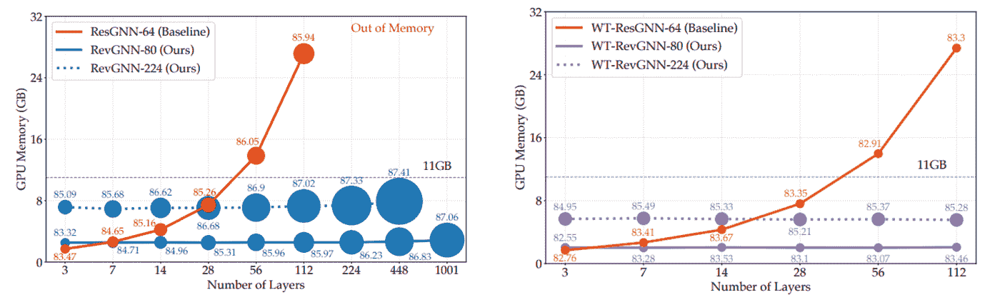**

**可逆(Rev)和重量捆绑(WT) GNNs 的良好缩放。来源:[【李】等](https://arxiv.org/pdf/2106.07476.pdf)**

**[**Godwin 等人**](https://arxiv.org/pdf/2106.07971.pdf) 介绍了一种利用递归学习深度 GNNs 的方法——消息传递步骤按块组织，每个块可以有 M 个消息传递层。然后，循环应用 N 个块，这意味着块共享权重。如果你有 10 个消息传递层和 10 个块，你会得到一个 100 层的 GNN。一个重要的组件是**噪声节点**正则化技术，该技术扰动节点和边缘特征并计算额外的去噪损失。该架构适合更好的分子任务，并在 QM9 和 OpenCatalyst20 数据集上进行了评估。**

**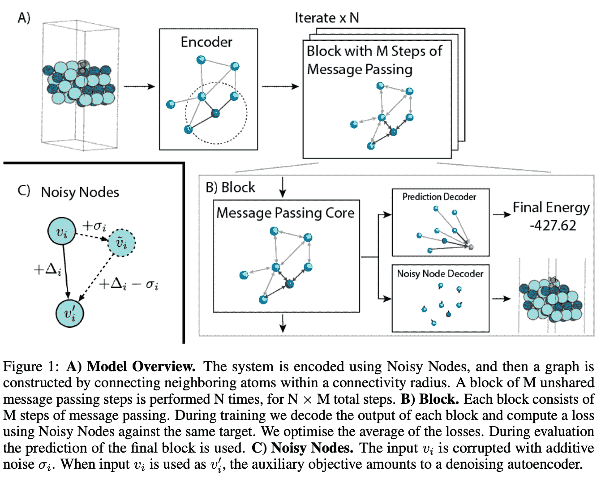**

**来源: [**戈德温等人**](https://arxiv.org/pdf/2106.07971.pdf)**

**最后，如果我们想要将任意的 GNN 缩放到非常大的图，除了采样子图，我们没有其他选择。通常，采样 k 跳子图会导致*指数*的内存开销和计算图大小。**

**PyG、 [**的作者 Matthias Fey 等人**](https://arxiv.org/pdf/2106.05609.pdf) 创建了 [GNNAutoScale](https://github.com/rusty1s/pyg_autoscale) ，这是一个在**常数**时间内扩展 GNNs 的框架，利用了历史嵌入(以前消息传递步骤的缓存的一个奇特版本)和图聚类(在这种情况下是一个众所周知的 METIS 算法)。在预处理过程中，我们将图划分为 B 个聚类(小批量),使得聚类之间的连通性最小化。然后，我们可以在这些集群上运行消息传递，跟踪缓存中更新的节点特性。实验表明，深度网络的 GNNAutoScale(最多 64 层)的性能与整批设置一样好，但内存需求却大大降低(大约小 50 倍)，因此您可以在商品级 GPU 上运行深度 gnn 和大型图形💪**

**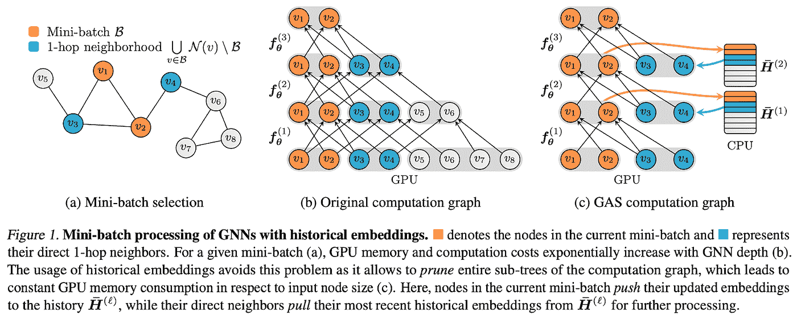**

**GNNAutoScale。来源: [**Fey 等人**](https://arxiv.org/pdf/2106.05609.pdf)**

# **知识图表**

> **KGs 上的表征学习终于突破了传导型的天花板。**

**在 2021 年之前，模型被清楚地分为直推式和归纳式，具有不同的归纳偏差、架构和训练机制。换句话说，直推模型没有机会适应看不见的实体，而归纳模型太昂贵，无法在中大型图上训练。2021 年带来了两种架构**

*   **在直推式和感应式环境下工作，**
*   **不需要节点特征，**
*   **可以以与直推模式相同的方式在感应模式中被训练，**
*   **可扩展到现实世界的千克大小。**

**第一个是[神经贝尔曼-福特网](https://github.com/DeepGraphLearning/NBFNet)由[朱**等人**](https://arxiv.org/pdf/2106.06935.pdf)组成。作者找到了一种非常优雅的方式来将经典的贝尔曼-福特推广到更高层次的框架，并展示了我们如何通过用特定的运算符实例化框架来获得其他众所周知的方法，如*卡茨指数*、 *PPR* 或*最宽路径*。更重要的是，他们表明广义贝尔曼-福特本质上是一种关系 GNN 架构(GNNs 和动态编程之间的*算法一致性*的另一个确认)。NBFNet 不学习实体嵌入(只学习关系和 GNN 权重),这使得模型通过设计归纳并推广到看不见的图。该模型在关系图和非关系图上的链接预测任务上工作得非常好。应用于 KGs，NBFNet 从 2019 年起为 FB15k-237 和 WN18RR 提供了最大的性能提升，同时参数减少了 100 倍💪。**

**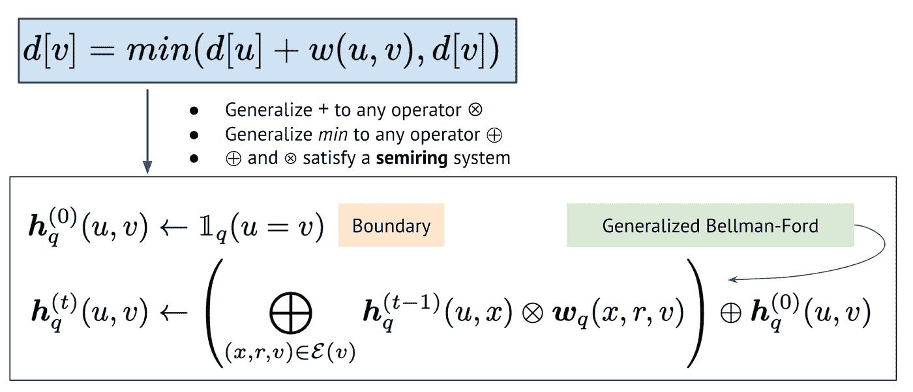**

**从香草贝尔曼-福特到神经贝尔曼-福特 GNN。来源: [**朱等**](https://arxiv.org/pdf/2106.06935.pdf)**

**🍰另一种方法由 [**Galkin 等人**](https://arxiv.org/pdf/2106.12144.pdf) (声明:本文作者之一是该论文的作者)受 NLP 中的标记化算法的启发，该算法具有固定的标记词汇表，能够标记任何单词，甚至是那些在训练时间看不见的单词。应用于 KGs， [NodePiece](https://github.com/migalkin/NodePiece) 将每个节点表示为一组 *top-k* 最近锚节点(可选地在预处理步骤中采样)和围绕该节点的 *m* 唯一关系类型。锚和关系类型被编码成可用于任何下游任务(分类、链接预测、关系预测等)和任何归纳/直推设置的节点表示。NodePiece 特性可以由 RotatE 等非参数解码器直接使用，或者发送到 GNNs 进行消息传递。该模型在归纳链接预测数据集上的表现与 NBFNet 不相上下，并在大型图上表现出高参数效率——在 [OGB 维基 2](https://ogb.stanford.edu/docs/leader_linkprop/#ogbl-wikikg2) 上的节点模型需要的参数比浅的纯直推模型少约 100 倍。如果你想了解更多，请查看关于 NodePiece 的完整博文[!](/nodepiece-tokenizing-knowledge-graphs-6dd2b91847aa)**

**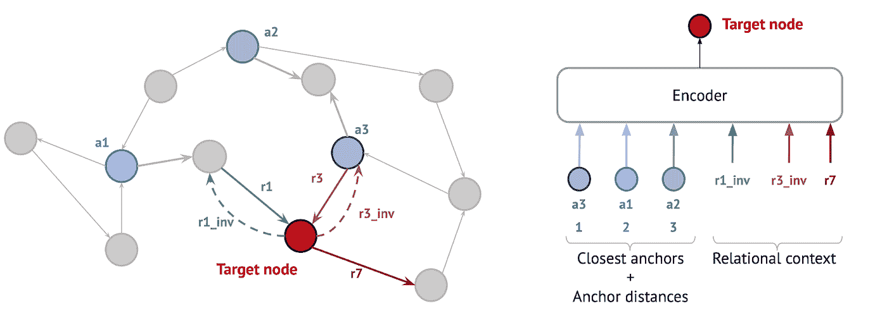**

**节点标记化。来源: [**加尔金等人**](https://arxiv.org/pdf/2106.12144.pdf)**

# **用 GNNs 进行总体上很酷的研究👀**

**这一节提到了几个特别酷的作品，它们使用了 GNNs，但并没有具体归入某一类别。**

**[**黄，何，**等人在 21 上提出了*正确&平滑*——一种用标签传播改进模型预测的简单方法。与一个 MLP 配对，这种方法在没有使用任何 gnn 和更少参数的情况下，以最高分冲击了 OGB 排行榜！今天，几乎所有在 OGB](https://arxiv.org/pdf/2010.13993.pdf) 的[节点分类赛道上的顶级模特都使用正确的&平滑来多挤一点点。](https://ogb.stanford.edu/docs/leader_nodeprop/)**

**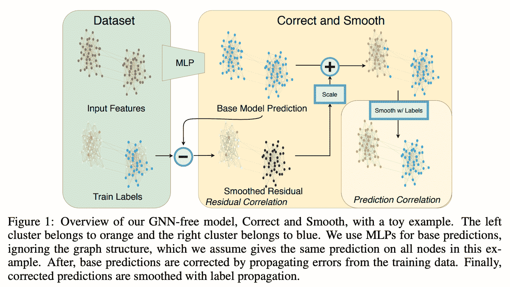**

**资料来源:[黄、何等](https://arxiv.org/pdf/2010.13993.pdf)**

**11 月，🪄 [**克尼亚泽夫等人**](https://arxiv.org/pdf/2110.13100.pdf) 在 **one** forward pass 中预测各种神经网络架构参数的工作震动了 ML 社区。也就是说，不是随机初始化模型，而是有可能立即预测好的参数，并且这样的模型已经比随机模型好得多👀。当然，如果你用 *n* SGD 步骤优化一个随机初始化的网络，你会得到高得多的数字，但是这篇论文的一个主要贡献是，通常不需要 **训练**这个特定的架构就可以找到合适的参数**。****

**参数预测实际上是一项图形学习任务——任何神经网络架构(ResNet、ViT、Transformers 等)都可以表示为计算图形，其中节点是具有可学习参数的模块，节点特征是这些参数，我们有一系列节点类型(例如，线性层、Conv 层、Batch Norm，作者使用了大约 15 种节点类型)。然后，参数预测是一项节点回归任务。用 GatedGNN 对计算图进行编码，并且将其新的表示发送到解码器模块。为了训练，作者收集了一个 1M 架构的新数据集(图)。该方法适用于任何神经网络架构，甚至适用于其他 gnn！**

**欲了解更多信息，请查看带有示例和 Jupyter 笔记本的[官方回购](https://github.com/facebookresearch/ppuda)，以及鲍里斯·克尼亚泽夫与扬尼克·基尔彻的[采访](https://www.youtube.com/watch?v=3HUK2UWzlFA)。**

**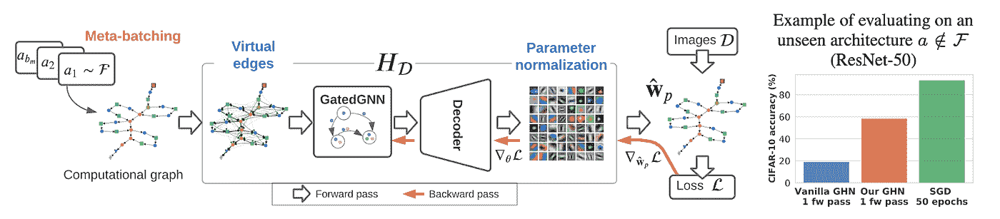**

**预测未知模型的参数:管道。来源: [**克尼亚泽夫等人**](https://arxiv.org/pdf/2110.13100.pdf)**

**🗺DeepMind 和谷歌通过将道路网络建模为超分段的图形并在其上应用 GNNs，极大地提高了谷歌地图中 ETA 的质量。在 Derrow-Pinion 等人 的论文中，该任务被设计为节点级和图级回归。除此之外，作者描述了为了在谷歌地图规模上部署该系统需要解决的众多工程挑战。一个应用 GNNs 解决数百万用户面临的实际问题的完美例子！**

**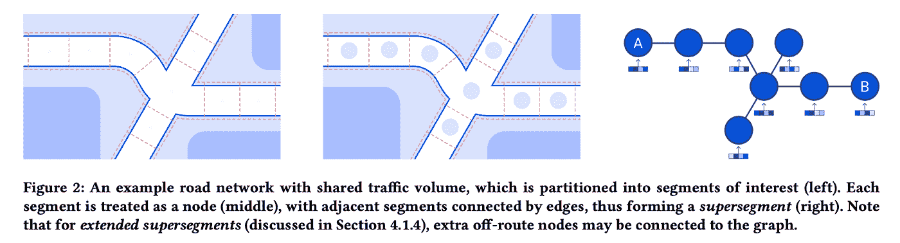**

**来源: [**德罗-皮恩等人**](https://arxiv.org/pdf/2108.11482.pdf)**

**GNNs 在癌症研究中的另一个潜在应用是最近由转基因和 NEC 宣布的。根据 NEC 首席研究员 [Mathias Niepert](http://www.matlog.net/) 的说法，gnn 被用于通过嵌入传播来估算缺失的患者数据(查看最近[关于该方法的 Twitter 帖子](https://twitter.com/Mniepert/status/1464166436297973761))，以及对候选肽进行评分以引发免疫反应。**

**最后，来自 DeepMind 的 [Davies 等人](https://www.nature.com/articles/s41586-021-04086-x)最近使用 GNNs 来帮助制定关于核心数学问题的猜想(关于他们工作中的🪢结🪢)，并且实际上发现并证明了一个新的定理！你看，GNNs 也可以处理相当抽象的事物👏**

# **新的数据集、挑战和任务**

**如果你厌倦了 Cora、Citeseer 和 Pubmed——我们理解你。2021 年带来了大量不同规模和特征的新数据集。**

*   **OGB 在 KDD 21 年组织了 [**大规模挑战赛**](https://ogb.stanford.edu/docs/lsc/) ，用 3 个非常大的图进行节点分类(2.4 亿个节点)、链接预测(整个维基数据，9000 万个节点)和图回归(4 百万个分子)。在 KDD 杯比赛中，大多数获胜团队使用 10-20 个模特的组合——查看[研讨会录音](https://snap.stanford.edu/graphlearning-workshop/)以了解更多关于他们的方法。新版本的 LSC 数据集现已推出新的排行榜！**
*   **[**Meta AI 的 Open Catalyst neur IPS ' 21 Challenge**](https://opencatalystproject.org/challenge.html)提供了一个大分子任务——给定一个具有原子位置的初始结构，预测松弛态能量。数据集非常庞大，需要大量的计算，但组织者暗示将发布一个较小的版本，对 GPU 预算有限的小型实验室更友好一些。结果和记录是可用的——等变模型和变压器达到了顶端。事实上，Graphormer 在 OGB LSC 和 OpenCatalyst'21 中都获得了前 1 名，几乎囊括了 2021 年 Graph ML 的大满贯🏅**
*   **关于图学习基准的研讨会**@ web conf 2021 带来了一系列新的数据集，包括由 [Lim 等人](https://arxiv.org/abs/2110.14446)的[非同构图](https://github.com/CUAI/Non-Homophily-Benchmarks)，由 [Tsitsulin 等人](https://graph-learning-benchmarks.github.io/assets/papers/GLB_Synthetic_Graph_Generation_Benchmark.pdf)的[图模拟](https://github.com/google-research/google-research/tree/master/graph_embedding/simulations)，由 [Rozemberczki 等人](https://graph-learning-benchmarks.github.io/assets/papers/Chickenpox_WebConf_21.pdf)的[时空图](https://github.com/benedekrozemberczki/spatiotemporal_datasets/)，以及更多****
*   ****[**NeurIPS 的 21 个数据集&基准测试跟踪**](https://nips.cc/Conferences/2021/DatasetsBenchmarks/AcceptedPapers) 就像*一个新数据集的 SXSW 节日*:今年我们有[MalNet](https://mal-net.org/#home)——图分类，平均图大小是 15k 个节点和 35k 条边，大大大于分子； [ATOM3D](https://www.atom3d.ai/) —新 3D 分子任务集合； [RadGraph](https://datasets-benchmarks-proceedings.neurips.cc/paper/2021/file/c8ffe9a587b126f152ed3d89a146b445-Paper-round1.pdf) —从放射学报告中提取信息。最后， [Liu 等人](https://arxiv.org/pdf/2110.14809.pdf)报告了创建图学习数据集分类的挑战——这是一项期待已久的工作，社区肯定会从中受益。****

# ****课程和书籍****

****新的和值得注意的课程和书籍:****

*   ****几何深度学习[原型书](https://arxiv.org/abs/2104.13478) & [课程](https://geometricdeeplearning.com/lectures/)由迈克尔·布朗斯坦、琼·布鲁纳、塔科·科恩和佩塔尔·韦利奇科维奇主讲。包含 12 个讲座和实践教程&研讨会。如果你喜欢视频记录，迈克尔的 ICLR 21[主题演讲](https://www.youtube.com/watch?v=w6Pw4MOzMuo)是今年发布的关于图表的最佳视频。****
*   ****[关于知识图谱的新开卷](https://kgbook.org/)由 18(！)作者。整本书在网络上是免费的；它包含了很多关于方法、模式和查询的细节。****

****[威廉·哈密顿《图形表示学》一书](https://www.cs.mcgill.ca/~wlh/grl_book/)。虽然技术上是在 2020 年发布，但从现代深度学习的角度来看，它仍然是对 GML 的最佳简短介绍。****

# ****库和开源****

****2021 年发布的新库:****

*   ****[**张量流 GNN**](https://github.com/tensorflow/gnn) —作为张量流世界一等公民的 GNNs。****
*   ****[**TorchDrug**](https://torchdrug.ai/) —基于 PyTorch 的 GNN 库，用于分子和 KG 任务****

****已建立的图形 ML 库得到更新:****

*   ******PyG 2.0——现在支持异构图、GraphGym 以及一系列改进和新模型******
*   ******[**DGL 0.7**](https://www.dgl.ai/) —在 GPU 上进行图形采样，更快的内核，更多的模型******
*   ****[**皮克 EN 1.6**](https://github.com/pykeen/pykeen) —训练 KG 嵌入的最佳库:更多的模型、数据集、指标和节点件支持！****
*   ****[**Jraph**](https://github.com/deepmind/jraph)**——GNNs 对于 JAX 的爱好者来说，看看这篇由王俐人(DeepMind)和尼古拉·约万诺维奇(ETH Zurich)关于构建和评估 GNNs 的[最新介绍](https://github.com/deepmind/educational/blob/f44b133905a96e1887f5909aedcae6811b2c37a3/colabs/summer_schools/intro_to_graph_nets_tutorial_with_jraph.ipynb)******

# ******如何保持更新🤓******

******2021 年到此为止！很可能，我们忽略了你的图形表示学习子领域中的一些重要的东西——让我们在评论中知道你认为我们错过了什么。******

******如何及时了解 Graph ML 中出现的所有新的酷东西:******

*   ******[图机学习](https://t.me/graphML)通道中的电报******
*   ******[米拉 GRL 阅读小组](https://grlmila.github.io/)(加拿大东部时间【美国时间】下午)******
*   ******[LoGaG 阅读小组](https://hannes-stark.com/logag-reading-group)(英国时间下午)******
*   ******[迈克尔·布朗斯坦在媒体上的博客](https://michael-bronstein.medium.com/)******
*   ******在 Twitter 上关注我，并在 Medium 上订阅；)******

******你坚持读完了长篇小说——你应该得到一张迈克尔·布朗斯坦与圣诞老人同构的照片！🎅******

*******感谢* [*安东·齐苏林*](http://tsitsul.in/) *、安瓦尔·库尔穆科夫* [*谢尔盖·伊万诺夫*](https://ivanovml.com/) *对博文内容的帮助，以及* [*佩塔尔·韦利奇科维奇*](https://petar-v.com/) *对少数不精确提法的修正。*******