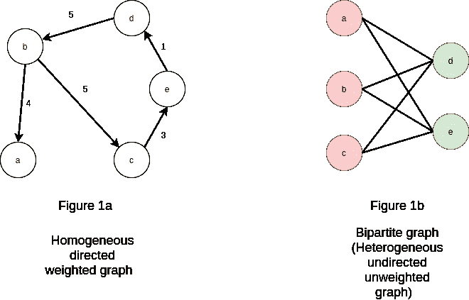
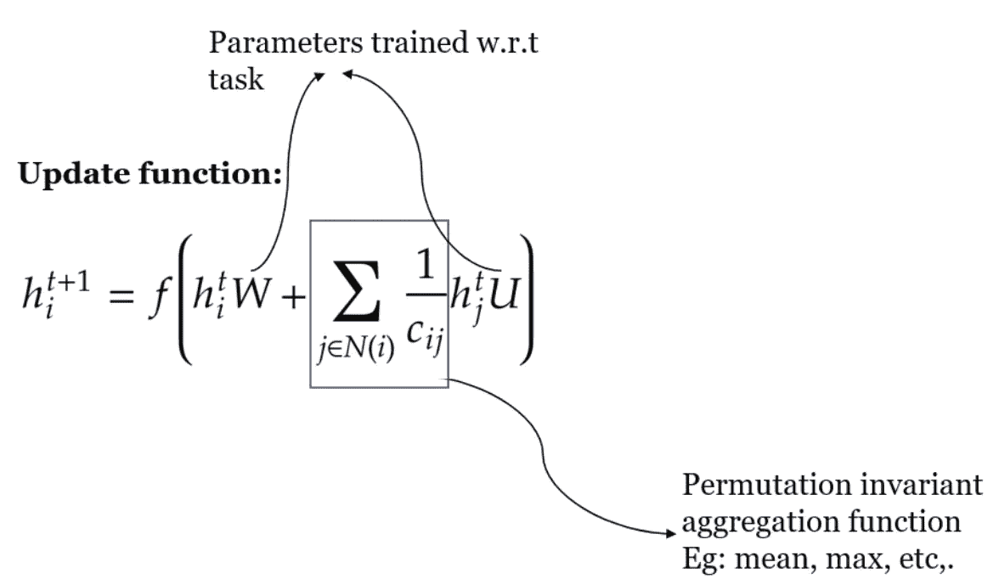
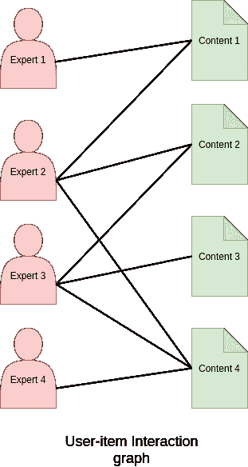
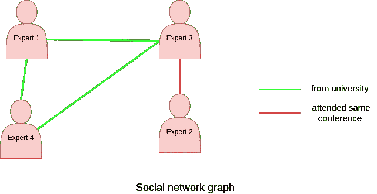
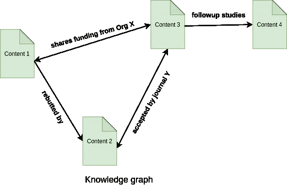
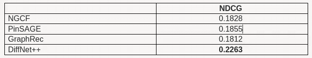

# 推荐系统的图形神经网络(GNN)结构

> 原文：<https://towardsdatascience.com/graph-neural-network-gnn-architectures-for-recommendation-systems-7b9dd0de0856?source=collection_archive---------3----------------------->

## **高级建议的 GNN 技术回顾**

[阿丽娜·格鲁布尼亚](https://unsplash.com/@alinnnaaaa?utm_source=medium&utm_medium=referral)在 [Unsplash](https://unsplash.com?utm_source=medium&utm_medium=referral) 上的照片

推荐系统无处不在，几乎指导着我们做出的每一个决定。从下一个节目我们将狂吃网飞到下一个我们将尝试的外卖食物，复杂的算法学习我们是谁，并使用这些知识来推动某些结果。在 B2B 领域，推荐系统正在赶上它们的 B2C 姐妹，我们在 Slimmer AI 开发的几个产品都包含推荐组件。

对于我自己的研究，我被图形神经网络(GNN)所吸引，这是最近流行的，许多问题都是用基于 GNN 的模型来解决的。gnn 的吸引力还在于开源工具和库的可用性，如 [Pytorch Geometric](https://github.com/rusty1s/pytorch_geometric) 和 [Deep Graph Library (DGL)](https://docs.dgl.ai/index.html) ，使得实现这些模型变得容易。

在本文中，我概述了如何使用 GNNs 实现推荐系统，并简要回顾了一些更流行的可用模型。要详细了解推荐系统中的 GNNs，请查看吴、等人的 2020 年调查**【2】**，这有助于我对该领域的理解。在详细介绍 GNN 在推荐中的应用之前，我将从一些关于图和 GNNs 的基础知识开始。

# **关于“图形”的复习**

*图*是由一组代表实体的*节点/顶点*和一组连接代表实体间关系的节点的*边*组成的结构。它有几个特点，包括:

*   边缘可以是*有向*(图 1a)或*无向*(图 1b)。即，对于有向图，关系是单向的，对于无向图，关系是双向的。
*   在许多情况下，实体之间的关系具有不同程度的重要性，这可以在图中使用*权重*来区分(图 1a)。如果未指定重要性，则假设每条边都具有相同的重要性。
*   在某些情况下，图形可以由多种类型的实体组成。例如，推荐图可以由用户和项目节点组成。这样的图被称为*异构*图(图 1b)，而不区分节点类型的图被称为*同构*图(图 1a)。
*   有许多特殊种类的图。对本文特别重要的一个图是*二分图*(图 1b)，这是一个由两个不相交的节点集组成的异构图，边只存在于相对节点集的节点之间。

举例说明图形的不同属性。图片作者。

# **关于图形神经网络(GNNs)的综述**

图形拓扑/结构编码了大量信息。使用传统的学习技术很难捕捉这种隐性知识。因此，将数据表示为图形有助于使底层关系清晰可见。GNNs 关注于利用这些知识的学习机制，以便为下游任务获得更好的性能，如评级预测(推荐系统中流行的任务之一)、相似内容检索等。

GNNs 的目标是使用邻域信息更好地学习实体/节点的*表示* / *嵌入*。GNNs 也可以用来学习*边*和*图* *表示法*，但为了简单起见，本文中我将重点介绍*节点表示法*。说了这么多，让我们简单看看 GNNs 是如何工作的:

*   GNNs 迭代地聚集来自邻居的*特征信息*，以更新每个节点的*当前表示*。
*   *聚合函数*确定如何组合从邻居收集的特征，例如*平均池*、*最大池*等。
*   下图显示了流行的 GNN 模型之一的图卷积网络(GCN)**【3】**的更新函数 *f* ，用于在时间 *t+1 更新节点 *i* 的表示 *h* 。*
*   对于每个*迭代*，节点的当前表示被用作下游任务的输入，其损失函数更新*可训练参数*。

在上面的更新函数中， ***h*** 代表节点 **i** ， ***t*** 代表时间步长， ***N(i)*** 代表节点 ***i*** ， *U* 和 *W* 是训练时更新的参数，***c _ ij*图片作者。灵感来自 [AI 与 Letitia](https://www.youtube.com/watch?v=me3UsMm9QEs) 的茶歇。****

因此，gnn 属于*表示学习技术*的范畴，该技术除了*内容*信息之外，还专注于捕获*拓扑*信息。

总而言之，GNNs 背后的三个主要思想是:

1.  *消息(信号)通过*:信息传播
2.  *聚合(更新)*:处理接收到的信息的功能
3.  *迭代*:确定信号的幅度

现在，让我们仔细看看 GNNs 的推荐。

# **GNNs for recommendation**

推荐系统用于为给定用户生成推荐项目的列表。推荐是从可用的项目集合(例如，电影、杂货、网页、研究论文等)中提取的。、)并根据以下内容为个人用户量身定制:

*   用户的偏好(隐式或显式)，
*   项目功能，
*   和/或用户项目过去的交互。

用户和项目数据的数量和质量决定了推荐的质量。大多数当前最先进的推荐系统使用深度学习技术。关于这些技术的全面概述，请查看张，帅等人 2019 年的调查论文**【4】**。

根据上面对推荐系统的描述，可以将数据建模为图:用户和项目作为节点，边表示节点之间的关系。这些关系可以从大多数推荐系统的输入数据中提取/推断出来。

有模型可用于处理*顺序推荐***【2】**，其中系统试图基于用户与前一时间步中的项目之间的“交互顺序”来推荐下一个项目。为了简单起见，我只关注一般的建议(建议的顺序是独立的)。

根据我们如何将可用数据建模为图形，有几种类型的基于 GNN 的模型可用于解决推荐问题。这些模型可以大致分为 3 种类型:

1.  使用用户-项目交互信息的 GNNs
2.  用社交网络信息增强的 GNNs
3.  用知识图增强的 GNNs

为了说明推荐的三种类型的 GNN 模型，考虑向专家推荐内容的问题，这将在本文中使用。目标是推荐与专家之前撰写的出版物相似的内容。*标题*、*简介*、*关键词*等信息。，有可能被用作内容的特征。此外，我们可以通过利用专家的*研究兴趣*、参加的*会议*等来模拟专家。

## **仔细观察:使用用户-项目交互信息的 GNNs**

在这类模型中，数据被建模为二分图。在我们的示例中，专家构成一组节点，内容构成另一组节点，如果专家是内容的原始作者之一，则节点之间存在边。

上图显示了一个用户-项目交互图的例子，这是一个由*专家*节点和*内容*节点组成的二分图，其中*边*表示专家是否是内容的作者之一。图片作者。

首先，下面是使用用户-项目交互的 GNNs 类别中的流行模型，它们的实现是可用的，并且易于实验:

**GCN**

**【3】【GCN 图卷积网】**是 GNN 最早的作品之一。神经图协同过滤(NGCF)**【5】**是一种 GCN 变体，它使用用户-项目交互来学习揭示用户之间行为相似性的协同信号，以改进推荐。*在 [Yelp2018](https://www.yelp.com/dataset) 和[亚马逊图书](https://jmcauley.ucsd.edu/data/amazon/)数据集上的评分预测*被用来衡量模型的性能。

*实现* : GCN — [PyG](https://github.com/rusty1s/pytorch_geometric/blob/master/examples/gcn.py) ，NGCF: [Tensorflow](https://github.com/xiangwang1223/neural_graph_collaborative_filtering)

**图表语法**

graph sage**【6】**是一个提出*采样*固定大小的邻域，而不是使用每个节点的所有邻居进行*聚合*的框架。它还提供了 *min* 、 *max、*或 *sum pooling* 作为聚合器的选项，并使用*串联*操作来更新节点/边/图表示。PinSage**【7】**是 GraphSage 的一个变种，作为处理 *web 级图形*的解决方案而提出。Pinterest 的 PinSage 引入了一种采样技术，根据最高访问量对固定大小的社区进行采样。或者，可以用区分节点重要性的任何特征来代替访问计数。

*实现* : GraphSage — [PyG](https://github.com/rusty1s/pytorch_geometric/blob/master/examples/reddit.py) ，PinSage — [DGL](https://github.com/dmlc/dgl/tree/master/examples/pytorch/pinsage)

**GAT**

图形注意网络**【8】**使用*注意*机制来学习邻居的*影响力*；这个*影响*用于确定邻居在聚合步骤中的贡献。多分量图卷积协同过滤(MCCF)**【9】**就是这样一种方法，它使用注意机制来学习潜在的购买动机，并将其与来自显式用户-项目交互的特征相结合，以获得更好的推荐。作者对 MCCF 在 [MovieLens](https://grouplens.org/datasets/movielens/) 、[亚马逊产品推荐](https://jmcauley.ucsd.edu/data/amazon/)和 [Yelp](https://www.yelp.com/dataset) 数据集上的表现进行了基准测试。

*实现* : GAT — [PyG](https://github.com/rusty1s/pytorch_geometric/blob/master/examples/gat.py) ，MCCF — [Pytorch](https://github.com/RuijiaW/Multi-Component-Graph-Convolutional-Collaborative-Filtering)

## **细看:GNNs 增强了社交网络信息**

在这类模型中，数据建模为:

1.  两个图:一个二分图*用户项目图*和一个单独的*社交网络图*，由用户和表示他们之间某种关系的边组成，或者
2.  由用户和项目组成的异构图，通过用户-用户和用户-项目边相互连接。

回想一下我们将内容与专家匹配的例子。我们可以根据他们的兴趣，他们可能属于的共同群体，或者任何其他社会或职业联系来建立一个社交网络图。以这种方式定义社交网络图，并使用学习到的特征，已经显示出对包括推荐**【2】**在内的许多下游任务是有益的。

上图展示了一个社交网络图的例子。图片作者。

以下是这一类别中一些有趣的模型(带有社交网络信息的 GNNs ),其源代码是可用的:

**DiffNet++**

diff net++**【10】**提出了一种网络，该网络从两个独立的图中更好地学习*用户嵌入*，其中潜在的*用户兴趣信号*来自用户-项目图，而*用户影响信号*来自用户-用户图。在 [Yelp](https://www.yelp.com/dataset) 、 [Epinions](https://snap.stanford.edu/data/soc-Epinions1.html) 和 [Dianping](https://lihui.info/data/dianping/) 上进行基准测试。

*实现*:diff net++—[tensor flow](https://github.com/PeiJieSun/diffnet)

**GraphRec**

graph rec**【11】**是另一个框架，它利用用户的社交网络来获得更好的推荐。在这种方法中，该模型从同一用户-项目异构(非二分)图中捕获用户-项目交互和用户意见。该框架执行:

1.  *用户建模*，丰富用户嵌入，利用用户-项目聚合和用户-用户嵌入(社会关系)，以及
2.  *项目建模*，其中项目嵌入使用用户-项目嵌入(即多个用户对该项目的看法)来丰富。

对于评级预测的下游任务，用户和项目嵌入的串联被用作输入。在 [Epinions 和 Ciao](https://www.cse.msu.edu/~tangjili/datasetcode/truststudy.htm) 数据集上的框架基准。

*实现* : GraphRec — [PyTorch](https://github.com/wenqifan03/GraphRec-WWW19)

## **细看:用知识图增强的 GNNs**

该类别中的模型专注于改进*项目表示*，这进而导致基于用户过去与可比项目的交互的更好的项目推荐。*知识图*常见于推荐领域，它根据项目的*属性*对项目进行链接或分组。然而，由于项目之间多类型关系的复杂结构，这些图形的处理可能具有挑战性。

回到我们将内容与专家相匹配的例子，可以使用内容的各种属性(比如共同的主题或题目)来形成知识图。

上图展示了一个知识图的示例，其中的节点是通过不同关系相互链接的内容。可以利用这种关系来丰富专家和内容节点的表示。图片作者。

在用知识图增强的 GNNs 类别中，一个特别有趣的模型是 KGAT:

**KGAT**

推荐用知识图注意力网络(KGAT)**【12】**基于 GAT。它构建了一个异构图，由作为节点的*用户*、*项目*和*属性*组成。它进一步递归地传播来自节点邻居的嵌入，以聚集和更新每个节点嵌入。邻居可以是任何类型的节点(例如，用户、项目或属性)，并使用注意机制来学习邻居的重要性。*评分预测*任务用于性能分析，并在[亚马逊图书](https://jmcauley.ucsd.edu/data/amazon/)、 [Yelp2018](https://www.yelp.com/dataset) 和 [Last-FM](http://millionsongdataset.com/lastfm/) 数据集上进行测量。

*实现* : KGAT — [张量流](https://github.com/xiangwang1223/knowledge_graph_attention_network)

# **选择合适的型号**

我选择上面提到的模型来说明各种类别的主要原因是因为在写这篇文章时它们的可访问性(开源实现、数据集的可用性等)。,).因此，我想强调的是，这个列表并不是绝对的，我只是触及了表面。

虽然每种类型的模型都有自己的优势，但选择正确的模型取决于可用数据的多样性。虽然来自社交网络图的信息已经被证明可以改善推荐**【10】**，但是并不是所有的域都可以容易地获得这样的信息。另一方面，在我们的数据时代，知识图谱非常丰富(例如，[维基百科](https://www.wikidata.org/wiki/Wikidata:Main_Page)， [DBpedia](https://www.dbpedia.org/) 等)。)，但是维护这样的图是资源密集且耗时的。

由于上述原因，比较不同的模型类型变得困难。在用于基准测试的各种数据集当中，Yelp 数据集是广泛使用的基准数据集，因此我将在下面使用它来比较这些模型。下面是 Yelp 数据集上 [NDCG](https://en.wikipedia.org/wiki/Discounted_cumulative_gain) 分数(排名质量的标准衡量标准之一)的对比:

所有上述实验使用 64 的嵌入维数和预处理的 Yelp 数据集，该数据集具有 17237 个用户、38342 个项目和 143765 个交互(边)。吴，乐等实验**【10】**。

从以上结果可以看出，从社交网络图中获取辅助知识的 DiffNet++在比较的模型中表现最好。虽然 KGAT**【12】**也在 Yelp 数据集上进行了基准测试，但它使用了由 45919 个用户、45538 个项目和 1185068 个交互(边)组成的不同的更大版本的数据集，因此，它与上述模型不可比。使用辅助知识源已被证明可以提高推荐的质量，因此，如果使用社交网络和知识图是可行的，应该选择混合模型。

# **收尾思路**

B2C 体验完全重塑了我们对推荐系统的期望，B2B 的门槛也大大提高了。出于这些原因以及更多原因，高级推荐系统需要智能和直观的解决方案，以充分利用可用数据。

推荐数据——由用户和商品组成——可以自然地建模成一个图表，而不需要太多的努力。GNNs 具有从节点信息(个体信息)和边信息(关系信息)学习的优点，并进一步与利用流行的知识图和社会网络图的模型相结合，使得 GNNs 成为推荐的有前途的解决方案。

作为一个非常活跃和动态的研究领域，新技术经常在各种会议上介绍。当然，当我们进一步将 GNNs 应用到我们自己的推荐系统中来取悦用户并提高他们对我们产品的满意度时，我会关注这个空间。

我错过了你最喜欢的 GNN 推荐技巧了吗？或者您在 B2B 软件产品中尝试过以上任何一种吗？我很想收到你的来信！请跟随更苗条的人工智能创新团队:[https://medium.com/slimmerai/innovation/home](https://medium.com/slimmerai/innovation/home)。

# **参考文献**

**吴，，等[图神经网络综述](https://ieeexplore.ieee.org/abstract/document/9046288) (2020)，IEEE 神经网络与学习系统汇刊 32.1(2020):4–24。**

****【2】**吴，，等，[图神经网络在推荐系统中的应用综述](https://arxiv.org/abs/2011.02260) (2020)，arXiv 预印本 arXiv:2011.02260。**

****【3】**Kipf，Thomas N，和 Max Welling，[利用图卷积网络的半监督分类](https://arxiv.org/abs/1609.02907) (2016)，arXiv 预印本 arXiv:1609.02907。**

****【4】**张，帅等，[基于深度学习的推荐系统:综述与新视角](https://dl.acm.org/doi/abs/10.1145/3285029) (2019)，ACM 计算调查()52.1(2019):1–38。**

****【5】**，王，向等，[神经图协同过滤](https://dl.acm.org/doi/abs/10.1145/3331184.3331267) (2019)，第 42 届国际 ACM 信息检索研究与发展会议论文集。**

****【6】**汉密尔顿，林子幸，Rex Ying，Jure Leskovec，[大型图上的归纳表征学习](https://proceedings.neurips.cc/paper/2017/file/5dd9db5e033da9c6fb5ba83c7a7ebea9-Paper.pdf) (2017)，第 31 届神经信息处理系统国际会议论文集。**

****【7】**应，Rex，等，[面向 web 规模推荐系统的图卷积神经网络](https://dl.acm.org/doi/abs/10.1145/3219819.3219890) (2018)，第 24 届 ACM SIGKDD 知识发现国际会议论文集&数据挖掘。**

****【8】**veli kovi，Petar，et al .[图注意网络](https://arxiv.org/abs/1710.10903) (2017)，arXiv 预印本 arXiv:1710.10903。**

****【9】**，王，肖等，[多分量图卷积协同过滤](https://ojs.aaai.org/index.php/AAAI/article/view/6094) (2020)，人工智能会议论文集。第 34 卷。№04.**

****【10】**吴，乐等， [Diffnet++:一种面向社会推荐的神经影响和兴趣扩散网络](https://arxiv.org/abs/2002.00844) (2020)，IEEE 知识与数据工程汇刊。**

****【11】**范，，等，[面向社会推荐的图神经网络](https://dl.acm.org/doi/abs/10.1145/3308558.3313488) (2019)，环球网大会。**

****【12】**王，向等， [KGAT:知识图注意网络推荐](https://dl.acm.org/doi/abs/10.1145/3292500.3330989) (2019)，第 25 届 ACM SIGKDD 知识发现国际会议论文集&数据挖掘。**