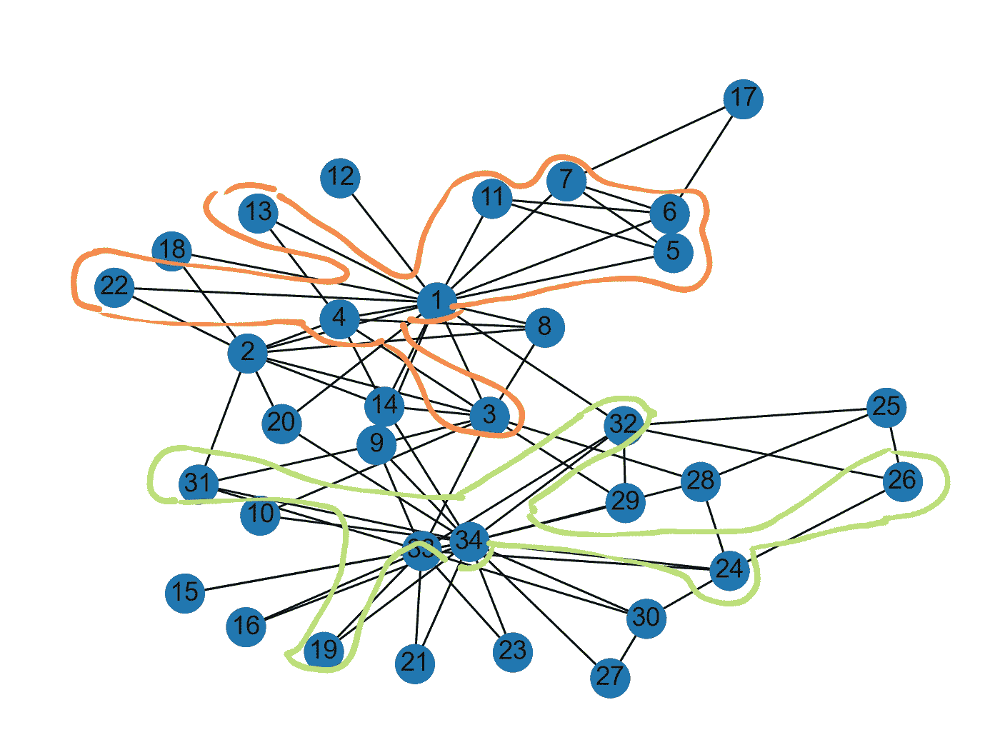
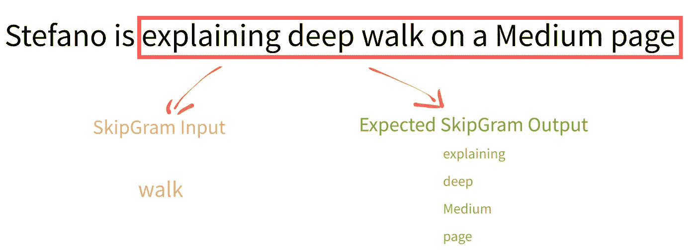
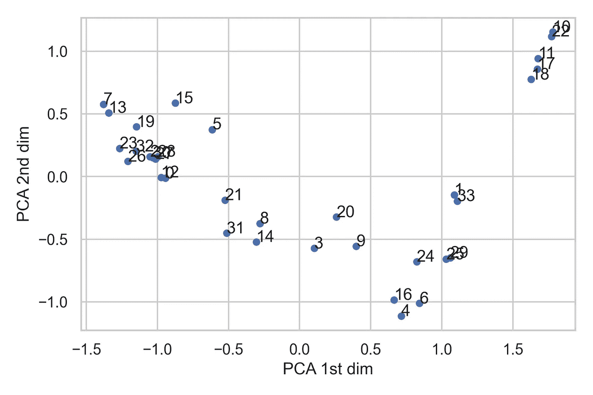

# 图形神经网络:2008 年以来的学习之旅——深度行走

> 原文：<https://towardsdatascience.com/graph-neural-networks-a-learning-journey-since-2008-deep-walk-e424e716070a?source=collection_archive---------23----------------------->

图形神经网络之旅的第三部分。今天，佩罗齐 2014 年论文《深度行走:社会表征的在线学习》的理论背景

图片由 [Wladislaw Sokolowskij](https://unsplash.com/@wsokolowskij) 在 [Unsplash](https://unsplash.com/photos/0vw4InAC-yM) 上拍摄

<https://medium.com/@stefanobosisio1/membership>  

[在本系列的第一篇文章中，我们学习了图形神经网络模型是如何工作的](/graph-neural-networks-a-learning-journey-since-2008-part-1-7df897834df9)。我们看到，GNN 返回基于节点和基于图形的预测，它有坚实的数学背景支持。特别地，转移函数和输出函数满足 Banach 不动点定理。然而，尽管成功的 GNN 应用，也有一些障碍，如解释[1]。GNN 模型的主要思想是建立状态转换，函数 *f𝓌* 和 *g𝓌* ，并迭代直到这些函数收敛在一个阈值内。这是一个强约束，可能会限制模型的可扩展性和表示能力。其次，GNN 不能利用*表示学习*，即如何从低维特征向量中表示图形。第三，GNN 基于迭代学习过程，其中标签是混合的特征。这种混合可能会导致一些级联错误，如[6]所示

为了解决这些问题，DeepWalk [2]在 2014 年出现，作为 GNN 的一个可能的增强。DeepWalk 是第一个实现*嵌入方法*的图，它基于表示学习和语言建模——skip gram 模型[3]

# 深度行走模型

## 定义

DeepWalk 通过对一系列短距离随机行走建模来学习图顶点的社会表现。*社会表征*是跨越图形顶点的隐藏连接，可以解码为潜在特征。因此，DeepWalk 读取输入图形并输出图形的潜在表示。

如何获得图形的潜在表示？嗯，**这里我们有与斯卡塞利的方法**的主要区别。斯卡塞利的 GNN 是一种有监督的方法，而 DeepWalk 是一种无监督的方法，因此它必须从图的特征中学习，以理解和捕捉图的结构和目标，独立于节点或图的标签。这种映射方法已被证明比其他社会维度分类器更有效[4，5]，将微观 F1 分数的分类性能提高了 5-10%，甚至在训练数据少 60%的情况下也优于“竞争对手”。最后，DeepWalk 框架允许简单的可伸缩性，以处理网络规模的图表，如脸书，Twitter 或 Youtube。

## 数学洞察 I:定义

DeepWalk 基于节点的社会属性返回输入图的有洞察力的潜在表示。图定义为数学函数 *G=(V，E)* ，是由 *V* 顶点和 *E* 边组成的。顶点可以部分标记， *Y 标记，*并由属性/特征 *X 描述。*属性/特征是实数域的一部分，其维数为 *S，*和标记由实数向量定义。

给定输入真实域，DeepWalk 将节点的特征 *X* 转换为潜在域，其维度为 *d.* 这种映射描述了具有较小特征子集的社会现象，这有助于更好地理解底层数据的关系，并在摄取到 PCA 或 t-SNE 算法中时具有即时的视觉答案。

为了理解 DeepWalk 的理论和过程，在处理实际实现之前，[我在这里提供了一个空手道俱乐部图的例子](/graph-neural-networks-a-learning-journey-since-2008-part-2-22dbf7a3b0d?source=user_profile---------1----------------------------)。图 1 示出了输入图 G，其中顶点是 34，边是 78。

图 1 输入空手道俱乐部图表

输入特征矩阵 *X* 描述了节点之间的关系，我们希望使用 DeepWalk 找到图形的潜在表示，以找到俱乐部中的最佳分组。例如，潜在表示维度可以是 10，因此 DeepWalk 将产生 10 个新特征来将图细分成组。

## 数学洞察 II:随机漫步的产生

为了实现潜在表示，DeepWalk 开始从输入图创建γ(例如 100)个随机行走。随机游走 *Wvᵢ* 从顶点 *vᵢ* 开始，随机选择 *k* (例如 10 个)其他图的顶点 *vₖ* (例如见图 2)

图 2:顶点 22 和 31 的截断随机行走的例子。随机漫步允许轻松地同时探索多个图形区域

随机漫步的选择允许算法从网络中提取信息，一方面保证计算的容易并行化，另一方面保证探索图形的动态方式，一旦图形改变，可以封装新的信息。后一方面允许从单个图子集迭代更新模型训练，而没有整个图计算的问题。

## 数学洞察 III:语言建模

一旦收集了γ(例如 100)“截断的”随机游走，就有可能利用一些语言建模来提取输入社会表征的潜在描述。特别地，随机漫步的集合可以被看作是由 *k* 单词 *w* : *Wvᵢ = (w₀，w₁，…wₖ).)组成的句子的编码集合(图 3 显示了 10 个随机漫步的例子)从这里，DeepWalk 计算所有输入语料库 G* 的单词嵌入或节点嵌入表示。这是一个值得注意的点，因为这是在图形世界中第一次有人写节点嵌入的概念。

图 3:从顶点 22、13、31、16、10、5、17、16、24 和 18 开始的 10 次随机漫步。

单词嵌入可以由一个函数φ来描述，该函数的值位于实数域中。φ是一个矩阵，它的维数是顶点数 *V* 和潜在维数 *d* (在这个例子中是 34 x 10)。目标是在给定所有先前访问过的顶点嵌入的情况下，检索观察到顶点 *vᵢ* 的可能性:

等式 1:给定所有先前的顶点嵌入，顶点 vi 被观察到的可能性

然而，这种计算取决于图的维数和随机游走的长度，因为它们在增长。等式 1 是计算性的，效率不高。在[7] [8]中提出了一个解决方案，其中问题是相反的。如图 4 所示，我们将计算一个单词在给定上下文中作为邻居出现的可能性，而不是预测一个句子中缺失单词的出现

图 SkipGram 方法的直观示例。给定一个句子，我们希望预测一个单词与给定单词相邻的可能性(例如 walk)。

这种方法称为 skip gram[7–11]，旨在解决这一优化问题:

等式 SkipGram 的优化问题。目的是在给定单词 v_i 的映射的情况下，通过估计上下文单词的对数似然来最小化嵌入表示

从等式 2 可以描述 d 维潜在表示中的顶点，使得相似的顶点具有相似的表示。

## 数学洞察 IV:分层 Softmax

仔细观察 SkipGram 算法，我们可以获得以下“成分”:

*   尺寸为 *w* 的窗口滑过输入序列
*   单词嵌入潜在维度 *d*
*   一个 2 层神经网络，接收输入语料库
*   计算单词概率分布的激活层

对于给定随机漫步中的每个顶点 *vᵢ* ，我们有一个表示向量*φ(vᵢ*。给定这个顶点表示，我们希望在随机行走中最大化它的邻居的概率(等式 2)。这样的后验分布可以通过几种算法来学习。在 DeepWalk 中，该模型使用分层的 Softmax 方法[12，13]，这减轻了计算成本并加快了训练时间，从而逼近概率分布。计算后验概率可能会导致巨大的工作量，这等于图中顶点的数量(在某些情况下高达数十亿)。

分级 Softmax 基于一个二叉树，即霍夫曼树/编码，它确保了属于任何树节点每一侧的点的分布之间的平衡。来自等式 2 的顶点 *vᵢ* 是根节点。从那里，我们可以从随机漫步到最后一个顶点创建分支。最终的后验概率是通过从词根开始遍历树来计算我们遇到的每个单词的概率之和。

## 最后备注:想象嵌入

最后会有什么？一旦 DeepWalk 已经运行，Skipgram `Word2Vec`模型将返回我们的输入图的潜在空间描述，即一个图嵌入文件:

图 5:空手道俱乐部图的最终嵌入示例。数字 34 和 10 是图的节点数和潜在表示维度。对于每个顶点节点(每行的第一个数字，例如 34，1，33，3，2)，我们可以找到相关的潜在表示坐标

对于每个顶点，该文件报告模型的嵌入，即顶点在潜在表示空间中的位置。我们如何使用这种表示法？嗯，我们可以使用至少两种分解算法来获取这样一个空间的“人类”表示。第一个是 [t-SNE 方法](https://en.wikipedia.org/wiki/T-distributed_stochastic_neighbor_embedding)【14】，第二个是[主成分分析(PCA)](https://en.wikipedia.org/wiki/Principal_component_analysis) 。图 6 显示了空手道俱乐部输出嵌入的 PCA 分解。正如你所看到的，根据输入特征/节点间的关系，DepeWalk 可以检索至少 3 个空手道俱乐部细分的主要组。这使得人们可以分析巨大的图表，例如脸书网页，了解网页之间的社会关系，而不用担心处理表示和标签。

图 6:空手道俱乐部深走嵌入的 PCA 2 维表示

请继续关注我们的下一篇文章:DeepWalk 的两个实际应用，以全面了解 Python 实现:)

如果有任何问题或意见，请随时给我发电子邮件，地址是:stefanobosisio1@gmail.com，或者直接在 Medium 这里。

# 文献学

1.  周，解，等，“图形神经网络:方法与应用综述”*艾公开赛*1(2020):57–81。
2.  佩罗齐、布莱恩、拉米·艾尔弗和史蒂文·斯基纳。"深度行走:社交表征的在线学习."*第 20 届 ACM SIGKDD 知识发现和数据挖掘国际会议论文集*。2014.
3.  《向量空间中单词表征的有效估计》arXiv 预印本 arXiv:1301.3781 (2013)
4.  唐、雷、。"通过潜在社会维度的关系学习."*第 15 届 ACM SIGKDD 知识发现和数据挖掘国际会议论文集*。2009.
5.  唐、雷、。“利用社交媒体网络进行分类。”*数据挖掘和知识发现*23.3(2011):447–478。
6.  内维尔，詹妮弗和大卫·延森。"使用集体推理的模型偏差/方差分解."*机器学习*73.1(2008):87–106。
7.  《向量空间中单词表征的有效估计》 *arXiv 预印本 arXiv:1301.3781* (2013)。
8.  单词和短语的分布式表征及其组合性。*神经信息处理系统的进展*。2013.
9.  大卫·格思里等着，〈跳过语法建模的更近距离观察〉。 *LREC* 。第六卷。2006.
10.  Gittens，Alex，Dimitris Achlioptas 和 Michael W. Mahoney。" Skip-Gram Zipf+Uniform =矢量可加性."计算语言学协会第 55 届年会会议录(第一卷:长篇论文)。2017.
11.  明诺、大卫和劳雷·汤普森。"负抽样跳跃图的奇异几何."*自然语言处理中的经验方法*。2017.
12.  Mnih，Andriy 和 Geoffrey E. Hinton。"一个可扩展的分层分布式语言模型."*神经信息处理系统进展*21(2008):1081–1088。
13.  莫林，弗雷德里克，还有约舒阿·本吉奥。"分层概率神经网络语言模型."人工智能与统计国际研讨会。PMLR，2005 年。
14.  辛顿、杰弗里和萨姆·t·罗伊斯。“随机邻居嵌入。”*钳口*。第 15 卷。2002.