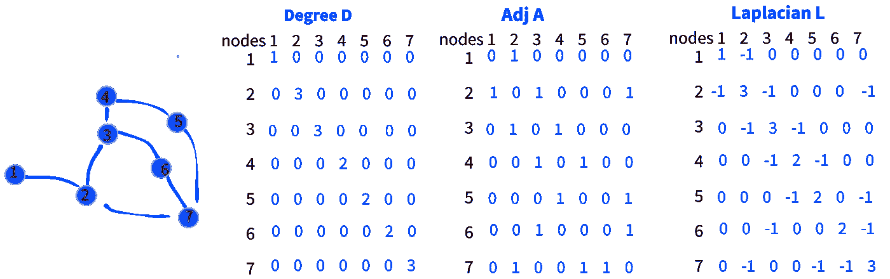
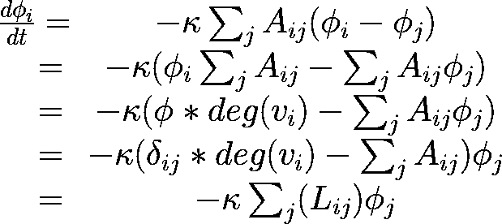

# 图形神经网络:2008 年以来的学习之旅——图形卷积网络

> 原文：<https://towardsdatascience.com/graph-neural-networks-a-learning-journey-since-2008-graph-convolution-network-aadd77e91606?source=collection_archive---------15----------------------->

图形卷积网络(GCN)在数学上很难理解，但是让我们跟随我的第四篇文章，一步一步地分解 GCN

约翰·罗德恩·卡斯蒂略在 [Unsplash](https://unsplash.com/photos/rQqWOHZ96OM) 上拍摄的图片

<https://medium.com/@stefanobosisio1/membership>  

我以前关于图形和 ML 的帖子:

*   [图形神经网络:2008 年以来的学习之旅——第一部分](/graph-neural-networks-a-learning-journey-since-2008-part-1-7df897834df9?source=your_stories_page----------------------------------------)
*   [图形神经网络:2008 年以来的学习之旅——第二部分](/graph-neural-networks-a-learning-journey-since-2008-part-2-22dbf7a3b0d?source=your_stories_page----------------------------------------)
*   [图形神经网络:2008 年以来的学习之旅——深度行走](/graph-neural-networks-a-learning-journey-since-2008-deep-walk-e424e716070a?source=your_stories_page----------------------------------------)
*   [图形神经网络:2008 年以来的学习之旅——Python&深度行走](/graph-neural-networks-a-learning-journey-since-2008-python-deep-walk-29c3e31432f?source=your_stories_page----------------------------------------)

在我们之前的文章中，我们看到了斯卡塞利的图形神经网络思想[1–4]如何彻底改变了构建典型 ML 问题的方式。自 2008 年以来的几年中，图上的 ML 已经成为一个热门话题，越来越完善和改进了 Scarselli 的第一个开创性方法。上一次我们看到了 Perozzi 的 DeepWalk 方法[5]对 GNN 的改进，社区第一次开始讨论“节点嵌入”[6–8]。

今天要给大家展示一个非常流行的算法:图卷积网络[9]。这篇文章涵盖了 2014 年至 2017 年间的出版物。在这 3 年里，科学家们投入了大量的精力将著名的卷积神经网络方法应用于图形。事实上，为什么卷积在图像上非常有效？为什么不能直接应用到图中？如何将图转化为卷积项？有什么数学方法可以让我们达到这个目的吗？

在这篇文章中，我们将涵盖 GCN 的理论方面，从定义卷积运算到图形卷积。下一次，我们将介绍 Kipf GCN 算法的 Tensorflow 实现。

# 卷积什么？

神经网络是一个连续的*仿射变换*【15，16】:给定一个输入向量，网络将其乘以一些矩阵，生成一个输出。输入向量可以是 1D 信号、图像、视频，并且通常是多维数组。该阵列具有不同的轴，例如，图像具有专用于 RGB 通道的轴，另一个轴定义高度，另一个轴定义宽度。仿射变换中不使用轴，这里卷积开始发挥重要作用，以帮助神经网络输出产品。离散卷积[17]是一种*线性变换，*，其中输入特征图和卷积核相乘

图 1:图像卷积的例子。A)3×3 像素大小的核乘以给定图像(输入特征图，例如 10×10)中的重叠区域。橙色阴影区域定义了与卷积(黑色)内核相乘的输入要素地图区域。b)对于重叠的 3x3 区域，点积返回 1 个单值。基于步距值，卷积继续下一个输入区域(例如，这里我们将卷积核移动 3 个像素)。作者图片

每个重叠的输入特征地图片是具有滑动卷积核的点积，返回最终的输出图像/矢量。为了固定一些关于卷积的一般概念，我们可以用数学方法将卷积定义为积分:

等式 1:卷积积分。在时域中，在输入特征矩阵 f 上执行的卷积是输入 f 的域上的积分

其中 *f* 为输入特征图，*圆星*为时域卷积运算， *g* 为输入卷积核。卷积是在输入特征映射域τ上的积分，由 *dτ* 定义(例如，这可以是立方体、由图像定义的平面、向量等)， *g(t- τ)* 是卷积核，其在输入特征映射上滑动τ步 *f(τ)* 。这个积分可以转换成一个和，得到一个离散的卷积。这里，内核可以基于以下参数化:

*   *n* 输出特征地图的数量
*   *m* 输入特征地图的数量
*   *k* 轴上定义的ⱼthe 内核尺寸 *j*

卷积层沿轴 *j* 的输出大小 *oⱼ* 受以下因素影响:

*   *I*ⱼ*t31】输入沿轴尺寸 *j**
*   *kⱼ* 沿轴线的内核尺寸 *j*
*   *sⱼ* 沿轴的步幅 *j*
*   *pⱼ* 沿轴补零 *j*

我们可能会发现这些术语不时出现在我们的卷积码中，为了使它更清楚:

*   步幅是内核的两个连续位置之间的距离
*   零填充是添加到图像中的零的附加“帧”,通常是为了使图像大小达到 2 的幂

卷积与神经网络配合得很好，提供了输入信号的线性变换。然而，卷积只有且仅当:

*   可以在网格上描述输入信号(例如向量、图像、3D 立方体)
*   输入具有主要的局部统计(例如，一组像素主导图像的信息内容)

当处理 3D 网格或社交媒体数据，即图形时，这是一个很大的问题。这些对象没有基于网格的数学域，因此卷积不能将图形作为输入信号进行处理。然而，数学可以帮助我们，提供一个绝妙的解决方案。

## 图表:数学见解

为了在图上应用卷积，第一个技巧是获得地图*位置* [10]的新定义。在图像情况下，局部性可以被认为是主要的局部统计。在图*中，G=(N，E)* (或 *G=(V，E)* 根据 Kipf 的论文【9】)，给定阈值δ，局部性可以基于节点的邻域来表示:

等式 2:图中的局部性。给定节点特征必须满足的阈值，我们可以定义节点 j 的局部性，查看满足给定特征值 Wij 阈值的所有节点 I

在给定一个节点 *j* 的情况下，邻域局部性可以被表示为其特征 *W* ᵢⱼare 大于给定阈值的所有那些节点 *i* 。

由此，有可能得到该图的紧凑表示，其中节点的邻域平均值可以用作节点特征值，如图 2 所示

图 2:图中的位置。通过等式 2 定义局部性可以通过将其特征与其所有相邻(红色圆圈)特征的值进行平均来获得红色节点的隐藏表示。图片由作者提供，灵感来自吴*等人*【18】

对于平均局部性，卷积滤波器可以接受邻域主导统计，输入层的大小最大为 *O(S*n)* ，其中 *S* 是给定 *n* 个节点的邻域大小的平均值。

第二个基本技巧是从图的数学表示中提取属性，拉普拉斯矩阵*L*【19】。一个拉普拉斯定义为 *L = D — A* ，其中 *D* 为度矩阵， *A* 为邻接矩阵。 *D* 矩阵指出每个节点有多少个连接，而 *A* 哪些节点相互连接(图 3)

图 3 左边的示例图，每个节点的度 D 矩阵，邻接矩阵 A 和拉普拉斯 L，其中 L=D-A。

因此，Laplacian 是描述图以及节点的连接如何影响图的动力学的一种伟大的、简洁的和高度信息化的方式。为了进一步欣赏和理解拉普拉斯在图上的作用，我们可以看到一个经典的例子，它解释了热量如何在给定的图上扩散。给定一个热变量*φ*，其中*φᵢ*是节点 *i* 和节点 *j* 中*φ*ⱼ的热量，从经典物理学中我们知道从 *i* 传递到 *j* 的热量与材料热容 *κ* 成正比，如*κ(φᵢ—φⱼ)*。因此，热量随时间在曲线图中的演变可以通过以下等式来描述:

方程 3:图上的热量方程。节点 I 和 j 之间的热传递可以容易地分解成图的拉普拉斯算子

[这个等式可以用 Python 代码实现，我们可以得到热扩散:](https://en.wikipedia.org/wiki/Laplacian_matrix#Example_of_the_operator_on_a_grid)

图 4:通过拉普拉斯热方程在图上的热扩散。随着时间的推移，热量在节点的邻居之间平稳地扩散。图片由 [Ctralie](https://commons.wikimedia.org/w/index.php?title=User:Ctralie&action=edit&redlink=1) 、[知识共享许可](https://creativecommons.org/licenses/by-sa/3.0/)、[链接](https://en.wikipedia.org/wiki/Laplacian_matrix#/media/File:Graph_Laplacian_Diffusion_Example.gif)

正如你所看到的，拉普拉斯矩阵 L 告诉我们热量如何从(本例中为三个)起始点均匀地扩散到整个图表中。

## 填补空白:拉普拉斯和傅立叶变换

*L* 可以表示为对称正交矩阵(等式 4)

等式 4:拉普拉斯算子可以表示为对称正交矩阵

其中 *I* 是单位矩阵， *-1/2* 是度矩阵 *D* 的幂， *A* 是邻接矩阵。对称正交 L 矩阵是半正定的，这保证了它有实的特征向量和特征值。

该条件允许通过频谱分解(等式 5)来表达 *L*

等式 5:拉普拉斯矩阵的频谱分解

其中 *U* 是正交矩阵基，*λ*是具有正特征值的对角矩阵， *T* 幂代表转置。*uλ*构成实数域中的标准正交基。由此可见, *L* 的每个特征向量可以与图中的相应节点相关联。如果节点改变位置，那么特征向量将相应地重新排列— *排列不变。*其次， *L* 的本征函数可以进一步重排为复指数。

此时，你的脑海中应该会响起一个铃声。[通过欧拉公式，复指数可视为时域中的一系列正弦曲线](https://czxttkl.com/2018/10/07/eulers-formula/)。这意味着傅立叶变换和拉普拉斯特征值之间存在关系。在傅立叶域中，卷积(等式 1)是输入信号 *x* 和卷积核 gϑ:之间的乘法

等式 6:输入信号的拉普拉斯算子(图)和傅立叶域中的卷积之间的关键关系

其中 *F* 代表傅立叶变换， *U* 是归一化图拉普拉斯的特征向量的矩阵(等式 5)。这意味着拉普拉斯算子定义了傅立叶基，因此它返回输入图的傅立叶基视图，因此拉普拉斯算子可用于计算图上的卷积。具体而言，通过计算图的拉普拉斯算子的特征向量，可以在给定图的频谱上计算卷积及其权重[20]。

# Thomas Kipf 和 Max Welling 在 2017 年发表的《图形卷积网络》

现在，所有这些数学框架都很棒，我们可以考虑将拉普拉斯谱分解应用于一个图，将其传递给一些神经网络层和激活函数，工作就完成了。不幸的是，通过拉普拉斯算子的卷积在计算上是不可行的，并且非常昂贵。为了解决这个问题，Kipf 和 Welling 以及 Hammond 在 2011 年的论文中提出了傅立叶卷积滤波器 gϑ:的切比雪夫多项式 *Tₖ(x)* 的截断展开

方程 7:用切比雪夫多项式逼近卷积滤波器

其中*θ’*表示切比雪夫多项式系数的向量， *Tₖ* 是切比雪夫多项式的递归公式，λ是基于图拉普拉斯矩阵的最大特征值的重定标常数。将等式 7 并入等式 7，可以获得卷积的最终切比雪夫近似:

等式 8:图形卷积的切比雪夫近似

等式 9:重新缩放的拉普拉斯算子

其中 tilded L 是重新缩放的图拉普拉斯算子(等式 9)。该表达式是 *K* 局部化的，即它是拉普拉斯算子中的第*K*阶切比雪夫多项式，因此它仅依赖于距离中心节点最多 *K* 步的节点 *N* (重新定义图的局部性)。然后计算复杂度降低到 *O(E)* ，所以依赖于边数。

给定等式。8 上图卷积网络可以通过堆叠多个卷积层来实现，每层之后是逐点非线性。因此，对于给定的层 *l+1* ，图的逐层传播将是:

等式 10:GCN 的逐层传播规则

其中 *H* 是第*l*或*l+1*层的激活矩阵，σ是类似于 *ReLu* 的激活函数， *W* 是特定层的可训练权重矩阵。这是图卷积神经网络的核心公式，由 Kipf 在 2017 年提出。现在让我们看看空手道俱乐部的 Python 实现！

# 空手道俱乐部和 GCN

首先，让我们直接从`networkx` Python 库加载空手道俱乐部:

图 5:导入库并创建空手道幼崽

其次，我们可以创建图邻接矩阵`adj`和一个简单的一键编码图特征矩阵`X` *:*

图 6:创建空手道俱乐部邻接表和特征(一键编码矩阵)

然后，我们将创建度矩阵`deg`，通过一个自连接邻接矩阵`adj_self`，即带有自项连接的邻接矩阵:

图 7:邻接自连接矩阵和归一化度矩阵

现在，是时候实现 GCN 方法了，如图 8 所示。最初，我们需要定义 ReLu 函数，这只是`np.maximum(input_value, 0)`。其次，我们可以定义 GCN 中的逐层传播规则，即等式 10。该函数将邻接矩阵、度矩阵、图形特征矩阵和第 I 层权重作为输入。最后，初始化层权重，设置 2 层——但是你可以设置任意多的层——给 GCN 一个机会！

图 8: GCN 实现:ReLu 函数、分层传播、权重初始化和模型运行。

请继续关注我们的下一篇文章:我们将深入研究 Kipf 使用 Tensorflow 的 GCN 实现。

如果有任何问题或意见，请随时给我发电子邮件，地址是:stefanobosisio1@gmail.com，或者直接在 Medium 这里。

# 文献学

1.  《网页排序的图形神经网络》。*2005 年 IEEE/WIC/ACM 网络智能国际会议(WI'05)* 。IEEE，2005 年。
2.  戈德堡，安德鲁 v，和克里斯哈里森。"计算最短路径:搜索符合图论."*汽水*。第五卷。2005.
3.  《网页排序的图形神经网络》。*2005 年 IEEE/WIC/ACM 网络智能国际会议(WI'05)* 。IEEE，2005 年。
4.  《图形神经网络模型》 *IEEE 神经网络汇刊*20.1(2008):61–80。
5.  佩罗齐、布莱恩、拉米·艾尔弗和史蒂文·斯基纳。"深度行走:社交表征的在线学习."第 20 届 ACM SIGKDD 知识发现和数据挖掘国际会议论文集。2014.
6.  《向量空间中单词表征的有效估计》arXiv 预印本 arXiv:1301.3781 (2013)
7.  唐、雷、。"通过潜在社会维度的关系学习."*第 15 届 ACM SIGKDD 知识发现和数据挖掘国际会议论文集*。2009.
8.  唐、雷、。“利用社交媒体网络进行分类。”*数据挖掘和知识发现*23.3(2011):447–478。
9.  基普夫，托马斯 n，和马克斯韦林。"图卷积网络的半监督分类." *arXiv 预印本 arXiv:1609.02907* (2016)。
10.  琼·布鲁纳等着《图上的谱网络和深局部连通网络》第二届学习代表国际会议，ICLR 。第 2014 卷。2014.
11.  阿特伍德，詹姆斯和唐·陶斯利。"扩散卷积神经网络."*神经信息处理系统的进展*。2016.
12.  迪费拉德、米歇尔、泽维尔·布列松和皮埃尔·范德盖恩斯特。"具有快速局部谱滤波的图上的卷积神经网络."神经信息处理系统进展 29(2016):3844–3852。
13.  学习分子指纹的图形卷积网络。 *arXiv 预印本 arXiv:1509.09292* (2015)。
14.  哈蒙德、大卫·k、皮埃尔·范德盖恩斯特和雷米·格里邦瓦尔。"通过谱图论研究图上的小波."*应用和计算谐波分析*30.2(2011):129–150。
15.  学习仿射变换。*模式识别*32.10(1999):1783–1799。
16.  李，文静，和唐利。"仿射不变匹配的 Hopfield 神经网络."IEEE 神经网络汇刊 12.6(2001):1400–1410。
17.  离散傅立叶变换和卷积的算法。斯普林格，1989 年。
18.  吴，，等，“图神经网络综述” *IEEE 神经网络和学习系统汇刊*32.1(2020):4–24。
19.  《拉普拉斯矩阵》 [*https://mathworld。*](https://mathworld.) *沃尔夫拉姆。com/* (1999)。
20.  Singh，Rahul，Abhishek Chakraborty 和 B. S. Manoj。"基于有向拉普拉斯的图形傅立叶变换." *2016 国际信号处理与通信会议(SPCOM)* 。IEEE，2016。