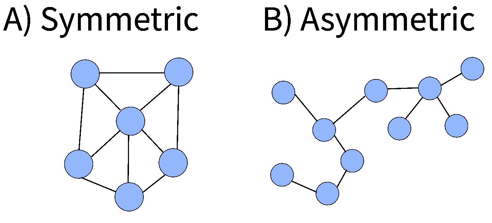
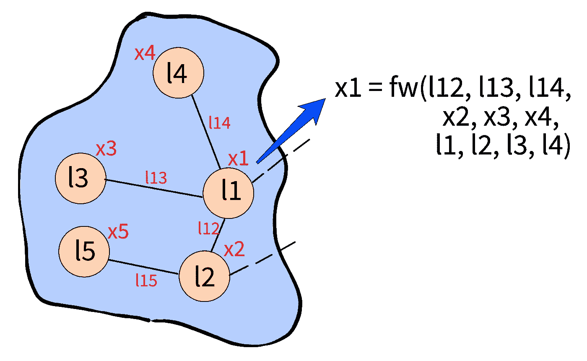
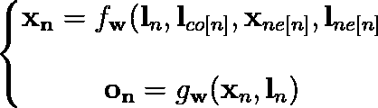
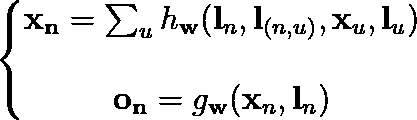
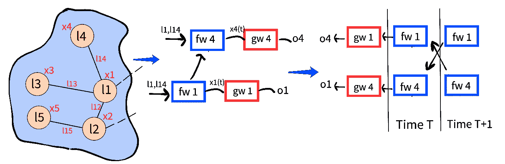

# 图形神经网络:2008 年以来的学习之旅——第一部分

> 原文：<https://towardsdatascience.com/graph-neural-networks-a-learning-journey-since-2008-part-1-7df897834df9?source=collection_archive---------17----------------------->

图形神经网络获得了越来越多的成功，但它们到底是什么？它们是如何工作的？让我们一起来看看这些故事中的图表吧！今日:斯卡塞利关于图形神经网络的开创性论文

图片由[张秀坤·施罗德](https://unsplash.com/@wirhabenzeit)在 [Unsplash](https://unsplash.com/photos/FIKD9t5_5zQ) 上拍摄

 [## 通过我的推荐链接加入 Medium-Stefano Bosisio

### 作为一个媒体会员，你的会员费的一部分会给你阅读的作家，你可以完全接触到每一个故事…

medium.com](https://medium.com/@stefanobosisio1/membership) 

数据通常很容易被形象化并解释为图表。除了揭示数据点之间的潜在关系，图表还有助于在复杂的模式中找到隐藏的答案。因此，图形应用无处不在也就不足为奇了，从社交媒体分析[1–5]到神经科学[6，7]，页面排名[8–10]，最短路径理论[11–14]和化学[15–19]。

自 2006 年以来，随着图形神经网络应用的新概念，图论与机器学习有了密切的联系。Scarselli 和 Gori [20]在 2006 年发表了第一个建议，随后在 2008 年[21]通过论文“*图神经网络模型*”对其进行了概括。在这里，作者为现代图形神经网络奠定了数学基础。从那以后，文献中出现了 graph ML 作品[22–28]的高峰，这使得图形世界越来越进化，更精确地定义了这些数学结构的关键元素，以及如何将它们与更精确的机器学习算法联系起来。

我认为每一篇关于图论和 ML 的论文都是一次冒险，作者们正在建立他们的术语和数学发展。因此，我想开始这一系列关于图形的教程，用严密的数学和 Python 中的计算例子给出一个简单的解释。今天，我们将从斯卡塞利的主要论文“图形神经网络模型”开始这一旅程。让我们开始吧！

# 图形神经网络模型

## 定义

图形神经网络(GNN)源于两种 ML 技术:*递归神经网络*(RNN)【30–32】和*马尔可夫链*【33–35】，其中的基本思想是使用图形编码数据，利用节点之间的关系。特别地，RNN 方法是*图集中的*，其中用户的目标是在用带标签的图训练之后给给定的图加标签。马尔可夫链方法是*以节点为中心的*，其中每个节点都被标记，用户正在寻找节点级的预测。GNN 模型封装了从这些以前的模型中获得的知识，适用于以图形和节点为中心的应用程序。

此外，GNN 推广了基于图的计算，以处理*对称*和*非对称* *图，*图 1。如果在修改节点位置后，节点之间的属性不变，则该图被定义为对称的，即您总是获得相同的图。相反，在非对称图中，顺序非常重要，因为通过改变节点的位置可以获得不同的图。在不对称的情况下，一对节点定义了一条称为*弧*的边，并且该图被称为*有向*——即，它具有特定的方向。

图 1:A)对称图形和 B)不对称图形的例子。在前一种情况下，如果改变节点的顺序，图形不会改变，而在不对称情况下，图形在节点中具有特定的顺序。作者图片

## 计算洞察力

至于计算图，每个节点都被赋予了一些属性，这些属性被收集到一个标签*中*。标签是具有预定义维度的向量，其编码描述每个节点的特征(例如，图像中像素的平均颜色、对象的形状等)和节点-边缘之间的关系(例如，图像识别中感兴趣的点之间的距离等)。).给定基本的特征条件，图结构与简单的神经网络显著不同。事实上，每个节点都可以知道在其邻居中正在发生什么，并且可以看到相邻节点的当前状态(或特征)(图 2)

图 2:让我们检查一个图形网络。所有节点都有它们自己的标签(l1，l2，l3，l4)以及状态向量 x (x1，x2，x3，x4)和边信息(l12，l13，l14，l15)。由于转移函数 fw，每个节点的状态，例如节点 1 x1，是所有相邻节点的状态的函数。作者图片

因此，可以将一个图定义为一个数学对象。每个节点都有一个定义的状态 *x* ₙ，其中包含节点的特征以及邻居的特征。此外，每个节点具有相关联的*局部转移函数 f𝓌* ，其对特征 *x* ₙ相对于节点 *n* 的上下文的依赖性进行建模，以及描述每个节点的输出如何产生的局部输出函数 *g𝓌* 。

情商。1:图形网络的位置形式。节点 n 的状态 x_n 取决于节点标签 ln、边标签 l_co[n]、邻居状态 x_ne[n]和邻居节点标签 l_ne[n]。上的输出取决于本地输出函数 gw，它是通过节点 n 的状态 x_n 和标签 l_n 计算的。

到目前为止一切顺利，但在处理与 f𝓌.的关系时有问题根据邻域大小或邻居集合未排序的情况，可能会有数量可变的自变量。因此 *f𝓌.*应该是*不变量*对邻域中节点的排列。为了满足这种数学和技术上的约束，可以将 *f𝓌* 推广为 *h𝓌.的函数*这个最后的转移函数对于图中的节点位置和节点数量是不变的，并且它取决于节点 *n* 和 *u* 之间的弧线的给定标签

情商。2:方程 1 的非正形式。在这种情况下，我们可以通过一般的转移函数 h_w 来定义节点 n 的状态 x_n，该转移函数依赖于节点标号 l_n、节点 n 和节点 u 之间的弧标号 l_(n，u)、节点 u 的状态 x_u 和节点 u 的标号 l_u。

## 一个要求:Banach 不动点定理

一旦定义了一个图的主要函数和结构，就需要一个状态 *x* ₙ的计算——我们需要定义 a .斯卡塞利处理 GNN 计算的核心点是 [*巴拿赫不动点定理*](https://en.wikipedia.org/wiki/Banach_fixed-point_theorem) *。* Banach 不动点定理也叫 c *压缩映射定理。*该定理建立了在定义的度量空间中压缩映射函数的不动点的存在唯一性。这是什么意思？

*   [数学中的不动点是给定函数 F 的解，即当函数是恒等式时](https://en.wikipedia.org/wiki/Fixed_point_(mathematics))
*   然后，考虑距离的概念，即两点 *a* 和 *b* 相距多远。给定一组数字 *X，*，可以计算这些点之间的距离。距离度量定义了一个新的空间，称为度量空间，由集合 *X* 和距离函数 *(X，d)* 的结果表示
*   现在，在这个度量空间中，我们可能有一个数学函数 *F* ，它可以应用到点 *a* 和 *b* 来检索另一个度量。如果结果点 *F(a)* 和 *F(b)* 之间的距离小于 *a* 和 *b* 之间的真实距离，则 *F* 为*收缩图*。
*   如果 *F* 是一个压缩映射，那么 Banach 证明了对于这样一个函数存在一个不动点解

这样一个定理的结果是，有可能用迭代方案计算当前节点的状态。我们可以说，基本上每次都更新节点状态，以便找到正确的标签。

此时，我们几乎准备好进入生产阶段。但是，对于 *f𝓌/h𝓌* 和 *g𝓌* 要有什么函数才能满足巴拿赫不动点定理呢？惊喜，惊喜，这里是 GNN 的第二个重要部分:这些功能可以是简单的多层感知器(MLP)。事实上，MLP 可以利用通用近似理论，所以他们满足巴拿赫的要求。最初，每个单元都启动了随机状态。 *f𝓌/h𝓌* 函数将更新这些状态，直到实现收敛，即找到定点解。然后，可以使用 *g𝓌* 进行最终的 MLP 计算，这将依次返回每个节点或图形本身的输出预测。

既然我们已经从理论上了解了 GNN 是如何工作的，请继续关注下一篇文章，我们将通过计算实现 GNN！

图 3:图形神经网络(GNN)的最终视图。原始图可以被看作是从时间 T 到时间 T+步骤的时间上的步骤的组合，其中每个功能接收输入的组合。fina 展开图每一层对应一个时刻，并有一个先前步骤的所有单位的副本。

如有任何问题或意见，请随时发送电子邮件至:stefanobosisio1@gmail.com 或直接发送至 Medium。

# 文献学

1.  艾索普斯、福蒂斯、乔治·帕帕达基斯和提奥多拉·瓦里古。“使用 n 元图对社交媒体内容进行情感分析。”*第三届 ACM SIGMM 社交媒体国际研讨会论文集*。2011
2.  威廉·坎贝尔、查理·k·达格里和克利福德·j·温斯坦。"带有内容和图表的社会网络分析."*林肯实验室期刊*20.1(2013):61–81。
3.  《推特对话图的重建和分析》*首届 ACM 跨学科社会网络研究热点国际研讨会论文集*。2012.
4.  推特时间演变分析:比较事件和话题驱动的转发图。 *IADIS 国际计算机科学杂志&信息系统* 11.2 (2016)。
5.  伊曼纽·罗西等人，《动态图上深度学习的时态图网络》arXiv 预印本 arXiv:2006.10637 (2020)。
6.  丹尼尔·s·巴塞特、佩里·朱恩和约书亚·I·戈尔德。"网络神经科学中模型的本质和使用."*自然评论神经科学*19.9(2018):566–578。
7.  斯波恩斯，奥拉夫。"图论方法:在大脑网络中的应用."*临床神经科学对话* 20.2 (2018): 111。
8.  阿贝丁、巴巴克和巴巴克·索拉比。"图论在网站链接结构改进中的应用及网页排序."*行为&信息技术*28.1(2009):63–72。
9.  乔治·梅加布。"谷歌的网页排名适用于不同的拓扑网络图结构."*美国信息科学与技术学会杂志*52.9(2001):736–747。
10.  《网页排序的图形神经网络》。*2005 年 IEEE/WIC/ACM 网络智能国际会议(WI'05)* 。IEEE，2005 年。
11.  戈德堡，安德鲁 v，和克里斯哈里森。"计算最短路径:搜索符合图论."*汽水*。第五卷。2005.
12.  盖洛、乔治和斯特凡诺·帕洛蒂诺。"最短路径算法。"*运筹学年鉴*13.1(1988):1–79。
13.  博格瓦德，卡斯滕 m，和汉斯-彼得克里格尔。"图上的最短路径核."*第五届 IEEE 数据挖掘国际会议(ICDM 05)*。IEEE，2005 年。
14.  网格图的最短路径算法。网络 7.4(1977):323–334。
15.  图论在化学中的应用。化学信息和计算机科学杂志 25.3(1985):334–343。
16.  拓扑量子化学的图表理论数据。*体检 E* 96.2 (2017): 023310。
17.  拓扑量子化学的能带连接性:作为图论问题的能带结构。*体检 B* 97.3 (2018): 035138。
18.  预测化学反应性的图形卷积神经网络模型。*化学科学*10.2(2019):370–377。
19.  基于自我注意的信息传递神经网络预测分子亲脂性和水溶性。化学信息学杂志 12.1(2020):1–9。
20.  《网页排序的图形神经网络》。2005 年 IEEE/WIC/ACM 网络智能国际会议。IEEE，2005 年。
21.  《图形神经网络模型》IEEE 神经网络汇刊 20.1(2008):61–80。
22.  佩罗齐、布莱恩、拉米·艾尔弗和史蒂文·斯基纳。"深度行走:社交表征的在线学习."*第 20 届 ACM SIGKDD 知识发现和数据挖掘国际会议论文集*。2014.
23.  李，，等，“门控图序列神经网络” *arXiv 预印本 arXiv:1511.05493* (2015)。
24.  量子化学的神经讯息传递。*机器学习国际会议*。PMLR，2017。
25.  基普夫，托马斯 n，和马克斯韦林。"图卷积网络的半监督分类." *arXiv 预印本 arXiv:1609.02907* (2016)。
26.  图卷积网络的简化。*机器学习国际会议*。PMLR，2019。
27.  汉密尔顿、林子幸、Rex Ying 和 Jure Leskovec。"大型图上的归纳表示学习."*第 31 届国际神经信息处理系统会议录*。2017.
28.  彼得·w·巴塔格利亚等人，《关系归纳偏差、深度学习和图形网络》 *arXiv 预印本 arXiv:1806.01261* (2018)。
29.  小团体中冲突和分裂的信息流模型。人类学研究杂志 33.4(1977):452–473。
30.  弗拉斯科尼、保罗、马尔科·戈里和亚历桑德罗·斯佩尔杜蒂。"数据结构自适应处理的通用框架."IEEE 神经网络汇刊 9.5(1998):768–786。
31.  斯珀杜蒂、亚历山德罗和安东尼娜·斯塔丽塔。"用于结构分类的监督神经网络."神经网络 IEEE 汇刊 8.3(1997):714–735。
32.  哈根布奇纳，马库斯，亚历桑德罗·斯佩尔杜蒂和阿忠蔡。“自组织映射，用于结构化数据的自适应处理。”IEEE 神经网络汇刊 14.3(2003):491–505。
33.  布林、谢尔盖和劳伦斯·佩奇。“大规模超文本网络搜索引擎的剖析。”*计算机网络和 ISDN 系统*30.1–7(1998):107–117。
34.  《超链接环境中的权威来源》*汽水*。第 98 卷。1998.
35.  蔡，阿忠，等，〈网页的适应性排序〉。*第 12 届万维网国际会议论文集*。2003.