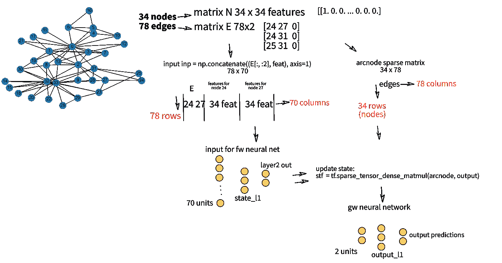
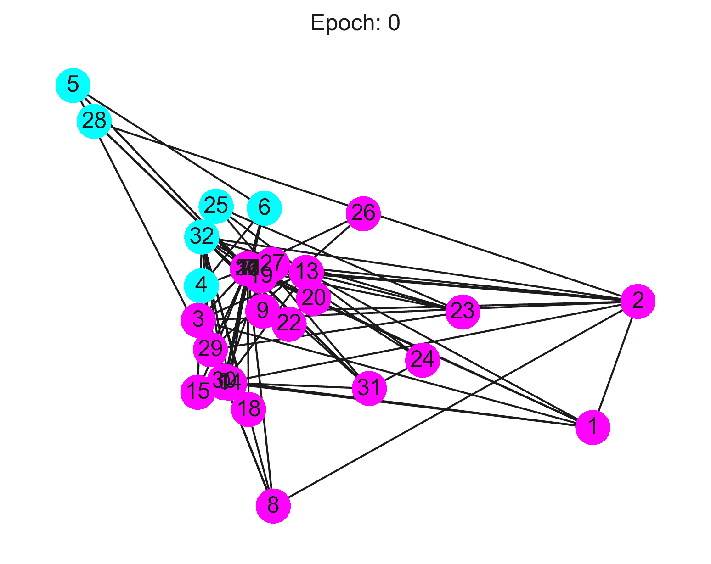

# 图形神经网络:2008 年以来的学习之旅——第二部分

> 原文：<https://towardsdatascience.com/graph-neural-networks-a-learning-journey-since-2008-part-2-22dbf7a3b0d?source=collection_archive---------34----------------------->

## 关于斯卡塞利图形神经网络的第二个故事。今天，让我们来实现我们所学的:Python 中的 GNN


布雷迪·贝里尼在 [Unsplash](https://unsplash.com/photos/WEQbe2jBg40) 上拍摄的照片

<https://medium.com/@stefanobosisio1/membership>  

我们在本系列的第一部分[中学习了斯卡塞利图形神经网络的理论背景。特别是，我们了解到:](/graph-neural-networks-a-learning-journey-since-2008-part-1-7df897834df9)

*   GNN 既适合基于节点的预测，也适合基于图的预测。在前一种情况下，我们希望预测图中的每个节点，在后一种情况下，我们希望预测整个图
*   每个节点可以用一个转移函数 *f𝓌* 和一个输出函数 *g𝓌* 来表示。
*   为了收敛到一个解，转移函数和输出函数都必须满足 Banach 的不动点解
*   多层感知器(MLP)确实满足巴拿赫的要求，因此 *f𝓌* 和 *g𝓌* 可以实现为简单的神经网络层

记住这几点，让我们一步一步地看看如何用 Python 实现这个框架，并把它应用到一个简单的问题上，这个问题叫做“空手道俱乐部”。

# 空手道俱乐部

我们以扎卡里的空手道俱乐部问题为例。这个问题可以追溯到 Zachary 的论文“小群体中冲突和裂变的信息流模型”[29]，其中对一个空手道俱乐部网络进行了三年(1970–1972)的研究。该网络由 34 名成员组成，包括空手道俱乐部管理员“约翰 A”和教练“嗨先生”，以及在俱乐部外互动的成对成员之间的联系(他们聚在一起喝啤酒，散步……)。在管理者和指导者之间的一场争论之后，俱乐部分裂成两半，因此两个新的组被创建。扎卡里用福特-富尔克森算法正确预测了成员如何重新安排他们的社交网络/每个成员的决定。这个问题引起了图形爱好者社区的注意，它被广泛用于测试 GraphNN。斯卡塞利 2009 年的论文应用图形神经网络正确预测了空手道俱乐部成员在分裂后的决策。

## Github 回购和安装

主要脚本存储在此存储库中:

<https://github.com/Steboss/learn_graph_ml/tree/master/Scarselli_GNN>  

在继续之前，我建议您在一个工作目录中创建一个虚拟环境(只需输入您的终端`python -m venv venv`，就会创建一个`venv`文件夹)。然后，您可以安装这些软件包:

*   `dgl`是 Deep Graph Library，一个专门从事图形计算的库。在培训步骤中，我们将使用它来可视化我们的图表。要安装`dgl`，请在此页面插入您的硬件信息:[https://www.dgl.ai/pages/start.html](https://www.dgl.ai/pages/start.html)(例如`None` CUDA、`Pip(stable)`包、`Mac` Os 和`Python 3.8`版本，这样我就可以用下面的命令`pip install dgl -f https://data.dgl.ai/wheels/repo.html)`安装`dgl`。如果您在使用`pip`时遇到问题，只需使用`pip install --upgrade pip`进行升级，一切都会正常工作。
*   `pip install torch`
*   `pip install tensorflow`
*   `pip install matplotlib`
*   `pip install seaborn`

## 脚本和图形介绍

正如你在 Github repo 中看到的，有几个脚本。以下是对它们的简单描述:

*   `create_and_visualize.py`允许创建初始图形并在训练期间绘制图形
*   `prepare_edge_nodes_mat.py`提供了边、标签和节点的特征。创建两个矩阵:`E`边矩阵和图形 id，`N`节点特征矩阵和图形 id
*   `prepare_GNN.py`变换`E`和`N`矩阵作为图形神经网络的输入。输出是一个`inp`矩阵，其形式为`[source_node, destination_node, features of the source node, features of the destination node]`和`arcnode`矩阵，一个稀疏矩阵，节点之间有边连接，例如`[source_node, destination_node, 1 at source index position 0 otherwise]`
*   `input_and_output_funcitons.py`定义了 *f𝓌* 和 *g𝓌* 神经网络，以及验证指标和损失
*   `GNN.py`主图形神经网络类，其中定义了训练条件，以及收敛性检查。最终输出是训练损失、节点预测、节点在训练期间的位置以及收敛的迭代次数。
*   `karate.py`是主脚本，创建空手道数据集并训练 GNN。

作为第一步，我们可以运行`create_and_visualize.py`来可视化空手道俱乐部图。您可以在一个`ipyhton` shell 中运行这个脚本:

图 1:在 Python shell 中，只需输入上面的命令就可以显示输入的空手道俱乐部图

该图是通过`build_karate_club_graph()`函数中的`dgl.DGLGraph()`创建的。`visualize_karate_club()`通过转换输入图`to_networkx()`产生输出(图 2)


图 2:作为图表的空手道俱乐部。该俱乐部由 34 个人组成，在分裂后，他们决定根据自己的特点分成两组。

## 图解说明

图 3 示出了计算步骤的图形研究。从初始图创建两个矩阵:节点特征 N 矩阵和边矩阵 e。然后这两个矩阵被转换为图神经网络的输入。特别地，矩阵 e 和来自矩阵 n 的特征被用作转移函数 *f𝓌* 的输入。这个神经网络输出与 arcnode one-hot 编码矩阵相乘，以更新节点的状态。最终输出用作函数 *g𝓌* 的输入，以产生最终预测



图 3:计算方法的图示。输入图被细分为矩阵 N 和 e。从那里，GraphNN 的输入矩阵被创建。矩阵 inp 是边矩阵和特征的组合，而 arcnode 将边连接定义为一个一键编码矩阵。然后，inp 矩阵被用作 NN fw 的输入。节点状态由 matmul 用 arcnode 矩阵更新。通过输出函数 gw 产生最终输出

## 1.输入预处理:边、标签和要素

<https://github.com/Steboss/learn_graph_ml/blob/master/Scarselli_GNN/prepare_edge_nodes_mat.py>  

`prepare_edge_nodes_mat.py`允许创建两个矩阵:边矩阵`E`和节点特征矩阵`N`。

为了创建边，我在`data/edges.txt`中提供了一个输入文件:

图 edges.txt 文件的前 8 行，节点 1 的边

边的矩阵`E`是从边输入加上定义了`graph_id`的最后一列创建的，在这种情况下`graph_id`是 0，因为我们想要节点聚焦的预测。如果您正在执行基于图形的预测，您将添加一个`graph_id`。

矩阵`E`的最终内容是`[source_node, destination_node, graph_id]`:

图 5:从输入边创建 E 矩阵并与图 id 值连接

使用`sp.eye(np.max(edges+1), dtype=np.float32).tocsr()`将节点的特征创建为一个热编码矩阵:

*   `sp.eye`是`scipy.sparse`矩阵，
*   `np.max(edges+1)`定义了我们想要的索引的值为 1、
*   `tocsr()`是压缩稀疏行格式

将特征与`graph_id`连接，以创建最终节点的特征矩阵`N`，其内容为`[ node's features, graph_id]`，维度为`[number_of_nodes, number_of_nodes+1]`:

图 6:前 3 个节点的矩阵 N 内容

在这种情况下，标签(0 或 1)被分配为:

图 7:为每个节点分配标签的代码

最后，脚本随机选取 4 个节点作为监督训练的标记节点。

## 2.从矩阵到 GNN 输入

<https://github.com/Steboss/learn_graph_ml/blob/master/Scarselli_GNN/prepare_GNN.py>  

`prepare_GNN.py`帮助从`E`和`N`矩阵创建神经网络的输入。

第一个输出是`inp`矩阵。[第 22–36 行显示了如何创建输入](https://github.com/Steboss/learn_graph_ml/blob/9f4868264d41f44495f0acf7e8a8d6d890d4e2c4/Scarselli_GNN/prepare_GNN.py#L22)矩阵，它是边矩阵`E`和节点特征`N.`的串联，最终内容是`[source_node, destination_node, source_features, destination_features]`。例如，对于第一条边，在节点 0 和 1 之间，`inp`的内容是:

图 8:节点 0 和 1 的 GNN 的输入矩阵。前两个数字指的是节点 0 和 1，接着是节点 0 的功能[1，0，0，…]和节点 1 的功能[0，1，0，…]

[第二个输出是](https://github.com/Steboss/learn_graph_ml/blob/9f4868264d41f44495f0acf7e8a8d6d890d4e2c4/Scarselli_GNN/prepare_GNN.py#L46) `[arcnode](https://github.com/Steboss/learn_graph_ml/blob/9f4868264d41f44495f0acf7e8a8d6d890d4e2c4/Scarselli_GNN/prepare_GNN.py#L46)`，以`SparseMatrix`格式对边缘信息进行编码，其尺寸为`[number_of_nodes, number_of_edges]`(本例中为 34x78)。稀疏格式允许节省内存，并且只标识值为 1 的行列索引对，否则为 0。

## 3.定义输入和输出函数

<https://github.com/Steboss/learn_graph_ml/blob/master/Scarselli_GNN/input_and_output_functions.py>  

`input_and_output_functions.py`将底层转换和输出函数定义为 MLP。`class Net`的核心函数是`netSt`和`netOut`，分别为 *f𝓌* 和 *g𝓌* 创建神经网络，定义了一个 2 层神经网络。`netSt`接收维数为 70 的节点特征，并使用`tanh`激活函数，用 3 个隐藏节点重新映射这些特征。`netOut`具有类似的架构，它接收 2 维输入，通过 3 个节点重新映射，并在`softmax`应用后返回最终预测输出:

图 9:图形 NN 的转换和输出函数。

## 4.几乎准备好了:主 GNN

<https://github.com/Steboss/learn_graph_ml/blob/master/Scarselli_GNN/GNN.py>  

最后一步是`GNN.py`，我们将定义神经网络架构应该如何工作。功能`convergence`、`condition`和`Loop`是整个架构的核心部分，在这里更新节点的状态

训练环节从[行 293](https://github.com/Steboss/learn_graph_ml/blob/9f4868264d41f44495f0acf7e8a8d6d890d4e2c4/Scarselli_GNN/GNN.py#L293) 开始，`Loop`功能封装在`self.loss_op`中。在【T23、[线 221](https://github.com/Steboss/learn_graph_ml/blob/9f4868264d41f44495f0acf7e8a8d6d890d4e2c4/Scarselli_GNN/GNN.py#L221) ，被称为运行`condition`和`convergence`。最后一个函数更新当前节点的状态:

图 10:更新节点状态的函数收敛

图 10 中的`a[:,1]`是输入矩阵`inp[:,1]`，即所有的`destination_node`索引。`tf.gather`返回每个目的节点的所有`old_state`值，得到一个 78x2 的矩阵，其值在第一次迭代时为零——因为`old_state`最初被初始化为一个零矩阵，`np.zeros((ArcNode.dense_shape[0], self.state_dim))` ( [行 261](http://self.state: np.zeros((ArcNode.dense_shape[0], self.state_dim)),) )。

`sl = a[:, 2:]`返回所有的`source_node`和`destination_node`特征(尺寸 78x68)，然后连接为`inp`用于转换神经网络功能。通过矩阵乘法`sparse_tensor_dense_matmul`用边缘连接更新来自 *f𝓌* 的输出状态。新状态被传回`Loop`功能([行 237](https://github.com/Steboss/learn_graph_ml/blob/9f4868264d41f44495f0acf7e8a8d6d890d4e2c4/Scarselli_GNN/GNN.py#L237) )，然后被用作 *g𝓌* 输出功能的输入:`out=self.net.netOut(stf)`

# 空手道俱乐部在行动

您现在可以运行`karate.py`了！！！

<https://github.com/Steboss/learn_graph_ml/blob/master/Scarselli_GNN/karate.py>  

最终的输出没有什么意义，但它是一个显著的例子，可以看到图形神经网络的力量以及图形如何被用作我们预测的输入。

`karate.py`脚本的主要部分在[第 61 行](https://github.com/Steboss/learn_graph_ml/blob/9f4868264d41f44495f0acf7e8a8d6d890d4e2c4/Scarselli_GNN/karate.py#L61)，在此执行训练步骤。如果您想将最终结果保存为`gif`，如果您想在`tensorboard`中可视化神经网络结果，这是打开`tensorboard`的命令，带有最终输出:

```
venv/bin/tensorboard --logdir tmp/path/to/folder_with_out.tfevents
```

将您的浏览器连接到`http://localhost:PORT`，这里端口被定义为终端中的输出，以充分工作`tensorboard`

主输出形式`g.Train`是`loop_val`。此变量报告:

*   `loop_val[0]`节点的预测值
*   `loop_val[1]`为更新状态而执行的迭代次数
*   `loop_val[2]`当前节点的位置
*   `loop_val[3]`节点的特性

图 11 将训练运行动画化，从没有节点预测的初始猜测，直到节点之间有线性间隔的结束。



图 11:基于来自 GraphNN 的预测，通过时期的节点细分

今天就到这里吧！请继续关注关于图形和 ML 的新帖子！！！！

*如果有任何问题或意见，请随时发送电子邮件至:stefanobosisio1@gmail.com 或直接发送至 Medium。*