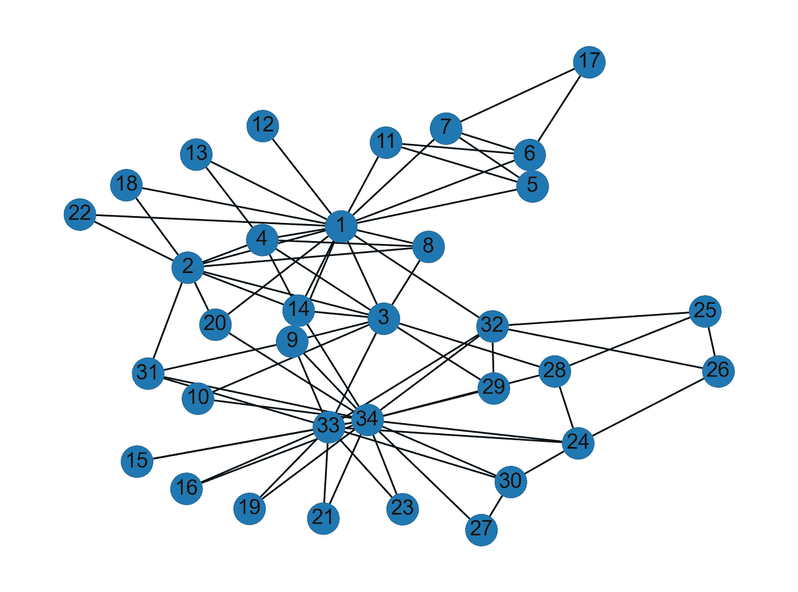
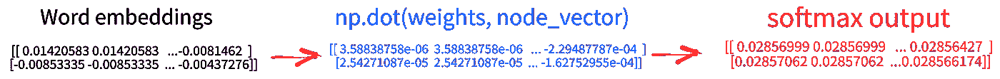

# 图形神经网络:2008 年以来的学习之旅——Python 和 Deep Walk

> 原文：<https://towardsdatascience.com/graph-neural-networks-a-learning-journey-since-2008-python-deep-walk-29c3e31432f?source=collection_archive---------31----------------------->

## [实践教程](https://towardsdatascience.com/tagged/hands-on-tutorials)

## 本系列的第四部分。今天，深度行走的实际实现🐍看看脸书的大型页面数据集👍

图片由[弗朗西丝卡·霍钦](https://unsplash.com/@franhotchin)在 [Unsplash](https://unsplash.com/photos/FN-cedy6NHA) 上拍摄

 [## 通过我的推荐链接加入 Medium-Stefano Bosisio

### 作为一个媒体会员，你的会员费的一部分会给你阅读的作家，你可以完全接触到每一个故事…

medium.com](https://medium.com/@stefanobosisio1/membership) 

欢迎回到我们在图形机器学习世界的旅程的第四部分。在之前的帖子中，我们看到了[deep walk 算法如何工作](/graph-neural-networks-a-learning-journey-since-2008-deep-walk-e424e716070a?source=user_profile---------0----------------------------)及其数学背景。今天，我们将深入研究该算法的 Python 实现，从一个简单的例子(空手道俱乐部)开始，在`Numpy`中有一个简单的 DeepWalk 版本，然后我们将跳转到一个更有趣的场景，使用脸书大型页面数据集。

以下是前几集的列表:

*   [斯卡塞利·GNN 的理论背景](/graph-neural-networks-a-learning-journey-since-2008-part-1-7df897834df9)
*   [斯卡塞利 GNN 实际实施](/graph-neural-networks-a-learning-journey-since-2008-part-2-22dbf7a3b0d)
*   [DeepWalk 理论背景](/graph-neural-networks-a-learning-journey-since-2008-deep-walk-e424e716070a?source=user_profile---------0----------------------------)

# 串联所有深走数学步骤

## 生成“序列”的语料库

现在我们知道了 DeepWalk 在数学上是如何工作的，让我们一起一步一步地看看空手道俱乐部将会发生什么，在跳到更大的应用之前修正我们的想法。当前的应用程序基于一个简单的`numpy`嵌入式神经网络应用程序。代码和输入文件可在以下位置找到:

 [## learn _ graph _ ml/Perozzi _ deep walk at master ste boss/learn _ graph _ ml

### 从 2009 年到现在的漫长旅程，带着图表——learn _ graph _ ml/Perozzi _ deep walk at master ste boss/learn _ graph _ ml

github.com](https://github.com/Steboss/learn_graph_ml/tree/master/Perozzi_DeepWalk) 

输入数据集是`data/karate.adjlist`，空手道俱乐部的邻接表，`graph.py`是读取输入文件的实用程序，`karate.py`是我们的主要 DeepWalk 算法文件。这些计算远非正确，但它们是具体理解正在发生的事情的一个很好的方法。

图 1 空手道俱乐部图表。该俱乐部由 34 名成员组成，我们可以定义 78 种相互之间的交互。

在这个例子中，我们有 34 个节点和 78 条边。对于每个节点，随机行走的次数是`number_walks=5`，因此总共 170 次随机行走，即从一个起点开始探索一个`walk_length=5`顶点。在第 378 行，我们正在创建初始语料库:

图 2:长度为 5 的随机游走的“句子”语料库的生成

从这里我们会有一个随机漫步的列表:

图 3:从顶点 22、17、13、18、11 和 15 开始的长度为 5 的随机行走的例子。

## Skipgram 模型

一旦生成了语料库，我们就可以继续使用 SkipGram 模型。在这个例子中，我没有实现层次化的 Softmax，但我只是使用了一个简单的 softmax 层，因为问题很小。这些是我们需要的步骤:

*   *生成训练数据*:对于每个输入序列，我们需要为训练阶段生成一对 *(X，y)* 。 *X* 是当前顶点，而 *y* 是来自 *X* 的一个`window_size`内的字
*   *参数初始化:*随机初始化一个单词嵌入矩阵，并执行 2-隐层神经网络的前向步骤
*   *神经网络:*更新权重和返回训练成本的函数，以向正确的嵌入收敛。

## 生成训练数据

训练数据强调了 SkipGram 模型的目标:`X`是输入单词，并且该模型预测在最大`window_size`距离处的单词成为`X`的邻居的可能性。最终的训练数据集将是一组对`(X, y)`。例如，给定输入序列`22, 1, 13, 4, 3`和`wind_size=5`，对`(X,y)`将是(例如):`(22, 1), (22, 13), (22, 4), (22, 3), (1, 22), (1, 13), (1, 4), (1, 3), (13, 22), (13, 1), (13, 4)`等。[函数](https://github.com/Steboss/learn_graph_ml/blob/e0c7f6e319919c7a9a75edd8204f8c4163ef2d9c/Perozzi_DeepWalk/karate.py#L105) `[generate_training_data](https://github.com/Steboss/learn_graph_ml/blob/e0c7f6e319919c7a9a75edd8204f8c4163ef2d9c/Perozzi_DeepWalk/karate.py#L105)` [完成了这个目标](https://github.com/Steboss/learn_graph_ml/blob/e0c7f6e319919c7a9a75edd8204f8c4163ef2d9c/Perozzi_DeepWalk/karate.py#L105)，循环遍历所有输入`random_walks`及其元素，选择左右索引`idxs_left`和`idxs_right`

图 4:生成训练数据功能。Skipgram 模型的对(X，y)是通过迭代所有随机行走及其元素，每次选择相对于起始顶点 I 的左和右索引

最终向量`X`和`y`的大小为`(1, 3400)`，其中`3400`来自随机漫步的总数(`170`)乘以每次随机漫步的配对数，即`20`。

## 参数初始化

第二步是初始化以下参数:

*   `representation_size`这是潜在特征尺寸，即 SkipGram 应该返回多少潜在“坐标”。在本例中，该值固定为 2
*   `vocab_size`、词汇大小，即图中顶点的总数(`vocab_size=34+1=35`)
*   目标`y`的一键编码矩阵。热编码矩阵的大小为`35, 3400`，每次目标词出现时，其值为 1:

图 5:将目标向量转换为热编码矩阵，其大小来自词汇大小(+1)和目标大小。

*   `epochs`为 SkipGram 模式。记住 SkipGram 是一个神经网络，所以我们必须指定我们想要循环通过整个数据集的次数(在本例中是`epochs=2`)
*   `batch_size`，神经网络训练的每次迭代应该使用多少数据块(这里`batch_size=4096`，因为我想立即处理整个数据集)
*   `learning_rate`，设置为`0.001`
*   [神经网络](https://github.com/Steboss/learn_graph_ml/blob/e0c7f6e319919c7a9a75edd8204f8c4163ef2d9c/Perozzi_DeepWalk/karate.py#L177)的嵌入和权重矩阵，通过函数`param_init`初始化。在该函数中，我们为单词嵌入创建一个随机矩阵，其大小为`vocab_size`和`representation_size`——即对于每个节点，我们将有`representation_size`坐标。其次，神经网络权重被随机初始化为:`np.random.randn(out_size, inp_size)`其中`inp_size`是图顶点的数量，`out_size`是`representation_size`。

## 神经网络

至此，我们可以通过以下步骤旋转嵌入神经网络:

*   从输入数据中定义一块`batch_size`
*   运行神经网络的正向传播部分(`forward_propagation`)
*   通过反向传播计算梯度(`backward_propagation`)
*   更新参数、嵌入矩阵和权重矩阵(`update_parameters`)
*   通过交叉熵计算成本(`cross_entropy`)

SkipGram 的这个`numpy`实现可以帮助我们理解主 DeepWalk 中隐藏了什么。

图 5:对于每个时期，我们从训练数据集中导出组块，我们执行正向传播、反向传播，并且我们更新所有参数。

首先，`forward_propagation`检索每个单词的嵌入，`node_to_embedding`返回训练数据集的所有 3400 个`X`输入的初始随机嵌入表示。然后，调用`linear_dense`函数，更新神经网络权重:

图 6:神经网络计算的核心。在每次正向迭代中，单词嵌入与网络权重进行点乘

核心神经网络仅将乘以神经网络权重的单词嵌入作为输入:`np.dot(weights, node_vector)`最后一步是通过`softmax`函数计算前一产品的 softmax 层。图 7 示出了输入单词嵌入如何通过网络计算而改变。

图 7:正向传播。让我们花点时间来看看输入数据的演变。随机初始化的单词嵌入通过神经网络。在输入嵌入和网络权重之间计算点积。最后一层是对网络输出的 softmax 计算。

计算出的嵌入和权重需要通过反向传播来更新。[函数](https://github.com/Steboss/learn_graph_ml/blob/e0c7f6e319919c7a9a75edd8204f8c4163ef2d9c/Perozzi_DeepWalk/karate.py#L308) `[backward_propagation](https://github.com/Steboss/learn_graph_ml/blob/e0c7f6e319919c7a9a75edd8204f8c4163ef2d9c/Perozzi_DeepWalk/karate.py#L308)` [计算 softmax 层梯度、神经网络权重梯度和嵌入梯度](https://github.com/Steboss/learn_graph_ml/blob/e0c7f6e319919c7a9a75edd8204f8c4163ef2d9c/Perozzi_DeepWalk/karate.py#L308)，因为我们想要训练神经网络和单词嵌入表示。

[最后，反向传播输出用于更新输入参数，即单词嵌入和网络权重](https://github.com/Steboss/learn_graph_ml/blob/e0c7f6e319919c7a9a75edd8204f8c4163ef2d9c/Perozzi_DeepWalk/karate.py#L328)

图 8:反向传播的更新过程。基于在嵌入层计算的学习速率和梯度来更新单词嵌入和网络权重。

干得好！这些是 deep walk skip program 部分包含的所有步骤。

# 一个大图数据集分类:脸书大页面-页面网络

为了证明 DeepWalk 获得社会潜在表征的能力，在这个例子中，我们将使用一个大规模数据集，即脸书大型页面-页面网络，可以在这里免费下载[1]。这是包含 22470 个脸书页面的数据集，根据它们的内容被标记为`tvshow`、`government`、`company`或`politician`以及 171002 个边。边缘描述了社会互动，例如一个页面喜欢另一个页面的内容。处理这个图的代码可以在这里找到:[https://github . com/ste boss/learn _ graph _ ml/blob/master/Perozzi _ deep walk/Facebook . py](https://github.com/Steboss/learn_graph_ml/blob/master/Perozzi_DeepWalk/facebook.py)

图 9:脸书数据集一瞥。id 定义节点 id，facebook_id 是唯一的脸书标识符，page_name 是页面的名称，page_type 用作定义节点所属的类的目标。

[代码的第一部分打开[1]中提供的所有输入文件](https://github.com/Steboss/learn_graph_ml/blob/58454b34333cb7c470ae47425bab1947f2801280/Perozzi_DeepWalk/facebook.py#L49)，并将边信息转换为`networkx`图:

图 10:用 networkx 打开输入数据并转换成图形

[其次，我们将从输入图](https://github.com/Steboss/learn_graph_ml/blob/58454b34333cb7c470ae47425bab1947f2801280/Perozzi_DeepWalk/facebook.py#L9)中创建 80 个长度为 10 的随机行走。输出是 224'700(节点*行走长度)次随机行走，这将是 SkipGram 的输入序列:

图 11:在给定输入图、要创建的步数及其长度的情况下，创建随机步的函数。

[一旦建立了语料库，我们就可以开始制作](https://github.com/Steboss/learn_graph_ml/blob/58454b34333cb7c470ae47425bab1947f2801280/Perozzi_DeepWalk/facebook.py#L66)`[gensim](https://github.com/Steboss/learn_graph_ml/blob/58454b34333cb7c470ae47425bab1947f2801280/Perozzi_DeepWalk/facebook.py#L66)`[skip program 模型](https://github.com/Steboss/learn_graph_ml/blob/58454b34333cb7c470ae47425bab1947f2801280/Perozzi_DeepWalk/facebook.py#L66)——已经有一个模型多好？—如图 12 所示

图 12:深度行走的核心，一旦随机行走的语料库被创建，我们可以从 Gensim 运行 Word2Vec 算法

`Word2Vec`接收输入:

*   句子语料库`walks`
*   潜在维度的大小`representation_size=100`
*   为给定单词寻找邻居的窗口大小`window_size=5`
*   在训练过程中考虑一个单词的最少次数。在这种情况下，0 意味着`Word2Vec`将把所有的单词作为输入
*   触发 skip program 模式的选项`sg=1`
*   触发分级 softmax `hs=1`的选项
*   我们想要运行的迭代次数，可选。在这个例子中是 1
*   CPU 的数量
*   再现性的随机种子`seed=42`

这将需要一点时间来运行，但最终我们将得到给定输入图的最终嵌入，可以很容易地保存在文件中，如下所示:

图 13:word 2 vec 的嵌入输出 sved 的例子。22470 表示节点数，100 表示潜在维度。第 2–4 行的第一列是节点索引，而后面的数字是嵌入表示

从这里，我们可以直接询问模型，寻找与给定页面相似的页面。例如，让我们使用索引`14`，即页面`Nasa's Marshall Space Flight Center`，并使用`model.wv.most_similar()`查询模型。`model.wv_most_similar(14)`返回与页面`14`相似页面的所有索引及其概率得分

图 14:找到所有与第 14 页相似的页面，美国宇航局马歇尔太空飞行中心

查询输出将是:

图 15:给定页面的 Word2Vec SkipGram 模型的输出

值得注意的是，该模型返回与给定页面高度相似的页面，而没有关于页面正在处理什么的信息。令人印象深刻的是，DeepWalk 可以利用单词模型的简单相似性来询问大输入图！

今天就到这里吧！请继续关注关于图形和 ML 的新帖子！！！！

*如有疑问或意见，请随时发送电子邮件至:stefanobosisio1@gmail.com 或直接发送至 Medium。*

# 文献学

1.  Rozemberczki，Benedek，Carl Allen 和 Rik Sarkar。"多尺度属性节点嵌入."*复杂网络杂志* 9.2 (2021): cnab014。