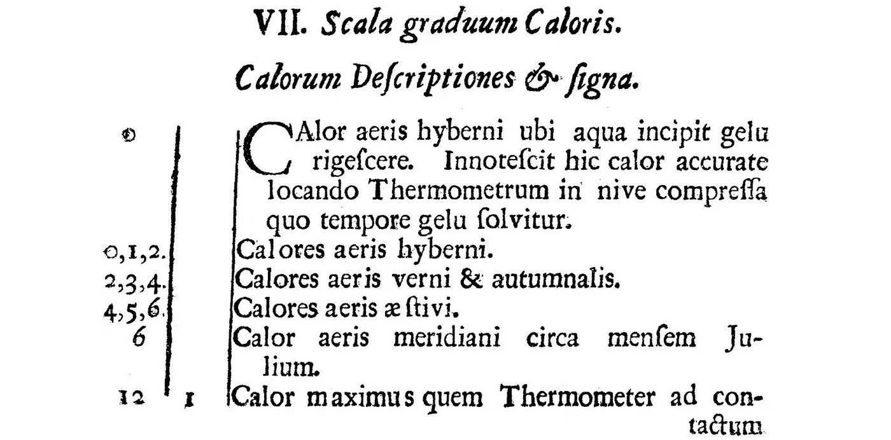
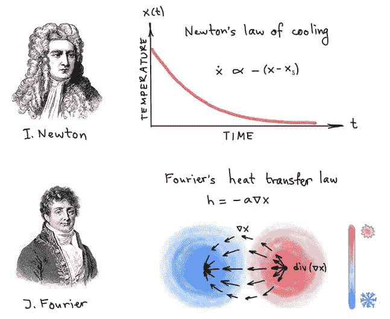
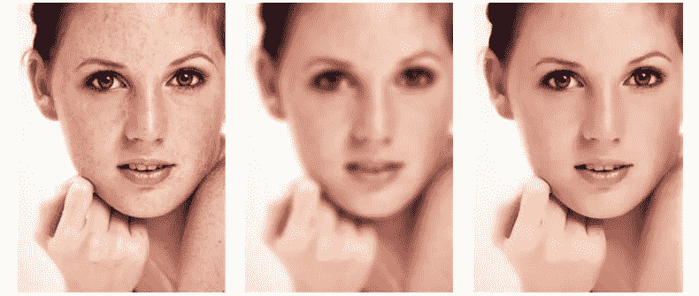
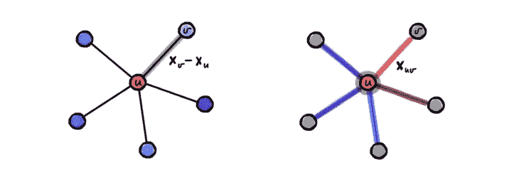
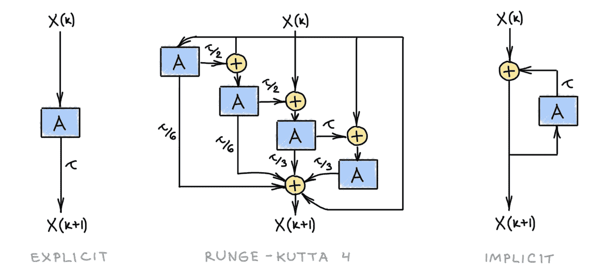
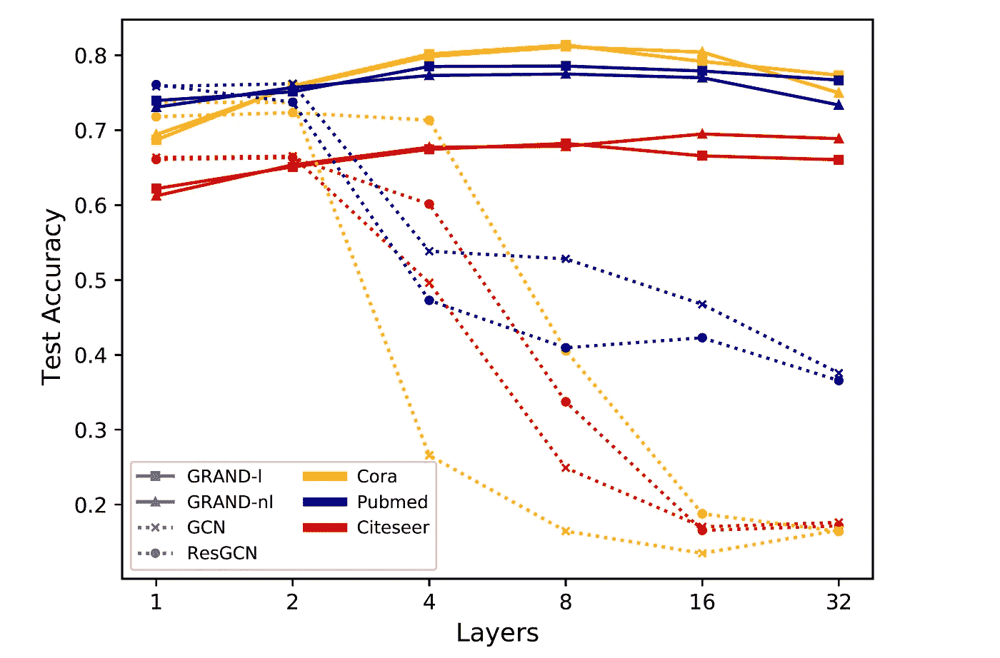
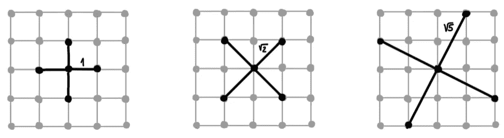

# 作为神经扩散偏微分方程的图形神经网络

> 原文：<https://towardsdatascience.com/graph-neural-networks-as-neural-diffusion-pdes-8571b8c0c774?source=collection_archive---------7----------------------->

## [思想和理论](https://towardsdatascience.com/tagged/thoughts-and-theory)，重新思考 GNNs

## **图神经网络(GNNs)与控制图上信息扩散的微分方程密切相关。将 gnn 视为偏微分方程(PDEs)会产生一类新的 gnn，它们能够以原则性的方式解决当前图 ML 模型的一些突出问题，如深度、过度平滑、瓶颈和图重布线。**

*这篇博文与本·张伯伦(Ben Chamberlain)和詹姆斯·罗博顿(James Rowbottom)合著，基于我们的论文 b·张伯伦(B. Chamberlain)、j·罗博顿(J. Rowbottom)等人的论文*[*GRAND:Graph Neural Diffusion*](https://arxiv.org/abs/2106.10934)*(2021)ICML。*

“Scala graduum Caloris”的第一页，这是艾萨克·牛顿爵士于 1701 年匿名发表在《皇家学会哲学会刊》上的论文。图中显示的是一个温标，0 表示“冬天空气中的水开始结冰时的温度”(aqua incipit gelu rigescere)，12 表示“与人体接触时”测得的温度(contactum corporis humani)。210 的最高温度是“风箱催灶火”的温度。

1701 年3 月，英国皇家学会的*哲学会刊*发表了一篇匿名的拉丁文笔记，题为“热度的等级”【1】。虽然没有指明名字，但艾萨克·牛顿是作者已经不是秘密了(四年后他将成为“艾萨克爵士”)。在一系列实验中，牛顿观察到

> 热物体在给定时间内失去的温度与物体和环境之间的温差成正比

—今天以他的名字命名的法律的现代表述[2]。从数学上来说，牛顿冷却定律产生了*热扩散方程*，这是一个偏微分方程(PDE ),其最简单的形式如下

*ẋ*=δ*x .*

这里， *x* ( *u* ， *t* )表示某一区域上时间 *t* 和点 *u* 的温度，lhs(时间导数 *ẋ* )是“温度变化率”，rhs(空间二阶导数或拉普拉斯δ*x*)表示某一点与其周围温度的局部差异该 PDE 是线性的，其解可以封闭形式给出，作为初始温度分布与时间相关的高斯核的卷积[3]，

*x* ( *u* ，*t*)=*x*(*u*,0)﹡exp(−|*u*|/4*t*)。

更一般地说，必须考虑物体不同的热传导特性，从而得到形式如下的偏微分方程

*ẋ* ( *u* ，*t*)= div(*a*(*u*，*t*)∇*x*(*u*， *t* ))

编码更一般的*傅立叶传热定律*【4】。

根据牛顿冷却定律(上)，物体的温度变化率( *ẋ* )与自身温度和周围温度之差成正比。所得微分方程的解具有指数衰减的形式。傅立叶热传递定律(底部)提供了一个更细粒度的局部模型:温度是一个标量场 *x* ，它的(负)梯度是一个矢量场−∇ *x，代表热量从较热的区域(红色)流向较冷的区域(蓝色)，散度 div(* −∇ *x)是矢量场* −∇ *x 通过一个点周围无限小区域的净流量。*

扩散偏微分方程出现在许多物理过程中，包括“物质”(无论是能量还是物质)，或者更抽象地说，信息的转移。在图像处理中，可以利用上述扩散解释作为图像去噪的线性低通滤波。然而，在去除噪声的同时，这种滤波器也不希望地模糊了不同颜色或亮度的区域(“边缘”)之间的过渡。Pietro Perona 和 Jitendra Malik [5]的一个有影响力的见解是考虑一个与图像梯度|∇*x*的范数成反比的自适应扩散系数:这样，扩散在“平坦”区域(其中|∇*x*|≈0)很强，而在亮度不连续的情况下很弱(其中|∇*x*|很大)。结果是一个非线性滤波器能够从图像中去除噪声，同时保留边缘。

左图:原始图像，中图:高斯滤波器，右图:非线性自适应扩散(图中所示为 Q. Yang，[“递归双边滤波”](https://projet.liris.cnrs.fr/imagine/pub/proceedings/ECCV-2012/papers/7572/75720399.pdf) (2012)【的概念上类似的滤波器)。

佩罗娜-马利克扩散和类似的方案创造了一个完整的基于偏微分方程的技术领域，它也从几何学、变分法和数值分析中获得了灵感和方法[6]。对我个人来说，Ron Kimmel 关于图像的数值几何的著作[7]是我爱上微分几何并以此为主题攻读博士学位的原因。变分法和基于偏微分方程的方法统治了图像处理和计算机视觉领域近二十年，在 2000 年代的第二个十年让位于深度学习[8]。

在我们最近在 Twitter [9]的工作中，我们依靠同样的哲学来重新审视图形神经网络。gnn 通过以消息传递的形式在相邻节点之间交换信息来运行，这个过程在概念上等同于扩散。在这种情况下，基础空间是图表，扩散沿着边发生，其中空间导数的类比是相邻结点要素之间的差异。

从形式上看，将扩散过程推广到图形几乎是简单明了的:方程看起来是相同的，

**ẋ**(*t*)= div(**a**(**x**(*t*))∇**x**(*t*))

其中**X**(*t*)**现在是在时间 *t* 的节点特征的 *n* × *d* 矩阵，梯度是给每个边 *u* ~ *v* 分配各自节点特征向量的差的算子， (∇**x**)*ᵤᵥ*=**x***ᵥ*—**x***ᵤ*节点 *u* 处的散度是从其发散出来的边的特征的总和，(div(**x**)*ᵤ=*∑*ᵥ**wᵤᵥ* **扩散率由形式为**a**(**x**)= diag(*a*(**x***ᵤ*， **x** *ᵥ* )的矩阵值函数表示，其中，如前所述， *a* 是确定沿边缘扩散强度的函数****

******

***节点和边特征分别类似于图上的标量场和矢量场。渐变产生形状的边缘特征(∇**x**)*ᵤᵥ*=**x***ᵥ*-x*ᵤ.发散产生形式为*(div(**x**)*ᵤ=*∑*ᵥ**wᵤᵥ***x***ᵤᵥ.的节点特征****

***图形扩散方程可以方便地写成如下形式的矩阵微分方程***

*****ẋ**(*t*)=(**a**(**x**(*t*)—**I**)**x**(*t*)。***

***在大多数情况下[12]，这个微分方程没有封闭形式的解决方案，必须数值求解。有大量的数值技术用于求解非线性扩散方程，主要区别在于空间和时间离散化的选择。***

***T 最简单的离散化用正向时差代替时间导数**ẋ**，***

***【**x**(*k*+1)**x**(*k*)]/𝜏=[**a**(**x**(*k*)**I****x**(*k*)***

***其中 *k* 表示离散时间指数(迭代次数),𝜏是步长，使得 *t* = *k* 𝜏.将上面的公式重写为***

*****x**(*k*+1)=[(1−𝜏)**I**+𝜏**a**(**x**(*k*)】**x**(*k*)=**q**(*k*)**x**()***

***我们得到一个*显式*或[前向欧拉](https://en.wikipedia.org/wiki/Euler_method) *方案*的公式，其中下一次迭代 **X** ( *k* +1)是通过应用线性算子**Q**(*k*)【13】从某个 **X** (开始)从前一次迭代 **X** ( *k* )计算出来的只有当时间步长足够小时，𝜏 < 1，该方案在数值上*稳定*(在某种意义上，输入 **X** (0)的小扰动会导致输出 **X** ( *k* )的小扰动)。***

***用后向时差离散时间导数得到*(半)* [*隐式*](https://en.wikipedia.org/wiki/Explicit_and_implicit_methods) 格式，***

***【(1+𝜏)**I**−𝜏**a**(**x**(*k*)】**x**(*k*+1)=**b**(*k*)**x**(*k*+1)=**x**(*k【k****

***这样命名是因为从前一个迭代推导下一个迭代需要求解一个线性系统，相当于 **B** 的逆(在大多数情况下，通过线性解算器的几次迭代近似实现)。这个方案是*无条件稳定的*，这意味着我们可以使用任何𝜏 > 0 而不用担心迭代会失败。***

***这些是概念上最简单的离散化技术，在实践中不一定是最好的。在 PDE 文献中，通常使用[多步方案](https://en.wikipedia.org/wiki/Linear_multistep_method)，例如[龙格-库塔](https://en.wikipedia.org/wiki/Runge%E2%80%93Kutta_methods)【14】，其中后续迭代被计算为几个先前迭代的线性组合。显式和隐式情况都可以是多步骤的。此外，步长可以根据近似误差【15】进行*自适应*。***

******

***图形扩散方程不同离散化方案的框图表示(从左到右:单步显式欧拉，多步四阶龙格-库塔，单步隐式)。a 表示扩散算子；𝜏是时间步长。***

***具有针对给定任务优化的参数扩散函数的扩散方程定义了一大类类似图形神经网络的架构，我们称之为*图形神经扩散*(或者，不客气地说，简称为 GRAND)。输出是扩散方程在某个结束时间*T*的解 **X** ( *T* )。许多流行的 GNN 架构可以被形式化为大参数离散图形扩散方程的实例。具体来说，上面提到的显式方案具有图形注意力网络[16]的形式，其中我们的扩散性扮演了*注意力*的角色。***

***绝大多数 GNN 使用显式单步欧拉方案，其中离散时间索引 *k* 对应于图形神经网络的卷积或注意力层，并且多次迭代运行扩散相当于多次应用 GNN 层。在我们的形式中，扩散时间参数 *t* 充当层的*连续*类比【17】——这种解释允许我们开发更有效和稳定的数值方案，这些方案使用时间上的自适应步骤。特别是，GRAND 允许解决[广泛认可的问题](/do-we-need-deep-graph-neural-networks-be62d3ec5c59?sk=8daa06935676e78bdb229017d3c4bac9)深度 gnn 中的性能下降。***

******

***在图形神经扩散中，显式 GNN 层被扩散时间的连续模拟代替。该方案允许训练深度网络(长时间运行扩散)而不会经历性能下降。***

***T21:有限方案允许使用更大的时间步长和更少的迭代(“层”)，代价是迭代的计算复杂性，这需要扩散算子的反演。扩散算子(我们方程中的矩阵 **A** 与图的邻接矩阵(1 跳滤子)结构相同，而它的逆通常是稠密矩阵，可以解释为 [*多跳滤子*](/simple-scalable-graph-neural-networks-7eb04f366d07?sk=2127a086dd3e91b06235ef0f74016e64) 。***

***由于矩阵求逆的效率主要取决于矩阵的结构，因此在某些情况下，将用于扩散的图与输入图分离可能是有利的。这些技术统称为[图重布线](/manifold-learning-2-99a25eeb677d?sk=1c855a020f09b72edfa50a8aba5f24a0)，已经成为 GNNs 中处理可伸缩性或信息瓶颈的流行方法。扩散框架通过将图形视为某个连续对象(例如流形)[18]的*空间离散化*，提供了图形重新布线的原则观点，并且某些离散化在数值上更有利。***

******

***2D 拉普拉斯算子的不同离散化(这些离散化的任何凸组合也是有效的)。选择一个离散化，可能在每一点都不同，这是一个欧几里得的“图形重新布线”的类比。***

***G 图神经扩散为研究许多流行的图形深度学习架构提供了一个原则性的数学框架，也为开发新的架构提供了蓝图。这种思维方式为 GNNs 的一些常见问题提供了新的思路，如功能过度平滑和设计深度神经网络的困难，以及启发式技术，如图形重新布线。更广泛地说，我们相信探索图 ML、微分方程和几何之间的联系，并利用这些主题的大量文献，将在该领域产生新的有趣的结果。***

***[1]无名氏， [Scala graduum Caloris。calorum descriptions et signa](https://archive.org/details/philtrans07084697/mode/2up)(1701)*Philosophical Transactions*22(270):824–829 描述了一种新的温标和一种测量它的油基装置，称为“温度计”。在整篇论文中，牛顿使用了 *calor* (“热”，在现代物理学中具有热能流动的含义，以焦耳为单位测量)一词，而不是更合适的术语“温度”(分子的平均动能，以开尔文度为单位测量)，后者尚未被创造出来。S. Maruyama 和 s .御名方守矢，[牛顿冷却定律:跟进和探索](https://reader.elsevier.com/reader/sd/pii/S0017931020334803?token=74B7B93D6DF21208F97630F8B243667255FE6DDD8F59C13A2C1DB0480E7FFFED783543EB5CA6DD60AD2714CF9F8308F6&originRegion=eu-west-1&originCreation=20210608101320) (2021) *国际传热传质杂志* 164 最近准确地再现了牛顿的实验工作，并认为作者无法解释的多个因素可能是匿名发表论文的原因。***

***[2]很明显，牛顿不了解温度和热量之间的区别，因此基于传热系数概念的“冷却定律”的现代形式是错误的。E. F. Adiutori，[传热系数的起源](http://thenewengineering.com/PaperMechEng.pdf) (1990) *机械工程*激烈地争辩说，牛顿不应该被归功于以他的名字命名的定律的发现，而应该将荣誉授予[约瑟夫·布雷克](https://en.wikipedia.org/wiki/Joseph_Black)和[约瑟夫·傅立叶](https://en.wikipedia.org/wiki/Joseph_Fourier)。***

***[3]通过将 *x* 展开成傅立叶级数，并将其代入等式的两边，这很容易看出。事实上，解热方程是 j . Fourier(1824 年)开发这个仪器的动机之一，这个仪器今天以他的名字命名。我们公式中的热核还应该有一个额外的依赖于维数的归一化系数，为了简单起见，我们省略了它。***

***[4]根据傅立叶定律，热梯度∇ *x* 产生一个*热通量**h*=-*a*∇*x*满足*连续性方程**ẋ=*-div(*h*)，这编码了一个假设，即温度的唯一变化是由于热通量(由发散算子测量的)，即这个原理在化学上也被称为*菲克定律*，源自 a .菲克[über 扩散](https://onlinelibrary.wiley.com/doi/abs/10.1002/andp.18551700105)(1855)*Annalen der Physik*94。有趣的是，阿道夫·弗利克的职位被称为“苏黎世的专业人员”，这是一个值得怀疑的职位，他在成为教授之前的前三年里一直担任这个职位，先是在苏黎世，然后在维尔茨堡。***

***[5] P .佩罗娜和 j .马利克，[“使用各向异性扩散的尺度空间和边缘检测”](https://authors.library.caltech.edu/6498/1/PERieeetpami90.pdf) (1990)，*12(7):629–639 是一篇开创性的论文，提出了一种基于偏微分方程的自适应图像滤波，错误地命名为“各向异性”严格地说，佩罗纳-马利克非线性扩散方程*ẋ*= div(*a*(*u*)∇*x*)，其中 *a* 是位置相关的扩散系数常数，是*非均匀的*(意味着扩散系数是非恒定的)但是*各向同性的*(与方向无关，因为 *a* 是简单缩放梯度的标量)；真实的*各向异性*扩散方程具有形式*ẋ*= div(**a**(*u*)∇*x*)其中 **A** ( *u* )是位置相关的 2×2 矩阵(*扩散张量*)，其根据方向对梯度进行不同的缩放。****

****[6]参见 J. Weickert 的《图像处理中的各向异性扩散》一书 (1998) Teubner 对这些方法的教学介绍。遵循佩罗娜和马利克的类似范例的一些有影响力的图像处理框架是由 N. Sochen 等人介绍的 *Beltrami 流*将图像建模为嵌入式流形，[低级视觉的通用框架](https://www.researchgate.net/profile/Ron-Kimmel/publication/5576282_A_General_Framework_for_Low_Level_Vision/links/0deec5205542ca9543000000/A-General-Framework-for-Low-Level-Vision.pdf?_sg%5B0%5D=tEvhElaILTKyy01hhqqZhIAy5RHclVUJ-Qh6ydYfrsccceQKMstveQz7zhXBefDYyMIMoUTrUaK4AKhy7VSujQ.LQe_Wx67DxBewP7SoVVmrIRj2D0q-JKQm91ojcwsQYhpVVHAS91ZmTwwsqcJhEA7JHjO5PmsrkHJy4yrvqcQAQ&_sg%5B1%5D=8zqL2SWuquidpOIq9kiIOYTdIXxvjAY46nj2PhOv2wQYd-DNF2k4kxP9boetbA_3rExQgqEWf40o6rcnxnrwkOnfTNBjvTDQg2Hc4ti0kQ0Z.LQe_Wx67DxBewP7SoVVmrIRj2D0q-JKQm91ojcwsQYhpVVHAS91ZmTwwsqcJhEA7JHjO5PmsrkHJy4yrvqcQAQ&_iepl=) (1998) *IEEE Trans .图像处理*7(3):310–318；*c . Tomasi 和 R. Manduchi 的双边滤波器*，[灰度和彩色图像的双边滤波](https://users.cs.duke.edu/~tomasi/papers/tomasi/tomasiIccv98.pdf)(1998)*ICCV*；而*非局部指的是 A. Buades 等人的*，[一种图像去噪的非局部算法](https://www.researchgate.net/profile/Bartomeu-Coll/publication/4156453_A_non-local_algorithm_for_image_denoising/links/0f317534c2cac194e4000000/A-non-local-algorithm-for-image-denoising.pdf?_sg%5B0%5D=_elp0rwsA8dd1GzQSwu9gOJDfxE7BN_9AQrHeOhH4XXZImckjvX9gf-voekHVyrN2lKENM1CxhT24ah42o7fdA.MnACJb8wCTGsZfm5if35Cyat3VVFiKX8Y8a4-_QXFgdigogp_lchNjjwnxW76mnGZHFPnggetfcGRhCY6wgzOg&_sg%5B1%5D=XAMaLsQulwbYQoeGrrUIAgNaICVfgtVUQsRtLxJTc2lhRi3ctc8ZbTRS_xCWeAj_4ZuP8gS2zwlHOXHXffM2NBNxjzEv_5dS4LDDXO9SdkwE.MnACJb8wCTGsZfm5if35Cyat3VVFiKX8Y8a4-_QXFgdigogp_lchNjjwnxW76mnGZHFPnggetfcGRhCY6wgzOg&_iepl=) (2005)， *ICCV* 。这些方法的各种版本在图像处理硬件中实现；我甚至在英特尔实感相机的早期版本中自己开发了一个。基于 PDE 的低级计算机视觉方法包括图像完成技术，如 M. Bertalmio 等人的[图像修补](https://www.ima.umn.edu/sites/default/files/1655.pdf) (2000) *计算机图形和交互技术*和*活动轮廓*分割技术，如 V. Caselles 等人的[测地线活动轮廓](https://www.cs.technion.ac.il/~ron/PAPERS/CasKimSap_IJCV1997.pdf)(1997)*IJCV*22(1):61–79 和 T. F. Chan 和 l 图像处理 10(2):266–277。****

****[7] R. Kimmel， [*图像的数值几何*](https://books.google.co.uk/books?id=su7xBwAAQBAJ) (2004)施普林格。****

****[8]基于偏微分方程的方法和变分方法之间的联系源于这样一个事实，即许多偏微分方程可以作为一些泛函的最优性条件(称为 [*欧拉-拉格朗日方程*](https://en.wikipedia.org/wiki/Euler%E2%80%93Lagrange_equation) )导出，例如测量结果图像的“质量”。例如，齐次扩散方程是狄利克雷能量的最小化流(粗略地说，是变分问题中梯度下降的连续类比)。设计一个泛函，导出一个最小化它的偏微分方程，并在图像上运行它的范例在概念上非常吸引人；然而，大多数这种“手工制作”的泛函往往是理想化的，与深度学习相比表现较差，这是过去十年基于偏微分方程的方法消亡的主要原因。然而，一些想法仍然存在(通常没有适当的归属):例如，从概念上讲，人们可以考虑佩罗娜-马利克方案中的自适应扩散性，该方案根据像素之间的关系聚集像素中的信息，作为注意机制的先驱。****

****[9] B. Chamberlain，J. Rowbottom 等人， [GRAND:图形神经扩散](https://arxiv.org/abs/2106.10934) (2021) *ICML* 。历史上公平地说，不同风格的图扩散方程以前在过多的应用中使用过，所有这些都被命名为[*hanc marginis exi guitas non caperet*](https://mathworld.wolfram.com/FermatsLastTheorem.html)*。*在计算机图形学中，由于流形上的扩散方程的基本解([热核](https://en.wikipedia.org/wiki/Heat_kernel))与其高斯曲率之间的关系，离散流形(网格)上的热方程长期以来被用作形状描述符(例如，参见我以前的 [EUROGRAPHICS 2012 教程](https://diglib.eg.org/handle/10.2312/conf.EG2012.tutorials.t2)，其中我提到了扩散在几何处理和图形学中的许多应用)。在图形信号处理中，低通滤波器可以用扩散过程来识别(例如，L. Stankovi 的综述论文，[《图形信号处理简介》](http://www.tfsa.ac.me/pap/tfsa-001333.pdf) (2019)提到了这种关系)，并且已经用于从数据中恢复图形(例如，参见 D. Thanou 等人，[学习热扩散图](https://arxiv.org/abs/1611.01456) (2017) *IEEE Trans。网络上的信号和信息处理*3(3):484–499)。P. Milanfar，[现代图像滤波之旅](https://drive.google.com/file/d/1zP_fDkFoGRUcEhaCra6Ve0paiSE3-Psg/view?usp=drivesdk)(2013)*IEEE Signal Processing Magazine*30(1):106–128 中介绍了从图形的角度对经典图像滤波器的解释，包括一些概括。在机器学习中，一类称为[扩散图](https://en.wikipedia.org/wiki/Diffusion_map)的流形学习(非线性降维)技术由 R. R. Coifman 等人引入，[几何扩散作为调和分析和数据结构定义的工具:扩散图](https://www.ncbi.nlm.nih.gov/pmc/articles/PMC1140422)(2005)*PNAS*102(21):7426–7431 实现了扩散度量的欧几里德嵌入，与图中一对节点之间的热传播相关。最后，在 GNN 文献中，扩散方程已经在 F. Scarselli 等人的经典论文[《图形神经网络模型](https://persagen.com/files/misc/scarselli2009graph.pdf)(2009)*《IEEE Trans。神经网络*27(8):61–80 以及最近 m .等人的[图神经常微分方程](https://arxiv.org/abs/1911.07532) (2019) arXiv:1911.07532，j .庄的[图网络上的常微分方程](https://arxiv.org/abs/1911.07532) (2019) arXiv:1911.07532，f .顾等人的[隐式图神经网络](https://proceedings.neurips.cc/paper/2020/file/8b5c8441a8ff8e151b191c53c1842a38-Paper.pdf) (2020)【神经网络****

****[10]我们使用一个标准的符号:图 *G* 有 *n* 个节点和 *m* 条边， **W** 是具有 *wᵤᵥ=* 1 的 *n* × *n* 邻接矩阵，如果 *u* ~ *v* 则为零。给定 *d* 维节点特征排列成 *n* × *d* 矩阵 **X** ，梯度∇ **X** 可以表示为大小为 *m* × *d.* 的矩阵，类似地，给定大小为 *m* × *d* 的边缘特征矩阵 **Y** ，散度这两个运算符是伴随 w.r.t .适当的内积，⟨∇ **X** ， **Y** ⟩=⟨ **X** ，div( **Y** )⟩.我们稍微滥用了用**x**t54】ᵤ表示节点特征(类似于连续情况下的标量场)和用**x**t58】ᵤᵥ表示边缘特征(类似于矢量场)的符号；从上下文来看，区别很明显。****

****[11]我们假设 a 是归一化的，∑ *ᵥ* *aᵤᵥ* =1。****

****[12]对于一个常数 **A** ，扩散方程的解可以封闭形式写成**X**(*t*)= exp(*t*(**A**—**I**)**X**(0)= exp(*t*【T80)拉普拉斯**δ**图的指数被称为*热核*，并且可以被解释为具有低通滤波器的广义(频谱)卷积。****

****[13]注意 **Q** 依赖于 **X** (因此每次迭代都会改变)，但是它对 **X** 的应用是*线性*并且采用矩阵乘积的形式。这与 GNNs 的“注意力”味道有着精确的相似之处。****

****[14]以 C. Runge，über die numerische auflsung von differentialgleichungen(1895)*Mathematische Annalen*46(2):167–178 和 W. Kutta，Bei trag zur naherungsweisen integration totaler differentialgleichungen(1901)*z . Math。Phys* 。46:435–453，龙格-库塔法实际上不是一种单一的方法，而是一类数值格式。具体来说，在我们的论文中，我们使用了流行的 [Dormand-Prince](https://en.wikipedia.org/wiki/Dormand%E2%80%93Prince_method) 方案。****

****[15]通常，近似误差计算为两个后续近似级之间的差异。****

****[16]p . veli kovi 等人，[图注意网络](https://arxiv.org/abs/1710.10903) (2018) *ICLR* 。更具体地说，我们假设层之间没有非线性，并且跨层共享注意参数(对应于与时间无关的扩散率)。后者是一个很大的优势:在我们的实验中，我们在大多数情况下获得了优于 GAT 的结果，而使用的参数却少了 20 倍。****

****[17]“神经微分方程”，或将残差神经网络解释为常微分方程的欧拉离散化，由几个小组提出，包括 E. Haber 和 L. Ruthotto，深度神经网络的稳定架构(2017) *逆问题* 34 (1)，Y. Lu 等人，[超越有限层神经网络:桥接深度架构和数值微分方程](http://proceedings.mlr.press/v80/lu18d/lu18d.pdf)(2018)*，以及可能是其中最著名的 R. Chen 等人，【T10 我们的方法可以被认为是“神经偏微分方程”。*****

*****[18]这当然是无标度图的情况，例如社会网络可以在具有双曲几何的空间中实现。图作为连续空间的几何解释是*网络几何学*领域的主题，参见例如 m .博古纳等人的[网络几何学](https://arxiv.org/abs/2001.03241) (2021) *自然评论物理学*3:114–135。将图解释为一些空间的采样是证明谱图滤波器一般化的中心机制，例如在 R. Levie 等人的[谱图卷积神经网络的可转移性](https://arxiv.org/abs/1907.12972) (2019) arXiv:1907.12972 中。*****

****我们感谢 Nils Hammerla 校对了这篇文章，也感谢 Peyman Milanfar 从图形的角度指出了对图像滤镜的解释。有关图形深度学习的其他文章，请参见 Michael 在《走向数据科学》中的 [*其他帖子*](https://towardsdatascience.com/graph-deep-learning/home) *，* [*订阅他的帖子*](https://michael-bronstein.medium.com/subscribe) *和* [*YouTube 频道*](https://www.youtube.com/c/MichaelBronsteinGDL) *，获取* [*中等会员资格*](https://michael-bronstein.medium.com/membership) *，或关注 Michael 在* [*Twitter 上的*](https://twitter.com/mmbronstein)****