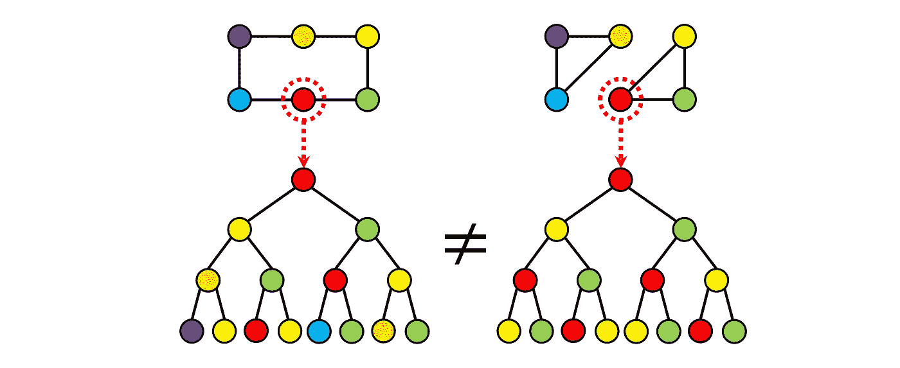

# 从微分几何和代数拓扑的角度看图形神经网络

> 原文：<https://towardsdatascience.com/graph-neural-networks-through-the-lens-of-differential-geometry-and-algebraic-topology-3a7c3c22d5f?source=collection_archive---------0----------------------->

## 重新思考 GNNs

## 微分几何和代数拓扑在主流机器学习中不是很经常遇到。在这一系列的文章中，我将展示如何使用这些领域的工具来重新解释图形神经网络，并以有原则的方式解决它们的一些常见困境。

> 对称，无论你如何定义它的含义，都是一种观念，古往今来人类一直试图通过它来理解和创造秩序、美和完美。

赫尔曼·魏尔[1]对对称性的描述颇具诗意，强调了对称性在科学中的基石作用。费利克斯·克莱因 1872 年的"[埃尔兰根计划](https://en.wikipedia.org/wiki/Erlangen_program) " [2]通过对称群刻画几何图形。这不仅是数学上的一个突破，统一了“几何动物园”，而且导致了现代物理理论的发展，这些理论可以完全从对称性的第一原理中推导出来[3]。在[几何深度学习](/geometric-foundations-of-deep-learning-94cdd45b451d?sk=184532175cb936d7b25d9adebd512629)的保护伞下，类似的原则也出现在机器学习中，这是一个通过群不变性和等方差推导出大多数流行神经网络架构的通用蓝图【4】。

图形神经网络可以被认为是[几何深度学习蓝图](/geometric-foundations-of-deep-learning-94cdd45b451d?sk=184532175cb936d7b25d9adebd512629)的一个特例，它的构建块是一个具有对称群的域(在这种情况下是具有置换群的图形)，域上的信号(节点特征)，以及这些信号上的群等变函数(消息传递)。

几何深度学习蓝图可以应用于不同的领域，如网格、网格或图形[5]。然而，虽然前两者有明确的连续类比对象(网格可以被认为是欧几里德或更一般的均匀空间(如球体)的离散化，网格是二维流形的常见离散化)，但对于图形没有直接的连续类比*【6】。这种不平等有点令人不安，并促使我们更仔细地研究图形学习的连续模型。*

**

*网格、网格和图形是几何深度学习蓝图中处理的域的示例。然而，虽然前两者有连续的相似性(例如，网格可以被视为欧几里得空间的离散化，而网格是二维流形或表面的常见离散化)，但图形没有直接的连续相似性。*

***神经扩散图。**图形神经网络(GNNs)通过在图形上执行某种形式的消息传递来学习，由此特征通过边从节点传递到节点。这种机制与图上的扩散过程有关，可以用称为“[扩散方程](https://en.wikipedia.org/wiki/Diffusion_equation)的偏微分方程(PDE)的形式来表示。在最近的一篇论文[7]中，我们表明，这种具有非线性可学习扩散函数的偏微分方程的离散化(称为“[图形神经扩散](/graph-neural-networks-as-neural-diffusion-pdes-8571b8c0c774?sk=cf541fa43f94587bfa81454a98533e00)”或非常谦虚地说，GRAND)概括了一大类 GNN 架构，如图形注意力网络(GAT) [8]。*

*PDE 思维模式提供了多种优势，例如可以利用高效的数值解算器(例如隐式、多步、自适应和多重网格方案),并保证稳定性和收敛性。这些解算器中的一些在流行的 GNN 架构动物园中没有直接的类比，潜在地承诺新的有趣的图形神经网络设计。由于我们考虑的扩散偏微分方程可以被视为一些相关能量的梯度流[9],这样的结构可能至少比典型的结构稍微更容易解释。*

*同时，虽然 GRAND 模型提供了*连续时间*来代替传统 GNNs 中的层，但是方程的空间部分仍然是*离散的*并且依赖于输入图。重要的是，在这个扩散模型中，域(图)是固定的，在其上定义的一些属性(特征)是演化的。*

*微分几何中常用的一个不同的概念是*几何流*，演化出*域本身的属性*【10】。这个想法是我的博士导师 Ron Kimmel 和他的合著者在 20 世纪 90 年代在图像处理领域采用的[11]。他们将图像建模为嵌入在联合位置和颜色空间中的流形，并通过最小化嵌入谐波能量的偏微分方程对其进行演化[12]。这种称为 *Beltrami 流*的 PDE 具有各向同性非欧几里德扩散的形式，并且产生边缘保持图像去噪。*

*我们将这一范式应用于“Beltrami 神经扩散”(BLEND)框架中的图表[13]。图中的节点现在由位置坐标和特征坐标来表征，*和*都是演化的，并且都决定了扩散率属性。在这种思维模式中，图本身变成了一个辅助角色:它可以从位置坐标中生成(例如作为一个*k*-最近邻图)并在整个进化过程中重新布线。下图说明了这种同步进化过程:*

**

*通过重新布线的 Beltrami 流，Cora 图的位置和特征分量的演变(颜色表示特征向量)。动画:詹姆斯·罗博特姆。*

*S 在最近的工作中，图形神经网络的表达能力受到了极大的关注。消息传递 gnn 等同于 [Weisfeiler-Lehman 图同构测试](/expressive-power-of-graph-neural-networks-and-the-weisefeiler-lehman-test-b883db3c7c49?sk=5c2a28ccd38db3a7b6f80f161e825a5a)【14–16】，这是一种试图通过迭代颜色细化来确定两个图在结构上是否等价(“同构”)的经典方法。这个测试是一个必要但不充分的条件:事实上，Weisfeler-Lehman 可能认为一些不同构的图是等价的。下图说明了消息传递 GNNs“看到”了什么:两个突出显示的节点看起来没有区别，尽管图形显然具有不同的结构:*

**

*Weisfeiler-Lehman 测试不能区分的两个不同构图的例子。图改编自 Sato [18]。*

***位置编码。**解决这个问题的一个常用方法是给节点“着色”,给它们分配一些额外的特征，代表节点在图中的角色或“位置”。位置编码方法在 Transformers [17](这是注意力 GNNs 在完整图形[4]上操作的一种特殊情况)中得到普及，已经成为增加图形神经网络表达能力的一种常用方法。*

**

*位置编码为图的节点分配额外的特征，允许消息传递获得比 Weisfeiler-Lehman 测试更高的表达能力。然而，在位置编码的多种可能选择中，没有“规范的”选择。图改编自 Sato [18]。*

*也许最直接的方法是赋予每个节点一个随机特征[18]；然而，虽然这种方法更具表达性，但它的泛化能力很差(因为不可能在两个图中重现随机特征)。图拉普拉斯算子[19]的特征向量提供了图的邻域保持嵌入，并且已经被成功地用作位置编码。最后，我们在与乔尔戈斯·布里特萨斯和法布里齐奥·弗拉斯卡[20]的论文中表明，图形[子结构计数](/beyond-weisfeiler-lehman-using-substructures-for-provably-expressive-graph-neural-networks-d476ad665fa3?sk=bc0d14c28a380b4d51debc4935345b73)可以用作一种位置或“结构”编码的形式，可以证明这种编码比基本的魏斯费勒-雷曼测试更有效。*

*然而，对于位置编码有多种选择，对于如何选择一个*没有明确的方法，对于哪种方法在哪种情况下更好的问题也没有明确的答案。我相信像 BLEND 这样的几何流可以根据这个问题来解释:通过非欧几里得扩散来进化图的位置坐标，位置编码适合于下游任务。因此，答案是“视情况而定”:最佳的位置编码是手头数据和任务的函数。**

***高阶信息传递。**另一种表达方式是停止用节点和边来思考图形。图是称为*细胞复合体*的对象的例子，细胞复合体是代数拓扑领域的主要研究对象之一。在这个术语中，节点是 *0 单元*，边是 *1 单元*。我们不必就此打住:我们可以构建如下图所示的 *2 单元格*(面),这使得上一个示例中的两个图形完全可以区分:*

**

*在最近与克里斯蒂安·博德纳尔和法布里齐奥·弗拉斯卡合著的两篇论文[21–22]中，我们证明了构建一个“提升变换”是可能的，这种“提升变换”用这种更高阶的单元来扩充图形，在此基础上可以执行更复杂形式的分层消息传递。该方案可以证明比 Weisfeiler-Lehman 测试更具表达性，并在计算化学中显示出有希望的结果，在计算化学中，许多分子显示出更好地模拟为细胞复合体而不是图形的结构。*

*AGNNs 的另一个常见困境是“[过度压制](/do-we-need-deep-graph-neural-networks-be62d3ec5c59?sk=8daa06935676e78bdb229017d3c4bac9)现象，或由于输入图的某些结构特征(“瓶颈”)导致消息传递无法有效传播信息【23】。过度平息通常发生在具有指数体积增长的图中，例如小世界网络[24]以及依赖于长程信息的问题中。换句话说，GNNs 运行的输入图对于消息传递并不总是友好的。*

**

*“小世界”图中快速增长的邻居数量通常是在 GNNs 中观察到的过度挤压现象的来源。*

***过度挤压、瓶颈和图形重布线。**从经验上看，将输入图与计算图分离，并允许在不同的*图上传递消息有助于缓解问题；这种技术通常被称为“图形重布线”。**

*公平地说，许多流行的 GNN 架构实现了某种形式的图重连，它可以采取邻域采样(最初在 GraphSAGE 中提出以应对可扩展性[25])或[多跳过滤器](/simple-scalable-graph-neural-networks-7eb04f366d07?sk=2127a086dd3e91b06235ef0f74016e64) [26]的形式。上面讨论的拓扑消息传递也可以被看作是一种重新布线的形式，由此远距离节点之间的信息流可以通过更高级别的单元而被“捷径”化。Alon 和 Yahav [23]表明，即使像使用全连通图这样简单的方法也可能有助于改善图 ML 问题中的过度挤压。克利茨佩拉和合著者热情地宣称“扩散改善了图形学习”，提出了 GNNs 的通用预处理步骤(命名为“DIGL”)，包括通过扩散过程对图形的连通性进行去噪[27]。总的来说，尽管有重要的实证研究，过度挤压现象一直难以捉摸，也没有得到充分的理解。*

*在[最近的一篇论文](/over-squashing-bottlenecks-and-graph-ricci-curvature-c238b7169e16?sk=f5cf01cbd57b4fee8fb3a89d447e56a9)【28】中，我们表明导致过度挤压的瓶颈可以归因于图的局部几何属性。具体来说，通过定义一个[瑞奇曲率](https://en.wikipedia.org/wiki/Ricci_curvature)的图形类比，我们可以表明负弯曲的边是罪魁祸首。这种解释导致了类似于“逆向 Ricci 流”的图重新布线过程，该过程通过外科手术去除了有问题的边，并产生了一个在结构上类似于输入图的更有利于消息传递的图。*

**

*使用基于扩散的方法(DIGL，中)和基于曲率的方法(Ricci，右)重新布线康奈尔图(左)的示例。基于曲率的方法更显著地减少了瓶颈，同时更忠实于原始图形结构。*

*T 这些例子表明，微分几何和代数拓扑为图形机器学习中的重要和具有挑战性的问题带来了新的视角。在本系列的后续文章中，我将进一步详细展示如何使用这些领域的工具来解决前面提到的图形神经网络问题。第二部分将讨论拓扑空间上的消息传递如何改进 GNNs 的理论和计算。第三部分将处理 GNN 公式作为梯度流，导致几何扩散偏微分方程。[第四部分](/over-squashing-bottlenecks-and-graph-ricci-curvature-c238b7169e16?sk=f5cf01cbd57b4fee8fb3a89d447e56a9)将展示过度挤压现象如何与图形曲率相关联，并提供受瑞奇流启发的图形重布线的几何方法。[第五部分](http://and topological message passing)将处理细胞束上的学习，以及这种形式主义如何解决 gnn 倾向于遭受的嗜异性设置。*

*[1] H .韦勒，《对称性》(1952)，普林斯顿大学出版社。*

*[2]F .克莱因，Vergleichende Betrachtungenüber neuere geometrische for schungen(1872 年)。*

*[3] J. Schwichtenberg，来自对称性的物理学(2018)，施普林格。*

*[4] M. M .布朗斯坦，j .布鲁纳，t .科恩，p .韦利奇科维奇，[几何深度学习:网格、群、图、测地线和量规](https://arxiv.org/abs/2104.13478)(2021)；见随附的[帖子](/geometric-foundations-of-deep-learning-94cdd45b451d)和[项目网站](https://geometricdeeplearning.com/)。*

*[5]在上面的 GDL 原型书中，我们将这些称为几何深度学习的“5G”。*

*[6] *几何图形*自然产生于生活在连续空间中的物体的离散模型。一个突出的例子是分子，建模为图形，其中每个节点代表一个具有 3D 空间坐标的原子。另一方面，有可能将*嵌入*一般的图到一个连续的空间中，从而利用某个空间的度量结构(近似)实现它们的连通性。*

*[7] B. Chamberlain，J. Rowbottom 等人，[GRAND:Graph Neural Diffusion](https://arxiv.org/abs/2106.10934)(2021)ICML。*

*[8]p . veli kovi 等人，[图形注意网络](https://openreview.net/pdf?id=rJXMpikCZ) (2018) ICLR。*

*【9】一个*梯度流*可以看作是变分问题中梯度下降的连续类比。它源于泛函的最优性条件(变分法中称为[欧拉-拉格朗日方程](https://en.wikipedia.org/wiki/Euler%E2%80%93Lagrange_equation))。*

*【10】*几何流*是定义在流形上的泛函的梯度流。其中最著名的可能是格里高里·佩雷尔曼在证明百年庞加莱猜想时使用的[瑞西流](https://en.wikipedia.org/wiki/Ricci_flow)。Ricci 流发展了流形的黎曼度量，并且在结构上类似于扩散方程(因此，通常经过粗略简化，表示为“度量的扩散”)。*

*[11] N. Sochen 等人，[低层视觉的一般框架](https://www.researchgate.net/profile/Ron-Kimmel/publication/5576282_A_General_Framework_for_Low_Level_Vision/links/0deec5205542ca9543000000/A-General-Framework-for-Low-Level-Vision.pdf?_sg%5B0%5D=tEvhElaILTKyy01hhqqZhIAy5RHclVUJ-Qh6ydYfrsccceQKMstveQz7zhXBefDYyMIMoUTrUaK4AKhy7VSujQ.LQe_Wx67DxBewP7SoVVmrIRj2D0q-JKQm91ojcwsQYhpVVHAS91ZmTwwsqcJhEA7JHjO5PmsrkHJy4yrvqcQAQ&_sg%5B1%5D=8zqL2SWuquidpOIq9kiIOYTdIXxvjAY46nj2PhOv2wQYd-DNF2k4kxP9boetbA_3rExQgqEWf40o6rcnxnrwkOnfTNBjvTDQg2Hc4ti0kQ0Z.LQe_Wx67DxBewP7SoVVmrIRj2D0q-JKQm91ojcwsQYhpVVHAS91ZmTwwsqcJhEA7JHjO5PmsrkHJy4yrvqcQAQ&_iepl=) (1998) IEEE Trans。图像处理 7(3):310–318 使用一个几何流最小化一个流形的嵌入能量作为图像去噪的模型。得到的 PDE 是线性非欧几里德扩散方程*ẋ*=δ*x*(这里δ是表示为嵌入流形的图像的拉普拉斯-贝尔特拉米算子)，与 P. Perona 和 J. Malik 早先使用的非线性扩散*ẋ*= div(*a*(*x*)∇*x*)，[尺度空间和使用各向异性扩散的边缘检测](https://authors.library.caltech.edu/6498/1/PERieeetpami90.pdf)(14*

*[12] Beltrami 流将弦理论中称为 [*波利亚科夫作用*](https://en.wikipedia.org/wiki/Polyakov_action) 的泛函最小化。在欧几里得的例子中，它简化为经典的狄利克雷能量 T21。*

*[13] B. P. Chamberlain 等人， [Beltrami 流和图上的神经扩散](https://arxiv.org/pdf/2110.09443.pdf) (2021) NeurIPS。*

*[14] B. Weisfeiler，A. Lehman，[将一个图简化为标准形式以及其中出现的代数](https://www.iti.zcu.cz/wl2018/pdf/wl_paper_translation.pdf)(1968)Nauchno-Technicheskaya informatisia 2(9):12–16。*

*[15] K. Xu 等，[图神经网络到底有多强大？](https://arxiv.org/abs/1810.00826) (2019) ICLR。*

*[16] C. Morris 等人， [Weisfeiler 和 Leman go neural:高阶图神经网络](https://aaai.org/ojs/index.php/AAAI/article/view/4384/4262) (2019) AAAI。*

*[17] A. Vaswani 等人，[注意力是你所需要的一切](https://papers.nips.cc/paper/2017/file/3f5ee243547dee91fbd053c1c4a845aa-Paper.pdf) (2017) NIPS。*

*[18] R. Sato，[关于图形神经网络表达能力的调查](https://arxiv.org/abs/2003.04078) (2020)。arXiv: 2003.04078。使用随机特征进行位置编码。*

*[19] V. P. Dwivedi 等人[标杆图神经网络](https://arxiv.org/abs/2003.00982) (2020)。arXiv: 2003.00982。使用拉普拉斯特征向量作为位置编码，尽管谱图嵌入的思想更为古老，并且已经广泛用于非线性维度减少，例如 M. Belkin 和 P. Niyogi 的经典工作，[拉普拉斯特征图和用于嵌入和聚类的谱技术](https://proceedings.neurips.cc/paper/2001/file/f106b7f99d2cb30c3db1c3cc0fde9ccb-Paper.pdf) (2001)，NIPS。*

*[20] G. Bouritsas 等，[通过子图同构计数提高图神经网络表达能力](https://arxiv.org/abs/2006.09252) (2020)。arXiv:2006.09252。使用图形子结构计数作为位置编码；参见随附的[帖子](/beyond-weisfeiler-lehman-using-substructures-for-provably-expressive-graph-neural-networks-d476ad665fa3?sk=bc0d14c28a380b4d51debc4935345b73)。*

*[21] C .博德纳尔，f .弗拉斯卡等，[魏斯费勒和雷曼 go 拓扑:消息传递单纯网络](http://proceedings.mlr.press/v139/bodnar21a/bodnar21a.pdf) (2021) ICML。*

*[22] C .博德纳尔、f .弗拉斯卡等人，[魏斯费勒和雷曼 go cellular:CW Networks](https://arxiv.org/pdf/2106.12575.pdf)(2021)neur IPS。*

*[23] U. Alon 和 E. Yahav，[关于图神经网络的瓶颈及其实际意义](https://arxiv.org/pdf/2006.05205.pdf) (2020)。arXiv:2006.05205*

*[24]在这样的图中，随着*k*的增加，达到*k*跳的邻居的大小增长得非常快，导致“太多的邻居”必须将它们的更新发送到一个节点。*

*[25] W. Hamilton 等人，[大型图上的归纳表征学习](https://proceedings.neurips.cc/paper/2017/file/5dd9db5e033da9c6fb5ba83c7a7ebea9-Paper.pdf) (2017) NIPS。*

*[26] F .弗拉斯卡等人， [SIGN:可扩展的初始图神经网络](https://grlplus.github.io/papers/77.pdf) (2020)。ICML 图形表示学习研讨会。使用多跳筛选器；见一个随行的[帖子](/simple-scalable-graph-neural-networks-7eb04f366d07?sk=2127a086dd3e91b06235ef0f74016e64)。*

*[27] J .克利茨佩拉等人，[扩散改善图形学习](https://proceedings.neurips.cc/paper/2019/file/23c894276a2c5a16470e6a31f4618d73-Paper.pdf) (2019) NeurIPS。通过计算个性化页面等级(PPR)节点嵌入，然后在嵌入空间中计算一个 *k* -NN 图，来重新连接该图。*

*[28] J. Topping，F. Di Giovanni 等人，[通过曲率理解图的过度挤压和瓶颈](https://arxiv.org/pdf/2111.14522.pdf) (2021) arXiv:2111.14522。参见附带的[博文](/over-squashing-bottlenecks-and-graph-ricci-curvature-c238b7169e16?sk=f5cf01cbd57b4fee8fb3a89d447e56a9)。*

*感谢克里斯蒂安·博德纳尔、本·张伯伦、法布里齐奥·弗拉斯卡、弗朗切斯科·迪·乔瓦尼和尼尔斯·哈默拉校对了这篇文章。关于图的深度学习的附加文章，参见《走向数据科学》中我的 [*其他帖子*](https://towardsdatascience.com/graph-deep-learning/home) *，* [*订阅我的帖子*](https://michael-bronstein.medium.com/subscribe) *，获取* [*中等会员*](https://michael-bronstein.medium.com/membership) *，或者关注我的*[*Twitter*](https://twitter.com/mmbronstein)*。**