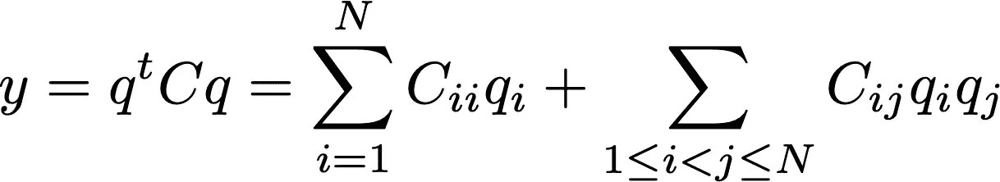
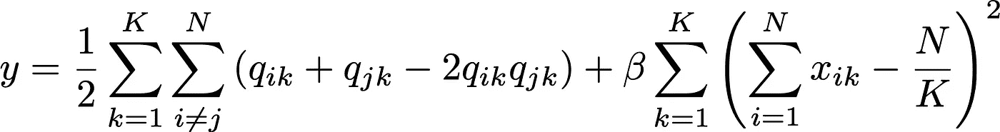
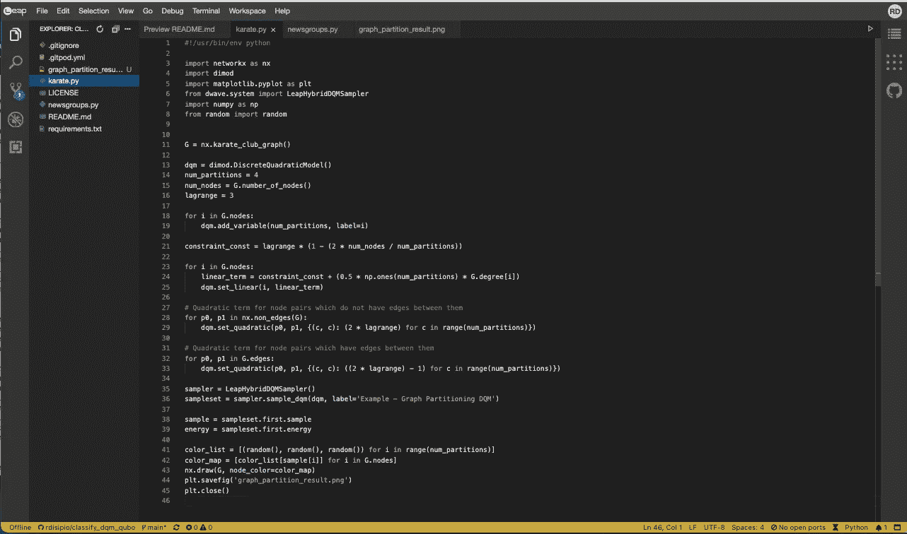
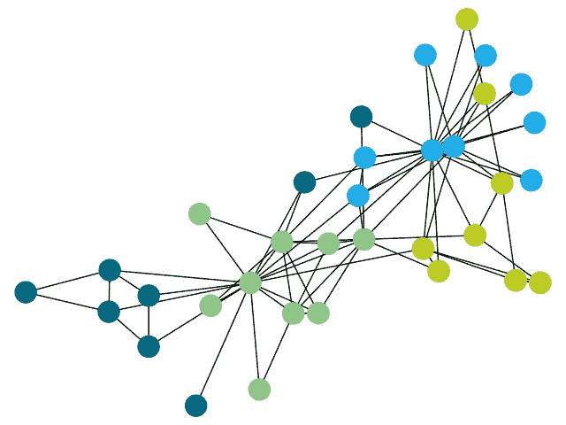

# DWave 量子退火机上运行的离散二次模型图划分

> 原文：<https://towardsdatascience.com/graph-partitioning-with-discrete-quadratic-model-running-on-dwave-quantum-annealer-6c2e821d646e?source=collection_archive---------37----------------------->

## [思想和理论](https://towardsdatascience.com/tagged/thoughts-and-theory)

## 量子退火器是一类量子计算机，可以帮助解决 NP 难和 NP 完全问题。这里有一个对社交网络、推荐系统等有实际意义的例子。

[图](/quick-guide-to-graph-traversal-analysis-1d510a5d05b5)是由一组通过边连接的节点组成的数据结构。图形无处不在:它们可以代表友谊的网络，工厂和商店、机场等等之间的联系。在可以应用于图形以提取有用信息的许多操作(其本身就是[一个巨大的兔子洞](https://en.wikipedia.org/wiki/Graph_operations))中，可能最明显的一个是分割，*，即*基于一些相似性或距离标准将 *N* 节点分成 *K* 组。主要思想是，一旦组被识别，属于给定组的节点彼此之间的关系比属于其他组的节点之间的关系更紧密。

一种成熟的聚类方法被称为无监督的 [K-means](https://en.wikipedia.org/wiki/K-means_clustering) ，其中每个观察值被分配到质心最近的[簇](https://en.wikipedia.org/wiki/Cluster_(statistics))(簇的*即*多维平均)。在 [scikit-learn](https://scikit-learn.org/stable/modules/generated/sklearn.cluster.KMeans.html) python 库中可以找到该算法的一个常见实现。

然而，K-means 并不是故事的结尾。我想在这篇文章中讨论的方法是基于一种叫做 [*二次无约束二元优化*](https://en.wikipedia.org/wiki/Quadratic_unconstrained_binary_optimization) (曲波)的优化方法，这是用[量子绝热退火程序](https://en.wikipedia.org/wiki/Adiabatic_quantum_computing)解决 [NP 难题](https://en.wikipedia.org/wiki/NP-hardness)的主力，这要归功于它与[伊辛能量函数](https://en.wikipedia.org/wiki/Ising_model)的联系，后者反过来描述了这种计算机背后的物理学。在曲波公式中，问题由一组二元变量 *q_i* ( *例如* 0 或 1，-1 或 1)、常数权重的方阵 *C* 以及我们希望通过找到最优的 *q_i:* 来最小化的目标(成本、损失)函数来描述



[*二次无约束二元优化*](https://en.wikipedia.org/wiki/Quadratic_unconstrained_binary_optimization) (曲波)的数学公式。图片作者。

在图划分方面，权重 *C_ij* 是预先计算的，例如它们表示[地理距离](http://scikit-learn.org/stable/modules/generated/sklearn.metrics.pairwise.haversine_distances.html#:~:text=The%20Haversine%20(or%20great%20circle,the%20longitude%2C%20given%20in%20radians.)或[余弦相似度](http://scikit-learn.org/stable/modules/generated/sklearn.metrics.pairwise.cosine_similarity.html)在 [TF-IDF](http://scikit-learn.org/stable/modules/generated/sklearn.feature_extraction.text.TfidfVectorizer.html) 文档嵌入之间。 *q_i* 是在最小化过程中找到的，代表解。人们经常不得不处理退化解，*即*不同组的 *q_i* 同样好地最小化 *y* 。

这些讨论的一个关键点是“*无约束*”这个词。无约束意味着目标函数…不受约束。举个例子，一个约束看起来像( *q_i* — 1) =1。在 Glover 等人的臭名昭著的[曲波模型指南](https://arxiv.org/pdf/1811.11538.pdf)中可以找到一长串的例子。无约束意味着人们必须在原始方程中添加一项以纳入约束，乘以常数[拉格朗日乘数](https://en.wikipedia.org/wiki/Lagrange_multiplier) β，*例如*。 **y' = y + β*(x — 1)** 。问题是，*y’*的最终方程必须仍然是曲波方程，使得约束可以被重新吸收到更新的权重矩阵*C’*的定义中。

要用曲波术语建立图划分问题，第一步是确定二进制变量代表什么。在这种情况下，一种常见的方法是将 *K* 个二进制变量分配给每个节点，并将它们解释为一个热码向量，也就是说，如果对于第 *i* 个节点，第 *j* 个比特为 1，而所有其他比特为 0，则该节点被分配给集群( *j* +1)。

```
Node | q_i0 | q_i1 | q_i2 |
 1   |  0   |  1   |  0   |
 2   |  1   |  0   |  0   |
 3   |  0   |  1   |  0   |
 4   |  0   |  0   |  1   |
```

首先，我们需要定义要最小化的目标函数。在一种常见的方法中，它被证明是不同集群之间*连接* *的简单数量。我们会让集群内连接的数量不受限制。这简单地通过询问对于一对节点 *i* 和 *j* ，它们*两个*必须属于集群 *k* 或者不属于集群*k*来实现，这是一个 [XOR 逻辑门。在曲波的世界里，相当于异或门的东西有点棘手。我们想要最小化由两个变量 *q_ik* 和 *q_jk* 构成的量。它们的和不是 2 就是 0，它们的积不是 0 就是 1。因此，以下组合满足要求:](https://en.wikipedia.org/wiki/XOR_gate)*

```
y = q_ik + q_jk - 2 * q_ik * q_jkq_ik | q_jk | sum | -2*prod | y
  0  |   0  |  0  |     0   | 0
  1  |   0  |  1  |     0   | 1
  0  |   1  |  1  |     0   | 1
  1  |   1  |  2  |    -2   | 0
```

然后，我们需要定义约束。

首先，我们希望 *K* 集群是*平衡的*，*即*每个集群必须包含相似数量的节点，大约等于 *N/K* 。

其次，如果我们正在进行二元二次模型设置，我们需要进一步的约束来确保在 *q* 变量中，只有 1 被设置为 1，而所有其他的都是 0。对于每个节点 *i* ，该约束将简单地是𝚺_ *j q_ij* = 1。然而，这是这篇文章的重点，DWave 在他们的软件中引入了一个新的功能来处理这种情况，作为一个*离散的*类索引(*例如*红色、绿色或蓝色)，而不是二进制。有趣的是，这种模型的[解算器](https://docs.ocean.dwavesys.com/en/stable/docs_system/reference/samplers.html#leaphybriddqmsampler)是*混合*类型的，这意味着它利用量子计算来改进对目标函数最小值的经典搜索。根据他们的声明:

> 这种混合求解器接受多达 5，000 个离散变量的问题，每个变量可以表示多达 10，000 个值的集合，以及 20 亿个线性加二次偏差

因此，总的目标函数+约束如下所示:



使用离散二次模型的图划分问题的曲波目标函数。图片作者。

这个表达式可以扩展然后简化为从二次项(乘积 *C_ij* * *q_i * q_j* )中分离线性项(每次涉及一个 *C_ii * q_i* ),这是一个繁琐但却是定义权重矩阵 *C* 的系数所必需的操作。感兴趣的读者可以在 DWave 网站上的[这个例子](https://github.com/dwave-examples/graph-partitioning-dqm)中找到更多细节。

作为一个实际的用例，我使用了一个大学空手道俱乐部的社交网络[扎卡里的空手道俱乐部](https://en.wikipedia.org/wiki/Zachary%27s_karate_club)图，在韦恩·w·扎卡里的[论文](http://www1.ind.ku.dk/complexLearning/zachary1977.pdf)“小团体中冲突和分裂的信息流模型”中有所描述。这个由 34 个人组成的小型网络的结构可以在 python 库中找到。成对成员之间的联系代表了俱乐部之外的互动，他们最终分成两个独立的小组。为了展示如何从`networkx`中读取图形结构，然后用 [DWave ocean](https://docs.ocean.dwavesys.com/) 库对其进行分析，我们将把可能的子组数量增加到 2 个以上。

完整的代码可以在[我的 GitHub 库](https://github.com/rdisipio/classify_dqm_qubo/blob/main/karate.py)中找到。简而言之，以下是解决问题所必需的一系列操作:

然而，为了运行它，需要访问闰 DQM 解算器，所以基本上需要访问[闰](https://cloud.dwavesys.com/leap/)。别担心，这是免费的，但使用量仅限于每月一定的数量。

一旦您获得了 Leap 的访问权，您就可以使用 LeapIDE 开发环境了。要启动一个工作区，你只需将浏览器指向一个以`*https://ide.dwavesys.io/#`*开头的地址，然后是 GitHub 库的地址。例如:

[](https://github.com/rdisipio/classify_dqm_qubo/blob/main/karate.py) [## rdisipio/classify _ dqm _ 曲波

### 使用曲波二次离散模型分类文档-rdisipio/classify _ dqm _ 曲波

github.com](https://github.com/rdisipio/classify_dqm_qubo/blob/main/karate.py) 

```
*https://ide.dwavesys.io/#*[https://github.com/rdisipio/classify_dqm_qubo](https://github.com/rdisipio/classify_dqm_qubo)
```

如果一切正常，它应该是这样的:



然后，您可以打开一个终端窗口(终端>新终端)并键入命令`python karate.py`。输出将显示为新的。名为`graph_partitioning_result.png`的 png 文件，看起来应该类似于用于 *K* =4 个集群的文件:



将空手道俱乐部图分成 4 组的结果。图片作者。

总之，图划分是一个突出的问题，有许多不同的方法可以解决它。曲波方法已经存在有一段时间了(也可参见 Ushijima-姆维西瓦等人的这篇好论文)，但是它们的定义对我来说似乎总是很麻烦，因为必须处理簇变量的方式，尤其是因为在某些情况下缺乏唯一的赋值。这通过使用具有离散二次模型的混合方法得到了很好的解决，这允许用户通过利用经典和基于量子的计算之间的相互作用来解决大型问题。