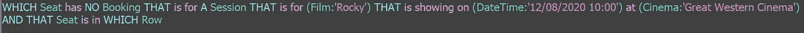
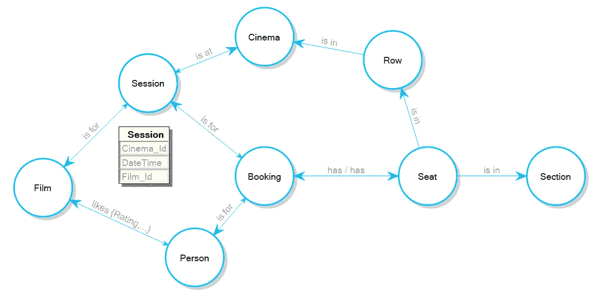
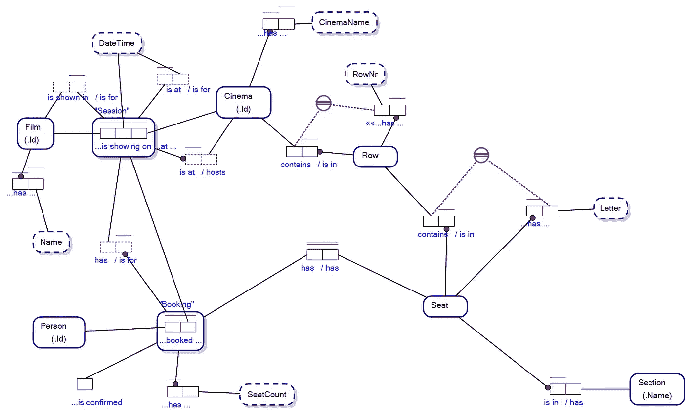
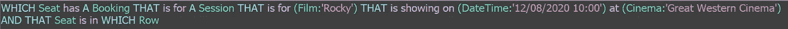
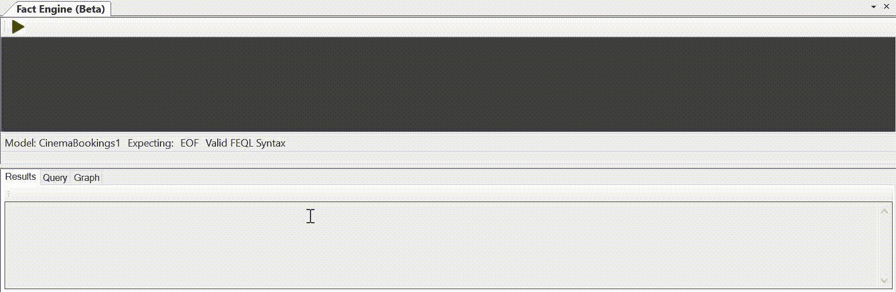

# 图表查询和影院预订

> 原文：<https://towardsdatascience.com/graph-queries-and-cinema-bookings-cfb8fe02db25?source=collection_archive---------38----------------------->

## 知识图商业语言子查询变得简单

在 [Unsplash](https://unsplash.com/s/photos/cinema?utm_source=unsplash&utm_medium=referral&utm_content=creditCopyText) 上由 [Myke Simon](https://unsplash.com/@myke_simon?utm_source=unsplash&utm_medium=referral&utm_content=creditCopyText) 拍摄的照片。皇家自由形象。

我的业务被称为 FactEngine，这是一项从根本上改变人们对数据库和知识图查询语言的看法的举措。

假设您想在一家电影院预订一个座位，该影院使用一个数据库来跟踪这些预订。如果你想找到那个座位，你应该问:

FactEngine 查询语言中的图形查询。图片作者。

以上是 FactEngine 中的图表查询，对以下图表进行操作:

显示电影院中会话属性的属性图模式。图片作者。

**子查询**

对于 initiated，该查询包含一个子查询，该子查询将首先找到那些已经预订的座位，并返回该集合之外的座位，或者相反地使用一个[相关子查询](https://en.wikipedia.org/wiki/Correlated_subquery)，其中“座位的预订计数为零”针对电影院中的每个座位进行操作。

由于 FactEngine 查询引擎位于将所有数据库概念模型首先视为[对象-角色模型](/why-learn-object-role-modelling-4eebd93dcda2#:~:text=When%20you%20learn%20ORM%2C%20you,to%20learn%20Object%2DRole%20Modelling.)(如下)的架构内，因此该查询既是图形查询又是自然语言查询。

在我们的对象-角色模型中，会话是“**电影*在*日期时间*在*电影院**上映”的地方，这允许在我们的子查询中进行简单的图形横切，即:

使用对象-角色模型的事实类型读数的图遍历。图片作者。

点击放大。电影院订票的对象-角色模型。图片作者。

也就是说，在我们的模型的图形表示中，日期时间是一个 ***属性*** ，在我们的图形查询中，日期时间成为一个有效的 ***节点*** ，其中对象角色建模中的对象类型是超图中的有效节点。

我们示例中的子查询受单词“NO”的影响。即哪个座位没有预订。

## 一个词彻底改变了查询

与自然语言一样，FactEngine 查询中的一个单词就可以从根本上改变查询的含义。

将“无预订”更改为“有预订”，将返回所有已预订的座位:

通过更改查询中的一个单词来删除子查询需求。图片作者。

也就是说，我们已经有效地去除了对任何子查询的需求，现在我们的查询变成了简单的图遍历。

我觉得这很有趣。人类自然明白，句子中的一个单词就能从根本上改变他们处理信息的方式。让一台计算机在没有机器学习的情况下做那件事*是我的动力所在。*

## *为什么是图形查询？谁在乎呢。*

*事实引擎目前在关系数据库上运行，关系数据库通常使用 SQL 进行查询。如果您必须为本文顶部的查询编写 SQL，您将会遇到一些麻烦。这是:*

*选择[座位]。Cinema_Id，[座位]。RowNr，[座位]。字母，[行]。Cinema_Id，[Row]。RowNr
从【座位】，
【Row】
那里【座位】。Cinema_Id = [Row]。Cinema_Id
和【座位】。RowNr = [Row]。RowNr
和 1 >(从【预订】、
【场次】、
【电影】、
【影院】
、bookinghaseat
中选择 COUNT(*)
)其中【bookinghaseat】。person _ Id =[预订]。Person_Id
和【BookingHasSeat】。film _ Id =[预订]。Film_Id
和【BookingHasSeat】。日期时间=[预订]。日期时间
和【BookingHasSeat】。CinemaId =[预订]。Cinema_Id
和【BookingHasSeat】。RowNr = [Seat]。RowNr
和【BookingHasSeat】。Cinema_Id = [Seat]。Cinema_Id
和【BookingHasSeat】。字母=[座位]。信
和【预订】。Film_Id = [Session]。Film_Id
和【预约】。日期时间=[会话]。日期时间
和【预约】。Cinema_Id = [Session]。Cinema_Id
和【会话】。Film_Id = [Film]。Film_Id
和【会话】。Cinema_Id=[Cinema]。Cinema_Id
和【电影】。Name = 'Rocky'
和[Session]。DateTime = '12/08/2020 10:00'
和【影院】。CinemaName = '大西部电影院'
)*

*可能只有我，但我更愿意这样写查询:*

**

*事实引擎中的自然语言查询。图片作者。*

*我觉得关系数据库供应商有很大的机会通过使关系数据库的查询更容易来夺回图形数据库的失地。*

*下一步是实现机器学习和复杂的机制不一定是计算机解释和理解大量自然/商业语言查询所必需的。*

*对于门外汉来说，子查询总是一个学习曲线，所以我觉得，任何可以使生活变得简单的工具都是好东西。*

*感谢您的阅读。如果时间允许，我会写更多关于图形查询、图形数据库、关系数据库和对象角色建模的文章。*

***NB** 本文表达的模型的原始版本版权归 DataConstellation 所有，在 GitHub 上的 ActiveFacts 项目下共享:[https://github.com/cjheath/activefacts](https://github.com/cjheath/activefacts)*

*——————End————*