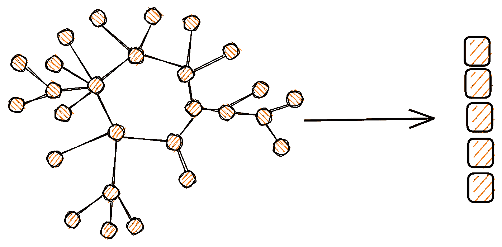
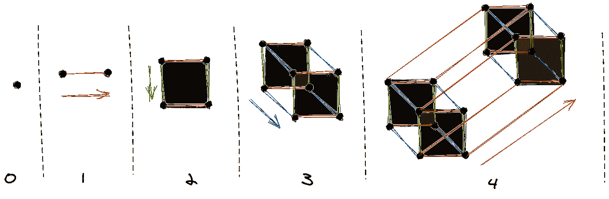
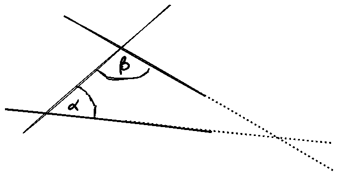
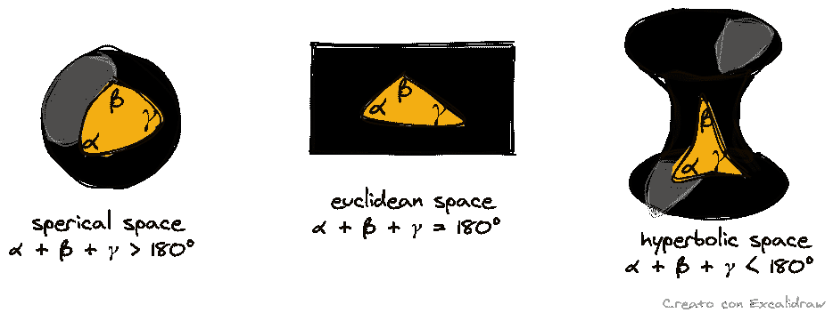

# 图形表示学习——网络嵌入(上)

> 原文：<https://towardsdatascience.com/graph-representation-learning-network-embeddings-d1162625c52b?source=collection_archive---------18----------------------->

## [GraphEDM 系列](https://towardsdatascience.com/tagged/graphedm-series)

## 主要概念的热身

节点嵌入的表示—作者修改的来自 Excalidraw 库的图像

*这个系列总结了一个关于图的机器学习的综合分类法，并报告了 GraphEDM(横山雅美等。al)，一个统一不同学习方法的新框架*

图是建模关系数据的通用结构。从社会网络连接到蛋白质相互作用，图结构强调数据点之间的联系，使新一代基于网络的系统的开发成为可能。考虑到图在真实场景中的广泛应用以及最近表征学习技术的成功，图表征学习(GRL)方法已经大量涌现。因此，鉴于这种令人印象深刻的增长，有一个在一个可理解的框架内总结和统一 GRL 方法的巨大需求。因此，在这一系列中，我报告了我个人对以下论文的综合:

> I .横山雅美、s .阿布埃尔海贾、b .佩罗齐、réc .、k .墨菲(2020 年)。图的机器学习:一个模型和综合分类法。arXiv 预印本:2005.03675。

这份手稿为理解 GRL 方法背后的主要直觉提供了坚实的基础。此外，所提出的分类法对于获得可用应用程序的广泛概述和支持为给定问题选择最佳工具特别有用。在这个新系列中，我将重点关注*Graph Encoder Decoder Model*(*graphe DM*)的一般思想，它能够描述一系列监督和非监督的方法，用于学习图形数据的表示(有关单一方法的详细信息，可以直接参考该论文)。

该系列的结构如下:

1.  *GRL 背景下的嵌入问题概述(本文有报道)。*
2.  *GraphEDM 框架的* [*描述*](/graph-representation-learning-the-encoder-decoder-model-part-2-ed8b505af447) *，包括其主要组件的摘要。*
3.  *A* [*详细解释*](/graph-representation-learning-objective-functions-and-encoders-aef3a65bbf81) *框架中定义的目标(或损失)函数、编码方法和监督应用。*

# 图形表示学习中的嵌入

GRL 方法的主要目标是从离散图形数据中学习低维连续表示，即所谓的*嵌入*。图的属性必须保留在嵌入空间中:例如，在原始图中由相似连接表征的节点在学习过程结束时实现了接近的向量表示(在几行中，我们将看到这对于结构嵌入是如何正确的)。从另一个角度来看，节点嵌入学习可以被视为用于可伸缩性目的的降维过程。事实上，学习向量的维数严格低于原始图中的节点数。

以下小节提供了直观的定义，以便清楚地说明 GRL 的问题设置。特别是，这些小节讨论了以下各项之间的重要差异:

1.  欧几里得与非欧几里得几何。
2.  位置嵌入与结构嵌入。
3.  直推式学习与归纳式学习。
4.  无人监督和有人监督的任务。

## 欧几里得几何与非欧几里得几何

在大多数表示学习方法中，嵌入使用*欧几里德*空间中的向量建模。2000 多年来，直到 19 世纪，这是唯一已知的物理空间的概念，它仍然是最适合模拟日常世界的方式。根据[大英百科全书](https://www.britannica.com/science/Euclidean-space)，欧几里得空间被定义为:

> 欧几里得几何的公理和假设适用的二维或三维空间；也指任何有限维数的空间，其中的点用坐标来表示(每一维一个坐标),两点之间的距离由距离公式给出。

从第 0 维到第 4 维欧几里得空间—作者图片

《大英百科全书》在其定义的开头解释说，欧几里得空间通过定义满足欧几里得几何的公理。欧几里得几何的独特公理之一是*平行公设。为了清楚直观地理解这一假设，请看下图。*

平行公设的图示—作者的图像

在这幅图中，一条线段与两条直线相交。这个交点在同一边形成两个内角 *α* 和 *β* ，内角之和小于两个直角之和(<180°)。根据公设，如果这两条线无限延伸，它们将在α和β边上的某一点相交。平行公设可以通过等价陈述来定义，这对于更好地理解网络嵌入表示是更有趣的。例如，这些陈述包括公平竞赛公理:

> **至多有一条线**可以通过一个外部点平行于另一条给定的线

三角形假设:

> 每个三角形的角之和是 180 度

虽然欧几里得嵌入对于表示网格结构或顺序数据特别有效，但是对于图形来说，人们对*非欧几里得*表示学习的兴趣越来越大。在这种情况下，主要目标是学习非欧几里得空间中的嵌入，例如球面和双曲空间。在非欧几里得空间中，平行公设及其等价陈述不成立:例如，在双曲空间中， [Playfair 公理被反驳](https://en.wikipedia.org/wiki/Hyperbolic_geometry#Non-intersecting_/_parallel_lines)，因为:

> **至少有两条线**可以通过一个外部点平行于另一条给定的线

通过观察三角形公设在非欧几里得空间中如何不被满足，可以获得清楚的直觉:

球面、欧几里德和双曲空间中三角形公设的图形表示—图片由作者提供

在 GRL 的背景下，非欧几里得方法似乎很有前途。这些方法背后的主要思想是在连续的嵌入空间中映射图形数据表示，这能够类似于输入的底层图形结构(例如，双曲空间表示树的连续版本)。例如，称为知识图(KGs)的语义网络的特定实现展示了分层和逻辑模式，这些模式可以通过双曲嵌入高保真地保留。以下文章和[相关系列](https://towardsdatascience.com/tagged/kgs-insights)中提供了有关 kg 的更多信息:

 [## 知识图表一览

### 利用语义图视角，将人类知识融入智能系统

towardsdatascience.com](/knowledge-graphs-at-a-glance-c9119130a9f0) 

## 位置嵌入与结构嵌入

RL 技术旨在学习保持输入图结构的低维表示。矩阵分解或随机行走等技术倾向于保留全局结构，重建图中的边并保持距离，如原始网络中的最短路径。关注全局结构的方法的目标是学习所谓的*位置嵌入。*

包括图形神经网络(GNNs)在内的其他技术旨在捕捉局部图形结构:图形中具有相似邻居的中心节点应该具有相似的嵌入，而不管原始网络中节点的距离。这些结构感知方法的目标是学习所谓的*结构嵌入。*

## 直推式学习与归纳式学习

对嵌入方法进行分类的一种特定方式与它们对未知数据的泛化能力有关。直推式设置假设在训练过程中观察到所有的图节点:该设置的要求是固定的图，不考虑新节点、边或子图结构形式的新实例。直推式方法允许我们在训练过程中推断分析的节点之间的新信息。例如，给定部分标记的节点，我们可以对未标记的节点进行分类。或者，在其他情况下，我们可以预测在训练期间观察到的图节点之间的新边。

在归纳设置中，我们期望模型能够推广到在训练过程中没有看到的节点和边。因此，归纳学习可能特别适合于动态的和时间演化的图。节点特征在归纳图表示学习方法中起着至关重要的作用。事实上，与直推式方法不同，这些特征可以用来学习参数映射的嵌入。通过优化这种参数映射而不是直接优化嵌入来实现学习目标。这意味着学习映射可以应用于任何节点，甚至是那些在训练过程中没有看到的节点。

## 无人监督与有人监督的任务

在 *无监督的*任务中，图结构是唯一可用的信息。因此，嵌入学习过程的目标是保持图形结构，优化重建损失。这个损失函数测量学习的嵌入能够多好地逼近原始图。

在监督任务中，提供了有关节点或图形标签的附加信息。在这些情况下，嵌入学习过程旨在处理下游任务，包括节点、边或图属性的预测。因此，该模型被优化以达到这一特定目的。正如我在下面的文章中已经报道的，在 GNNs 的情况下，您可以向网络架构添加一个预测层，以便达到您的学习目标，从节点分类到链路预测。

# 下一步是什么

在本系列的下一篇文章中，我将提供 GraphEDM 的细节，这是一个通用框架，封装了无监督和有监督的方法、图正则化和 GNNs。

对于 GraphEDM 框架上的所有文章，你可以使用下面的链接:【https://towardsdatascience.com/tagged/graphedm-series】T4。

*关于图形表示学习的进一步阅读，你可以通过以下链接关注我的系列*:[https://towardsdatascience.com/tagged/grl-series](https://towardsdatascience.com/tagged/grl-series)。

*如果你喜欢我的文章，你可以支持我使用这个链接*[*https://medium.com/@giuseppefutia/membership*](https://medium.com/@giuseppefutia/membership)*成为一名中等会员。*