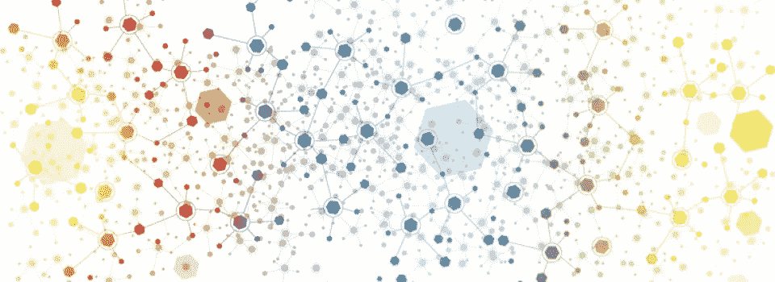
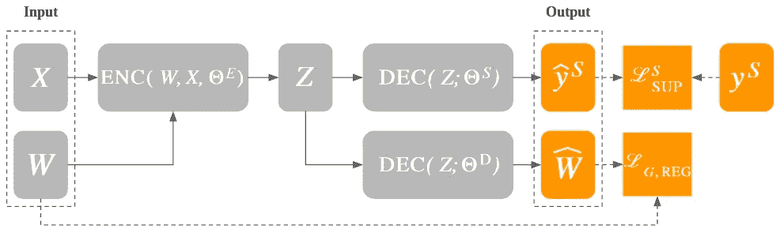
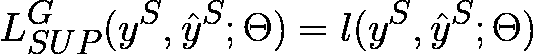
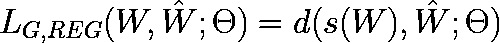
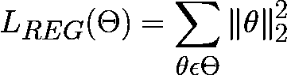
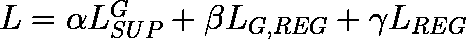
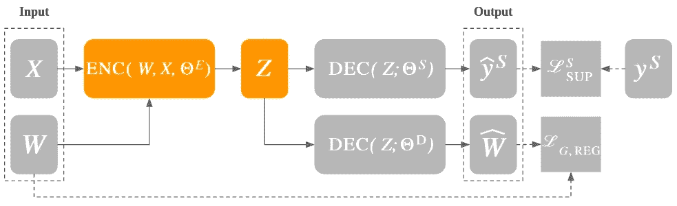
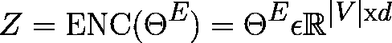
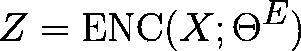
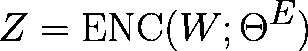

# 图形表示学习——目标函数和编码器(第三部分)

> 原文：<https://towardsdatascience.com/graph-representation-learning-objective-functions-and-encoders-aef3a65bbf81?source=collection_archive---------19----------------------->

## [GRAPHEDM 系列](https://towardsdatascience.com/tagged/graphedm-series)

## 让我们了解如何优化 GRL 模型以及它们整合不同网络功能的能力

Graph Vis —原图来自 [NYU 上海网站](https://research.shanghai.nyu.edu/centers-and-institutes/datascience/events/visualization-exploring-large-graphs-and-explaining)

*这个系列总结了一个关于图的机器学习的综合分类法，并报告了 GraphEDM(横山雅美等人)的细节，这是一个统一不同学习方法的新框架。*

最近几年，图形表示学习(GRL)技术有了大规模的发展。这些技术的主要目标是学习将图形数据的离散结构映射到向量空间中的连续表示的函数。在[之前的文章](https://towardsdatascience.com/tagged/graphedm-series)中介绍的 GraphEDM 框架能够在 GRL 环境中统一 30 多种方法来学习这些连续的表示，也称为*嵌入*。

在无监督的设置中，GRL 技术的学习目标是保持图形结构。在监督设置中，目标是解决特定的下游任务。不同的学习方法意味着不同的优化方法和不同类型的编码器来生成节点嵌入。因此，本文的第一部分致力于 GraphEDM 中实现的目标函数。第二部分关注不同类型的基于图形的编码器。要简要回顾 GraphEDM 框架，我建议阅读本系列的前几篇文章。

 [## 图形表示学习——网络嵌入(上)

towardsdatascience.com](/graph-representation-learning-network-embeddings-d1162625c52b)  [## 图形表示学习——编码器-解码器模型(下)

towardsdatascience.com](/graph-representation-learning-the-encoder-decoder-model-part-2-ed8b505af447) 

横山雅美等人在文章中报道了所有的框架细节:

> *横山雅美岛、阿布-埃尔-海贾岛、佩罗齐岛、雷岛、&墨菲岛(2020 年)。* [*图的机器学习:一种模型和综合分类法*](https://arxiv.org/abs/2005.03675) *。arXiv 预印本:2005.03675。*

# 目标函数

在机器学习中，*目标函数*，或*标准*，是我们在模型参数优化过程中想要最小化(或最大化)的一般函数。如果我们要最小化输出，对于单个训练示例，目标函数被表示为*损失*函数，而当考虑整个训练集时，它被称为*成本*函数。

因此，损失函数是在数据点上定义的:它将来自模型的预测标签与目标标签进行比较，并计算惩罚。成本函数可以是单个惩罚加上复杂性惩罚的总和或平均值，定义为*正则化*。正则化允许模型稳定学习过程并增强其泛化能力。在正则化中，模型参数被约束(或正则化)，阻碍噪声信号的学习并避免过拟合。

正如我们将很快看到的，在 GRL 的具体情况下，图结构也可以在学习过程中作为正则项使用。

# 损失函数

GraphEDM 框架中的损失函数(经许可后发布)

在 GraphEDM 框架中包含 GRL 技术的情况下，我们希望优化三个不同的参数类(参见本系列的[上一篇文章](/graph-representation-learning-the-encoder-decoder-model-part-2-ed8b505af447)了解更多详细信息):

*   θ^e 代表编码器网络的参数；
*   θ^d 代表解码器网络的参数；
*   θ^s 代表分类网络的参数。在这种特定情况下， *S* 是包括节点、边和图的特征和标签的监督信号的集合: *S ∈ {N，E，G}。*

所有这些参数都通过组合监督损失项、图形正则化损失项和权重正则化损失项来优化。

## **监督损失**

*监督损失*项计算预测标签和目标标签之间的损失。

图形表示学习——监督损失项(转自横山雅美等人的手稿)

该损失项中涉及的图形信号 *S* 与涉及模型训练阶段的下游任务严格相关。如果要执行的任务是节点分类，那么 *S = (N)。*对于任务集中于链路预测的情况， *S = (E)* 。否则，在图级别执行任务的情况下， *S = (G)* 。在这个数学形式化中， *ŷ^S* 代表预测空间，而 *y^S* 代表标签空间。

## 图正则化损失

*图正则化损失*项的目标是通过利用网络结构来正则化 GRL 模型的参数。

图形表示学习——图形正则化损失项(来自横山雅美等人的手稿)

惩罚计算基于重构的相似性矩阵*ŵ*T4 和目标相似性矩阵 *s(W)* 之间的距离。矩阵*ŵ*和 *W* 的维数都等于|V|×|V|，其中|V|是节点数。 *d* 执行*ŵ*和 *s(W)之间的距离计算。*

为了更好地理解 GRL 相似矩阵的一般概念，考虑下面的说明。图正则化最简单的用法是重构邻接矩阵，它的维数是|V|×|V|。正如我在关于 GNNs 的介绍性文章中用一个例子描述的那样，邻接矩阵描述了节点之间的(加权)边。

我们可以说邻接矩阵决定了两个节点之间的一阶接近度。为了澄清这个方面，考虑两个不同的节点 *vᵢ* 和 *vⱼ* :这些节点的局部相似性值，根据一阶接近度，由边权重 *wᵢⱼ.定义*因此，一阶近似能够捕获两个不同节点之间的边的存在和有效性。

然而，我们可以扩展这个一阶邻近概念，尝试从图结构中封装进一步的信息。例如，两个节点之间的二阶接近度不考虑基于它们的加权边的两个节点之间的一致性，而是基于它们的相邻节点的同质性。换句话说，如果两个节点倾向于具有许多共同的邻居，则它们根据二阶接近度实现更接近的表示。

节点邻近的概念对于学习图嵌入是至关重要的，因为许多 GRL 模型的训练目标是保持一个或多个邻近顺序。

## *重量规则化损失*

*权重正则化损失*项是一种传统方法，用于在训练步骤中一般正则化模型参数。

图形表示学习——权重正则化损失项(来自横山雅美等人的手稿)

权重正则化概念背后的主要思想是在模型中注入少量的偏差，以获得方差的显著下降。因此，在拟合稍差的情况下，我们可以用真实数据提供更好的预测。最常见的正则化是 *L2* ，其中 *θ* 参数的平方值使得预测对训练数据的变化不太敏感。

## 损失项组合

正如本节开头所解释的，为 GraphEDM 框架中封装的模型定义的损失包括所有前面的组件。为此，损失计算如下。

图形表示学习—损失项组合(转自横山雅美等人的手稿)

*α* 、 *β* 和 *γ* 是可以在训练过程中学习的超参数。可以猜测，在图嵌入学习的监督设置中 *α* ≠ 0，而在非监督设置中 *α* = 0 以排除监督损失项的贡献。

# GraphEDM 编码器

GraphEDM 编码器(经许可后发布)

编码器网络的主要目标是将图中的每个节点映射到低维向量中。基于生成节点嵌入的编码器，不同的 GRL 方法显著不同。GraphEDM 框架总结了四个主要类别:浅层嵌入方法、图正则化方法、图自动编码方法和邻域聚合方法。

## 浅层嵌入方法

在浅嵌入方法的情况下，编码器功能是简单的投影操作。

浅层编码器网络(转自横山雅美等人的手稿)

因此，模型的参数被直接用作节点嵌入(在数学公式中， *|V| x d* 对应于模型参数的数量)。

考虑到它们的性质，这些方法在直推式设置中特别有用，直推式设置假设在训练过程中观察到所有的图节点。与归纳设置不同，直推设置的要求是一个固定的图形，不会随着时间的推移而演变。要具体理解投影步骤，你可以看我在 GNNs 上的[介绍相关的文章(“输入层”一节)。](/understanding-the-building-blocks-of-graph-neural-networks-intro-56627f0719d5)

## 图正则化方法

在图正则化方法的情况下，编码器仅利用节点特征和标签。

图形正则化编码器网络(张贴自横山雅美等人的手稿)

即使它不直接用于传播到编码网络中，图结构也被用作正则化约束( *β* ≠ 0 以保留图正则化损失项)。作为主要结果，使用训练步骤来学习节点特征，但是同时，使用图结构来正则化它们。

## 图形自动编码方法

在图形自动编码方法的情况下，编码器组件只利用图形结构。

图形自动编码网络(转自横山雅美等人的手稿)

与浅层嵌入方法相比，图形自动编码器能够利用深度学习架构来学习非线性特征。在这种特定情况下，图结构没有被用作图正则化项，而是作为邻接矩阵 *W* 被直接注入(使用自动编码器)编码器组件中。

## 邻域聚合方法

在邻域聚合方法的情况下，在传播步骤中利用了节点特征( *X* )和图结构( *W* )。

邻域聚合编码器网络(转自横山雅美等人的手稿)

这些 GRL 方法利用消息传递框架(参见[我以前的一篇文章](/understanding-the-building-blocks-of-graph-neural-networks-intro-56627f0719d5)以获得清晰的直觉)用其邻居的特性更新节点特性。在这种情况下，邻居特征通过边作为*消息*被*传递*到目标节点。作为主要结果，嵌入能够编码图的局部结构。值得一提的是，图卷积网络(GCNs)是邻域聚合方法的一个有效示例。

*对于 GraphEDM 框架上的所有文章，可以使用以下链接*:[https://towardsdatascience.com/tagged/graphedm-series](https://towardsdatascience.com/tagged/graphedm-series)。

*关于图形表征学习的进一步阅读，你可以通过以下链接关注我的系列*:[https://towardsdatascience.com/tagged/grl-series](https://towardsdatascience.com/tagged/grl-series)。

*如果你喜欢我的文章，可以支持我使用此链接*[*https://medium.com/@giuseppefutia/membership*](https://medium.com/@giuseppefutia/membership)*成为一名中等会员。*