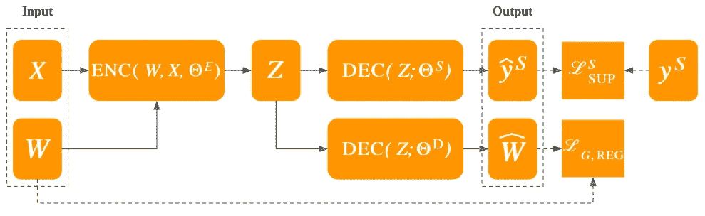
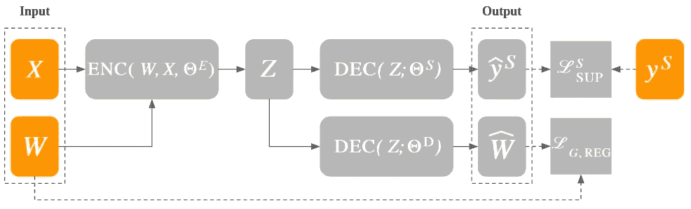
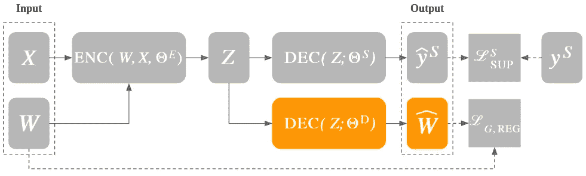
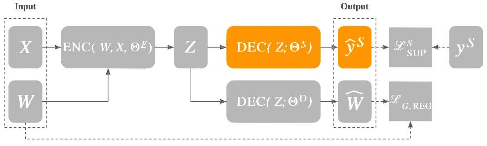
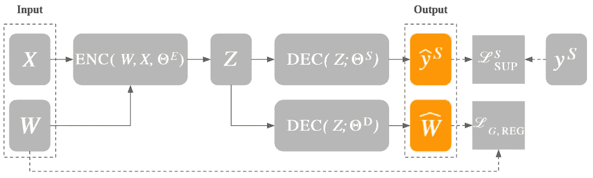

# 图形表示学习——编码器-解码器模型(下)

> 原文：<https://towardsdatascience.com/graph-representation-learning-the-encoder-decoder-model-part-2-ed8b505af447?source=collection_archive---------13----------------------->

## [GraphEDM 系列](https://towardsdatascience.com/tagged/graphedm-series)

## 深入探究 GraphEDM 架构

GraphEDM 框架的表示——作者修改的原始纸质图像(经允许后发布)

*这个系列总结了一个关于图的机器学习的综合分类法，并报告了关于 GraphEDM 的细节(*横山雅美等人。al *，一个统一不同学习方法的新框架。*

图是无处不在的结构，能够编码不同领域中不同元素之间的关系，从社交网络到金融交易。图嵌入是来自网络结构化数据的低维连续表示，可以通过应用图表示学习(GRL)技术来学习。

在本系列的前一篇文章中，我从不同的角度提出了对网络嵌入的讨论，进行了不同的比较，包括欧几里德几何与非欧几里德几何，位置嵌入与结构嵌入，以及直推式学习与归纳式学习。

 [## 图形表示学习——网络嵌入(上)

towardsdatascience.com](/graph-representation-learning-network-embeddings-d1162625c52b) 

在第二篇文章中，我们将详细介绍 GraphEDM 架构，从编码器-解码器的角度来看，它在一个独特的框架中连贯地包含了不同的 GRL 技术。横山雅美等人在文章中报道了所有的框架细节。艾尔:

> I .横山雅美、s .阿布埃尔海贾、b .佩罗齐、réc .、k .墨菲(2020 年)。图的机器学习:一个模型和综合分类法。arXiv 预印本:2005.03675。

编码器的目标是将数据点的特征转换成低维表示。解码器将该表示作为输入，并试图重建原始数据。如果在训练过程中计算的嵌入能够捕获核心信息，该核心信息能够编码数据中的最高方差，则该架构的性能增加。因此，编码器-解码器架构的学习目标是在重建过程中最小化信息损失。

在网络的情况下，该重建过程旨在恢复原始图形结构(无监督设置)或实现解决特定任务的表示，例如节点或边分类(有监督设置)。与现有的研究工作相比，GraphEDM 定义了一个端到端的模型，能够封装监督和非监督学习方法。以下各节描述了该框架的主要组成部分，该框架能够在 GRL 的背景下归纳出 30 多种方法。

## 投入

GraphEDM 框架的输入

GraphEDM 框架认为输入是一个无向加权图， *G=(N，E)* ，其中 *N* 是节点集，而 *E* 表示边集。这个无向图是使用两种不同类型的矩阵定义的:邻接矩阵 *W* 和描述节点特征的可选矩阵 *X* 。

邻接矩阵 *W* 是一个维数为|*N*|*x*|*N*的方阵，它对图中节点之间的关系进行编码。在未加权图形的情况下， *W* 包括 0 和 1 之间的值。否则，对于加权图，这些值对应于边权重。 *X* 矩阵的行数对应于图中的节点数| *N* |，列数对应于特征尺寸 *d* ₀.以下文章提供了此类维度的示例:

 [## 了解图形神经网络的构建模块(简介)

### 框架上的直觉(带有运行代码),用神经架构分析和学习图形数据

towardsdatascience.com](/understanding-the-building-blocks-of-graph-neural-networks-intro-56627f0719d5) 

对于(半)监督设置，我们需要包括目标标签，用于在特定的下游任务上训练模型。为节点 *N* 边 *E* 和/或整个图形 *G* 提供训练目标标签。监控信号的集合在 GraphEDM 论文中表示为 *S∈{N，E，G}* 。

## 图形编码器网络

GraphEDM 编码器

属于 GraphEDM 架构的第一个组件是图形编码器网络，表示为 *ENC(W，X；θ^e).*编码器将以下内容作为输入:

1.  图的结构形式为邻接矩阵*W→*|*N*|*x*|*N*|；
2.  该节点特征以特征矩阵 X →| *N* | *x* d₀.的形式出现

该输入由*θ^e*参数化，以便产生节点嵌入矩阵 *Z = ENC(W，x；θ^e)*。 *Z* 的维数为| *N* | *x d* ，其中 *d* 对应节点嵌入维数。根据编码器的类型，在训练过程中生成并在矩阵 *Z* 中编码的节点嵌入可能捕获不同的图形属性。例如，在本系列的前一篇文章中报道的，矩阵分解和随机漫步等技术旨在学习低维表示，以保持输入图的全局结构。包括图形神经网络(GNNs)在内的其他技术旨在捕捉局部图形结构:具有相似局部表示的节点应该具有相似的嵌入，而不管原始网络中节点的距离如何。

## 图形解码器和分类网络

图形解码器网络

解码器组件*DEC(Z；θ)*将捕捉到的图形特征作为输入，并将其转换成由*θ*参数化的低维表示。对于无监督的任务，图解码器网络的目标*ŵ=dec(z；θ^d)*是从节点嵌入 *Z* 中重建邻接矩阵*ŵ*，以计算所有节点对的相似性(或不相似性)得分。

分类网络

在监督设置中，分类网络产生标签值*ŷ^s=dec(z；θ^s)*对应于与下游任务相关的输出。如输入部分所介绍的， *S* 包括被监控信号的采集 *{N，E，G}* 。

## 输出

GraphEDM 框架的输出

GraphEDM 框架能够根据具体的问题设置产生双重输出。事实上，模型的输出对应于训练无监督嵌入算法的邻接矩阵，以及有监督任务的输出标签。直观来看，*ŵ*的维数与*w*(|*n*|*x*|*n*|)的维数相同。另一方面， *ŷ^S 的维数为*|*n*|*x*|*υ*|，其中 *Y* 为标签空间。取决于受监督的应用，标签输出空间可以不同，以表示节点标签空间、边标签空间和图标签空间。

## 损失函数

GraphEDM 框架中的损失函数

不同类型的损失项用于优化 GRL 环境中的模型，包括*监督损失*、*图正则化损失*和*权重正则化*。GraphEDM 模型能够通过学习前面章节中提到的参数组合这些术语*θ*∈{*θ^e、θ^d、θ^s}*。

监督损失项 *Lₛᵤₚ^S* 将预测标签 *ŷ^S* 与目标标签 y *^S* 进行比较，这取决于下游任务(例如节点分类)。

图正则化损失项 *L* 𝓰 ᵣₑ利用图结构对模型的权重施加正则化约束。与监督损失不同，图正则化比较解码的邻接矩阵*ŵ*和地面真实邻接 *W* 。这种类型的正则化施加了例如相邻节点共享相似嵌入的约束。

权重正则化 *L* ᵣₑ传统上包括一套技术，可以防止神经架构中的过拟合，提高它们的泛化能力。这使得能够学习正则化系数，其在最小损失函数的方向上定义约束边界。因此，在训练阶段，优化被阻止达到损失函数的最小值，这可能导致过拟合。

# 下一步是什么

在本系列的下一篇文章中，我将详细介绍 GraphEDM 架构的不同组件，包括不同类型的编码器和损失函数。

对于 GraphEDM 框架上的所有文章，您可以使用以下链接:[https://towardsdatascience.com/tagged/graphedm-series](https://towardsdatascience.com/tagged/graphedm-series)。

*关于图形表征学习的进一步阅读，可以关注*:[https://towardsdatascience.com/tagged/grl-series](https://towardsdatascience.com/tagged/grl-series)的相关系列。