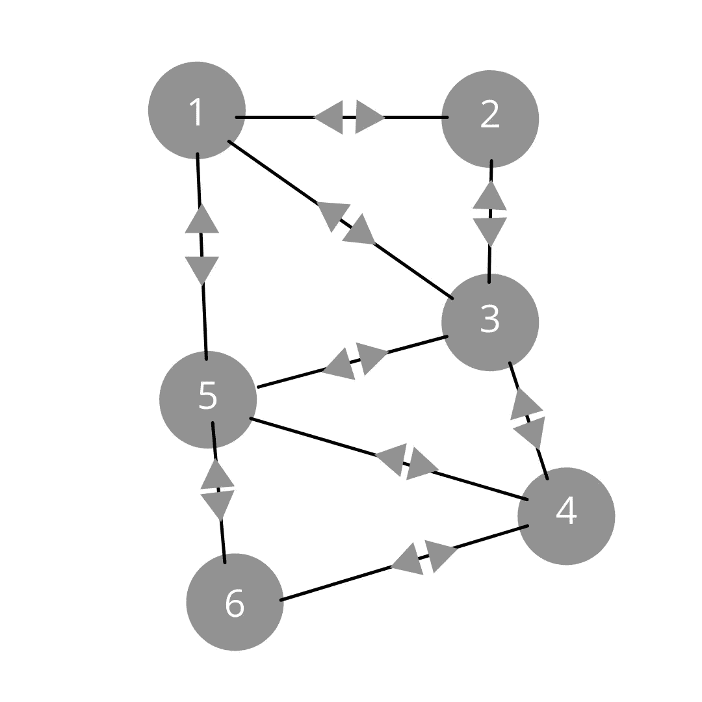
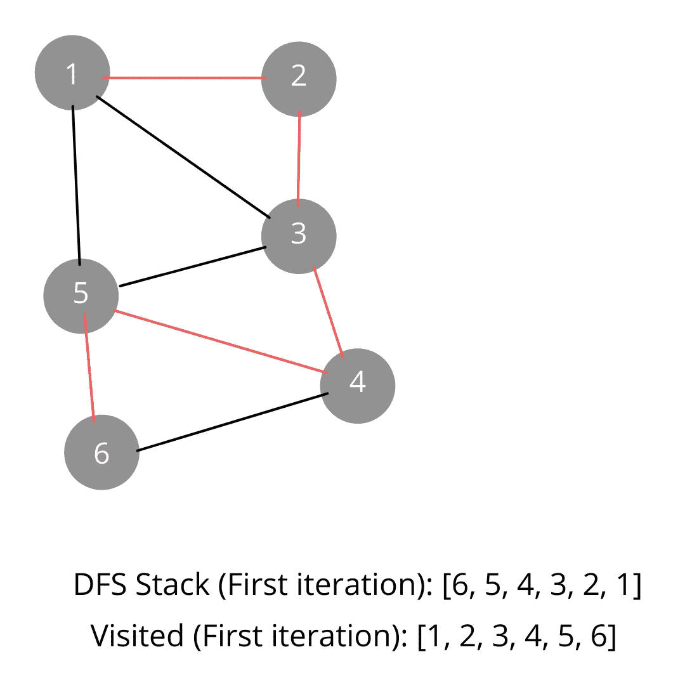
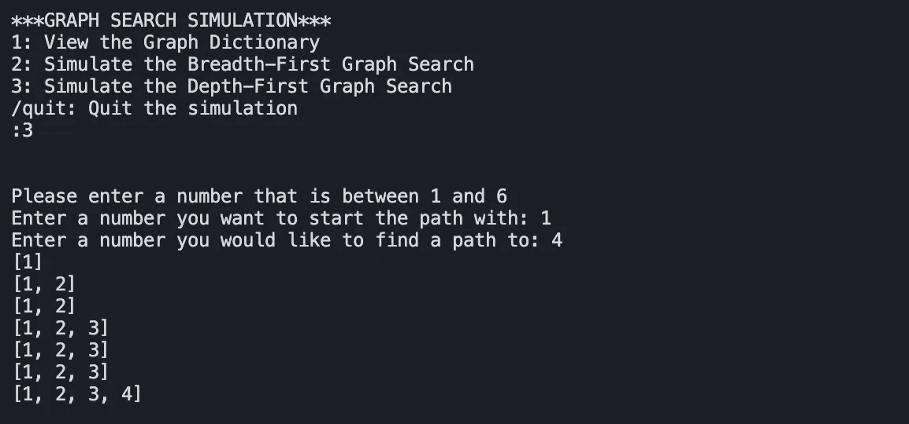
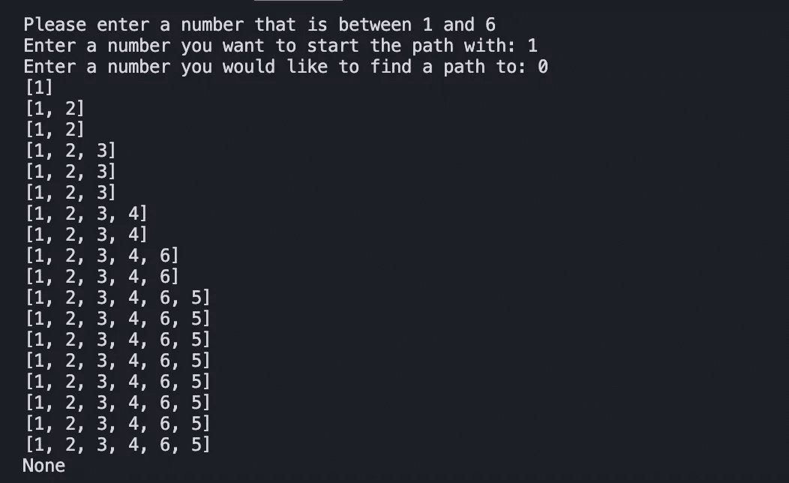
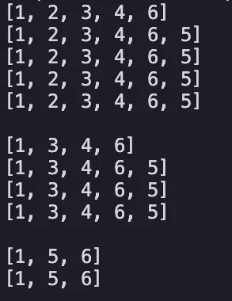
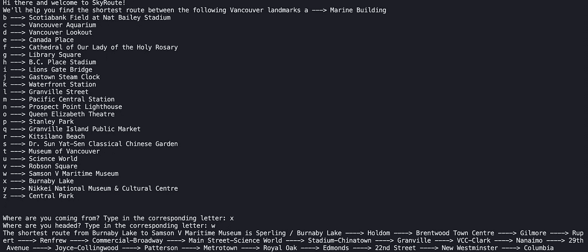

# 图形搜索，对遍历和搜索行为的直观介绍。

> 原文：<https://towardsdatascience.com/graph-search-an-intuitive-introduction-to-both-traversal-and-search-behaviour-e9c5f4dd230?source=collection_archive---------20----------------------->

## 我们几乎不知道，遍历和搜索的行为，以及它们在算法方面的差异，都可以通过使用图搜索从概念上学习！

说到算法和图论，人们首先想到的不是硬核编程，就是复杂的数学。如果你问一个非程序员或普通的平民，他们会把一个算法描绘成一些复杂的计算过程，需要聪明的人来开发。然而，他们不知道他们实际上被误导了。在过去的几十年里，电影、电视节目、游戏和故事都把算法描绘成只有擅长数学的人才能理解的东西。但现实中，事实并非如此。当然，随着越来越多的在线课程出现在网络上，如 Coursera 或 Youtube 上的视频，越来越多的人接触到了算法开发。然而，大多数程序员或开发人员仍然认为算法是最有声望的程序员和数学家的专利。

IT 行业的多个职业都涉及算法开发，比如机器学习(正在兴起)、后端开发等。然而，尽管多种职业(其中许多正在上升)涉及数据结构和算法的工作，但仍然没有足够的兴趣，因为尽管如前所述，职业在上升，但前端开发仍然存在。职业之间的工资仍然保持不变；技能组合可能会因公司和职业而异，但在某些方面对所有开发人员/程序员来说都是一样的，所有程序员都必须经历面试过程(取决于公司，但大多数都是如此)。不同部门的方案编制似乎没有什么不同。公司可能不需要很多算法或者机器学习开发者，但真正的问题是对算法的误解。由于对算法“复杂”的误解，没有多少开发人员像前端开发这样对机器学习或人工智能领域感兴趣。

然而，对许多人来说，是什么让算法变得“难”了呢？让人们理解起来乏味的不是数学或编程；它更多的是关于算法的概念行为。换句话说，人们很难了解算法在概念上是如何工作的，而不是所有编程和数学的理论部分，具有讽刺意味的是，这总是在好莱坞电影中涉及算法的编程场景中描绘，以显示“硬核编程”。

在编程世界中有许多类型的算法，每种算法都有自己的目的和应用。例如，您不能应用冒泡排序算法而不是二分搜索法算法，并期望它在每种情况下都以相同的速度和相同的效率运行。这是不可能的，因为它们被创造的方式和它们的目的。然而，如果我们扩大算法的范围，并根据它们的行为在一般尺度上比较它们，我们会得到三种类型的算法；排序、遍历和搜索。由于排序遵循相同的遍历协议，但只是比较前一个或下一个值，对于这种情况，由于我们是在谈论一般情况，我们将假设排序行为模仿遍历算法的相同行为(在某些方面确实如此)。因此，当学习和试图理解算法的工作方式时，归结起来更多的是关于它们如何遍历为参考或比较而存储的某些值，并在给定的数据集中搜索某些值。

如果你知道这两个基本行为，并理解它们是如何工作的，学习任何算法对你来说都会容易得多。但是对于那些还没有的人，不用担心。使用两种图搜索算法(是的，我们将通过算法本身学习基本的算法行为)，我们将了解它们的工作和应用。我决定使用图形，因为它最容易直观地理解，这最终会导致更好的概念理解。

参考文献中使用的两种图搜索算法是广度优先搜索和深度优先搜索。那些读过我之前关于著名的编码问题的文章的人([如果你还没有读过的话，看看](/two-of-the-most-famous-coding-interview-questions-9746a4111011))，或者知道树遍历的人，可能对这两个基本的，但是高效的算法很熟悉。它们都以线性时间运行，并且可以使用递归或迭代来实现。它们都使用数据结构作为参考(广度优先使用队列，深度优先使用堆栈)，最重要的是，它们都可以用于搜索和遍历。但是你可能会想，如果这两个算法都有那么多相似之处，那么用两个算法而不是一个算法有什么意义呢？这些算法可能有许多相似之处，但它们的工作和行为方式是不同的，这将有助于我们理解不同类型的算法如何在更广泛的范围内工作。

对于那些首先不知道什么是图数据结构的人来说，它本质上像树一样工作，但是没有通用的遍历顺序，直到开发人员或用户声明。它们由保存数据的节点或*顶点*和连接两个顶点的*边*组成。

有向图示例|作者图片

图有不同程度的联系。边与顶点的比率越高，图的连通性越好。在这种情况下，根据上面的例子，我们可以说该图是高度连通的，因为顶点与边的比率是 6:9，相当于 2:3。图表的酷之处在于你可以给每条边添加权重。使用权重，您可以创建高效的搜索和寻路算法，我们将在后面讨论。然而，加权图是具有边的典型图，这些边具有与在顶点之间行进相关联的特定数量或成本。通常，在大多数应用中，需要此成本来评估两个特定对象的最有效路径或距离。最后但同样重要的是，关于本文中的图，您需要知道的最后一件事是图的类型。图的两种最基本的类型是有向和双向的。有向图是边限制顶点之间移动方向的图。看一下上面的图表。边缘只通向一个方向。然而，另一方面，如果它是一个双向图，边可能会导致两条路径。例如，一个从边 A 到边 B，另一个从边 B 到边 A。

双向图示例|作者图片

这两种图都有自己的应用，但是在本文中，为了简单明了，我们将使用有向图。

在继续学习算法行为之前，我们将设置的下一个基本定义是广度优先算法更深入的内容，以及它在图中的工作方式。广度优先被认为是一种强力算法，它在移动到另一个深度级别之前检查所有相邻顶点的值。当顶点被搜索或遍历时，它们的子节点被添加到被称为*边界*的队列中。该队列遵循 FIFO 结构(先入先出)来跟踪当前顶点和仍有未访问邻居的顶点。

BFS 第一次迭代|作者图片

当某个顶点的所有相邻顶点都被访问过时，队列将退出队列。广度优先是查找两点间任意路径的一种非常低效的方法，但它是比较两个顶点间路径的一种很好的方法。正因为如此，BFS 有助于找出从一个地方到另一个地方的方向。而且说到这个算法的性能，它运行在`O(no. vertices + no.edges)`。由于性能取决于顶点的数量和图形的大小，因此输入，我们可以考虑这个线性时间。

BFS 第二次迭代|作者图片

最后但同样重要的是，我们需要设置的最后一个定义是什么是深度优先搜索以及它是如何工作的。深度优先搜索算法在横向移动到另一条路径之前检查沿着顶点路径的值。这些类型的算法有利于确定两个顶点之间是否存在路径。为了完成这个路径查找任务，深度优先算法使用堆栈数据结构，或者更常见的是使用递归来跟踪搜索的路径和当前顶点。

DFS 首次迭代|作者图片

如果我们已经到达路径的末端，那么堆栈将继续弹出，直到有一个顶点有未访问的边。这个过程将继续，直到堆栈为空。性能与`O(no. vertices + no. edges)`时的 BFS 相同，我们已经在线性时间考虑过了。

DFS 第二次迭代|作者图片

为了在本文的其余部分反映算法及其行为，我们将使用这两个函数来反映上面定义的算法:

现在我们有了基本的定义，让我们从谈论搜索行为开始。搜索算法本质上是不断遍历数据直到找到所需值的算法。当然，可以考虑各种参数，但这是基本的通用定义。以线性搜索为例。它将不断遍历列表，直到找到所需的值。如果没有，它将不会返回或打印任何内容。大多数图搜索算法在线性时间运行，因为它们是蛮力算法(这意味着它们易于实现，但性能效率低)，但有些运行在日志时间，如二分搜索法。作为一名程序员，让搜索算法在日志时间运行可能是你能做的最好的事情，因为在每个数据集中找到一个普遍的重要模式对我们的眼睛来说是不可见的。然而，让我们来看看搜索是如何更直观地在代码中工作的。以上是深度优先和广度优先搜索图的代码。先说深度优先搜索。我们的算法将不断添加顶点(根据它们在上面定义深度优先搜索时所遵循的路径),直到我们到达期望的顶点。

深度优先搜索递归搜索值为 4 的顶点|按作者排序的图像

如果我们没有到达期望的顶点，那么我们递归地调用顶点的边，直到我们找到顶点的“位置”如果根本没有位置，意味着两个顶点之间没有路径，算法会返回`None`。

深度优先搜索递归尝试查找值为 0 的顶点|按作者排序的图像

请注意该算法如何遍历和评估不同的路径，但仍然无法找到值为 0 的顶点。这是因为从来没有值为 0 的顶点！然而，我们可以注意到算法的排列和算法在每个深度遍历的顺序。

模拟自己的图形搜索或深入了解:【https://github.com/GEEGABYTE1/GraphSearch

既然我们现在知道了搜索在概念上是如何工作的，我们就可以继续遍历了。如果我用一句话来总结遍历，那就是它和搜索一个值是一样的，但是，没有一个实际的目标值来搜索。当试图直观地找出一些东西或发现未来的可能性时，遍历算法是很棒的。大多数遍历算法以不同的方式遍历数据集，直到它们到达数据集的末尾或者满足特定的条件，例如，只遍历路径特定的次数。例如，让我们用深度优先搜索和广度优先搜索来考虑我们的遍历。

我们一直走，直到我们到达了路的尽头，或者已经访问了每一个可能的边缘。在广度优先搜索中，当我们的 BFS 队列为空时，我们知道我们已经到达了终点；对于深度优先搜索，当路径为`None`(意味着没有更多可能的边要遍历)并且函数自身返回`None`，结束递归。

BFS 穿越|作者图片

请注意，该算法如何穷尽我们图形中的每个可能的边，直到它达到一个新的深度。深度优先遍历遵循相同的打印和遍历过程，但根据其定义。

深度优先遍历|作者图片

注意深度优先遍历，就像 BFS 一样，遍历相同的路径，就好像它试图搜索一个值。然而，遍历版本不是只打印或返回一条路径，而是打印它们已经走过的每一条不同的路径，直到它们到达终点(在这种情况下，如果它们到达了没有边的顶点)。但是，我们是如何得到不同的抽象路径的呢？信不信由你，获取抽象路径是非常直观的。从根顶点开始，在每次递归和迭代之后，我们弹出在当前路径中从根顶点开始遍历的边。

随着遍历的进行，我们不断弹出已经使用过的根顶点的边，确保没有任何重复的路径。这也可以被认为是另一种结束情况，其中我们继续弹出并遍历图，直到根顶点不再是图的一部分，或者换句话说，不再有根顶点的边需要遍历。

查看更深入的遍历算法:[https://github.com/GEEGABYTE1/GraphSearch-Traversal](https://github.com/GEEGABYTE1/GraphSearch-Traversal)

现在，就应用而言。遍历和排序算法有很多应用。作为人类，我们知道算法是我们今天使用的技术的基本组成部分。它们让我们的任务变得更容易，更容易完成，等等。想一想，仅广度优先搜索和深度优先搜索就有多种应用，从寻路、GPS 系统、文件系统、跟踪优步等等！例如，让我们更深入地看看 GPS 系统，以及遍历和搜索是如何使用我们之前使用的两种算法工作的。

我已经创建了一个名为 SkyRoute 的 GPS 模拟系统，它对温哥华的车站和地标进行采样，以及哪个车站通向哪个地标。用户可以输入起点和终点，程序将使用广度优先和深度优先输出需要作为最佳路径的站点。

SkyRoute 输出从伯纳比湖到萨姆森五世博物馆的最佳路径|图片由作者提供

深度优先算法用于查看是否存在对应于地标的站。SkyRoute 的另一个特点是用户可以添加正在建设中的相应站点(查看下面的 GitHub 链接了解更多信息)。因此，由于用户可以添加正在建设中的电台，电台仍然运行并成为一个选项没有任何意义。因此，为了使程序流适应这些变化，如果有一个车站正在建设中，我们将使用 DFS 来查看从起点到终点是否有另一条路径。如果有，程序会将可能的路线作为路径返回；否则，程序将断定没有可能的路径。本质上，我们的结论是 DFS 不返回路径，因为每个地标至少有一个站。当一个车站正在建设中时，程序会将该车站从每个地标中移除(这个过程相当于我们从一个顶点(如根顶点)中弹出一条边来打印抽象路径)。因此，在起点和期望的目的地之间可能没有路径。

但是如果车站不在建设中呢？这就是 BFS 算法的用武之地。由于我们的 BFS 版本附加了每个可能路径的列表(也是一个数组)，我们希望返回最短路径，因为这是当今高效 GPS 或地图应用程序的全部要点。在程序在两个目的地(起点和终点)运行 BFS 后，它将比较路径的每个长度，并返回长度最短的一个，假设选择最少的站点意味着快速和容易的路线。然而，就像 DFS 一样，如果它们之间没有可能的路径，那么算法将返回`None`，这将向用户指示没有找到路径。

就遍历而言，也许添加一个用户可以看到两点的多条路径的功能对这个项目的未来来说是一个很好的想法，因为它允许用户看到不同的路径，以防碰撞，天气，乘客数量等。遍历算法也将与上面遍历模拟中所示的相同。

不过，这就是地图应用和 GPS 系统的工作方式。使用遍历和搜索算法，GPS 系统和地图应用程序可以在不到一秒钟的时间内输出到达目的地的不同路径！例如，Google Maps 可以基于某些变量(如燃料、交通、运输方式等)输出不同路径的唯一方法是使用遍历和搜索算法。当然，由于效率和性能的原因，他们可能不会使用广度优先或深度优先，但他们的算法基于相同的逻辑运行。

亲自体验一下 sky route:[https://github.com/GEEGABYTE1/SkyRoute](https://github.com/GEEGABYTE1/SkyRoute)

所以，算法看起来并没有那么难懂。当然，理解它们是如何工作的可能需要一些时间，但它们并非完全不可能。最重要的是，它们不适合那些只擅长数学的人；任何人都能理解他们。学习和理解算法就像在学校学习一门新的学科或参加烹饪课程。学习一天，你不会有你想象的那么好。不断的练习和学习会使你提高对这门学科的知识和理解。这就是学习数据结构和算法的方式。没有一些基础的数学背景，不能只学算法。如果你想真正理解它们，你必须有时间和耐心去研究它们(概念上的和编程中的)并实践它们。你要记住的是，如果一个人能做到，那么你也能做到！我本人非常喜欢算法和数据结构，因此，它对我来说很容易。然而，如果你现在没有，不要担心，我会继续写算法以及我们如何更好地学习它们，因为开发算法和开发前端一样有趣。