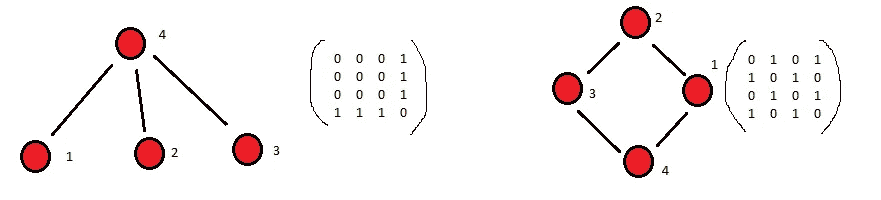
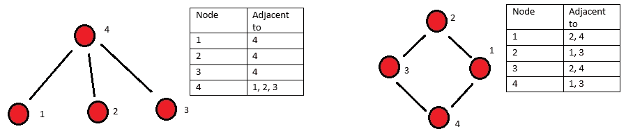

# 图论基础

> 原文：<https://towardsdatascience.com/graph-theory-basics-88a89863e3c1?source=collection_archive---------24----------------------->

## 随着图论应用的不断发展，你需要知道的是


诺德伍德主题公司在 [Unsplash](https://unsplash.com?utm_source=medium&utm_medium=referral) 上拍摄的照片

在编程和数学术语中，图论真的不是什么新东西，但是它在代码中的实现和使用随着机器学习和人工智能的进步而增长。一个很大的原因是大规模模型的计算能力的进步允许开发复杂的模型来表示任何事物之间的关系。图论技术中最著名和最早的实现之一是 Google 的页面排名算法。页面排名算法是谷歌搜索算法的最初版本，植根于图论，基于一种有效的方法来衡量互联网网页如何通过链接和用户点击/流量连接，以及哪些网页最受欢迎。此外，近年来，图论已被应用于知识图，以帮助理解系统内变量的相互联系(例如，工厂和其中的所有机器和因素，以及它们如何相互影响)。此外，图论已被应用于经济模型，以了解股票市场如何表现，以及区块链的内部工作是由图论支持的。因此，通过图形方式计算和创建极其复杂的模型的广泛能力只会继续增长，学习和理解基础知识对于将其应用于其他用例至关重要。


照片由[劳伦·里奇蒙](https://unsplash.com/@lashleyrich?utm_source=medium&utm_medium=referral)在 [Unsplash](https://unsplash.com?utm_source=medium&utm_medium=referral) 拍摄

# 图论基础和术语

> 在数学中，图论是对图形的研究，图形是用于建模对象之间成对关系的数学结构。这个上下文中的图由**个顶点**(也称为**个节点**或**个点**)组成，这些顶点由**条边**(也称为**条链接**或**条线**)连接。—维基百科

快速的维基百科搜索会给你这个图论的定义，下面我们将开始分解它是什么以及它是如何工作的

## 定义:

*   顶点/节点——这些对象通常具有自身的属性，然后连接到图形中的其他对象。对象可能具有的属性的一个简单示例是权重或值，在更复杂的对象中，这还可能包括成本、描述性属性(颜色、大小、重量)、能力、概率等。这都取决于图网络是如何构建的以及它试图完成什么
*   边缘/链接-边缘本质上是对象之间的关系或连接它们的道路。相互之间有边的对象有关系，而没有连接的对象没有关系。
*   有向/无向图-理解有向图和无向图之间的区别的最简单的方法是将对象之间的边视为双向道路或单向道路。有向图显示了从一个对象到另一个对象的关系，这种关系传递了与另一个对象的关系中的任何东西，并且不是对等的。无向图是两个对象之间的连接，但关于其关系的信息可以在它们之间双向流动。需要指出的一个关键点是，在有向图中，一对节点之间可以有两条边来模拟这两个节点之间的“无向”性质。
*   循环/无环图形-循环图形是一种具有一组连接成闭环的节点的图形，无环图形不具有闭环属性。

## 图形在计算机中是如何表示的？

计算机图形表示中两个最常见的主题是邻接矩阵(有时称为关联矩阵)或邻接表。

邻接矩阵——在这种方法中，图形被转换成图形的矩阵表示。该矩阵将是一个 n×n 形状的矩阵，其中 n 表示节点的数量，矩阵中的值表示节点之间的边，如下所示。值得注意的是，无向图的矩阵表示将是其自身沿对角线的镜像。



无向图邻接矩阵的可视化表示。图片作者。

邻接表——这个版本的图被表示为顾名思义的列表。它是一个无序列表，描述了图中顶点(或边)的邻居。



无向图的邻接表的可视化表示。作者图片

将图形放入这两种形式，允许我们对图形进行计算编程，这样我们就可以设置图形的规则、关系、属性和变化。

有了这些基本术语和概念，我们可以探索一些用图论来解决基本问题的例子，并希望用它们作为更复杂系统的构建模块的例子。


苏珊·尹在 [Unsplash](https://unsplash.com?utm_source=medium&utm_medium=referral) 上的照片

# 最短路径

关于图网络，您可能想知道的最基本的事情之一是路径之间的距离以及它们之间的最佳或最短路径。这可能有用的一些例子是查看电网或寻找社会网络中的分离度(凯文·贝肯)。

## BFS(广度优先搜索)和 DFS(深度优先搜索)

在几乎所有的学习平台中，图论引入的前两个算法是 DFS 和 BFS。它们都是遍历图形的算法。从本质上讲，DFS 和 BFS 都在努力实现相同的目标，只是方式略有不同。

从 BFS 开始，该算法背后的原理是在移动到下一个节点之前，从一个起点调查所有相邻节点。队列用于帮助指示哪些节点已经被访问，一旦该路径完成，它将转到下一个未被访问的节点，并像以前一样开始遍历图，标记所有被访问的节点。这个循环将对整个图形重复，直到所有节点都被访问过。在队列中，可以确定从起点到目标端点的最短路径。下面是 BFS 搜索算法的伪代码示例。

```
 1  procedure BFS(G, root) is
 2      let Q be a queue
 3      label root as discovered
 4      Q.enqueue(root)
 5      while Q is not empty do
 6          v := Q.dequeue()
 7          if v is the goal then
 8              return v
 9          for all edges from v to w in G.adjacentEdges(v) do
10              if w is not labeled as discovered then
11                  label w as discovered
12                  Q.enqueue(w)
```

DFS 或深度优先搜索是一种非常类似于 BFS 的算法，但它的行为略有不同。当遍历该图时，一旦到达 DFS 中的死胡同，该算法将回溯到与未被访问的节点相连接的前一个节点，并在该路径上继续。然后，它将只去一个随机的节点，如果它没有从图的原始网络连接。这两种方法都是最先教授的沿着图遍历并找到最短路径的方法。潜在的应用将是将其应用于社交网络的图表，以确定具有相似背景、朋友或爱好的人的潜在建议。下面是一个 DFS 伪代码的例子。

```
1 procedure DFS_iterative(G, v) is
2    let S be a stack
3    S.push(v)
4     while S is not empty do
5        v = S.pop()
6         if v is not labeled as discovered then
7             label v as discovered
8             for all edges from v to w in G.adjacentEdges(v) do
9                 S.push(w)
```

还有更高级的图遍历方法，例如 Bellman-Ford、Djikstra 和 Kruskal。每一种方法都尝试并解决在 BFS 或 DFS 中使用的方法无法解决的额外问题，例如，具有负权重/长度的边、循环图等…


照片由[艾米-利·巴纳德](https://unsplash.com/@amyb99?utm_source=medium&utm_medium=referral)在 [Unsplash](https://unsplash.com?utm_source=medium&utm_medium=referral) 拍摄

## 其他图论问题:

*   枚举——换句话说，就是对满足特定条件的图形进行评估和计数，或者换句话说，就是解决组合数学问题。
*   子图——查看图形以确定一个图形的组件是否是另一个图形的子组件，或者查看图形之间的“遗传”特征
*   图表着色—类似于枚举，但是将着色应用于图表问题，这样您就不会在图表的着色顶点上碰到相似的颜色
*   统一——评估约束更多(或信息更多)的图表，以及它们如何汇总成约束更少(或更一般化)的图表或模型
*   网络流量——这类问题的一个例子是评估一个能源网格，以确定整个系统的能量流量
*   可见性问题——尝试解决一个类似于博物馆警卫问题的问题，这样你可以计算出参观整个博物馆画廊的最少警卫人数。
*   分解——查看特定条件下的分解图。
*   路线问题——最短路径就是一个这样的问题，另一个是旅行推销员问题或哥尼斯堡七桥问题。


照片由[吕山德·袁](https://unsplash.com/@lysanderyuen?utm_source=medium&utm_medium=referral)在 [Unsplash](https://unsplash.com?utm_source=medium&utm_medium=referral)

# 为什么学习这个很重要

如前所述，图论正慢慢成为一种更有效的方式来表示现实世界的问题。解决任何系统的极其复杂的关系和细节的计算能力现在可以通过编程的方法来完成。本文旨在真正充当图论的初级读本，并鼓励您继续学习评估和实现图来解决现实世界问题的不同方法。

我个人最喜欢的课题之一是区块链，在某种程度上，你可以从图论的角度来看待区块链。

如果您对本文有任何问题或意见，请留下您的评论。