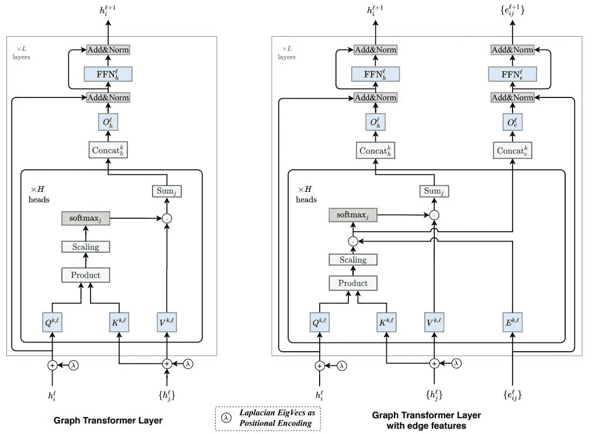
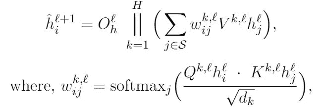
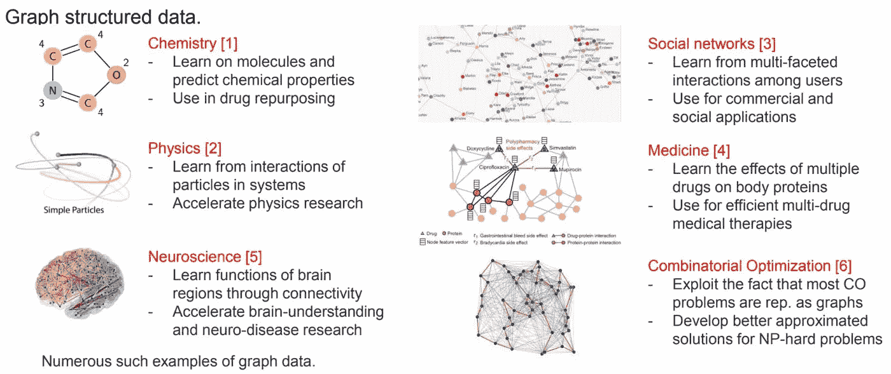
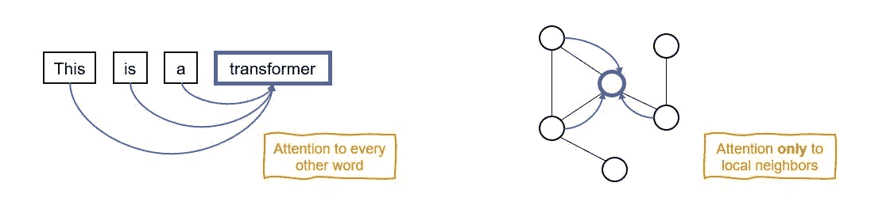
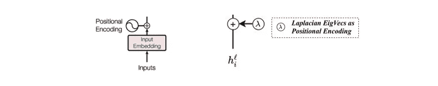
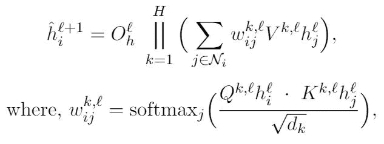
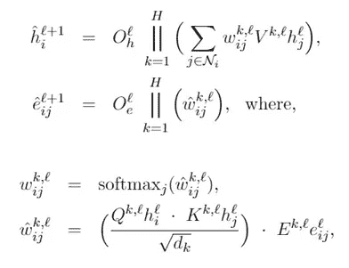

# 图变换器:图变换器的推广

> 原文：<https://towardsdatascience.com/graph-transformer-generalization-of-transformers-to-graphs-ead2448cff8b?source=collection_archive---------2----------------------->

这篇博客是基于[与](https://arxiv.org/abs/2012.09699) [Xavier Bresson](https://personal.ntu.edu.sg/xbresson) 在 [2021 年 AAAI 关于图的深度学习:方法和应用研讨会(DLG-AAAI’21)](https://deep-learning-graphs.bitbucket.io/dlg-aaai21/index.html)上发表的论文。

> 我们提出了 Graph Transformer，这是一个可以对任意图形进行操作的转换器神经网络。

## 博客大纲:

1.  背景
2.  目标
3.  图形转换器的关键设计方面
4.  提议的图形转换器架构
5.  来自实验的评论

# 1.背景

让我们从两个关键词开始，**变形金刚**和**图形**作为背景。

# 变形金刚(电影名)

基于 Transformers [1]的神经网络是自然语言处理(NLP)中表示学习的最成功的架构，克服了顺序处理引起的递归神经网络(RNNs)的瓶颈。作为变压器的核心构件，存在多头关注机制，由以下公式表示:

图 5:使用多头注意机制的单词“I”的特征更新等式。这些符号代表通常的含义。

> *使用多头注意力，一个单词关注句子中的每个其他单词，并组合接收到的信息以生成其抽象特征表示。*

# 图表

图是无处不在的数据结构。数据集可以用图形来表示的应用领域非常广泛。比如化学中的分子图，物理中的粒子间相互作用，医学中的药物蛋白质相互作用，社交媒体中的用户及其社交和商业联系，组合优化中的问题等。

图 2:具有图结构数据集的代表性领域.[链接](http://bit.ly/2OdBgXQ)

对于图上的学习，[图神经网络](/deep-learning-on-graphs-successes-challenges-and-next-steps-7d9ec220ba8) (GNNs)已经成为深度学习中最强大的工具。

简而言之，GNNs 由几个参数化的层组成，每个层接受具有节点(和边)特征的图，并通过考虑可用的显式连接结构(*即*图结构)来构建节点(和边)的抽象特征表示。这样生成的特征然后被传递到下游分类层，通常是 MLPs，并且目标属性被预测。

# 2.目标

现在，目标是将 transformer 神经网络推广到图形，以便它可以学习具有任意结构的图形和数据集，而不仅仅是顺序的(可以解释为由 NLP Transformers 完成)。

> *为了实现目标，我们着重于将变压器的关键设计原则从 NLP 扩展到一般的图形。*

# 3.图形转换器的关键设计方面

我们发现，使用图稀疏性和位置编码的注意力是将转换器推广到任意图的两个关键设计方面。

现在，我们从 NLP 和图的上下文来讨论这些，以使 Graph Transformer 的扩展更加清晰。

## 图形稀疏性

在 NLP 中，转换器在构建单词的特征表示时考虑全部注意力。也就是说，转换器将一个句子视为一个单词的[全连接图](/transformers-are-graph-neural-networks-bca9f75412aa)。这种全神贯注的选择是合理的，原因有两个*:*

首先，很难在一个句子中的单词之间找到有意义的稀疏交互或联系。例如，一个句子中的一个单词对另一个单词的依赖性会随着上下文、用户的视角和手边的应用而变化。在一个句子中的单词之间可能存在许多似是而非的基本事实联系，因此，句子的文本数据集通常不具有显式的可用单词交互。因此，让模型决定单词如何依赖于其他单词是有意义的。

第二，NLP 中如此解释的全连通图，节点往往少于几十上百个(*即*句子往往少于几十或几百个单词)。在这种大小的图中，关注每个节点在内存和时间上是可行的。

> *由于这两个原因，可以在 NLP 转换器中进行充分的关注，随后的工作[2，3，4]表明它在语言建模和几个 NLP 任务中卓有成效。*

图 3:全神贯注的注意力被限制在本地附近。

然而，在实际的图数据集的情况下，图具有基于应用领域的任意可用连接结构，并且具有高达数百万甚至数十亿的节点大小。在神经网络中学习时，可用的结构为我们提供了丰富的信息源，而节点大小实际上使得不可能有这种数据集的完全连接的图。

> *基于这些原因，拥有一个图转换器是*实际的*(为了可行性)和*有利的*(为了利用稀疏结构信息)，其中一个节点关注本地节点邻居，类似于图关注网络(GATs)[5]。*

事实上，局部信息聚集是 GNNs 的核心，表明稀疏性是泛化的良好归纳偏差。

## 位置编码

Transformer 中的注意机制对于节点的排序是不变的。它不知道单词在序列(或句子)中的位置。这意味着，转换器考虑多组单词，而不是 NLP 中的单词序列，如下面的比较所示:

图:对于多头注意机制，输入可以解释为多组单词。

那将意味着丢失一些关于单词排序的信息，不是吗？

为了避免这种情况并使 transformer 知道顺序信息，在 Transformer 中需要某种位置编码。Vaswani 等人[1]的原始变换器使用正弦位置编码，在输入端添加到每个单词的特征向量。这有助于将单词之间必要的普遍(顺序)关系编码到模型中。

我们扩展了图形转换器位置信息编码的关键设计模块。事实上，GNNs [6，7，8]中的一系列研究最近表明，位置信息改善了 GNNs，并克服了 GNNs 在几个基本任务中的失败。

因此，我们利用了 GNNs 中位置信息的最新成果，并在 Graph Transformer 中使用拉普拉斯位置编码[8]。我们使用预先计算的拉普拉斯特征向量[9]来添加到第一层之前的节点特征中，类似于在原始变换器中如何添加位置编码[1]。

图:原始转换器 v/s 建议的图形转换器中的位置编码(PEs)

> *拉普拉斯 PEs 是原始变压器中使用的正弦 PEs 的自然推广，因为正弦 PEs 可以被解释为线图的特征向量，即 NLP 中的句子。*

因此，在将转换器推广到任意图时，注意力期间的稀疏图结构和输入处的位置编码是我们考虑的两个重要因素。

# 4.提议的图形转换器架构

现在，我们将介绍所提出的架构——图形转换器层和具有边缘功能的图形转换器层。如下所示的层示意图由主要组件组成——带 PEs 的输入、关注限于本地邻居的多头关注机制以及前馈模块。

与 Vaswani 等人[1]的标准转换器相比，将 transformer 概括为图形以产生图形转换器的关键区别(或扩展)是:

I)注意机制是每个节点的*邻域连接性*的函数，由公式表示:

ii)位置编码由*拉普拉斯 PEs* 表示。特别地，在训练之前为每个图预先计算图拉普拉斯的特征向量，并且将节点的*k*-最小非平凡特征向量指定为该节点的 PE。

iii)前馈模块使用*批量归一化*【10】代替原始变压器[1]中使用的层归一化【11】。我们的经验证据支持了这一点，即使用批标准化代替层标准化会产生更好的性能。

iv)图形转换器扩展为具有*边缘表示*(参见架构图右侧的*具有边缘特征的图形转换器层*)。这种架构对于具有丰富信息的数据集至关重要，例如，分子图中沿边缘的键信息，或者知识图中的关系类型。在这种边缘扩展架构中有两件事需要注意:边缘特征被融合到相应的成对隐式注意力分数，并且在每一层都有指定的边缘特征流水线，如以下层更新等式所示:

> *这结束了对所提出的图形转换器的描述。关于完整的层更新方程，我们参考该论文。*

# 5.来自实验的评论

我们在基准数据集上评估了 Graph Transformer，并验证了我们的设计选择，同时试图回答一些公开的研究问题:I)对于将 Transformer 推广到图形，是局部注意还是完全注意，ii)如何编码稀疏结构信息？iii)位置编码候选。

我们*备注*以下结果:

a)如已经讨论的，图稀疏性是关键的，并且与使用完全注意相比，在注意机制中使用图稀疏性总是给出更好的性能。GNNs 在几个应用领域的成功已经证明了*稀疏度*对于图形数据集是一个很好的归纳偏差。

b)在注意力、PEs 使用、标准化候选等设计选择的几种组合中。架构*使用* i)关注本地邻居、ii)拉普拉斯 PEs 和 iii)前馈模块中的批量归一化层，在用于评估的所有数据集上具有最佳性能。这从经验上验证了使用这些组件来有针对性地推广变压器的选择。

c)由于拉普拉斯 PE 具有期望的属性，具有 I)距离感知信息，ii)可区分的节点特征，以及 iii)原始变换器的 PE 对一般图形的概括，因此与用于研究图形变换器的文献中使用的 PE 候选相比，根据经验，它是用作图形变换器的合适的 PE 候选，*甚至*(论文中详细讨论了相关工作)。

d)总体而言，与评估数据集相比，Graph Transformer 在 gnn 中实现了有竞争力的性能。所提出的架构性能明显优于基线 GNNs (GCNs [12]和 GATs [5])，并有助于缩小原始转换器和图形转换器之间的差距。因此，图形转换器作为一种新的强大的基于注意力的 GNN 基线出现，我们希望它可以很容易地扩展到未来的研究中，只要它简单明了，并能从转换器中直接概括出来。

*数值实验的表格在论文里，代码实现在 GitHub 上开源，附带的视频演示在 YouTube 上，对应链接如下:*

论文:【https://arxiv.org/abs/2012.09699
GitHub:[https://github.com/graphdeeplearning/graphtransformer](https://github.com/graphdeeplearning/graphtransformer)
视频:[https://youtu.be/h-_HNeBmaaU?t=240](https://youtu.be/h-_HNeBmaaU?t=240)

[1] 瓦斯瓦尼，a .，沙泽尔，n .，帕尔马，n .，乌兹科雷特，j .，琼斯，l .，戈麦斯，A.N .，凯泽，日，和 Polosukhin，I. (2017)。你需要的只是关注。

[2] Devlin，j .，Chang，M.W .，Lee，k .和 Toutanova，k .(2018 年)。Bert:用于语言理解的深度双向转换器的预训练。

[3]拉德福德、纳拉辛汉、萨利曼斯和苏茨基弗(2018 年)。通过生成性预训练提高语言理解能力。

[4] Brown，T.B .，Mann，b .，Ryder，n .，Subbiah，m .，Kaplan，j .，Dhariwal，p .，Neelakantan，a .，Shyam，p .，Sastry，g .，Askell，a .，Agarwal，s .(2020 年)。语言模型是一次性学习者。

[5]韦利奇科维奇、库库鲁勒、卡萨诺瓦、罗梅罗、莉雅和本吉奥(2018 年)。图形注意力网络。

[6]斯里尼瓦桑和里贝罗(2019 年)。位置节点嵌入和结构图表示的等价性。

[7] You，j .，Ying，r .和 Leskovec，j .(2019 年)。位置感知图形神经网络。

[8] Dwivedi，V. P .，Joshi，C. K .，Laurent，t .，Bengio，y .，和 Bresson，X. (2020 年)。基准图神经网络。

[9] Belkin，m .和 Niyogi，P. (2003 年)。用于降维和数据表示的拉普拉斯特征映射。

[10] Ioffe，s .和 Szegedy，c .(2015 年)。批量标准化:通过减少内部协变量转移加速深度网络训练。

[11] Ba，J.L .，Kiros，J.R .和 Hinton，g . e .(2016 年)。图层规范化。

[12]基普夫和韦林(2016 年)。基于图卷积网络的半监督分类。