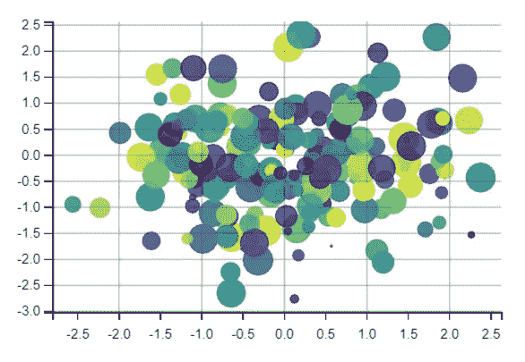
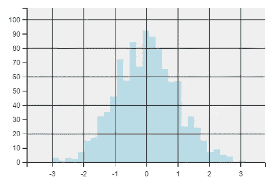
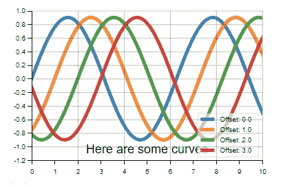
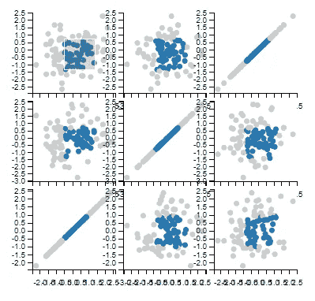

# 使用 D3 的图形数据可视化

> 原文：<https://towardsdatascience.com/graphical-data-visualization-using-d3-ae0ee82ae2e2?source=collection_archive---------27----------------------->

使用 MPLD3 创建交互式数据可视化


[粘土银行](https://unsplash.com/@claybanks?utm_source=medium&utm_medium=referral)在 [Unsplash](https://unsplash.com?utm_source=medium&utm_medium=referral) 拍摄的照片

D3 是一个基于 Javascript 的数据可视化库，用于在浏览器中创建交互式数据可视化。它基于 HTML5 和 CSS，使得可视化更加动态和吸引人。它支持 2D 和三维可视化。因为它是一个 Javascript 库，我们可以在任何框架上使用它，比如 Angular。JS 反应过来。JS 等。

使用某些库可以在 Python 中创建基于 Javascript 的可视化。其中一个库是 MPLD3，这是一个基于 D3 的开源 Python 库。JS 并构建在 Matplotlib 之上。它用于创建交互式数据可视化。

在本文中，我们将探索 MPLD3 并使用它创建一些可视化。

让我们开始吧…

# 安装所需的库

我们将从使用 pip 安装来安装 MPLD3 开始。下面给出的命令将使用 pip 安装 MPLD3。

```
pip install mpld3
```

# 导入所需的库

在这一步中，我们将导入创建交互式数据可视化所需的所有库。

```
%matplotlib inline
import matplotlib.pyplot as plt
import numpy as np
import mpld3
from mpld3 import plugins 
```

# 创建图表

现在我们将开始创建不同类型的图表。默认情况下，如果我们希望使用 mpld3 生成每个图表，我们需要运行下面给出的命令。

```
mpld3.enable_notebook()
```

1.  **泡泡剧情**

```
# Scatter points
fig, ax = plt.subplots()
np.random.seed(0)
x, y = np.random.normal(size=(2, 200))
color, size = np.random.random((2, 200))
ax.scatter(x, y, c=color, s=500 * size, alpha=0.9)
ax.grid(color='lightgray', alpha=0.3)
```



泡泡图(来源:作者)

创建的图具有高度的交互性，可以使用图表下方提供的不同选项进行控制。

2.**直方图**

```
fig = plt.figure()ax = fig.add_subplot(111, facecolor='#EEEEEE')
ax.grid(color='white', linestyle='solid')x = np.random.normal(size=1000)
ax.hist(x, 30, histtype='stepfilled', fc='lightblue', alpha=0.9);
```



直方图(来源:作者)

3.**折线图**

```
# Draw lines
fig, ax = plt.subplots()
x = np.linspace(-5, 15, 1000)
for offset in np.linspace(0, 3, 4):
    ax.plot(x, 0.9 * np.sin(x - offset), lw=5, alpha=0.9,
            label="Offset: {0}".format(offset))
ax.set_xlim(0, 10)
ax.set_ylim(-1.2, 1.0)
ax.text(5, -1.1, "Here are some curves", size=18, ha='center')
ax.grid(color='lightgray', alpha=0.3)
ax.legend()
```



折线图(来源:作者)

4.**支线剧情**

```
fig, ax = plt.subplots(3, 3, figsize=(6, 6))
fig.subplots_adjust(hspace=0.1, wspace=0.1)
ax = ax[::-1]X = np.random.normal(size=(3, 100))
for i in range(3):
    for j in range(3):
        ax[i, j].xaxis.set_major_formatter(plt.NullFormatter())
        ax[i, j].yaxis.set_major_formatter(plt.NullFormatter())
        points = ax[i, j].scatter(X[j], X[i])

plugins.connect(fig, plugins.LinkedBrush(points))
```



次要情节(来源:作者)

在这里，您可以清楚地看到我们使用 MPLD3 创建的不同图表和图形。所有这些图表都具有高度的互动性和视觉吸引力。继续尝试不同的数据集，创建不同的可视化效果，并让我知道您在回复部分的评论。

本文是与 [Piyush Ingale](https://medium.com/u/40808d551f5a?source=post_page-----ae0ee82ae2e2--------------------------------) 合作完成的。

# 在你走之前

***感谢*** *的阅读！如果你想与我取得联系，请随时通过 hmix13@gmail.com 联系我或我的* [***LinkedIn 个人资料***](http://www.linkedin.com/in/himanshusharmads) *。可以查看我的*[***Github***](https://github.com/hmix13)**简介针对不同的数据科学项目和包教程。还有，随意探索* [***我的简介***](https://medium.com/@hmix13) *，阅读我写过的与数据科学相关的不同文章。**