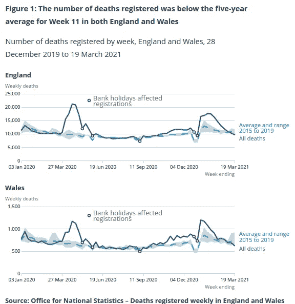
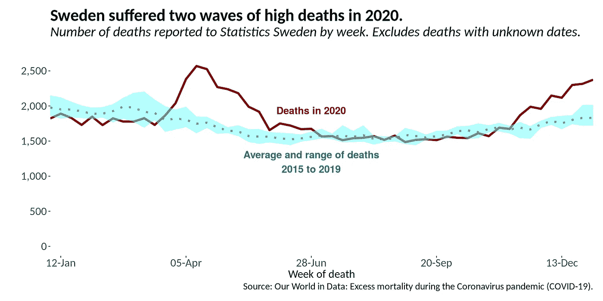

# 死亡率图表

> 原文：<https://towardsdatascience.com/graphing-mortality-a39fc504bf7a?source=collection_archive---------41----------------------->

## 仿效国家统计局的死亡率图表。

国家统计局的每周报告展示了一张死亡登记的图表。读者可以看到 2015 年至 2019 年的注册范围，以及最近一年。我们可以为其他国家仿效这个图表。



这些数字是死亡登记的数字。(图片: [ONS](https://www.ons.gov.uk/peoplepopulationandcommunity/birthsdeathsandmarriages/deaths/bulletins/deathsregisteredweeklyinenglandandwalesprovisional/weekending19march2021) )

[我们的数据世界](https://ourworldindata.org/excess-mortality-covid)整理了两个来源的全因死亡率数据。加州大学的研究人员维护着人类死亡率数据库。该数据库依赖欧统局和各国统计局。Ariel Karlinsky 和 Dmitry Kobak 收集了世界死亡率数据。

例子国家是瑞典。瑞典统计局每周发布死亡档案更新。与国家统计局不同的是，初步数据显示的是死亡发生的日期——某人死亡的时间。**存在死亡日期未知的死亡。对于这些死亡中的大多数，瑞典当局知道月份。**

# 搭建桌子

我们可以通过 R 中的步骤来制作这种风格的图形。我们首先从[我们的数据世界网站](https://ourworldindata.org/excess-mortality-covid)下载基本数据文件:

```
owid_all_cause_deaths_df <- read_csv(file = "excess-mortality-raw-death-count.csv")
```

然后我们对行进行过滤，得到瑞典的死亡数字:

```
sweden_deaths_df <- owid_all_cause_deaths_df %>%
  filter(Entity == "Sweden") %>%
  mutate(Day = as_date(Day))
```

为了获得 2015 年至 2019 年的范围，我们制定了一个总结框架。然后，`fill`函数将第 52 周的值复制到第 53 周。大多数年份没有 53 周:

```
sweden_summ_df <- sweden_deaths_df %>%
  select(Day, 6:10) %>%
  pivot_longer(2:6,
               names_to = "owid_measure",
               values_to = "deaths_all_ages") %>%
  group_by(Day) %>%
  summarise(deaths_2015_2019_min = min(deaths_all_ages, na.rm = FALSE),
            deaths_2015_2019_max = max(deaths_all_ages, na.rm = FALSE)) %>%
  fill(deaths_2015_2019_min,
       deaths_2015_2019_max)
```

我们将这些汇总统计数据加入到主要的每周数据中，创建了一个“整洁”的表格:

```
sweden_deaths_tidy_df <- full_join(sweden_deaths_df,
                                   sweden_summ_df,
                                   by = "Day") %>%
  select(Day, average_deaths_2015_2019_all_ages,
         deaths_2020_all_ages, deaths_2015_2019_min,
         deaths_2015_2019_max) %>%
  pivot_longer(2:3,
               names_to = "owid_measure",
               values_to = "deaths_all_ages")
```

# 创建图表

**最后，我们创建图表。**我们从它的核心开始:

```
sweden_deaths_gg <- sweden_deaths_tidy_df %>%
  ggplot(aes(x = Day)) +
  geom_line(aes(y = deaths_all_ages,
                colour = owid_measure,
                linetype = owid_measure),
            size = 1.5) +
  geom_ribbon(aes(ymin = deaths_2015_2019_min,
                  ymax = deaths_2015_2019_max,
                  fill = owid_measure),
              alpha = 0.3) +
```

我们希望 2015 年至 2019 年的平均值是一条虚线。这个系列的色调较浅。2020 年的死亡线应该是实线，有明显的颜色:

```
scale_linetype_manual(values = c("dotted", "solid")) +
  scale_fill_manual(values = c("white", "#0AFFFF")) +
  scale_colour_manual(values = c("#008080", "#800000")) +
```

接下来，我们更改轴刻度，使其看起来更好，带有漂亮的断点:

```
scale_x_date(date_labels = "%d-%b",
               breaks = sweden_breaks,
               expand = c(0,0)) +
  scale_y_continuous(labels = label_comma(),
                     breaks = pretty_breaks(),
                     limits = c(0,2700)) +
```

标签是下一部分，关闭图例:

```
labs(title = "Sweden suffered two waves of high deaths in 2020.",
       subtitle = "Number of deaths reported to Statistics Sweden by week. Excludes deaths with unknown dates.",
       x = "Week of death",
       y = "",
       caption = "Source: Our World in Data: Excess mortality during the Coronavirus pandemic (COVID-19).") +
  theme(legend.position = "none") +
```

最后，我们添加了带有`geom_text`的直接标签，分别采用两种颜色:

```
geom_text(data = filter(sweden_deaths_tidy_df,
                          Day == as_date("2020-06-28") &
                            owid_measure == "deaths_2020_all_ages"),
            aes(x = Day, y = deaths_all_ages, label = "Deaths in 2020"),
            color = "#800000", vjust = -2, size = 5, fontface = "bold") +
  geom_text(data = filter(sweden_deaths_tidy_df,
                          Day == as_date("2020-06-28") &
                            owid_measure == "deaths_2020_all_ages"),
            aes(x = Day, y = deaths_2015_2019_min,
                label = "Average and range of deaths\n2015 to 2019"),
            color = "#008080", vjust = 1.5, size = 5, fontface = "bold")
```

瑞典的死亡率图表在这里:



第 53 周的平均值和范围与第 52 周相同。(图片: [R 酒馆](https://rpubs.com/anthonybmasters/sweden-mortality-2020))

完整的 R 代码可以在 [R Pubs](https://rpubs.com/anthonybmasters/sweden-mortality-2020) 和 [GitHub](https://github.com/anthonybmasters/rstudio-2021/tree/main/All%20Cause%20Mortality) 上获得。