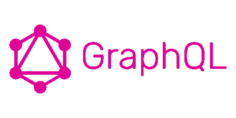
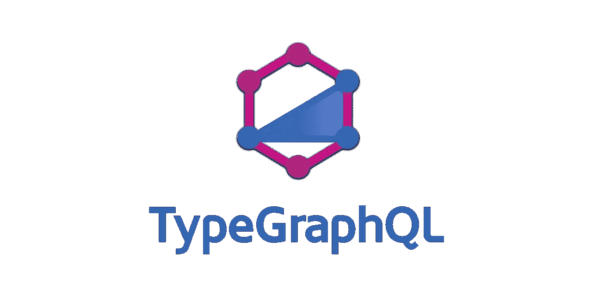

# GraphQL —使用 TypeGraphQL 和 typegoose 的代码优先(解析器优先)

> 原文：<https://towardsdatascience.com/graphql-code-first-resolver-first-using-typegraphql-and-typegoose-747616223786?source=collection_archive---------26----------------------->


[斯科特·格雷厄姆](https://unsplash.com/@homajob?utm_source=unsplash&utm_medium=referral&utm_content=creditCopyText)在 [Unsplash](https://unsplash.com/s/photos/netowrk-graph?utm_source=unsplash&utm_medium=referral&utm_content=creditCopyText) 上拍照

G raphQL 是一种开源的查询和数据操作语言，由脸书在 2015 年创建。尽管它被社区定义为 REST 的可能替代品，但根据每个 API 的架构和需求，有些项目可能适合 GraphQL API，而有些项目可能适合 REST API。但是由于它在过去几年的流行，一些大公司已经将他们的 API 迁移到 GraphQL APIs，而一些公司选择了同时使用 REST 和 GraphQL 的混合方法。



图片由 [GraphQL](https://graphql.org/) 提供

在创建 GraphQL API 时，可以使用许多工具来管理 API 的创建。目前可用于创建 GraphQL APIs 的一些主要和流行的工具有

*   graph QL([**)graph QL/graph QL-js**](https://github.com/graphql/graphql-js)**)**
*   阿波罗( [**)阿波罗/阿波罗服务器**](https://github.com/apollographql/apollo-server) **)**
*   express graph QL([**/express-graph QL**](https://github.com/graphql/express-graphql)**)**
*   普里斯马([https://www.prisma.io/](https://www.prisma.io/))
*   AWS AppSync

除此之外，在我写这篇文章的时候，还有很多工具正在开发中。所有这些工具都有各自的优点和缺点。本文不打算对这些工具进行比较，所以让我们继续讨论 GraphQL 的创建。

创建 GraphQL API 时，我们需要做的主要工作是定义 GraphQL 模式。有两种常见的方法可以做到这一点。

*   **模式优先开发**
*   **代码优先开发**

# 图式优先发展

在模式优先开发中，我们首先定义模式，然后实现与已定义模式上的定义相匹配的代码。为了定义模式，我们将使用**模式定义语言**，这是 GraphQL 团队推出的一种查询定义语言。下面是一个我们如何使用模式优先开发来定义模式的例子。

# 代码优先开发

在代码优先开发中，我们首先开始创建解析器，而不是首先创建模式。因此，解析器会自动生成模式。因此，在这里我们不必手动创建模式。但是缺点是仅仅看代码很难理解模式。

如上所示，我们可以看到，对于类型，我们可以使用 **GraphQLObjectType** 和属性作为字段来定义。解析器也是如此。

您可以选择用于创建 GraphQL API 开发的开发方法。这种选择需要在开发之初完成，并且可能取决于几个因素，如语言支持、开发人员经验等...在本文中，我们将探讨代码优先的开发方法。

## 使用 TypeScript 进行代码优先开发

Typescript 是一种基于 Javascript 的语言，我们可以在其中使用静态类型定义。通过使用静态类型检查，我们可以理想地在编译时移除许多错误，而不是在运行时将它们识别为错误，这在大型应用程序中非常有用。除了静态类型检查之外，使用 Typescript 还可以获得更多的开发人员功能，如 IntelliSense。由于这些特性，许多大型 Javascript 项目选择在其 Javascript 项目之上使用 Typescript 来增强其用途。对于 GraphQL APIs 也是如此。

让我们再来看看如何使用 TypeScript 实现 GraphQL 的代码优先开发。

正如您所看到的，当我们使用 Typescript 时，我们需要定义用户类型，因此之后我们可以将这个静态类型用于我们的其他实现和验证。此外，我还添加了一个模拟用户列表，用作模拟数据，它也使用创建的类型 user。但是在大多数应用程序中，这些数据将来自数据库。让我们使用 MongoDBas 作为我们的数据库，使用 mongoose 作为我们的 ODM 工具。那么完整的模式实现将如下所示。

在上面的代码中，我们可以看到，对于 mongoose，我们使用 user 类型定义了 UserModel，在解析器中(第 17 行),我们调用 MongoDB 并直接从数据库中获取结果。

上述解决方案运行良好，并提供了我们期望从 GraphQL API 获得的所需功能。但是现在让我们假设我们需要向我们的用户类型添加一个电子邮件字段。让我们检查上面的代码，并确定我们需要在哪里进行代码修改，以便进行这个简单的修改。经过调查，您可能已经发现我们需要在 3 个位置进行代码修改。

*   在 UserType GraphQLObjectType 中，我们需要添加

```
email: { type: GraphQLString }
```

*   在 Typescript 接口定义中，我们需要添加

```
email: string
```

*   在 mongoose 模式定义中，我们需要添加

```
email: { type: String, required: true }
```

这在我们的例子中可能看起来不多，但是在大型应用程序中，这些定义将位于不同的文件中，开发人员需要跟踪所有这些文件来进行这些修改。那么，有没有一种方法可以让我们只在一个地方修改就能处理这些场景呢？答案是**是的**，这就是我们介绍 **TypeGraphQL** 和 **typegoose** 的地方。

## TypeGraphQL 和 TypeGoose



图片来自 [**类型图 QL**](https://typegraphql.com/docs/introduction.html)

[**TypeGraphQL**](https://typegraphql.com/docs/introduction.html) 是一个库，可以用来使用 TypeScript 创建 GraphQL APIs。它提供的主要特性是在 GraphQL 模式和 Typescript 静态类型之间保持同步。

Typegoose 是一个使用 Typescript 轻松编写 mongoose 模式的包装器。

首先，让我们看看如何使用 TypeGraphQL 来转换我们定义的模式。

如你所见，我们在代码中引入了一些装饰器。主要是 **@ObjectType** 和 **@Field** decorator。通过使用@Field 这个装饰器，我们指定这个字段也应该在我们的 GraphQL 模式中可用。因此，如果我们希望在静态类型中有一个属性，而这个属性不需要在 GraphQL 模式中，我们可以忽略为这个属性提到这个@Field 装饰器。

下一个问题是，我们应该在哪里为 GraphQL 类型定义数据类型。为此，我们可以使用相同的 **@Field** 装饰器。但是在上面的代码中，我们从来没有使用这个 decorator 来定义 GraphQL 类型的数据类型，我们只为我们的 Typescript 类型定义了类型。这是因为对于字符串，布尔数据类型 TypeGraphQL 足够智能，可以为 GraphQL 类型识别相同底层数据类型。当 Typescript 类型和 GraphQL 类型不同时，我们可以使用@Field decorator 来表示数据类型，如下所示。

```
@Field(() => Int, description: "Age of the user")
age: Number;@Field(() => String)
createdAt = new Date().toUTCString()
```

正如您所做的，除了指定类型，我们还可以使用 decorators 指定其他选项。(描述等……)

接下来，让我们尝试将 typegoose 集成到同一个模式中。

在这里，你可以再次看到我们引入了另一个名为 **@props** 的装饰器。这个装饰器和 **@Field** 装饰器的作用是一样的，只是针对猫鼬。它指定这个字段应该在我们的 mongoose 模式中可用，并最终在我们的 MongoDB 数据库中可用。和上面的@prop 一样，我们也可以传递将被映射到数据库集合中的选项。同样，如果我们需要在数据库中存储不同的数据类型，我们可以像下面这样定义它们。

```
@prop({ type: () => [String] })

@prop({ type: () => Job })
```

集成 TypeGraphQL 后，我们的解析器将如下所示。

这里我们使用 **@Query** decorator 来定义一个查询，并通过使用 typegoose 定义来查询我们的数据库并返回数据。

现在让我们来看一下我们的场景，我们的 GraphQL 模式需要一个新的 email 字段。你能确定哪些地方我们需要改变吗？是的，现在我们只需要改变一个位置，如下所示。

```
@Field()
@prop({ required: true })    
email!: string;
```

现在不需要找到每个位置，因为我们的 GraphQL 模式、Typescript 类型和 mongoose 模式都是从一个位置同步的。

这是一个简单的介绍，其中我们使用代码优先方法中的 TypeGraphQL 和 typegoose 来创建 GraphQL。显然，这些工具比我在本文中使用的用例更强大。因此，如果您对如何在您的下一个项目中安装这两个非常棒的库更感兴趣，或者需要找到相关指南，请务必访问它们的官方文档，以便在您的下一个 GraphQL API 项目中增强更多功能。

谢谢:)