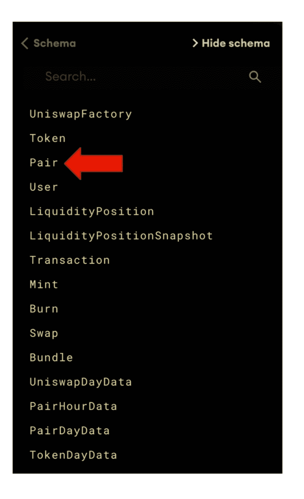

# GraphQL 演练:如何查询加密(使用 Uniswap 和 DeFi)

> 原文：<https://towardsdatascience.com/graphql-walkthrough-how-to-query-crypto-with-uniswap-defi-e0cbe2035290?source=collection_archive---------2----------------------->

## 学习 GraphQL，从比特币和以太坊等区块链网络中搜索数据

([照片信用](https://unsplash.com/photos/UmaojK7erQo)

如果在 2021 年你是一名网络开发人员，那么*你很有可能听说过 GraphQL。自从脸书在 2015 年公开发布这种查询语言以来，它的受欢迎程度已经飙升。虽然有些人声称这意味着“REST APIs 的死亡”,但从谷歌搜索趋势来看，这种炒作仍然有点言过其实。*

([图像源](https://trends.google.com/trends/explore?geo=US&q=graphql,rest%20api))

由于 GraphQL 越来越受欢迎，今天我们将通过*另一个*令人兴奋的技术:**加密货币**的例子来看看这项令人兴奋的技术。

使用 GraphQL，我们将查询和过滤世界上最大的区块链网络上的数据。我们将探索 **Uniswap** ，市场上[最热门的新 DeFi 加密交易所](https://www.bloomberg.com/news/articles/2020-10-16/defi-boom-makes-uniswap-most-sought-after-crypto-exchange)，我们将直接查看交易所的实时订单和交易量。

到本文结束时，您将能够查询 Uniswap 并找出哪两个加密令牌是最受欢迎的交易令牌。

## 首先，快速总结一下

让我们定义我们的术语，以便熟悉我们将使用的工具。

[**GraphQL**](https://en.wikipedia.org/wiki/GraphQL) :一种*查询语言*，用于从数据库或公共 API 端点请求数据。与 SQL(用于 REST APIs)不同，这种语言使用 JSON 符号，并允许您在同一个网络请求中进行多个查询。没有更多的 API 垃圾来访问深度嵌套的数据！

[**Uniswap**](https://uniswap.org/):a*DeFi*加密货币交易所。“DeFi”代表“去中心化金融”，这是一个[引人入胜的在线运动](https://www.coindesk.com/what-is-defi)，但是细节不在本文的讨论范围之内。你需要知道的是，这个交易所让你在以太网上购买&出售密码*，而不需要*通过一个像[比特币基地](https://www.coinbase.com/)或[币安](https://www.binance.us/en/home)这样的集中中间人注册账户。

[**图**](https://thegraph.com/) :一种“查询以太坊、IPFS 等网络的索引协议”我们将使用这个网站，这是一个开放的 [API-explorer](https://thegraph.com/explorer/) ，梳理实时区块链数据，看看有多少人通过 Uniswap 交换加密令牌。这就是 GraphQL 的用武之地——它是 Graph 用来搜索区块链数据的查询语言。

## 好了，我们开始吧！

# 步骤 1:在 Uniswap 上搜索所有令牌

对于我们的第一个查询，让我们对 Uniswap 上列出的所有加密令牌进行基本搜索。通过这种方式，我们可以看看新的语法，看看它是如何工作的，以及它为我们提供了什么。我们在查询结果中找到的任何代币都是你可以在交易所买卖的代币。

如果你在家跟着，这里的[是 Uniswap explorer，我们的查询在下面截图的左边。这里什么都没有:](https://thegraph.com/explorer/subgraph/uniswap/uniswap-v2?selected=playground)

在左边，您将看到我们的查询！我们正在访问 Uniswap 的**令牌** **对象**，我们只对三个**字段**感兴趣:“符号”、“名称”和“小数”。

右侧列出了我们的查询结果，在这里我们可以看到一个很长的加密令牌列表，我们可以在这个交易所进行买卖。其中大部分是陌生的，但在这个数千枚代币的列表中，有一个物体上写着“比特币”和“BTC”

说到这里。

我们仍在查询令牌对象，但这次我们只过滤比特币。我们的过滤器来自“ *where* :”子句，我们的结果是返回 name field = "Bitcoin "的所有匹配项出于某种原因，Uniswap 有多个令牌与名称“比特币”完全匹配，因此我们将只返回一个示例(使用 *first* :子句)。

注意我们的查询看起来有多简单和易读？

没有特定于语言的语法(比如 SELECT *或 FROM __TABLE__)，就像我们使用 SQL 查询 REST API 时要编写的那样。

为什么？那是因为 GraphQL 是围绕 [*对象*类型](https://graphql.org/learn/schema/#object-types-and-fields)构建的，所以它读起来像 JSON 符号。您不是描述您想要访问的数据库表，而是描述数据本身的*形状*。

> 不是描述您想要访问的数据库表，而是描述数据本身的*形状*。

GraphQL 也是独一无二的，因为**只有*一个*端点供我们访问。**另一方面，REST APIs 是围绕*资源*组织的，这些资源通常位于单独的*不同的*URL 上。但是使用这种语言，您的数据是围绕单个*实体图、* **组织的，结果只有一个端点:**

> https://exampleapi/graphql

当我们调用端点时，我们选择我们感兴趣的对象类型(“用户”、“文章”、“令牌”等)。)然后我们描述我们想要包含的字段。

# 步骤 2:查看“数据库”模式

接下来，让我们看看图表的**模式**，这样我们就有了这个区块链探索者提供的所有数据的大图视图。但是请记住，我们这里不是在使用数据库模式。图为**直接查询区块链上的数据，追踪比特币、以太坊等等！**

左边是我们的模式。这里列出的每一项都被称为*对象类型*。我们很快就会更深入地了解 Pair 对象，但是让我们停下来欣赏一下我们可以访问多少数据。

加密货币从“钱包”中存储和发送，这是一种简单的软件应用程序。这些钱包与用户的姓和名、银行账号、地址等无关。但是如果我们想深入研究用户对象，我们仍然可以探索个人帐户余额、交易数量等等。

此外，我们可以查看 Uniswap 处理的每一笔代币交易(T30、T31)，或者为流动性提供者创造的费用(T32、T33、T36、T32、T33、T36、T36、T33、T33)等等。

令人惊奇的是，所有这些数据都是公开的。如果你愿意，你可以建立一个由区块链分析*提供支持的网站，仅仅使用这个网站*。

# 第三步:看“配对”对象

到目前为止，我们已经为 Token 对象编写了简单的查询，并且浏览了图中的整个沙盒 API(我们的模式)。

现在，让我们深入了解一下 Pair 对象，看看我们可以查询的所有字段:

没有任何交易对，加密货币交易所就不会存在。

任何给定的配对都由两个令牌组成:如果你和我交易加密，那么我可能会用我的以太来交换你的比特币。这意味着当我们查询 Pair 对象时，查询结果中的每个条目都将包括 Token0 和 Token1(例如，“ETH”和“BTC”)。

但是我们还需要每个代币的价格，以便我们知道公平交易的价值——这来自于*代币 0 价格*和*代币 1 价格*字段。

[图形的 API](https://uniswap.org/docs/v2/API/entities/) 得到的*方式*比那个更详细。继续我们的例子，我们可以检查已经为 ETH/BTC 对进行了多少交易 **(txCount)** 。

然后，我们可以看到迄今为止与流动性生产者(或"[农民](https://www.coindesk.com/defi-yield-farming-comp-token-explained)")共享的流动性代币总数**(总供应量)**，Uniswap 上仍然可用的储备代币数量(**reserve 0**&**reserve 1**)(因为如果只有 4 个可用，我就买不到 5 个 BTC)…

…你明白了。

好了，现在我们已经大致了解了我们可以调查多少数据，**我们为什么不看看我们的查询能做多少呢？**

# 第四步:寻找交易最活跃的货币对

在 Uniswap 上交易的所有*代币中，哪一对交易最活跃？哪两种加密令牌最受欢迎？*

这就是我们的 API 变得真正强大的地方。

就像前面一样，我们的查询写在屏幕的左侧，查询结果显示在右侧。我们正在探索 Pairs 对象类型，我们正在过滤以查看一个列表，其中只包含前五个结果、*，按整个交易所**最高交易数**排序*。

在右侧， **token0** 显示“包裹以太网”，而 **token1** 显示“系绳美元”。我们不会深究细节，但这些代币都是合成的、基于加密的金融工具，分别用于以太(以太坊[网络](https://twitter.com/RyanWatkins_/status/1354229030162194432)的代币)和美元。

## 要点:

Uniswap **上的交易者交换乙醚和美元*是任何*对代币中最多的*。***

这正是我们所期待的！为什么？

Uniswap 是围绕以太坊网络构建的。我们之前提到过这一点，但是*你不能在以太坊网络上兑换美元或比特币，除非它被* [*【包装】*](https://coinmarketcap.com/alexandria/article/what-is-wrapped-bitcoin) *为基于以太坊的合成资产*。

因为**以太**是以太坊网络的燃料，而你*必须*拥有以太才能交易任何 ERC-20 代币，所以交易以太和美元是整个交易所最受欢迎的事情是完全有道理的。

**为了结束我们的查询，这里是我们看到的字段的完整列表:**

*   **名称**:令牌名称(其他例子有“包裹比特币”、“戴”等。)
*   **交易量(美元)**:所有对的代币交易量(历史)
*   **总流动性**:所有对之间作为流动性提供的代币总量
*   **代币价格**:一个代币的价格，以另一个代币的货币表示
*   **交易计数**:该对交易的所有时间金额
*   **“创建于”时间戳**:合同(对)的创建时间

不要忘记，如果我们认为我们的数据丢失了一些东西，或者如果我们看到了比我们需要的更多的信息，那么更新我们的查询就像从我们前面看到的模式中添加或删除任何字段一样简单。

# 步骤 5: GraphQL 与 SQL/REST 的比较

在结束本演练之前，让我们比较一下我们在简介中谈到的两种不同类型的查询。我们将继续第 4 步的示例查询，即“Uniswap 上最受欢迎的交易对”

左边是我们的 GraphQL 查询，右边是在 Oracle 数据库中使用 SQL 对相同数据的假设请求。通常我们会使用某个版本的 SQL 来搜索来自 REST API 或后端应用程序中的数据库的结果。

你会注意到的第一件事是，使用 SQL，无论何时你从两个或多个表中查询数据，你都需要以某种方式 ***连接*** 数据。由于 Pair 由两个标记组成，我们将标记和 Pair 表内部连接在一起。这样，我们的 ETH-TUSD 对将不会显示 Uniswap 上进行的每一笔 ETH 交易…只有 ETH 交换了 Tether。

但是，为什么我们不在 GraphQL 查询中进行任何“连接”呢？记住，我们正在查询一个整体的 ***图形对象*** 。*每一条数据记录*都在图表内的某处。因此，我们的查询语言让我们挑选我们想看的内容。使用 SQL/REST，我们不得不在数据库表之间建立连接*。记住我们之前说过的:*

> 您不是描述您想要访问的数据库表，而是描述数据本身的形状。

除了所有内部连接的复杂性之外，应该清楚哪种查询语言对人眼来说更具可读性和可理解性。由于我们在 GraphQL 中使用 JSON 符号，并且我们只写我们想要查看的字段的名称，所以我们的查询很简单，看起来像普通的英语。

# 结论

本演练的目的不是涵盖 GraphQL 能做的一切。那需要一整个系列！但是让我们记住，尽管它很强大，但有很多很好的理由不使用这种语言，因为它在某些方面肯定是有限的。

不管怎样，我希望这个例子是一个有用的介绍！你可以想象，如果我们运行这些数据，我们可以使用 GraphQL 的图形 API 为加密货币交易者构建一个非常强大的分析仪表板。我鼓励你自己去玩一玩，看看你能做些什么！

如果你还在了解区块链(说实话，谁不是呢？)，我希望这篇文章有助于演示区块链如何像数据库一样工作。只是*碰巧*是公开的、分布式的……但是你可以像运行任何集中式&私有数据库一样运行搜索结果。

请在 Twitter 上关注我，了解更多编程/加密技巧，如果您有任何问题或想要一些建议，请联系我。感谢您的阅读！