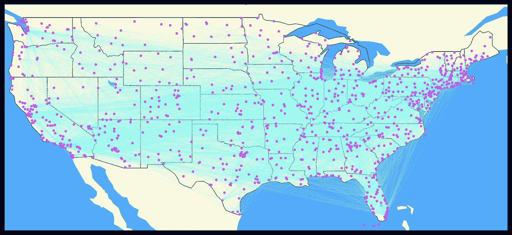
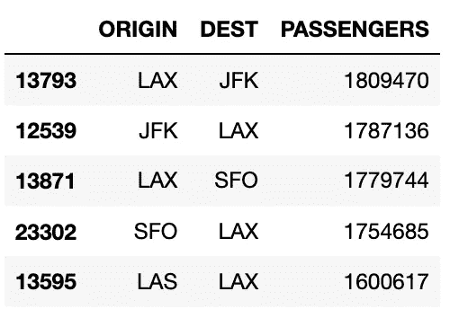
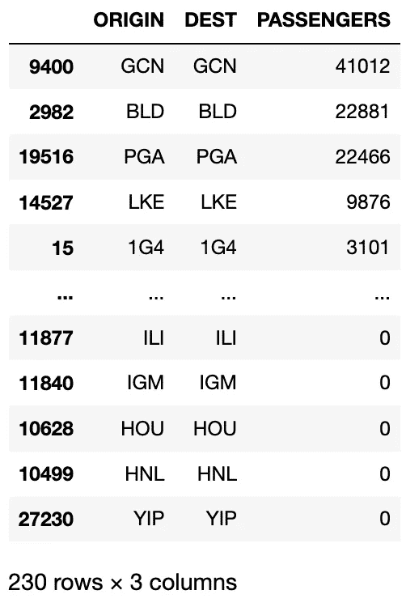
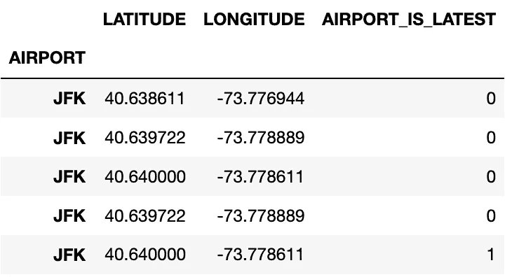
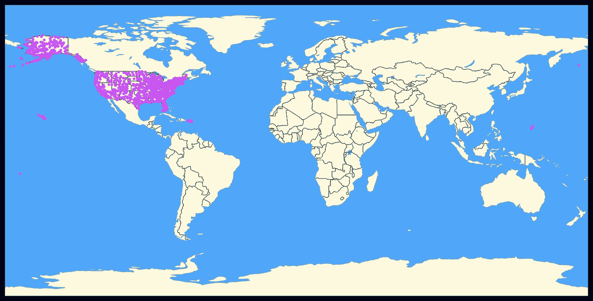
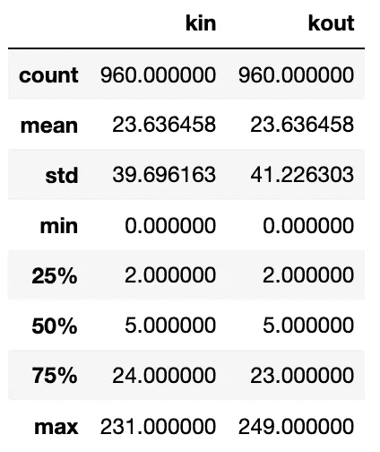
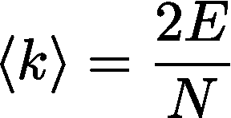
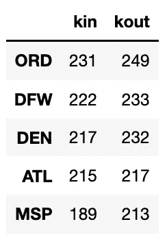
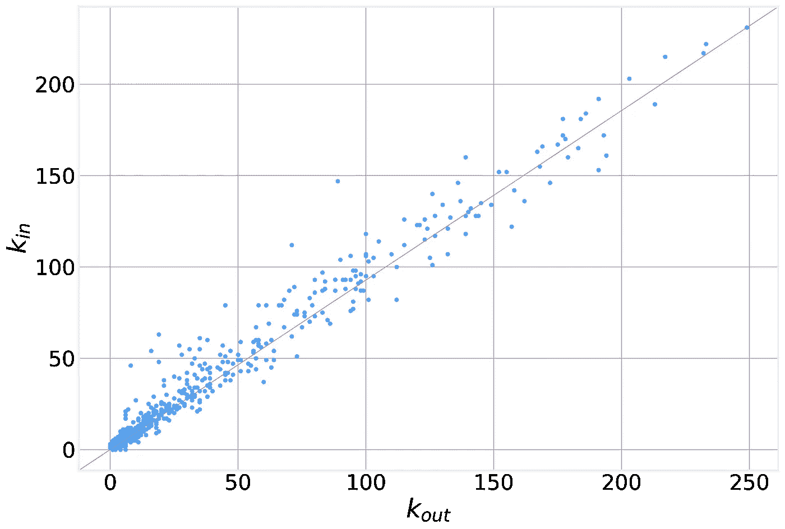
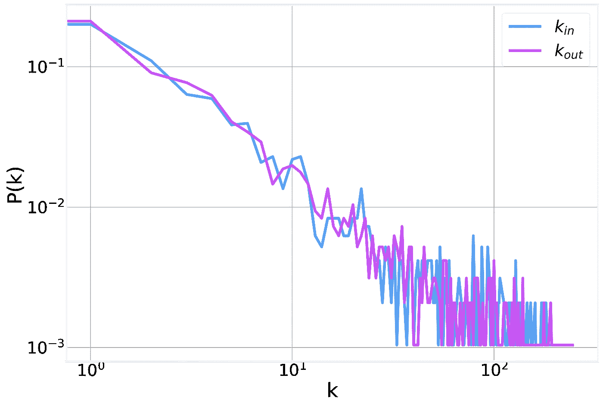

# 图表 101:航空运输网络

> 原文：<https://towardsdatascience.com/graphs-101-airline-transportation-network-5548739fd22e?source=collection_archive---------23----------------------->

## 真实世界数据集的实践概述

美国运输统计局(BTS)发布了大量与运输相关的数据。其中一个名为“ [T-100 国内航段(美国航空公司)](https://www.transtats.bts.gov/TableInfo.asp)的数据集被描述为:

> *此表包含美国航空公司报告的国内直飞航段数据，包括承运人、始发地、目的地、飞机类型和运送乘客的服务等级、货运和邮件、可用容量、计划出发、已执行的出发、飞机小时数以及当始发地和目的地机场都位于美国及其领地边界内时的客座率。*

这实际上是一个很大的 csv 文件，其中每一行对应一个单独的航班，包括航空公司、始发地和目的地机场、登机的乘客数量、日期和时间等。如果我们把机场作为节点，把航班作为边，那么我们就有了自己的网络！

# 飞行情报

当下载包含 2019 年所有航班的文件时，我们发现覆盖一年 365 天的 391，114 个独特航班。当我们合计在相同起点和目的地之间旅行的所有乘客时，我们发现我们减少到 27，302 行。按照乘客数量排序，我们发现 2019 年排名前五的航空公司是:

每人超过 160 万乘客！

这个缩减数据集的每一行现在都对应于一条单独的边。这种格式被称为“**边列表**”，是表示一个图的最常见的形式之一，只是一个边列表，每行一个。如果你曾经看过一个典型的网络科学教程或[在线网络数据仓库](https://snap.stanford.edu/data/)这可能是你处理过的数据集的格式。

仅仅通过这个简单的例子，我们就可以引入更多的概念。我们没有任何起点和终点相同的边(谁会想不着陆就从起点飞回他们出发的机场呢？).这种边被称为“**自循环**”，在大多数分析中会被丢弃。为了以防万一，我们检查是否有这样的边，发现了超过 200 个自循环:

其中一些似乎归因于空中旅行(例如大峡谷[和](https://en.wikipedia.org/wiki/Grand_Canyon_National_Park_Airport))，而另一些则不那么明显。无论如何，我们将它们从边列表中删除，剩下 E=27，072 条边。

边也有明确定义的方向，即从起点到目的地，使其成为一个“**有向网络**”。如果我们考虑的不是航班，比如说州际高速公路，那么我们就会有一个“**无向网络**”(因为高速公路通常允许双向交通)。

我们的网络为每条边关联一个数值(飞行该路线的乘客数量)。这意味着我们定义的航空运输网络是一个“**加权网络**”。在一般情况下，边权重可以表示与边相关联的任何种类的数字属性，例如乘客数量、距离、最大流量等。

此外，当我们将所有航班的乘客数量相加时，我们在任何节点对之间都只有一条边。这意味着我们构建的这个网络是一个“**简单图**”(没有多条边，也没有自循环)。如果我们对区分不同航空公司的航班感兴趣，我们可以在同一对节点之间允许多条边(每家航空公司一条)。在这种情况下，我们将处理一个“**多重图**”。

# 机场信息

既然我们已经探索了网络的边缘，我们将注意力转向节点。我们通过组合起点和终点来提取图中的节点列表。我们发现我们有 N=1，318 个唯一节点。谁知道仅在美国就有这么多机场？

节点通常有一个与之相关联的 ID(在本例中是 IATA 代码[)并且大量信息可以与所使用的特定 ID 相关联，例如位置、大小、颜色、重量等。就机场而言，我们可以从另一个 BTS 表中下载每个机场的额外信息，该表被古怪地命名为“](https://en.wikipedia.org/wiki/IATA_airport_code)[主坐标](https://www.transtats.bts.gov/Tables.asp?DB_ID=595&DB_Name=Aviation%20Support%20Tables&DB_Short_Name=Aviation%20Support%20Tables)”表，BTS 将其描述为:

> *该表包含航空数据库中使用的机场的历史(基于时间的)信息。它提供了国内和国外机场代码及其相关的世界区号、国家信息、州信息(如果适用)、城市名称、机场名称、城市市场信息以及经度和纬度信息的列表。*

我们对每个机场的**纬度**和**经度**坐标特别感兴趣，因为当我们试图可视化网络时，这将使我们的生活更容易。BTS 的好心人让我们的生活变得更轻松，他们为我们提供了纬度和经度列，以及一个标志，表明这些是否是最新的可用坐标:

谁知道机场会移动这么多？在我们过滤出最近的机场坐标后，我们发现有分布在世界各地的 6，572 个机场的信息。

因为我们的航班网络只包括美国境内的航班，所以我们通过组合用作始发地或目的地的机场集来提取航班数据集中包含的节点集。美国共有 1318 个机场。当我们从机场纬度/经度数据库中筛选出这些机场时，我们就可以最终将它们绘制在地图上了！

由于我们的网络嵌入在真实空间中，我们能够轻松获得每个节点的空间坐标。情况并不总是这样，在我们能够可视化网络之前，我们必须为每个节点计算足够的 X 和 Y 坐标。在网络术语中，这被称为“**图布局**，有一整个[家族的算法](https://en.wikipedia.org/wiki/Graph_drawing)致力于计算它们。我们将在以后的文章中讨论其中的一些。

正如我们所见，BTS 数据库非常完整，包括美国所有领土和岛屿上的机场。为了让我们的生活更容易，我们把自己限制在美国 48 个相邻的州。通过进一步的限制，我们只剩下 N=962 个节点和 E=22，691 条边。

我们现在不仅可以看到节点，还可以看到这个简化网络的边:

# 网络分析

随着我们的网络被完全定义，我们现在可以开始更深入地探索它。一个节点最基本的特征之一是它的度，k(T9):它所属的边的数量。在像我们这样的有向网络的情况下，我们区分输入和输出连接的数量，分别为**输入/输出度**。对于我们的网络，我们有:

我们注意到两个要点。首先。平均入度和出度是相同的。这总是正确的，并且是一个节点的输出边必须是另一个输入边的事实的直接结果。我们还可以使用以下表达式轻松计算总体平均度:

在我们的例子中，平均度数是 47.27，或者正好是平均进/出度数的两倍。基础数学还没有让我们失望！:)

其次，也许更令人惊讶的是，我们注意到有几个节点的入度或出度为 0。这意味着有些机场有航班起飞，但没有航班返回(反之亦然)！我们总共有 60 个这样的机场。在维基百科上快速查找机场代码发现，这些似乎是军事基地和其他通常不接待商业航班的机场。也许这些对应于紧急着陆？

我们还可以看到哪些机场的进出航班数量最多:

毫不奇怪，这些都是大型航空枢纽，如[芝加哥奥黑尔](https://en.wikipedia.org/wiki/O%27Hare_International_Airport)、[达拉斯沃斯堡](https://en.wikipedia.org/wiki/Dallas/Fort_Worth_International_Airport)或[亚特兰大的哈兹菲尔德-杰克森](https://en.wikipedia.org/wiki/Hartsfield%E2%80%93Jackson_Atlanta_International_Airport)。

从该表中，我们还可以看到，虽然接近，但传入和传出边的数量并不相同。当我们绘制 k_in 对 k_out 时，我们发现一些节点具有较高的 kin 值，而其他节点具有较高的 kout 值，这两者之间存在很强的相关性(尽管并不完美)。总体而言，皮尔逊相关系数为 0.986171。

总结网络连通性的更好方法是绘制度分布图，即 kin/kout 的每个值的相对频率:

我们注意到，程度分布相当广泛，跨越两个数量级。这种分布(对数-对数标度上的线性)是经验网络的典型，有时被称为“[无标度](https://en.wikipedia.org/wiki/Scale-free_network)”。我们将在以后的文章中对此进行更多的探讨。

你可以在我们的伙伴 [GitHub 知识库](https://github.com/DataForScience/Graphs4Sci)中找到这篇文章中分析的所有代码，如果你喜欢这篇文章，你应该订阅数据科学子堆栈的[图表！](https://graphs4sci.substack.com/subscribe)