# 远大的期望:永远知道从你的数据中可以期待什么

> 原文：<https://towardsdatascience.com/great-expectations-always-know-what-to-expect-from-your-data-51214866c24?source=collection_archive---------1----------------------->

## [入门](https://towardsdatascience.com/tagged/getting-started)

## 使用 Python 确保数据按预期工作

# 动机

假设你的公司正在训练一个机器学习模型，利用从用户那里收集的数据来预测用户是否会点击广告。2021 年 9 月，你训练的模型在 90%的情况下正确预测了一个用户是否点击了一个广告。万岁！

然而，在 2021 年 10 月，同一模型仅在 70%的情况下正确预测了用户是否点击了广告。发生了什么事？

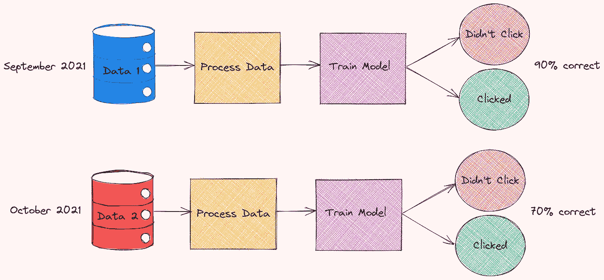

作者图片

您怀疑模型性能的变化可能是由数据的变化引起的。因此，您决定比较 2021 年 9 月和 2021 年 10 月收集的数据的每日现场时间分布。

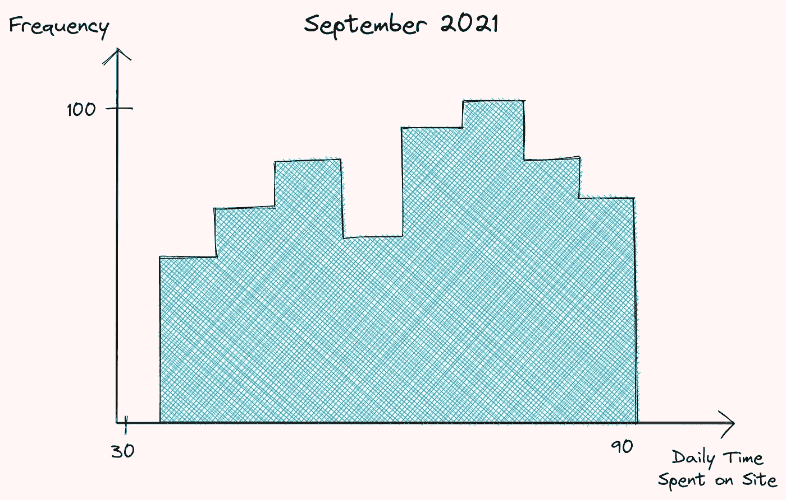

作者图片

你是对的！这两个数据在每天花费在现场的时间分布上有显著差异。


作者图片

由于每天花在网站上的时间是你的模型中最重要的特征之一，这种特征分布的变化会导致你的模型性能的下降。

除了每月手动检查数据的分布是否有变化之外，有没有一种方法可以在将数据输入模型之前自动检查分布的变化？

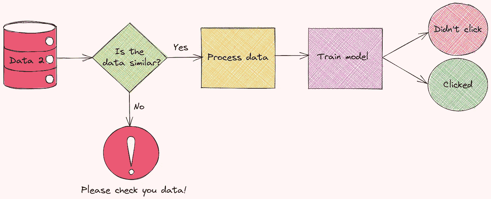

作者图片

这就是“远大前程”派上用场的时候。

# 什么是远大前程？

Great Expectations 是一个领先的 Python 库，允许您验证、记录和分析数据，以确保数据符合您的预期。

远大前程通过一个检查表来确保数据在使用前通过所有这些测试。


作者图片

有很多工具可以让你创建测试来验证你的数据。然而，我喜欢《远大前程》有几个原因:

*   **为你的数据自动创建一组测试:**为你的数据创建一组全面的测试可能会很痛苦。Great Expectations 通过建议一些基于数据特征的测试来消除这种痛苦。


作者图片

*   **通过笔记本创建您的期望并配置您的数据源:**对于一些人来说，使用 JSON 创建期望也是很困难的。《远大前程》让你用 Jupyter 笔记本轻松创造你的期望！
*   **创建良好的数据文档:**巨大的期望创建干净的、人类可读的文档，使您能够快速理解您的数据和验证结果。


作者 GIF

*   **与 DAG 执行工具无缝集成:**Great expectations 与 DAG 执行工具无缝集成，如 [Airflow](https://airflow.apache.org/) 、 [dbt](https://www.getdbt.com/) 、[提督](https://www.prefect.io/)、 [Dagster](https://github.com/dagster-io/dagster) 、 [Kedro](https://github.com/quantumblacklabs/kedro) 等。

在本文中，我将向您展示如何开始使用 Great Expectations，并回答您可能对这个工具有一些疑问。

要安装远大前程，请键入:

```
pip install great_expectations
```

# 入门指南

## 创建数据上下文

数据上下文管理您的项目配置。要使用 V3(批处理请求)API 创建新的数据上下文，请键入:

```
$ great_expectations --v3-api init
```

并且将在您的当前目录中创建具有以下结构的新目录！

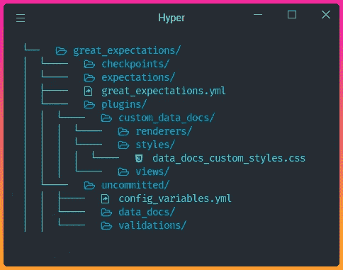

作者图片

这些目录的功能:

*   文件`great_expectations.yml`包含您的部署的主要配置。
*   目录`expections`将您所有的期望存储为 JSON 文件。
*   目录`plugins`保存了你可能有的任何定制插件的代码。
*   目录`uncommitted`包含了不应该在版本控制中的文件。

## 远大前程工作流程

伟大的期望通常包括 3 个步骤:连接数据，创造期望，验证你的数据。


作者图片

在接下来的部分中，我们将了解每个步骤的样子。

# 连接到数据

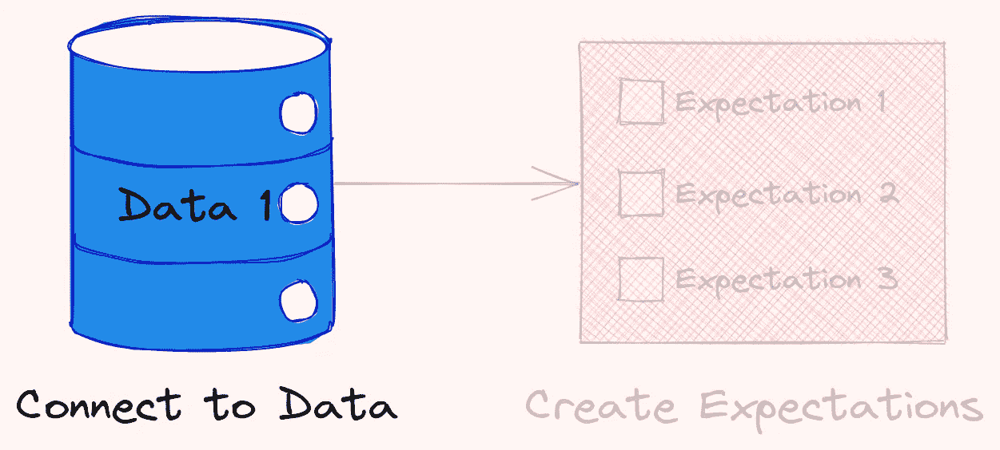

作者图片

作为演示，我将从 Kaggle 下载的[广告数据集](https://www.kaggle.com/fayomi/advertising)拆分成两个数据集:`first_data.csv`和`second_data.csv`。具体来说，

*   `first_data.csv`包含 2016 年 1 月至 2016 年 4 月的数据
*   `second_data.csv`包含 2016 年 5 月至 2016 年 7 月的数据

这些数据集存储在目录`data`下。


作者图片

要连接到我们的数据，请键入:

```
$ great_expectations --v3-api datasource new
```

在建立连接时，您会被问一些类似下面的问题。

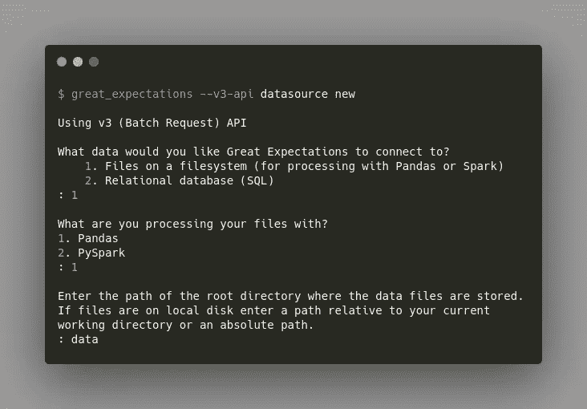

作者图片

我们可以将巨大的期望与我们系统或 SQL 上的文件联系起来。在这里，我们选择:

*   把它和我们系统上的文件连接起来
*   用熊猫处理我们的文件
*   指定`data`作为存储所有数据文件的目录。

回答完所有这些问题后，将会自动为您创建一个笔记本！此笔记本允许您配置新的数据源。Datasource 告诉了人们对您的数据存在于何处以及如何获取数据的极大期望。

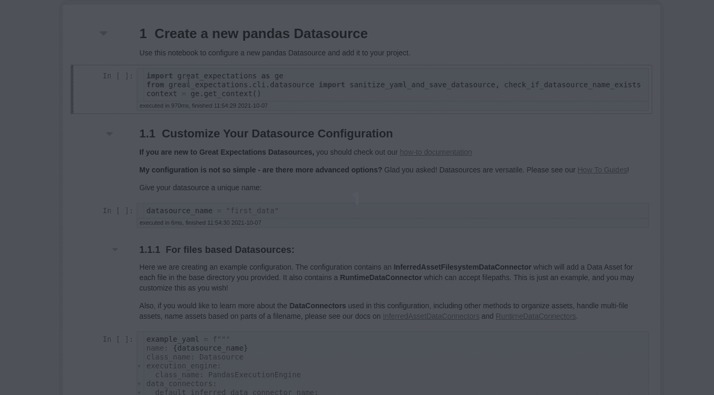

GIF 作者—点击查看笔记本[。](https://deepnote.com/project/Data-science-hxlyJpi-QrKFJziQgoMSmQ/%2FData-science%2Fdata_science_tools%2Fgreat_expectations_example%2Fgreat_expectations%2Funcommitted%2Fdatasource_new.ipynb)

在这个笔记本中，您可以通过编辑变量`datasource_name`的值来指定数据源的名称。

这个代码块允许我们创建和定制数据源的配置。

在上面的配置中，`InferredAssetFilesystemDataConnector`将使用您提供的正则表达式在基本目录中搜索文件。

例如，由于文件`first_data.csv`和`second_data.csv`都在`data`目录中，`InferredAssetFilesystemDataConnector`将检测这些文件并连接到它们。

```
Available data_asset_names (2 of 2):   
    first_data.csv (1 of 1): ['first_data.csv']   
    second_data.csv (1 of 1): ['second_data.csv']
```

执行完该笔记本中的所有单元格后，您的数据源的配置将被添加到`great_expectations.yml`中！

在这里找到配置你的数据源[的其他方法。](https://legacy.docs.greatexpectations.io/en/latest/guides/how_to_guides/configuring_datasources.html)

# 创造你的第一个期望

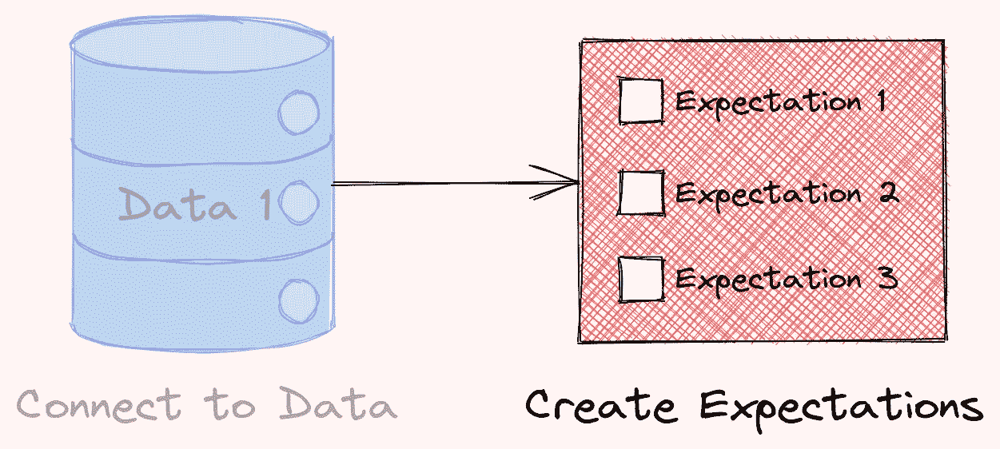

作者图片

现在到了激动人心的部分:创造你的第一个期望！我们将从创建一个新的期望套件开始。期望套件是期望的集合。要创建新的期望套件，请键入:

```
$ great_expectations --v3-api suite new
```


作者图片

您可以使用样本批次数据手动或自动创建期望值。在这里，我想根据数据自动创建期望`first_data.csv`。

完成所有问题后，将自动为您创建另一个笔记本。在这个笔记本中，您可以选择您关心的列和其他因素，并让分析人员为您写下一些候选期望。

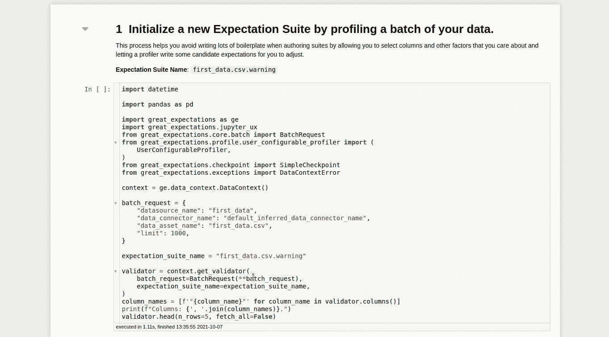

作者 GIF

该笔记本的第一个单元格将加载数据源中指定的数据。这非常方便，因为您可以可视化并了解数据集的一些特征。

您还可以指定要忽略哪些列，这样高期望值就不会对这些列产生期望。

运行笔记本中的其余单元格后，将为您创建一个类似于下面的报告！


GIF by Author —点击[此处](https://khuyentran1401.github.io/Data-science/data_science_tools/great_expectations_example/great_expectations/uncommitted/data_docs/local_site/expectations/first_data/csv/warning.html)查看文档

我们想要的期望可能比远大期望所创造的期望少一些或多一些。没关系！我们可以通过键入以下内容来编辑这些期望:

```
$ great_expectations --v3-api suite edit first_data.csv.warning
```

`first_data.csv.warning`是我们期望套件的名称。运行该命令后，将创建另一个笔记本，允许我们编辑我们的期望套件。

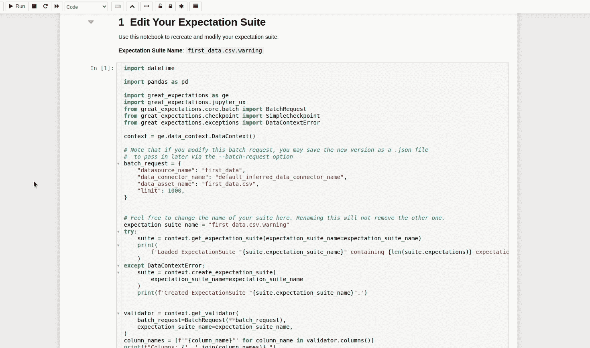

作者 GIF

在这个笔记本中，我们可以为整个表格和每一列创建期望。所有的期望都以`.expect_`开始，这使得自动完成很容易。让我们看看这些期望是怎样的。

## 表期望

在这里，我们可以指定与整个表相关的期望，比如期望表列按照一定的顺序排列。

## 列期望

您可以为不同的列创建期望。让我们从为专栏`Daily Time Spent on Site`创造期望开始。

在创建期望之前，您可能想要了解列`Daily Time Spent on Site`的分布。“远大前程”允许你像分析普通熊猫数据框架一样分析数据。

接下来，我们将基于列`Daily Time Spent on Site`的分布创建一些期望。

我们还希望该列不为空，并且是 float 类型。

我们还可以确保列`City`中唯一值的比例在 0.9 到 0.99 之间。

由于这些期望中有许多是自动创建的，所以我们不需要花费太多的精力来编辑函数以适应我们的期望。在此找到所有内置期望[。](https://legacy.docs.greatexpectations.io/en/latest/reference/glossary_of_expectations.html?utm_source=walkthrough&utm_medium=glossary#table-shape)

恭喜你！您刚刚创建了您的第一个期望套件。该套件将保存在下面目录下的文件`warning.json`中:

```
great_expectations/expectations
└── first_data
    └── csv
        └── warning.json
```

`warning.json`的前几行。

现在，您可以轻松地使用这个文件来编辑一些期望，而无需重新运行整个笔记本！

# 使用检查点验证您的数据

既然您已经创建了预期，那么您如何验证新数据呢？

这就是 Checkpoint 派上用场的时候。检查点将批量数据与相应的期望套件捆绑在一起进行验证。

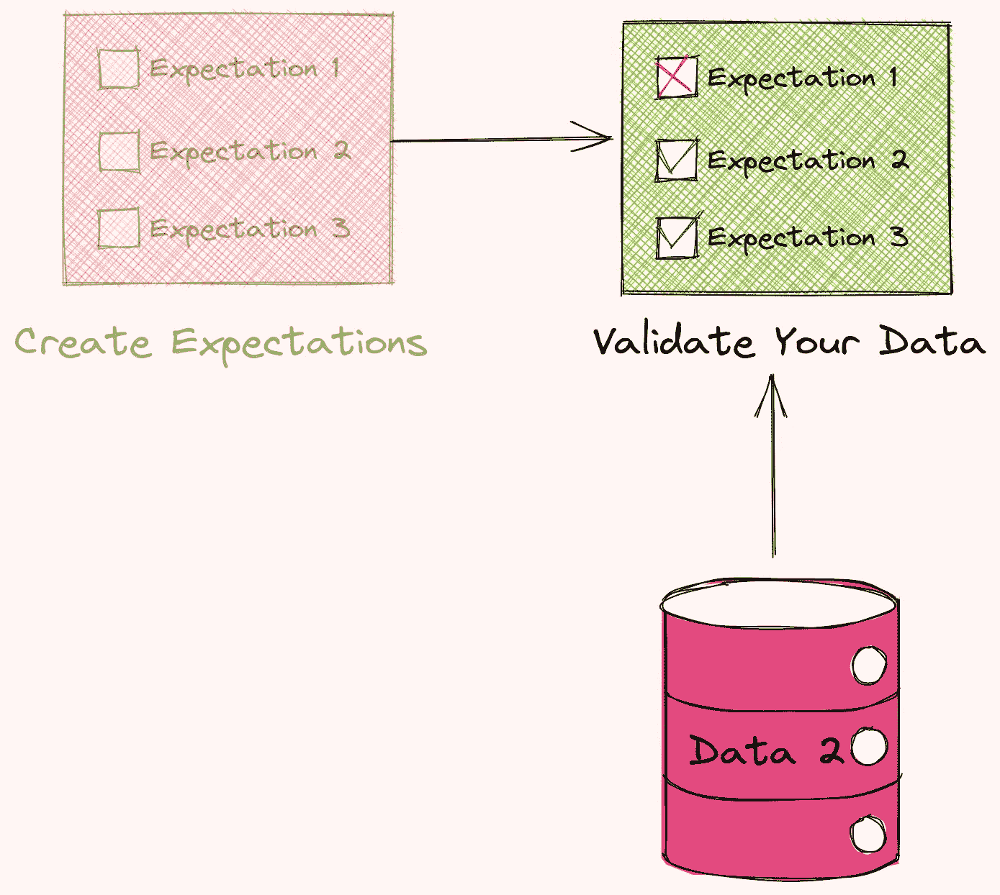

作者图片

要创建第一个检查点，请键入:

```
$ great_expectations --v3-api checkpoint new first_checkpoint
```

并且将为您创建一个如下所示的笔记本！

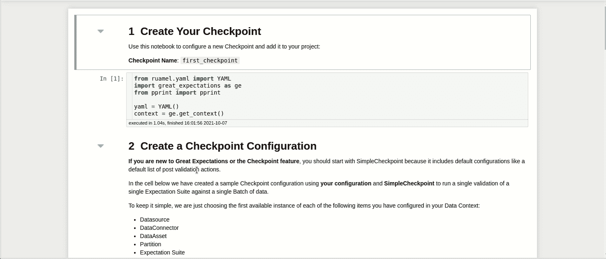

GIF 作者—点击查看笔记本[。](https://deepnote.com/project/Data-science-hxlyJpi-QrKFJziQgoMSmQ/%2FData-science%2Fdata_science_tools%2Fgreat_expectations_example%2Fgreat_expectations%2Funcommitted%2Fedit_checkpoint_first_checkpoint.ipynb)

在此笔记本中，您可以配置您的检查点。具体来说，

*   `datasource_name`指定数据源
*   `expectation_suite_name`指定期望套件的名称
*   `data_asset_name`指定要验证的数据集

在取消注释并运行该笔记本的最后一个单元格之后，您将看到一个表格，显示您的验证是失败还是成功。幸运的是，数据`second_data.csv`通过了所有测试！

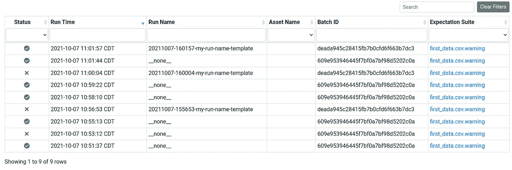

作者图片

要查看测试结果的详细信息，请单击运行时下的链接，您将看到如下所示的报告:

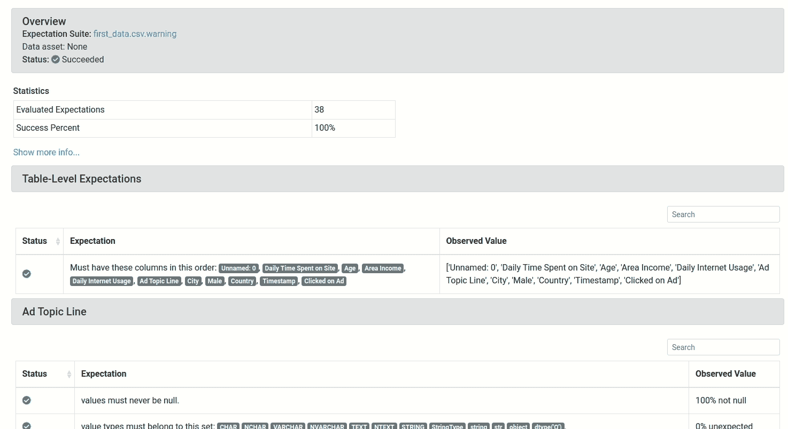

GIF 作者——点击查看完整报告[。](https://khuyentran1401.github.io/Data-science/data_science_tools/great_expectations_example/great_expectations/uncommitted/data_docs/local_site/validations/first_data/csv/warning/20211007-160157-my-run-name-template/20211007T160157.047037Z/deada945c28415fb7b0cfd6f663b7dc3.html#)

您的新检查点现在保存在:

```
great_expectations/checkpoints
└── first_checkpoint.yml
```

将来，如果您想使用同一个期望套件来验证另一个数据，比如说`third_data.csv`，您可以将`second_data.csv`切换为`third_data.csv`:

您可以在您的终端中运行检查点，而不是回到笔记本并重新运行最后一个单元！

```
$ great_expectations --v3-api checkpoint run first_checkpoint
```

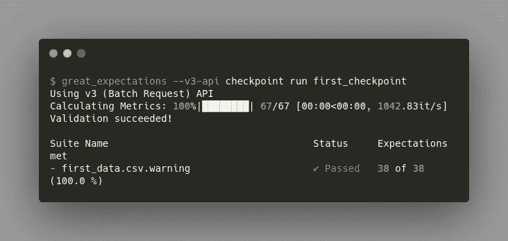

作者图片

很酷，不是吗？

## 一次验证两个不同的数据集

有时，您可能希望使用同一个 expect Suite 同时验证两个不同的数据集。这可以通过添加另一个`batch_request`来轻松实现:

让我们试着再跑一次，看看我们会得到什么。


作者图片

不错！

# 问与答(Question and Answer)

**远大前程没有我想要的期望怎么办？**

如果没有一个[内置期望](https://legacy.docs.greatexpectations.io/en/latest/reference/glossary_of_expectations.html?utm_source=walkthrough&utm_medium=glossary#table-shape)是您正在寻找的，您可以轻松地创建[自定义期望](https://legacy.docs.greatexpectations.io/en/latest/guides/how_to_guides/creating_and_editing_expectations/how_to_create_custom_expectations.html#how-to-guides-creating-and-editing-expectations-how-to-create-custom-expectations)。

**使用 Jupyter 笔记本有什么好处？**

使用 JSON 文件创建您的第一个期望可能很有挑战性。Jupyter 笔记本让您轻松编辑笔记本单元格中的预设期望。你也可以在写期望之前将你的数据可视化。

**我需要一直使用 Jupyter 笔记本吗？**

不，Jupyter Notebook 让初学者更容易建立期望，但是当你掌握它时，你可以在 JSON 文件中创建新的期望，在 YAML 文件中创建新的检查点。

如果你不喜欢这些方法中的任何一种，我推荐你查看一下[的《远大前程》文档](https://docs.greatexpectations.io/docs/guides/expectations/how_to_create_and_edit_expectations_based_on_domain_knowledge_without_inspecting_data_directly)，了解其他创建期望和检查点的方法。

**为什么《远大前程》有这么多定制？**

这些定制允许用户轻松地将巨大的期望与他们现有的框架集成在一起。不要害怕这些定制。我建议您从基础开始，然后一次定制一段代码来满足您的目标。

# 结论

恭喜你！您刚刚学习了如何使用巨大的期望来创建测试并验证您的数据。通过确保您的新数据符合您的预期，您将有信心将这些数据用于下游流程。

随意发挥，并在这里叉这篇文章的源代码:

[](https://github.com/khuyentran1401/Data-science/tree/master/data_science_tools/great_expectations_example) [## 数据-科学/数据 _ 科学 _ 工具/伟大 _ 期望 _ 实例在大师 khuyentran 1401/数据-科学

### 有用的数据科学主题以及代码和文章的集合…

github.com](https://github.com/khuyentran1401/Data-science/tree/master/data_science_tools/great_expectations_example) 

我喜欢写一些基本的数据科学概念，并尝试不同的算法和数据科学工具。你可以在 LinkedIn 和 Twitter 上与我联系。

如果你想查看我写的所有文章的代码，请点击这里。在 Medium 上关注我，了解我的最新数据科学文章，例如:

[](/kedro-a-python-framework-for-reproducible-data-science-project-4d44977d4f04) [## kedro——可再生数据科学项目的 Python 框架

### 使用 Kedro 创建可维护的模块化数据科学管道

towardsdatascience.com](/kedro-a-python-framework-for-reproducible-data-science-project-4d44977d4f04) [](/introduction-to-weight-biases-track-and-visualize-your-machine-learning-experiments-in-3-lines-9c9553b0f99d) [## 权重和偏差介绍:用 3 条线跟踪和可视化你的机器学习实验…

### 无缝比较不同的实验，并使用 Python 重现您的机器学习实验

towardsdatascience.com](/introduction-to-weight-biases-track-and-visualize-your-machine-learning-experiments-in-3-lines-9c9553b0f99d) [](/introduction-to-dvc-data-version-control-tool-for-machine-learning-projects-7cb49c229fe0) [## DVC 介绍:机器学习项目的数据版本控制工具

### 就像 Git 一样，但是有数据！

towardsdatascience.com](/introduction-to-dvc-data-version-control-tool-for-machine-learning-projects-7cb49c229fe0) [](/pytest-for-data-scientists-2990319e55e6) [## 数据科学家 Pytest

### 适用于您的数据科学项目的 Pytest 综合指南

towardsdatascience.com](/pytest-for-data-scientists-2990319e55e6)